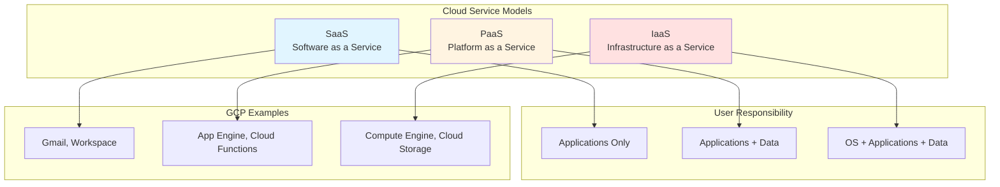
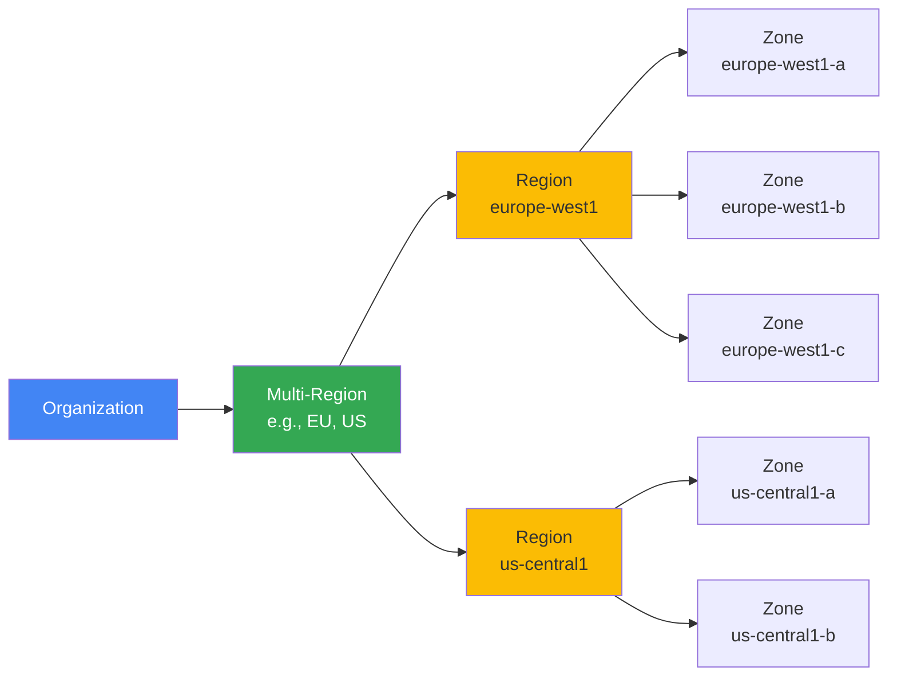

# Основи хмарних обчислень

## Module Goal

Цей модуль охоплює основи хмарних обчислень, моделі обслуговування (IaaS, PaaS, SaaS)
та географічну структуру Google Cloud Platform (регіони та зони). Ви дізнаєтесь про регіони, зони доступності та основні переваги використання хмарних технологій.

## Module Goal (English)

This module covers cloud computing fundamentals, service models (IaaS, PaaS, SaaS),
and the geographic structure of Google Cloud Platform (regions and zones). You will learn about regions, availability zones, and key benefits of using cloud technologies.

## Topics

- [Моделі хмарних обчислень](cloud-models.md) - IaaS, PaaS, SaaS
- [Регіони та зони GCP](gcp-regions-zones.md) - Географія та доступність

## Key Exam Takeaways

- ✅ Understand the difference between IaaS, PaaS, and SaaS service models
- ✅ Know which GCP services belong to each service model category
- ✅ Understand the concept of regions and zones for high availability
- ✅ Know how to choose the right region based on latency, compliance, and cost
- ✅ Understand multi-region resources vs regional vs zonal resources
- ✅ Know the benefits of cloud computing: scalability, elasticity, pay-as-you-go
- ✅ Understand CAPEX vs OPEX cost model transformation

## Architecture Diagram

## GCP Geography

## 📝 [Practice Questions](exam-questions.md)
