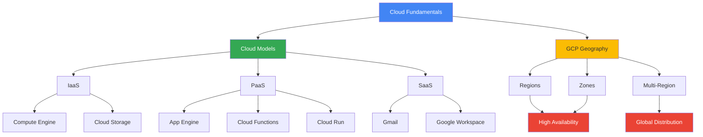

# Основи хмарних обчислень

## Вступ до модуля

Цей модуль є фундаментом для розуміння Google Cloud Platform та хмарних обчислень загалом. Перш ніж вивчати конкретні сервіси GCP, критично важливо зрозуміти базові концепції, які лежать в основі всієї хмарної інфраструктури.

### Чому цей модуль важливий?

**Фундаментальне розуміння:** Без розуміння моделей обслуговування (IaaS, PaaS, SaaS) ви не зможете правильно вибрати сервіс для конкретної задачі. Наприклад, чому для простого веб-додатку краще використати App Engine (PaaS), а не Compute Engine (IaaS)? Відповідь криється в розумінні того, що таке PaaS і які його переваги.

**Архітектурні рішення:** Розуміння регіонів та зон критично важливе для проектування високодоступних систем. Якщо ви розмістите всі ресурси в одній зоні, ваш додаток може стати недоступним при збої цієї зони. Знання про multi-zone та multi-region архітектури дозволяє будувати відмовостійкі системи.

**Оптимізація витрат:** Вибір правильного регіону може зекономити 10-20% бюджету. Розуміння різниці між on-demand, committed use, та preemptible ресурсами дозволяє оптимізувати витрати без втрати функціональності.

### Структура модуля та взаємозв'язки



### Як концепції пов'язані між собою

1. **Cloud Models → GCP Services**: Кожен сервіс GCP відноситься до однієї з моделей (IaaS/PaaS/SaaS). Розуміння моделі допомагає зрозуміти рівень контролю та відповідальності.

2. **Geography → Availability**: Вибір регіону та зон безпосередньо впливає на доступність, латентність та compliance вашого додатку.

3. **Models + Geography → Architecture**: Комбінація правильної моделі обслуговування та географічного розміщення визначає архітектуру вашого рішення.

---

## Module Goal

Цей модуль надає фундаментальне розуміння хмарних обчислень, моделей обслуговування (IaaS, PaaS, SaaS)
та географічну структуру Google Cloud Platform (регіони та зони). Ви навчитесь вибирати правильну модель для конкретних сценаріїв та проектувати високодоступні системи.

## Module Goal (English)

This module provides fundamental understanding of cloud computing, service models (IaaS, PaaS, SaaS),
and the geographic structure of Google Cloud Platform (regions and zones). You will learn to choose the right model for specific scenarios and design highly available systems.

---

## Topics

### 1. [Моделі хмарних обчислень](cloud-models.md)

**Що ви дізнаєтесь:**

- Детальне розуміння IaaS, PaaS, SaaS з прикладами
- Коли використовувати кожну модель
- Переваги та недоліки кожного підходу
- Реальні сценарії використання в GCP
- Стратегії оптимізації вартості

**Чому це важливо:**
На іспиті часто зустрічаються питання типу "Яку модель обрати для...". Без глибокого розуміння різниці між моделями ви не зможете правильно відповісти.

**Залежності:**
Це базова тема, яка не має залежностей. Рекомендується вивчати першою.

---

### 2. [Регіони та зони GCP](gcp-regions-zones.md)

**Що ви дізнаєтесь:**

- Структура глобальної інфраструктури GCP
- Різниця між zonal, regional, multi-regional та global ресурсами
- Як вибрати правильний регіон
- Стратегії високої доступності
- Network latency та performance considerations

**Чому це важливо:**
Майже кожне питання на іспиті, яке стосується deployment, буде включати вибір регіону/зони. Розуміння цієї теми критично важливе для проектування відмовостійких систем.

**Залежності:**
Базується на розумінні cloud models. Рекомендується вивчати після cloud-models.md.

---

## Key Exam Takeaways

### Критичні концепції для іспиту

✅ **Service Models:**

- IaaS = Максимальний контроль, максимальна відповідальність (Compute Engine)
- PaaS = Фокус на коді, автоматичне масштабування (App Engine, Cloud Functions)
- SaaS = Готовий продукт, мінімальна кастомізація (Gmail, Workspace)

✅ **Geography:**

- Zone = Один датацентр (найменша одиниця)
- Region = Мінімум 3 зони (для HA)
- Multi-Region = Кілька регіонів (для global availability)

✅ **Resource Scope:**

- Zonal: VM instances, Persistent Disks
- Regional: Subnets, Regional MIGs
- Global: VPC, Images, Load Balancers

✅ **High Availability:**

- Single zone = ~99.5% (тільки для dev/test)
- Multi-zone = ~99.95% (рекомендовано для production)
- Multi-region = ~99.99% (критичні системи)

✅ **Cost Optimization:**

- Вибір регіону може змінити вартість на 10-20%
- Preemptible VMs = до 80% знижки
- Committed Use Discounts = 37-57% знижки

---

## Типові питання на іспиті

### Формат питань

**Тип 1: Вибір моделі**

```
Компанія хоче швидко розгорнути веб-додаток без управління інфраструктурою.
Який сервіс найкраще підходить?
A) Compute Engine
B) App Engine
C) Cloud Storage
D) Cloud SQL

Відповідь: B (PaaS для швидкого deployment)
```

**Тип 2: Вибір регіону/зони**

```
Додаток має користувачів в Європі та повинен відповідати GDPR.
Який регіон обрати?
A) us-central1
B) asia-southeast1
C) europe-west1
D) australia-southeast1

Відповідь: C (GDPR вимагає зберігання даних в ЄС)
```

**Тип 3: Висока доступність**

```
Як досягти 99.95% доступності для веб-додатку?
A) Одна VM в одній зоні
B) Кілька VM в одній зоні
C) Кілька VM в різних зонах одного регіону
D) Кілька VM в різних регіонах

Відповідь: C (Multi-zone deployment)
```

---

## Практичні навички

Після вивчення цього модуля ви зможете:

1. **Аналізувати вимоги** та вибирати правильну модель обслуговування
2. **Проектувати архітектуру** з урахуванням географії та доступності
3. **Оптимізувати витрати** через правильний вибір регіону та моделі pricing
4. **Забезпечувати compliance** через правильне географічне розміщення
5. **Розуміти trade-offs** між вартістю, доступністю та performance

---

## Зв'язок з наступними модулями

**Module 02 (GCP Core Services):**
Базується на розумінні моделей. Ви дізнаєтесь, які конкретні сервіси GCP відносяться до IaaS/PaaS.

**Module 03 (Compute Engine):**
Глибоке занурення в IaaS. Використовує знання про регіони/зони для deployment.

**Module 04-06 (GKE, App Engine, Cloud Functions):**
PaaS сервіси. Базуються на розумінні переваг PaaS над IaaS.

**Module 09 (Networking):**
Використовує знання про global/regional ресурси для проектування мереж.

---

## 📝 [Practice Questions](exam-questions.md)

**Що включено:**

- 15+ реалістичних питань формату іспиту
- Детальні пояснення правильних відповідей
- Пояснення чому інші варіанти неправильні
- Посилання на відповідні секції теорії

**Рекомендація:**
Спочатку вивчіть теорію (cloud-models.md та gcp-regions-zones.md), потім перевірте знання через практичні питання.

---

**Наступний модуль:** [Module 02 - GCP Core Services](../02-gcp-core-services/README.md)
