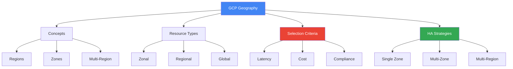
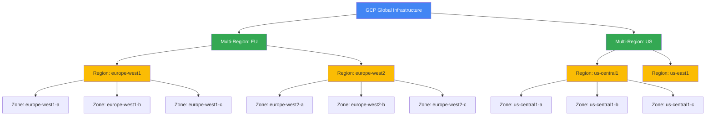

# Регіони та зони GCP

## Вступ: Чому географія важлива в хмарі?

### Контекст та важливість

Коли ви розгортаєте додаток в хмарі, фізичне розташування ваших ресурсів має критичне значення. На відміну від традиційних on-premises рішень, де всі сервери знаходяться в одному датацентрі, хмарна інфраструктура розподілена по всьому світу. Це створює як можливості, так і виклики.

**Три ключові питання, на які відповідає ця тема:**

1. **Де розмістити ресурси?** (Latency, Compliance, Cost)
2. **Як забезпечити доступність?** (Single zone vs Multi-zone vs Multi-region)
3. **Як ресурси взаємодіють між собою?** (Network architecture, Data transfer)

### Реальний приклад: Чому це важливо

```text
Сценарій: E-commerce платформа з користувачами в Європі

❌ Неправильно:
- Розміщення в us-central1 (США)
- Результат: 150-200ms latency для європейських користувачів
- Проблема: Повільна завантаження сторінок, втрата конверсії

✅ Правильно:
- Розміщення в europe-west1 (Бельгія)
- Результат: 10-30ms latency для європейських користувачів
- Бонус: Відповідність GDPR (дані зберігаються в ЄС)
```

### Структура цієї теми



---

## Географічна архітектура GCP

Google Cloud Platform має глобальну інфраструктуру, розподілену по всьому світу для забезпечення низької латентності, високої доступності та відповідності регуляторним вимогам.

### Ієрархія інфраструктури

```
Global Infrastructure
    ↓
Multi-Regions (EU, US, ASIA)
    ↓
Regions (europe-west1, us-central1)
    ↓
Zones (europe-west1-a, europe-west1-b, europe-west1-c)
    ↓
Data Centers (фізичні будівлі з серверами)
```

**Ключове розуміння:** Кожен рівень ієрархії має свою мету:

- **Multi-Region**: Глобальна доступність даних
- **Region**: Географічна локація для compliance та latency
- **Zone**: Ізоляція для fault tolerance
- **Data Center**: Фізична інфраструктура

---

## Основні концепції

### 🌍 Region (Регіон)

**Регіон** - це незалежна географічна локація, яка складається з кількох зон доступності.

#### Характеристики

- Містить мінімум 3 зони доступності
- Незалежне електропостачання та мережа
- Відстань між регіонами > 160 км
- Приклади: `us-central1`, `europe-west1`, `asia-southeast1`

#### Приклади регіонів

| Регіон | Локація | Зони |
|--------|---------|------|
| `us-central1` | Iowa, USA | a, b, c, f |
| `us-east1` | South Carolina, USA | b, c, d |
| `europe-west1` | Belgium | b, c, d |
| `europe-west2` | London, UK | a, b, c |
| `asia-southeast1` | Singapore | a, b, c |

---

### 📍 Zone (Зона доступності)

**Зона** - це ізольований датацентр в межах регіону з власною інфраструктурою.

#### Характеристики

- Ізольоване електропостачання
- Ізольована мережа
- Фізична ізоляція від інших зон
- Формат назви: `{region}-{zone}` (наприклад, `us-central1-a`)

#### Навіщо потрібні зони?

- ✅ **Висока доступність**: Розгортання в кількох зонах захищає від збоїв
- ✅ **Відмовостійкість**: Якщо одна зона недоступна, інші продовжують працювати
- ✅ **Балансування навантаження**: Розподіл трафіку між зонами

---

### 🌐 Multi-Region (Мульти-регіон)

**Мульти-регіон** - це великий географічний регіон, що містить кілька окремих регіонів.

#### Приклади

- `US` - Сполучені Штати
- `EU` - Європейський Союз
- `ASIA` - Азія

#### Використання

- Cloud Storage multi-regional buckets
- Глобальна доступність даних
- Найвища доступність (99.95% SLA)

---

## Типи ресурсів за географією

### 1. Zonal Resources (Зональні ресурси)

Ресурси, які існують в конкретній зоні.

#### Приклади

- **Compute Engine VM instances**
- **Persistent Disks**
- **Machine types**

#### Команда створення

```bash
gcloud compute instances create my-vm \
  --zone=us-central1-a
```

> ⚠️ **Важливо**: Якщо зона недоступна, ресурс також недоступний!

---

### 2. Regional Resources (Регіональні ресурси)

Ресурси, які існують в регіоні та реплікуються між зонами.

#### Приклади

- **Cloud SQL instances** (з HA конфігурацією)
- **Regional Persistent Disks**
- **Subnets**
- **Regional Managed Instance Groups**

#### Команда створення

```bash
gcloud compute addresses create my-address \
  --region=us-central1
```

---

### 3. Multi-Regional Resources (Мульти-регіональні ресурси)

Ресурси, які автоматично реплікуються між регіонами.

#### Приклади

- **Cloud Storage multi-regional buckets**
- **Cloud Spanner multi-region instances**
- **BigQuery datasets**

#### Команда створення

```bash
gsutil mb -c STANDARD -l EU gs://my-bucket
```

---

### 4. Global Resources (Глобальні ресурси)

Ресурси, доступні глобально без прив'язки до регіону.

#### Приклади

- **VPC Networks**
- **Firewall Rules**
- **Routes**
- **Images**
- **Snapshots**
- **Global Load Balancers**

#### Команда створення

```bash
gcloud compute networks create my-network \
  --subnet-mode=auto
```

---

## Вибір регіону: Критерії

### 1. 🚀 Латентність (Latency)

Вибирайте регіон найближчий до ваших користувачів.

```bash
# Перевірка латентності до різних регіонів
gcloud compute regions list --format="table(name,status)"
```

**Приклад:**

- Користувачі в Європі → `europe-west1`, `europe-west2`
- Користувачі в США → `us-central1`, `us-east1`
- Користувачі в Азії → `asia-southeast1`, `asia-east1`

---

### 2. 💰 Вартість (Cost)

Ціни відрізняються між регіонами.

| Регіон | Відносна вартість |
|--------|-------------------|
| `us-central1` | Базова (найдешевше) |
| `us-east1` | Базова |
| `europe-west1` | +10-15% |
| `asia-southeast1` | +15-20% |

> 💡 **Порада**: Використовуйте [GCP Pricing Calculator](https://cloud.google.com/products/calculator) для порівняння вартості.

---

### 3. 📜 Compliance (Відповідність вимогам)

Деякі дані повинні зберігатися в конкретних географічних локаціях.

**Приклади:**

- **GDPR** (Європа): Дані громадян ЄС → регіони в ЄС
- **HIPAA** (США): Медичні дані → регіони в США
- **Data Residency**: Дані повинні залишатися в країні

---

### 4. 🎯 Доступність сервісів

Не всі сервіси доступні у всіх регіонах.

```bash
# Перевірка доступності machine types у регіоні
gcloud compute machine-types list --zones=us-central1-a
```

---

## Стратегії високої доступності

### Single Zone (Одна зона)

- **Доступність**: ~99.5%
- **Використання**: Розробка, тестування
- ❌ Не рекомендується для production

### Multi-Zone (Кілька зон в одному регіоні)

- **Доступність**: ~99.95%
- **Використання**: Production додатки
- ✅ Рекомендується для більшості випадків

```bash
# Створення regional managed instance group
gcloud compute instance-groups managed create my-mig \
  --region=us-central1 \
  --size=3 \
  --template=my-template
```

### Multi-Region (Кілька регіонів)

- **Доступність**: ~99.99%
- **Використання**: Критичні додатки, глобальні сервіси
- ✅ Найвища доступність, але вища вартість

---

## Приклади команд

### Перегляд всіх регіонів

```bash
gcloud compute regions list
```

### Перегляд зон у конкретному регіоні

```bash
gcloud compute zones list --filter="region:us-central1"
```

### Встановлення регіону та зони за замовчуванням

```bash
gcloud config set compute/region us-central1
gcloud config set compute/zone us-central1-a
```

### Перегляд поточних налаштувань

```bash
gcloud config list
```

---

## Діаграма: Регіони та зони



---

> ⚠️ **Важливо для іспиту**:
>
> - Розуміння різниці між zonal, regional, multi-regional та global ресурсами
> - Вміння вибрати правильний регіон на основі латентності, вартості та compliance
> - Знання стратегій високої доступності (multi-zone, multi-region)

---

**Повернутися до:** [Модуль 01 - Основи хмарних обчислень](README.md)
