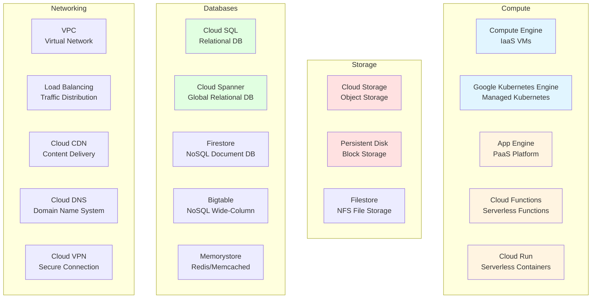
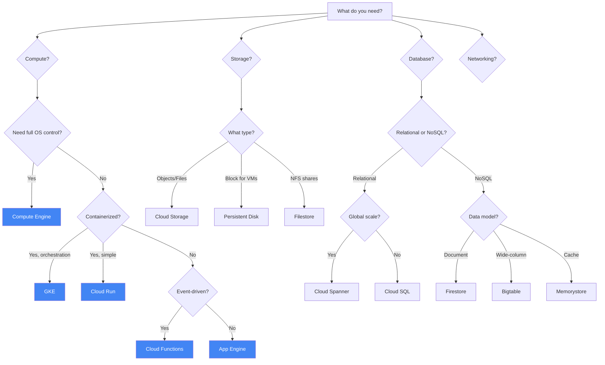

# Основні сервіси GCP

## Мета модуля

Цей модуль надає огляд основних сервісів Google Cloud Platform, згрупованих за категоріями: обчислення (Compute), сховища (Storage), бази даних (Databases) та мережі (Networking). Ви навчитесь вибирати правильний сервіс для конкретного сценарію використання.

## Module Goal (English)

This module provides an overview of core Google Cloud Platform services grouped by categories: Compute, Storage, Databases, and Networking. You will learn to select the right service for specific use cases.

## Topics

- [Compute Services](compute-services.md) - Compute Engine, GKE, App Engine, Cloud Functions, Cloud Run
- [Storage Services](storage-services.md) - Cloud Storage, Persistent Disk, Filestore
- [Database Services](database-services.md) - Cloud SQL, Spanner, Firestore, Bigtable, Memorystore
- [Networking Services](networking-services.md) - VPC, Load Balancing, Cloud CDN, DNS, VPN, Interconnect

## Key Exam Takeaways

- ✅ Know when to use Compute Engine vs GKE vs App Engine vs Cloud Functions
- ✅ Understand the difference between object storage (Cloud Storage) and block storage (Persistent Disk)
- ✅ Know which database to choose based on data structure and scale requirements
- ✅ Understand VPC concepts and how to connect resources securely
- ✅ Know the different types of load balancers and when to use each
- ✅ Understand the difference between Cloud VPN and Cloud Interconnect

## GCP Services Overview

## Service Selection Decision Tree

## 📝 [Practice Questions](exam-questions.md)
