# GCP Core Services

## Вступ до модуля

Цей модуль є мостом між фундаментальними концепціями (Module 01) та глибоким вивченням окремих сервісів (Modules 03-12). Тут ви дізнаєтесь про основні категорії сервісів GCP та як вони співвідносяться між собою.

### Чому цей модуль критично важливий?

**Проблема вибору:** GCP пропонує 100+ сервісів. Як вибрати правильний для вашої задачі? Цей модуль навчить вас систематичному підходу до вибору сервісів.

**Реальний сценарій:**

```text
Задача: Розгорнути веб-додаток з базою даних

❌ Неправильний підхід:
"Я чув про Kubernetes, використаю GKE"
Результат: Overengineering, висока складність, зайві витрати

✅ Правильний підхід:
1. Аналіз вимог: Веб-додаток, автоскейлінг, мінімальний DevOps
2. Категорія: Compute (PaaS)
3. Вибір: App Engine або Cloud Run
4. База даних: Cloud SQL (managed relational DB)
Результат: Простота, автоматичне масштабування, оптимальна вартість
```

### Структура модуля та залежності

```mermaid
graph TB
    A[GCP Core Services] --> B[Compute]
    A --> C[Storage]
    A --> D[Databases]
    A --> E[Networking]
    
    B --> B1[Compute Engine - IaaS]
    B --> B2[GKE - Container Orchestration]
    B --> B3[App Engine - PaaS]
    B --> B4[Cloud Functions - Serverless]
    B --> B5[Cloud Run - Containers]
    
    C --> C1[Cloud Storage - Object]
    C --> C2[Persistent Disk - Block]
    C --> C3[Filestore - File]
    
    D --> D1[Cloud SQL - Relational]
    D --> D2[Cloud Spanner - Global SQL]
    D --> D3[Firestore - NoSQL Document]
    D --> D4[Bigtable - NoSQL Wide-column]
    D --> D5[Memorystore - Cache]
    
    E --> E1[VPC - Network]
    E --> E2[Load Balancing]
    E --> E3[Cloud CDN]
    E --> E4[Cloud DNS]
    
    style A fill:#4285f4,color:#fff
    style B fill:#34a853,color:#fff
    style C fill:#fbbc04
    style D fill:#ea4335,color:#fff
    style E fill:#9334e6,color:#fff
```



### Як сервіси пов'язані між собою

**Вертикальні залежності (в межах категорії):**

- Compute Engine → GKE (GKE працює на Compute Engine VMs)
- Cloud Storage → Persistent Disk (різні типи storage для різних потреб)

**Горизонтальні залежності (між категоріями):**

- Compute + Storage: VM потребує диск для boot та data
- Compute + Database: Додаток на VM/GKE підключається до Cloud SQL
- Compute + Networking: Всі compute ресурси потребують VPC та Load Balancer

**Приклад повної архітектури:**

```
User Request
    ↓
Cloud CDN (кешування статики)
    ↓
Load Balancer (розподіл трафіку)
    ↓
App Engine / Cloud Run (додаток)
    ↓
Cloud SQL (база даних)
    ↓
Cloud Storage (файли, backup)
```

---

## Module Goal

Цей модуль надає огляд основних категорій сервісів GCP: Compute, Storage, Databases, та Networking. Ви навчитесь вибирати правильний сервіс для конкретних сценаріїв, розуміти взаємозв'язки між сервісами та проектувати ефективні архітектури.

## Module Goal (English)

This module provides an overview of core GCP service categories: Compute, Storage, Databases, and Networking. You will learn to choose the right service for specific scenarios, understand relationships between services, and design efficient architectures.

---

## Topics

### 1. [Compute Services](compute-services.md)

**Що ви дізнаєтесь:**

- 5 основних compute опцій: Compute Engine, GKE, App Engine, Cloud Functions, Cloud Run
- Коли використовувати кожен сервіс
- Порівняння контролю vs простоти
- Decision tree для вибору compute сервісу

**Ключові концепції:**

- **IaaS (Compute Engine)**: Повний контроль, максимальна гнучкість
- **Containers (GKE, Cloud Run)**: Портативність, оркестрація
- **PaaS (App Engine)**: Фокус на коді, автоматичне масштабування
- **Serverless (Cloud Functions)**: Event-driven, оплата за виконання

**Залежності:**

- Базується на розумінні IaaS/PaaS з Module 01
- Детальне вивчення Compute Engine в Module 03
- Детальне вивчення GKE в Module 04

**Типове питання на іспиті:**

```text
Компанія має legacy Java додаток, який потребує специфічної версії JDK
та custom kernel modules. Який compute сервіс найкраще підходить?

A) App Engine
B) Cloud Functions  
C) Compute Engine
D) Cloud Run

Відповідь: C (потрібен повний контроль над ОС)
```

---

### 2. [Storage Services](storage-services.md)

**Що ви дізнаєтесь:**

- Типи storage: Object, Block, File
- Cloud Storage classes: Standard, Nearline, Coldline, Archive
- Persistent Disk types: Standard, SSD, Extreme
- Коли використовувати кожен тип

**Ключові концепції:**

- **Object Storage (Cloud Storage)**: Unstructured data, глобальний доступ
- **Block Storage (Persistent Disk)**: VM boot disks, databases
- **File Storage (Filestore)**: Shared file systems, NFS

**Взаємозв'язки:**

```
Compute Engine VM
    ↓ (boot disk)
Persistent Disk (SSD)
    ↓ (data storage)
Cloud Storage (backup, static files)
```

**Залежності:**

- Використовується всіма compute сервісами
- Детальне вивчення в Module 07

**Типове питання на іспиті:**

```text
Веб-додаток зберігає user-uploaded зображення. Доступ до зображень
старше 30 днів рідкісний. Як оптимізувати вартість?

A) Все в Standard class
B) Lifecycle policy: Standard → Nearline після 30 днів
C) Все в Archive class
D) Використати Persistent Disk

Відповідь: B (автоматичний перехід на дешевший tier)
```

---

### 3. [Database Services](database-services.md)

**Що ви дізнаєтесь:**

- Relational vs NoSQL databases
- 5 основних database сервісів GCP
- Коли використовувати SQL vs NoSQL
- Горизонтальне vs вертикальне масштабування

**Ключові концепції:**

- **Cloud SQL**: Managed MySQL/PostgreSQL/SQL Server
- **Cloud Spanner**: Globally distributed SQL
- **Firestore**: NoSQL document database
- **Bigtable**: NoSQL wide-column (analytics, IoT)
- **Memorystore**: Redis/Memcached cache

**Decision Tree:**

```
Потрібна транзакційність? 
    ↓ Так
    Глобальний масштаб?
        ↓ Так → Cloud Spanner
        ↓ Ні → Cloud SQL
    ↓ Ні
    Тип даних?
        ↓ Documents → Firestore
        ↓ Time-series/Analytics → Bigtable
        ↓ Cache → Memorystore
```

**Залежності:**

- Використовується compute сервісами для зберігання даних
- Детальне вивчення в Module 08

**Типове питання на іспиті:**

```text
Глобальний e-commerce додаток потребує ACID транзакцій
та низької латентності в усіх регіонах. Яка база даних?

A) Cloud SQL
B) Cloud Spanner
C) Firestore
D) Bigtable

Відповідь: B (globally distributed SQL з ACID)
```

---

### 4. [Networking Services](networking-services.md)

**Що ви дізнаєтесь:**

- VPC та subnet architecture
- Load Balancing types: Global vs Regional
- Cloud CDN для static content
- Cloud DNS та Cloud VPN

**Ключові концепції:**

- **VPC**: Ізольована мережа для ваших ресурсів
- **Load Balancer**: Розподіл трафіку, HA
- **Cloud CDN**: Кешування на edge locations
- **Cloud Interconnect**: Приватне з'єднання з on-premises

**Network Architecture:**

```
Internet
    ↓
Cloud CDN (edge caching)
    ↓
Global Load Balancer
    ↓
VPC (europe-west1)
    ↓
Subnet (10.0.1.0/24)
    ↓
VM Instances
```

**Залежності:**

- Використовується всіма compute та database сервісами
- Детальне вивчення в Module 09

**Типове питання на іспиті:**

```text
Веб-додаток має користувачів по всьому світу.
Як зменшити латентність для статичного контенту?

A) Більше VM instances
B) Cloud CDN
C) Faster machine types
D) Premium network tier

Відповідь: B (кешування на edge locations близько до користувачів)
```

---

## Key Exam Takeaways

### Compute Services Decision Matrix

| Потреба | Сервіс | Чому |
|---------|--------|------|
| Повний контроль ОС | Compute Engine | IaaS, максимальна гнучкість |
| Container orchestration | GKE | Kubernetes для складних систем |
| Швидкий deploy веб-додатку | App Engine | PaaS, автоскейлінг |
| Event-driven функції | Cloud Functions | Serverless, оплата за виконання |
| Containerized додаток | Cloud Run | Serverless containers |

### Storage Services Decision Matrix

| Тип даних | Сервіс | Чому |
|-----------|--------|------|
| Unstructured (зображення, відео) | Cloud Storage | Object storage, глобальний доступ |
| VM boot disk | Persistent Disk SSD | Block storage, висока performance |
| Shared files (NFS) | Filestore | File storage для кількох VM |
| Archive (рідкісний доступ) | Cloud Storage Archive | Найдешевший tier |

### Database Services Decision Matrix

| Вимоги | Сервіс | Чому |
|--------|--------|------|
| Relational, regional | Cloud SQL | Managed MySQL/PostgreSQL |
| Relational, global | Cloud Spanner | Globally distributed SQL |
| NoSQL documents | Firestore | Flexible schema, real-time |
| NoSQL analytics | Bigtable | Petabyte-scale, low latency |
| Cache | Memorystore | Redis/Memcached |

---

## Patterns та Best Practices

### Pattern 1: Typical Web Application

```
Users → Cloud CDN → Load Balancer → App Engine → Cloud SQL
                                              ↓
                                        Cloud Storage (uploads)
```

**Чому така архітектура:**

- CDN: Кешування статики, зменшення латентності
- Load Balancer: HA, SSL termination
- App Engine: PaaS, автоскейлінг, фокус на коді
- Cloud SQL: Managed database, automatic backups
- Cloud Storage: Дешеве зберігання файлів

---

### Pattern 2: Microservices Architecture

```
Users → Load Balancer → GKE Cluster
                            ↓
                    [Service A] → Cloud SQL
                    [Service B] → Firestore
                    [Service C] → Bigtable
                            ↓
                    Cloud Storage (shared data)
```

**Чому така архітектура:**

- GKE: Оркестрація мікросервісів
- Різні databases: Кожен сервіс вибирає оптимальну БД
- Cloud Storage: Shared state між сервісами

---

### Pattern 3: Data Processing Pipeline

```
Cloud Storage (raw data)
    ↓
Cloud Functions (trigger on upload)
    ↓
Compute Engine (processing)
    ↓
Bigtable (results)
```

**Чому така архітектура:**

- Cloud Storage: Дешеве зберігання raw data
- Cloud Functions: Event-driven processing
- Compute Engine: Потужні VM для processing
- Bigtable: Швидкий доступ до results

---

## Зв'язок з іншими модулями

**Module 01 (Cloud Fundamentals):**
Використовує концепції IaaS/PaaS/SaaS для класифікації сервісів.

**Module 03 (Compute Engine):**
Глибоке занурення в IaaS compute опцію.

**Module 04 (GKE):**
Детальне вивчення container orchestration.

**Module 05-06 (App Engine, Cloud Functions):**
Детальне вивчення PaaS та serverless.

**Module 07 (Storage):**
Глибоке занурення в storage опції.

**Module 08 (Databases):**
Детальне вивчення database сервісів.

**Module 09 (Networking):**
Глибоке занурення в networking.

---

## 📝 [Practice Questions](exam-questions.md)

**Що включено:**

- 10+ питань на вибір правильного сервісу
- Сценарії з реального світу
- Порівняння різних опцій
- Детальні пояснення

**Фокус питань:**

- Compute service selection
- Storage class optimization
- Database type selection
- Network architecture decisions

---

**Попередній модуль:** [Module 01 - Cloud Fundamentals](../01-cloud-fundamentals/README.md)

**Наступний модуль:** [Module 03 - Compute Engine](../03-compute-engine/README.md)
