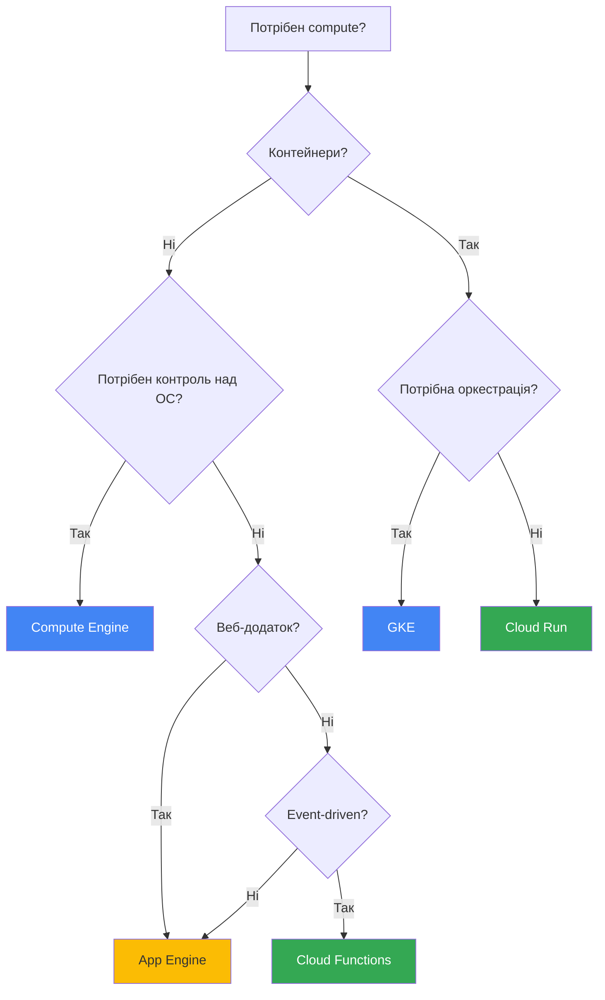

# Compute Services

## Огляд

GCP надає кілька варіантів для запуску обчислювальних workloads, від повного контролю над VM до повністю керованих serverless платформ.

---

## Compute Engine

**Тип:** IaaS  
**Опис:** Віртуальні машини з повним контролем над ОС та конфігурацією.

### Ключові характеристики

- Повний контроль над VM (ОС, мережа, диски)
- Підтримка Linux та Windows
- Preemptible та Spot VM для зниження вартості
- Custom machine types
- Автоматичне масштабування через Managed Instance Groups

### Коли використовувати

- ✅ Потрібен повний контроль над ОС
- ✅ Legacy додатки (lift-and-shift)
- ✅ Специфічні вимоги до ОС або ПЗ
- ✅ Довготривалі workloads

### Приклад команди

```bash
gcloud compute instances create my-vm \
  --zone=us-central1-a \
  --machine-type=e2-medium \
  --image-family=debian-11 \
  --image-project=debian-cloud
```

---

## Google Kubernetes Engine (GKE)

**Тип:** Managed Container Orchestration  
**Опис:** Керований Kubernetes для оркестрації контейнерів.

### Ключові характеристики

- Автоматичне управління control plane
- Автоматичні оновлення та патчі
- Інтеграція з Cloud Monitoring та Logging
- Horizontal Pod Autoscaling
- Два режими: Standard та Autopilot

### Коли використовувати

- ✅ Контейнеризовані додатки
- ✅ Потрібна оркестрація (deployments, services, scaling)
- ✅ Microservices архітектура
- ✅ Hybrid/multi-cloud deployments

### Приклад команди

```bash
gcloud container clusters create my-cluster \
  --zone=us-central1-a \
  --num-nodes=3
```

---

## App Engine

**Тип:** PaaS  
**Опис:** Платформа для розгортання веб-додатків без управління інфраструктурою.

### Два середовища

#### Standard Environment

- Швидкий запуск (мілісекунди)
- Автоматичне масштабування до 0
- Обмежені runtime (Python, Java, Node.js, PHP, Ruby, Go)
- Безкоштовний tier

#### Flexible Environment

- Повільніший запуск (хвилини)
- Мінімум 1 екземпляр
- Підтримка Docker контейнерів
- Більше контролю над середовищем

### Коли використовувати

- ✅ Веб-додатки та API
- ✅ Не потрібен контроль над інфраструктурою
- ✅ Автоматичне масштабування
- ✅ Швидка розробка та deployment

### Приклад команди

```bash
gcloud app deploy app.yaml
```

---

## Cloud Functions

**Тип:** Serverless Functions (FaaS)  
**Опис:** Виконання коду у відповідь на події без управління серверами.

### Ключові характеристики

- Event-driven архітектура
- Автоматичне масштабування
- Оплата тільки за час виконання
- Підтримка HTTP, Pub/Sub, Cloud Storage triggers
- Підтримка Python, Node.js, Go, Java

### Коли використовувати

- ✅ Event-driven workloads
- ✅ Короткотривалі задачі (до 9 хвилин)
- ✅ Обробка подій (файли, повідомлення)
- ✅ Webhooks та API endpoints

### Приклад команди

```bash
gcloud functions deploy my-function \
  --runtime=python39 \
  --trigger-http \
  --allow-unauthenticated
```

---

## Cloud Run

**Тип:** Serverless Containers  
**Опис:** Запуск контейнерів без управління інфраструктурою.

### Ключові характеристики

- Будь-який контейнер (Docker)
- Автоматичне масштабування до 0
- Оплата за використання
- HTTP та event-driven triggers
- Швидкий запуск

### Коли використовувати

- ✅ Контейнеризовані додатки
- ✅ Не потрібна оркестрація Kubernetes
- ✅ Serverless переваги з гнучкістю контейнерів
- ✅ Портативність між середовищами

### Приклад команди

```bash
gcloud run deploy my-service \
  --image=gcr.io/my-project/my-image \
  --platform=managed \
  --region=us-central1
```

---

## Порівняльна таблиця

| Характеристика | Compute Engine | GKE | App Engine | Cloud Functions | Cloud Run |
|----------------|----------------|-----|------------|-----------------|-----------|
| **Тип** | IaaS | CaaS | PaaS | FaaS | Serverless Containers |
| **Контроль** | Повний | Високий | Середній | Низький | Середній |
| **Масштабування** | Ручне/Auto | Auto | Auto | Auto | Auto |
| **Мін. екземплярів** | 1 | 1 | 0 (Standard) | 0 | 0 |
| **Час запуску** | Хвилини | Секунди | Секунди/Хвилини | Мілісекунди | Секунди |
| **Оплата** | За VM час | За ноди | За екземпляри | За виконання | За використання |
| **Use Case** | Legacy apps | Microservices | Web apps | Events | Containers |

---

## Вибір compute сервісу: Decision Flow



---

## Ключові команди gcloud

### Compute Engine

```bash
# Список VM
gcloud compute instances list

# SSH до VM
gcloud compute ssh my-vm --zone=us-central1-a

# Зупинити VM
gcloud compute instances stop my-vm --zone=us-central1-a
```

### GKE

```bash
# Список кластерів
gcloud container clusters list

# Отримати credentials
gcloud container clusters get-credentials my-cluster --zone=us-central1-a

# Використати kubectl
kubectl get pods
```

### App Engine

```bash
# Список версій
gcloud app versions list

# Перегляд логів
gcloud app logs tail

# Розподіл трафіку
gcloud app services set-traffic default --splits v2=1
```

### Cloud Functions

```bash
# Список функцій
gcloud functions list

# Перегляд логів
gcloud functions logs read my-function

# Виклик функції
gcloud functions call my-function --data='{"key":"value"}'
```

### Cloud Run

```bash
# Список сервісів
gcloud run services list

# Перегляд логів
gcloud run services logs read my-service

# Оновлення сервісу
gcloud run services update my-service --image=gcr.io/my-project/new-image
```

---

> ⚠️ **Важливо для іспиту**: Розуміння коли використовувати кожен compute сервіс - одне з найважливіших питань на іспиті ACE. Фокусуйтесь на use cases та trade-offs.

---

**Повернутися до:** [Модуль 02 - Основні сервіси GCP](README.md)
