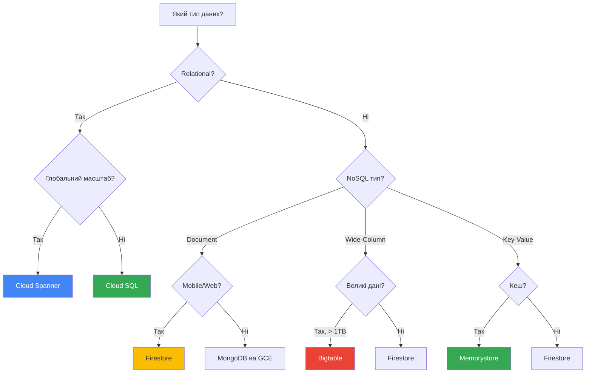

# Database Services

## Огляд

GCP надає різні типи баз даних для різних потреб: реляційні, NoSQL, in-memory кеші.

---

## Cloud SQL

**Тип:** Managed Relational Database  
**Опис:** Керований сервіс для MySQL, PostgreSQL та SQL Server.

### Підтримувані СУБД

- MySQL (5.6, 5.7, 8.0)
- PostgreSQL (9.6 - 15)
- SQL Server (2017, 2019, 2022)

### Ключові характеристики

- Автоматичні backup та point-in-time recovery
- Автоматичні патчі та оновлення
- High Availability (HA) конфігурація
- Read replicas для масштабування читання
- Автоматичне шифрування даних

### High Availability

- Primary instance + standby instance в іншій зоні
- Автоматичний failover при збої
- SLA 99.95%

### Коли використовувати

- ✅ Реляційні дані з ACID транзакціями
- ✅ Міграція з on-premises MySQL/PostgreSQL/SQL Server
- ✅ Structured data з складними запитами
- ✅ Регіональні додатки

### Приклади команд

```bash
# Створити Cloud SQL instance
gcloud sql instances create my-instance \
  --database-version=MYSQL_8_0 \
  --tier=db-n1-standard-1 \
  --region=us-central1

# Створити базу даних
gcloud sql databases create my-database \
  --instance=my-instance

# Підключитися через Cloud SQL Proxy
cloud_sql_proxy -instances=PROJECT:REGION:INSTANCE=tcp:3306
```

---

## Cloud Spanner

**Тип:** Globally Distributed Relational Database  
**Опис:** Глобально розподілена реляційна БД з сильною консистентністю.

### Ключові характеристики

- Горизонтальне масштабування (до петабайтів)
- Глобальна реплікація з сильною консистентністю
- ACID транзакції
- SQL-подібний синтаксис
- SLA 99.999% (multi-region)

### Конфігурації

- **Regional**: Дані в одному регіоні (3 зони)
- **Multi-region**: Дані в кількох регіонах (глобальна доступність)

### Коли використовувати

- ✅ Глобальні додатки з користувачами по всьому світу
- ✅ Потрібна сильна консистентність
- ✅ Великі обсяги даних (> 2 TB)
- ✅ Критична доступність (99.999%)

### Приклад команди

```bash
# Створити Spanner instance
gcloud spanner instances create my-instance \
  --config=regional-us-central1 \
  --nodes=1 \
  --description="My Spanner Instance"

# Створити базу даних
gcloud spanner databases create my-database \
  --instance=my-instance
```

---

## Firestore

**Тип:** NoSQL Document Database  
**Опис:** Документна база даних для веб та мобільних додатків.

### Два режими

#### Native Mode

- Оптимізований для мобільних та веб-додатків
- Real-time синхронізація
- Offline підтримка
- Автоматичне масштабування

#### Datastore Mode

- Сумісність з legacy Datastore API
- Server-side додатки
- Більше можливостей для запитів

### Ключові характеристики

- Документна модель (collections → documents → fields)
- Real-time listeners
- Автоматична індексація
- ACID транзакції
- Глобальна реплікація

### Коли використовувати

- ✅ Мобільні та веб-додатки
- ✅ Real-time синхронізація
- ✅ Ієрархічні дані
- ✅ Offline-first додатки

### Приклад (SDK)

```python
from google.cloud import firestore

db = firestore.Client()

# Додати документ
doc_ref = db.collection('users').document('user1')
doc_ref.set({
    'name': 'John Doe',
    'email': 'john@example.com'
})

# Читати документ
doc = doc_ref.get()
print(doc.to_dict())
```

---

## Bigtable

**Тип:** NoSQL Wide-Column Database  
**Опис:** Високопродуктивна NoSQL БД для великих обсягів даних.

### Ключові характеристики

- Петабайтне масштабування
- Мілісекундна latency
- Висока пропускна здатність (millions ops/sec)
- Автоматичне шардування
- Інтеграція з Hadoop/Spark

### Модель даних

- Row key (унікальний ідентифікатор)
- Column families
- Columns
- Timestamps (версіонування)

### Коли використовувати

- ✅ Time-series data (IoT, моніторинг)
- ✅ Аналітика великих даних
- ✅ Фінансові дані (tick data)
- ✅ > 1 TB даних з високою throughput

### Приклад команди

```bash
# Створити Bigtable instance
gcloud bigtable instances create my-instance \
  --cluster=my-cluster \
  --cluster-zone=us-central1-a \
  --cluster-num-nodes=3 \
  --display-name="My Bigtable Instance"

# Використати cbt CLI
cbt -instance=my-instance createtable my-table
cbt -instance=my-instance createfamily my-table cf1
```

---

## Memorystore

**Тип:** Managed In-Memory Cache  
**Опис:** Керований Redis та Memcached для кешування.

### Підтримувані системи

- **Redis**: Структури даних, pub/sub, persistence
- **Memcached**: Простий key-value кеш

### Ключові характеристики

- Мілісекундна latency
- Автоматичні backup (Redis)
- High Availability (Redis)
- Автоматичне масштабування
- VPC peering для безпеки

### Коли використовувати

- ✅ Кешування для зменшення latency
- ✅ Session storage
- ✅ Leaderboards, counters
- ✅ Pub/Sub messaging (Redis)

### Приклад команди

```bash
# Створити Redis instance
gcloud redis instances create my-redis \
  --size=1 \
  --region=us-central1 \
  --redis-version=redis_6_x
```

---

## Порівняльна таблиця

| Характеристика | Cloud SQL | Cloud Spanner | Firestore | Bigtable | Memorystore |
|----------------|-----------|---------------|-----------|----------|-------------|
| **Тип** | Relational | Relational | Document NoSQL | Wide-Column NoSQL | Key-Value Cache |
| **Масштабування** | Vertical | Horizontal | Auto | Horizontal | Vertical |
| **Транзакції** | ACID | ACID | ACID | Single-row | Немає |
| **Max Size** | ~30 TB | Petabytes | Terabytes | Petabytes | 300 GB |
| **Latency** | ms | ms | ms | ms | sub-ms |
| **Use Case** | OLTP | Global apps | Mobile/Web | Analytics | Caching |
| **Ціна** | \$ | \$\$\$ | \$ | \$\$ | \$ |

---

## Вибір бази даних



---

## Best Practices

### Cloud SQL

- ✅ Увімкніть automated backups
- ✅ Використовуйте HA для production
- ✅ Створіть read replicas для масштабування читання
- ✅ Використовуйте Cloud SQL Proxy для безпечного підключення

### Cloud Spanner

- ✅ Вибирайте правильну конфігурацію (regional vs multi-region)
- ✅ Проектуйте schema для уникнення hotspots
- ✅ Використовуйте interleaved tables для related data
- ✅ Моніторьте CPU utilization

### Firestore

- ✅ Структуруйте дані для ефективних запитів
- ✅ Використовуйте composite indexes для складних запитів
- ✅ Обмежуйте розмір документів (< 1 MB)
- ✅ Використовуйте batch operations

### Bigtable

- ✅ Проектуйте row keys для рівномірного розподілу
- ✅ Уникайте sequential row keys
- ✅ Використовуйте column families розумно
- ✅ Налаштуйте replication для HA

---

> ⚠️ **Важливо для іспиту**: Вибір правильної бази даних - часте питання на іспиті. Знайте use cases для кожної БД та коли використовувати Cloud SQL vs Spanner vs Firestore vs Bigtable.

---

**Повернутися до:** [Модуль 02 - Основні сервіси GCP](README.md)
