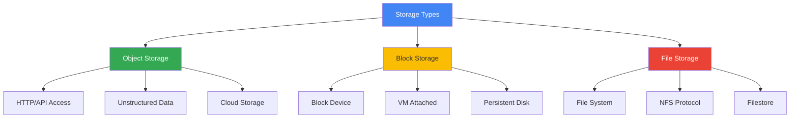
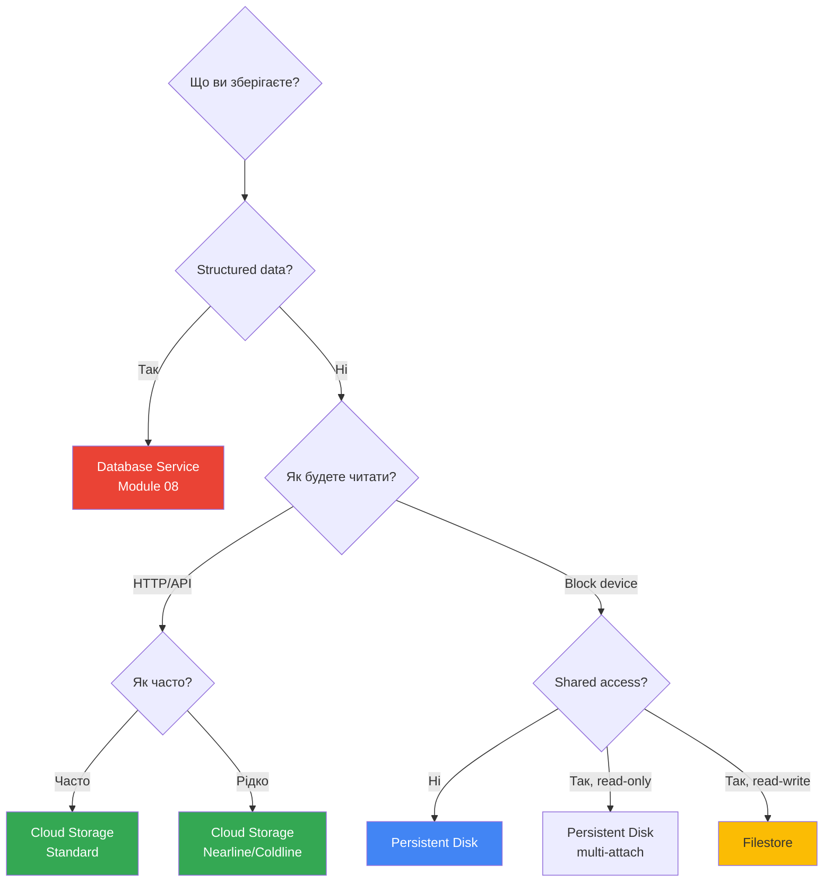
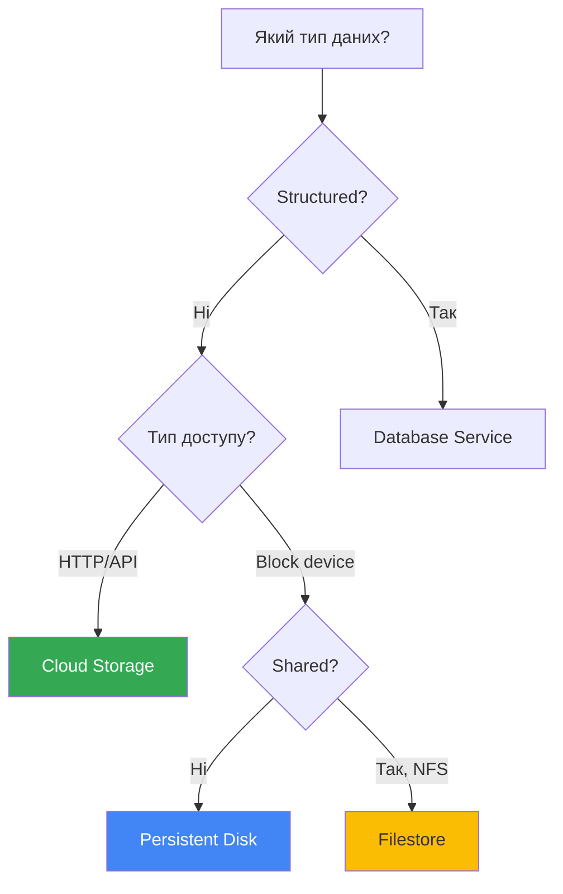

# Storage Services

## Вступ: Розуміння типів сховищ

### Три фундаментальні типи storage

Перед вивченням конкретних сервісів GCP, критично важливо зрозуміти три базові типи сховищ та їх призначення:



#### 1. Object Storage (Об'єктне сховище)

**Концепція:** Дані зберігаються як об'єкти з метаданими, доступ через HTTP/API.

**Аналогія:** Як бібліотека - кожна книга (об'єкт) має унікальний номер (key) та картку з інформацією (metadata).

**Характеристики:**

- ✅ Необмежена масштабованість
- ✅ Глобальна доступність
- ✅ Дешеве зберігання
- ❌ Не можна монтувати як диск
- ❌ Не підходить для баз даних

**GCP сервіс:** Cloud Storage

---

#### 2. Block Storage (Блокове сховище)

**Концепція:** Дані зберігаються у фіксованих блоках, доступ як до звичайного диску.

**Аналогія:** Як жорсткий диск у вашому комп'ютері - можна створити файлову систему, встановити ОС, запустити базу даних.

**Характеристики:**

- ✅ Низька латентність
- ✅ Високий IOPS
- ✅ Підходить для баз даних
- ❌ Прив'язане до VM
- ❌ Складніше масштабувати

**GCP сервіс:** Persistent Disk, Local SSD

---

#### 3. File Storage (Файлове сховище)

**Концепція:** Ієрархічна файлова система, доступ через NFS протокол.

**Аналогія:** Як мережева папка (network share) - кілька користувачів можуть одночасно працювати з файлами.

**Характеристики:**

- ✅ Спільний доступ між VM
- ✅ POSIX-сумісність
- ✅ Підходить для legacy додатків
- ❌ Дорожче за block storage
- ❌ Обмежена масштабованість

**GCP сервіс:** Filestore

---

### Коли використовувати кожен тип?



---

### Зв'язки з іншими модулями

**Module 03 (Compute Engine):**

- Persistent Disk як boot та data диски для VM
- Local SSD для high-performance workloads
- [VM Instances](../03-compute-engine/vm-instances.md) потребують storage

**Module 04 (Kubernetes Engine):**

- Persistent Volumes використовують Persistent Disk або Filestore
- [GKE Storage](../04-kubernetes-engine/README.md) інтеграція

**Module 07 (Storage - детальніше):**

- Глибше вивчення Cloud Storage classes
- [Storage optimization](../07-storage/README.md) стратегії

**Module 08 (Databases):**

- Бази даних використовують Persistent Disk під капотом
- [Database storage](../08-databases/README.md) вимоги

**Module 12 (Deployment):**

- Cloud Storage для artifacts та images
- [CI/CD storage](../12-deployment-management/README.md) patterns

---

## Огляд сервісів

Тепер, коли ми розуміємо фундаментальні типи, розглянемо конкретні GCP сервіси:

---

## Cloud Storage

**Тип:** Object Storage  
**Опис:** Об'єктне сховище для неструктурованих даних (файли, зображення, відео, backup).

### Ключові характеристики

- Необмежена ємність
- Глобальна доступність
- Версіонування об'єктів
- Lifecycle management
- Різні storage classes для оптимізації вартості

### Storage Classes

| Class | Use Case | Availability | Min Storage Duration | Retrieval Cost |
|-------|----------|--------------|---------------------|----------------|
| **Standard** | Часто використовувані дані | 99.95% (multi-region) | Немає | Немає |
| **Nearline** | Доступ < 1 раз/місяць | 99.9% | 30 днів | Низька |
| **Coldline** | Доступ < 1 раз/квартал | 99.9% | 90 днів | Середня |
| **Archive** | Доступ < 1 раз/рік | 99.9% | 365 днів | Висока |

### Коли використовувати

- ✅ Статичний контент (зображення, відео)
- ✅ Backup та архівування
- ✅ Data lakes
- ✅ Розподіл контенту (з Cloud CDN)

### Приклади команд

```bash
# Створити bucket
gsutil mb -c STANDARD -l US gs://my-bucket

# Завантажити файл
gsutil cp file.txt gs://my-bucket/

# Список файлів
gsutil ls gs://my-bucket/

# Синхронізувати директорію
gsutil rsync -r ./local-dir gs://my-bucket/remote-dir

# Встановити lifecycle policy
gsutil lifecycle set lifecycle.json gs://my-bucket/
```

### Lifecycle Policy приклад

```json
{
  "lifecycle": {
    "rule": [
      {
        "action": {"type": "SetStorageClass", "storageClass": "NEARLINE"},
        "condition": {"age": 30}
      },
      {
        "action": {"type": "Delete"},
        "condition": {"age": 365}
      }
    ]
  }
}
```

---

## Persistent Disk

**Тип:** Block Storage  
**Опис:** Блокове сховище для Compute Engine VM.

### Типи дисків

#### Standard Persistent Disk (HDD)

- Найдешевший варіант
- Підходить для sequential I/O
- Throughput-oriented workloads

#### Balanced Persistent Disk (SSD)

- Баланс між ціною та продуктивністю
- Підходить для більшості workloads
- Рекомендується за замовчуванням

#### SSD Persistent Disk

- Найвища продуктивність
- Low-latency workloads
- Бази даних, transactional workloads

#### Extreme Persistent Disk

- Найвища продуктивність та IOPS
- Критичні додатки
- Найдорожчий варіант

### Ключові характеристики

- Автоматична реплікація в зоні
- Snapshots для backup
- Можна змінювати розмір без downtime
- Можна приєднати до кількох VM (read-only)

### Zonal vs Regional

- **Zonal PD**: Реплікується в одній зоні (дешевше)
- **Regional PD**: Реплікується в двох зонах (вища доступність)

### Коли використовувати

- ✅ Boot диски для VM
- ✅ Додаткові диски для VM
- ✅ Бази даних на VM
- ✅ Persistent storage для додатків

### Приклади команд

```bash
# Створити диск
gcloud compute disks create my-disk \
  --size=100GB \
  --type=pd-balanced \
  --zone=us-central1-a

# Приєднати до VM
gcloud compute instances attach-disk my-vm \
  --disk=my-disk \
  --zone=us-central1-a

# Створити snapshot
gcloud compute disks snapshot my-disk \
  --snapshot-names=my-snapshot \
  --zone=us-central1-a

# Список snapshots
gcloud compute snapshots list
```

---

## Filestore

**Тип:** File Storage (NFS)  
**Опис:** Керований NFS файловий сервіс для VM та GKE.

### Ключові характеристики

- Повна сумісність з NFSv3
- Високопродуктивне файлове сховище
- Можна монтувати до кількох VM одночасно
- Автоматичні backup

### Tiers

| Tier | Performance | Use Case |
|------|-------------|----------|
| **Basic HDD** | До 180 MB/s | Загальні файлові сховища |
| **Basic SSD** | До 1200 MB/s | High-performance workloads |
| **High Scale SSD** | До 1200 MB/s + більша ємність | Enterprise workloads |
| **Enterprise** | Найвища продуктивність | Критичні додатки |

### Коли використовувати

- ✅ Спільний доступ до файлів між VM
- ✅ Legacy додатки, що потребують NFS
- ✅ Media rendering та processing
- ✅ GKE persistent volumes

### Приклади команд

```bash
# Створити Filestore instance
gcloud filestore instances create my-filestore \
  --zone=us-central1-a \
  --tier=BASIC_HDD \
  --file-share=name=share1,capacity=1TB \
  --network=name=default

# Монтувати на VM
sudo mount -t nfs <FILESTORE_IP>:/share1 /mnt/filestore
```

---

## Порівняльна таблиця

| Характеристика | Cloud Storage | Persistent Disk | Filestore |
|----------------|---------------|-----------------|-----------|
| **Тип** | Object | Block | File (NFS) |
| **Доступ** | HTTP/API | VM attach | NFS mount |
| **Sharing** | Публічний/приватний | Single VM (або read-only) | Multiple VMs |
| **Use Case** | Unstructured data | VM storage | Shared files |
| **Ємність** | Необмежена | До 64 TB | До 100 TB |
| **Ціна** | Найдешевше | Середня | Найдорожче |
| **Latency** | Вища | Низька | Середня |

---

## Вибір storage сервісу



---

## Best Practices

### Cloud Storage

- ✅ Використовуйте lifecycle policies для автоматичного переміщення даних між classes
- ✅ Увімкніть versioning для важливих даних
- ✅ Використовуйте signed URLs для тимчасового доступу
- ✅ Налаштуйте CORS для веб-додатків

### Persistent Disk

- ✅ Використовуйте snapshots для регулярних backup
- ✅ Вибирайте тип диску на основі IOPS вимог
- ✅ Використовуйте regional PD для критичних workloads
- ✅ Моніторьте disk performance metrics

### Filestore

- ✅ Вибирайте правильний tier на основі performance потреб
- ✅ Використовуйте в тій же зоні що й VM для низької latency
- ✅ Налаштуйте backup schedule
- ✅ Моніторьте capacity та performance

---

> ⚠️ **Важливо для іспиту**: Розуміння різниці між object, block та file storage критично важливе. Знайте коли використовувати кожен тип та їх обмеження.

---

**Повернутися до:** [Модуль 02 - Основні сервіси GCP](README.md)
