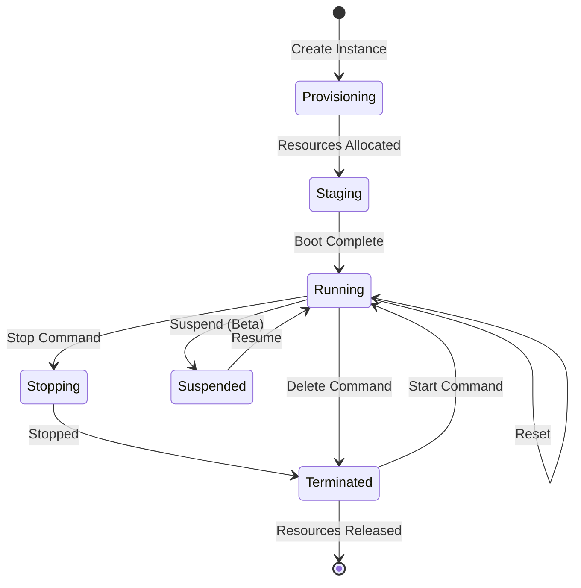
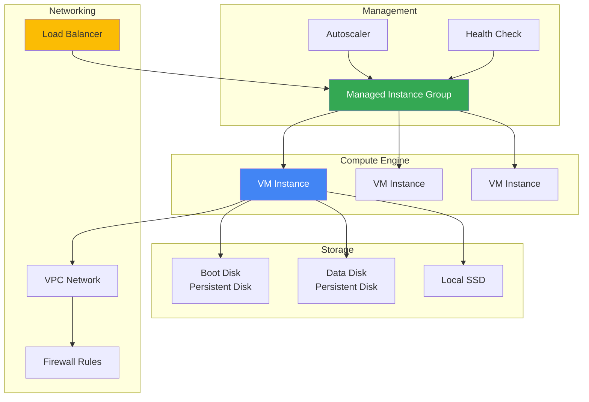

# Compute Engine

## Мета модуля

Цей модуль охоплює Google Compute Engine - IaaS сервіс для створення та управління віртуальними машинами. Ви навчитесь створювати VM instances, вибирати правильні machine types, управляти дисками та використовувати instance groups для масштабування.

## Module Goal (English)

This module covers Google Compute Engine - an IaaS service for creating and managing virtual machines. You will learn to create VM instances, choose the right machine types, manage disks, and use instance groups for scaling.

## Topics

- [VM Instances](vm-instances.md) - Створення, управління, SSH, metadata, preemptible VMs
- [Machine Types](machine-types.md) - Predefined, custom, shared-core types
- [Disks and Images](disks-and-images.md) - Persistent disks, local SSDs, snapshots, images
- [Instance Groups](instance-groups.md) - Managed vs unmanaged, autoscaling, health checks

## Key Exam Takeaways

- ✅ Know how to create and manage VM instances using gcloud and Console
- ✅ Understand the difference between predefined, custom, and shared-core machine types
- ✅ Know when to use preemptible/spot VMs for cost optimization
- ✅ Understand persistent disk types (Standard, Balanced, SSD, Extreme)
- ✅ Know how to create and use snapshots for backup and disaster recovery
- ✅ Understand managed instance groups (MIGs) with autoscaling
- ✅ Know how to configure health checks and rolling updates

## VM Lifecycle

## Compute Engine Architecture

## 📝 [Practice Questions](exam-questions.md)
