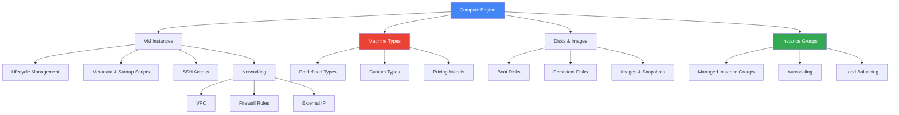

# Compute Engine

## Вступ до модуля

Compute Engine - це фундаментальний IaaS сервіс GCP, який надає віртуальні машини для запуску ваших workloads. Цей модуль є критично важливим, оскільки Compute Engine лежить в основі багатьох інших сервісів (наприклад, GKE використовує Compute Engine VM як worker nodes).

### Чому Compute Engine важливий?

**Фундамент інфраструктури:** Навіть якщо ви використовуєте PaaS сервіси, розуміння Compute Engine допомагає зрозуміти, що відбувається "під капотом". GKE, Cloud SQL, та інші керовані сервіси працюють на Compute Engine VM.

**Максимальна гнучкість:** Compute Engine надає повний контроль над віртуальними машинами, що робить його ідеальним для:

- Legacy додатків, які не можна модифікувати
- Специфічних вимог до ОС або kernel
- Workloads, які потребують специфічного hardware (GPU, TPU)
- Compliance вимог, які потребують повного контролю

### Реальний сценарій: Коли використовувати Compute Engine

```text
Сценарій: Міграція enterprise додатку в хмару

Вимоги:
- Oracle Database з специфічною версією
- Custom Java application server з модифікованим JVM
- Інтеграція з on-premises системами через VPN
- Compliance вимоги: повний контроль над ОС та патчами

❌ Неможливо використати:
- Cloud SQL (не підтримує Oracle)
- App Engine (немає контролю над JVM)
- Cloud Functions (не підходить для довготривалих процесів)

✅ Рішення: Compute Engine
- Повний контроль над ОС (можна встановити Oracle)
- Можливість налаштувати JVM як потрібно
- VPN підключення до on-premises
- Повний контроль над security та compliance
```

### Структура модуля та взаємозв'язки



### Ключові концепції та їх залежності

**1. VM Instance (базова одиниця)**

```
VM Instance складається з:
    ↓
Machine Type (CPU + Memory)
    +
Boot Disk (ОС)
    +
Network Interface (VPC + Subnet)
    +
Metadata (конфігурація)
```

**2. Machine Type визначає:**

- Кількість vCPU
- Обсяг RAM
- Network bandwidth
- Вартість за годину

**3. Disks забезпечують:**

- Boot disk: ОС та system files
- Data disks: Application data
- Snapshots: Backup та disaster recovery

**4. Instance Groups дозволяють:**

- Автоматичне масштабування
- Load balancing
- Rolling updates
- High availability

---

## Module Goal

Цей модуль надає глибоке розуміння Google Compute Engine - IaaS сервісу для запуску віртуальних машин. Ви навчитесь створювати та керувати VM instances, вибирати правильні machine types, працювати з дисками та images, та налаштовувати instance groups для high availability та autoscaling.

## Module Goal (English)

This module provides deep understanding of Google Compute Engine - the IaaS service for running virtual machines. You will learn to create and manage VM instances, choose the right machine types, work with disks and images, and configure instance groups for high availability and autoscaling.

---

## Topics

### 1. [VM Instances](vm-instances.md)

**Що ви дізнаєтесь:**

- Lifecycle VM (створення, запуск, зупинка, видалення)
- Metadata та startup scripts для автоматизації
- SSH access та troubleshooting
- Preemptible та Spot VMs для економії
- Live migration та maintenance events

**Ключові концепції:**

- **Lifecycle states**: PROVISIONING → STAGING → RUNNING → STOPPING → TERMINATED
- **Metadata**: Key-value pairs для конфігурації VM
- **Startup scripts**: Автоматизація налаштування при boot
- **Preemptible VMs**: До 80% знижки, але можуть бути зупинені

**Залежності:**

- Потребує розуміння regions/zones з Module 01
- Використовує VPC з Module 09 (Networking)
- Базується на machine types (наступна тема)

**Типове питання на іспиті:**

```text
Компанія запускає batch processing jobs, які можуть бути перервані
без втрати даних. Як оптимізувати вартість?

A) Використати standard VMs
B) Використати preemptible VMs
C) Використати committed use discounts
D) Використати smaller machine types

Відповідь: B (preemptible VMs до 80% дешевше для fault-tolerant workloads)
```

---

### 2. [Machine Types](machine-types.md)

**Що ви дізнаєтесь:**

- Predefined machine types (E2, N2, C2, M2, A2)
- Custom machine types для специфічних потреб
- Shared-core machine types (f1-micro, g1-small)
- Коли використовувати кожен тип
- Pricing models та оптимізація вартості

**Ключові концепції:**

- **E2**: Cost-optimized, day-to-day computing
- **N2/N2D**: Balanced price/performance
- **C2/C2D**: Compute-optimized, high CPU
- **M2**: Memory-optimized, large RAM
- **A2**: GPU-accelerated, ML/AI workloads

**Decision Tree:**

```
Яке навантаження?
    ↓
CPU-intensive (encoding, analytics)
    → C2/C2D series
    
Memory-intensive (databases, caching)
    → M2 series
    
GPU workloads (ML, rendering)
    → A2 series
    
Balanced workloads
    → N2/N2D series
    
Cost-sensitive
    → E2 series
```

**Залежності:**

- Використовується при створенні VM instances
- Впливає на pricing (Module 01 concepts)

**Типове питання на іспиті:**

```text
Додаток виконує in-memory analytics з великими datasets.
Який machine type найкраще підходить?

A) e2-standard-4
B) c2-standard-4
C) m2-ultramem-208
D) n2-standard-4

Відповідь: C (memory-optimized для in-memory workloads)
```

---

### 3. [Disks and Images](disks-and-images.md)

**Що ви дізнаєтесь:**

- Типи дисків: Standard HDD, Balanced SSD, SSD, Extreme SSD
- Boot disks vs Data disks
- Persistent Disks vs Local SSDs
- Images: Public, Custom, Shared
- Snapshots для backup та disaster recovery

**Ключові концепції:**

- **Persistent Disk**: Network-attached, durable, можна відключити від VM
- **Local SSD**: Physically attached, highest performance, ephemeral
- **Snapshots**: Incremental backups, global resource
- **Images**: Template для створення boot disks

**Storage Performance:**

```
Local SSD (найшвидший, ephemeral)
    ↓
Extreme SSD (найшвидший persistent)
    ↓
SSD Persistent Disk
    ↓
Balanced Persistent Disk
    ↓
Standard HDD (найдешевший)
```

**Залежності:**

- Кожна VM потребує boot disk
- Images використовуються для створення boot disks
- Snapshots залежать від persistent disks

**Типове питання на іспиті:**

```text
База даних потребує найвищої I/O performance.
Дані можуть бути відновлені з replica. Який disk type?

A) Standard Persistent Disk
B) SSD Persistent Disk
C) Local SSD
D) Extreme SSD

Відповідь: C (найвища performance, ephemeral прийнятно для replica)
```

---

### 4. [Instance Groups](instance-groups.md)

**Що ви дізнаєтесь:**

- Managed Instance Groups (MIG) vs Unmanaged
- Autoscaling policies (CPU, load balancer, custom metrics)
- Rolling updates та canary deployments
- Health checks та auto-healing
- Regional vs Zonal MIGs

**Ключові концепції:**

- **MIG**: Група ідентичних VM з instance template
- **Autoscaling**: Автоматичне додавання/видалення instances
- **Health checks**: Моніторинг стану instances
- **Auto-healing**: Автоматична заміна unhealthy instances

**MIG Architecture:**

```
Instance Template (blueprint)
    ↓
Managed Instance Group
    ↓
[VM 1] [VM 2] [VM 3] ... [VM N]
    ↓
Load Balancer (розподіл трафіку)
    ↓
Health Checks (моніторинг)
    ↓
Autoscaler (масштабування)
```

**Залежності:**

- Використовує VM instances та machine types
- Інтегрується з Load Balancing (Module 09)
- Потребує health checks для auto-healing

**Типове питання на іспиті:**

```text
Веб-додаток має змінне навантаження протягом дня.
Як автоматично масштабувати instances?

A) Manually add/remove instances
B) Use Managed Instance Group з autoscaling
C) Use preemptible VMs
D) Use larger machine types

Відповідь: B (MIG з autoscaling автоматично керує кількістю instances)
```

---

## Key Exam Takeaways

### VM Instance Lifecycle

```
PROVISIONING → STAGING → RUNNING
                            ↓
                        STOPPING
                            ↓
                        TERMINATED
```

**Важливо:**

- Оплата тільки в RUNNING state
- Можна зупинити VM для економії (зберігається boot disk)
- Preemptible VMs можуть бути зупинені GCP в будь-який момент

---

### Machine Type Selection

| Workload Type | Machine Series | Приклад Use Case |
|---------------|----------------|------------------|
| General purpose | E2, N2 | Web servers, dev/test |
| Compute-intensive | C2, C2D | Analytics, encoding |
| Memory-intensive | M2 | In-memory databases |
| GPU workloads | A2 | ML training, rendering |
| Cost-sensitive | E2, f1-micro | Small apps, testing |

---

### Disk Type Selection

| Вимоги | Disk Type | IOPS | Throughput |
|--------|-----------|------|------------|
| Highest performance | Local SSD | 680K | 2.4 GB/s |
| High performance persistent | Extreme SSD | 120K | 2.4 GB/s |
| Balanced | SSD PD | 60K | 1.2 GB/s |
| Cost-effective | Standard PD | 7.5K | 240 MB/s |

---

### Instance Groups Best Practices

✅ **Використовуйте MIG для:**

- Production workloads
- Autoscaling
- Load balancing
- High availability

✅ **Regional MIG для:**

- Multi-zone high availability
- Automatic failover
- 99.95% SLA

✅ **Zonal MIG для:**

- Development/testing
- Cost optimization
- Single zone workloads

---

## Architecture Patterns

### Pattern 1: Stateless Web Application

```
Users
    ↓
Load Balancer
    ↓
Regional MIG (3+ zones)
    ↓
[Web Server 1] [Web Server 2] [Web Server 3]
    ↓
Cloud SQL (database)
    ↓
Cloud Storage (static files)
```

**Чому така архітектура:**

- Regional MIG: Multi-zone HA
- Autoscaling: Automatic capacity management
- Load Balancer: Traffic distribution
- Cloud SQL: Managed database
- Cloud Storage: Scalable file storage

---

### Pattern 2: Batch Processing

```
Cloud Storage (input files)
    ↓
Cloud Functions (trigger)
    ↓
Preemptible VM MIG
    ↓
[Worker 1] [Worker 2] ... [Worker N]
    ↓
Cloud Storage (results)
```

**Чому така архітектура:**

- Preemptible VMs: 80% cost savings
- MIG: Automatic scaling based on queue
- Cloud Functions: Event-driven orchestration
- Fault-tolerant: Workers can be interrupted

---

### Pattern 3: High-Performance Database

```
Application Servers
    ↓
VM з Local SSD
    ↓
[Database Instance]
    ↓
Snapshots → Cloud Storage (backup)
```

**Чому така архітектура:**

- Local SSD: Highest I/O performance
- Regular snapshots: Disaster recovery
- Cloud Storage: Durable backup storage

---

## Pricing та Cost Optimization

### Pricing Models

**1. On-Demand (Pay-as-you-go)**

- Оплата за секунду (мінімум 1 хвилина)
- Найвища гнучкість
- Найвища вартість

**2. Committed Use Discounts (CUD)**

- 1-year: 37% знижка
- 3-year: 57% знижка
- Для predictable workloads

**3. Sustained Use Discounts (SUD)**

- Автоматичні знижки за тривале використання
- До 30% знижки
- Застосовується автоматично

**4. Preemptible/Spot VMs**

- До 80% знижки
- Можуть бути зупинені
- Для fault-tolerant workloads

### Cost Optimization Strategies

💡 **Rightsizing:**

- Використовуйте Recommender для оптимізації machine types
- Моніторте CPU/Memory utilization

💡 **Autoscaling:**

- Налаштуйте MIG autoscaling
- Масштабуйте down в non-peak hours

💡 **Preemptible VMs:**

- Використовуйте для batch processing
- Комбінуйте з regular VMs для HA

💡 **Committed Use:**

- Купуйте CUD для stable workloads
- 1-year для flexibility, 3-year для максимальної знижки

💡 **Disk Optimization:**

- Використовуйте Standard PD для non-critical data
- Видаляйте unused snapshots
- Налаштуйте snapshot schedules

---

## Зв'язок з іншими модулями

**Module 01 (Cloud Fundamentals):**

- Compute Engine - це IaaS модель
- Використовує regions/zones для deployment

**Module 02 (GCP Core Services):**

- Compute Engine - основний compute сервіс
- Порівняння з GKE, App Engine, Cloud Functions

**Module 04 (GKE):**

- GKE використовує Compute Engine VMs як nodes
- Розуміння VM допомагає troubleshoot GKE

**Module 07 (Storage):**

- Persistent Disks детально розглядаються
- Cloud Storage для backup та static files

**Module 09 (Networking):**

- VPC та subnets для VM networking
- Load Balancing для MIG traffic distribution

**Module 10 (IAM):**

- Service accounts для VM identity
- IAM roles для access control

---

## 📝 [Practice Questions](exam-questions.md)

**Що включено:**

- 15+ питань на Compute Engine
- Scenarios: VM lifecycle, machine types, disks, MIGs
- Pricing та optimization питання
- Troubleshooting scenarios

**Фокус питань:**

- Вибір правильного machine type
- Disk type selection
- MIG configuration
- Cost optimization strategies

---

**Попередній модуль:** [Module 02 - GCP Core Services](../02-gcp-core-services/README.md)

**Наступний модуль:** [Module 04 - Kubernetes Engine](../04-kubernetes-engine/README.md)
