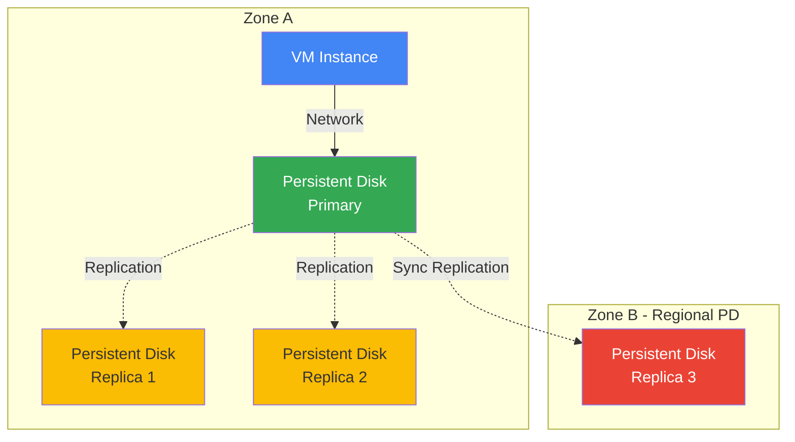
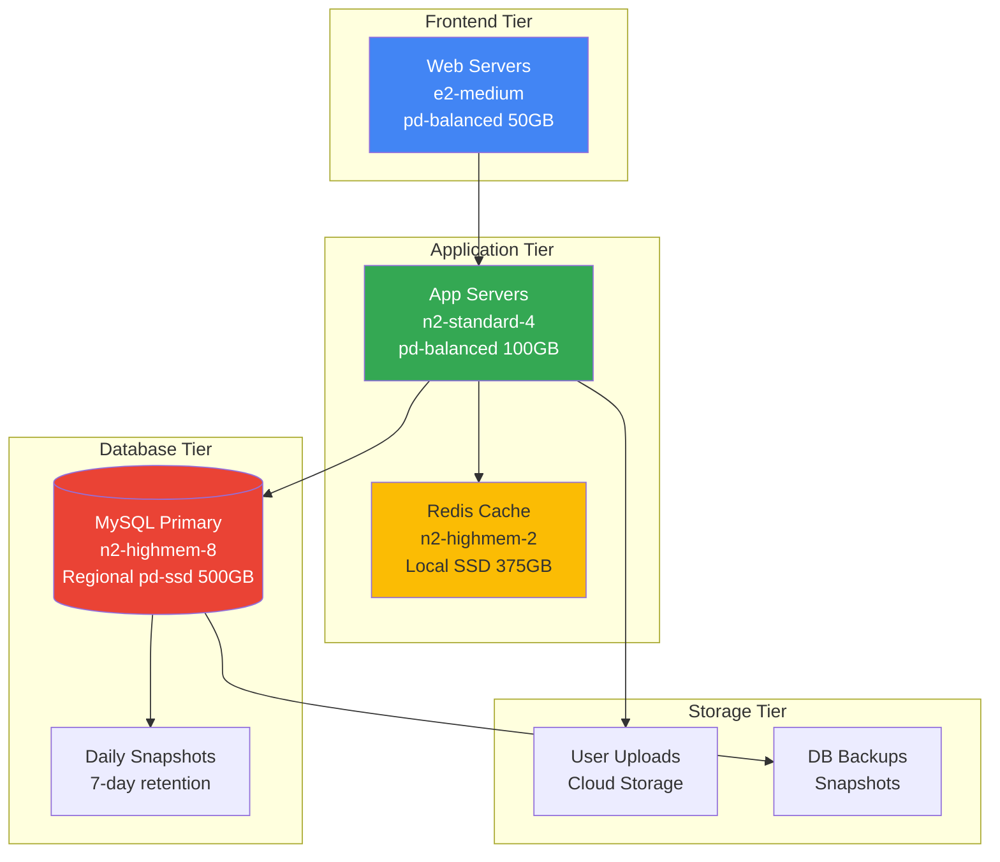

# Disks and Images

## Що таке Persistent Disks?

**Persistent Disk (PD)** - це durable block storage для Compute Engine VM instances. На відміну від ephemeral local storage, persistent disks зберігають дані незалежно від VM lifecycle.

### Основні характеристики

**Block Storage**

- Дані зберігаються у blocks (зазвичай 4 KB)
- Можна форматувати з будь-якою файловою системою (ext4, NTFS, XFS)
- Підключається до VM як звичайний диск (/dev/sdb)

**Network-Attached Storage**

- Фізично відокремлені від VM host
- Підключаються через мережу (але виглядають як local disk)
- Можна відключити та приєднати до іншої VM
- Автоматична реплікація для durability

**Durability та Availability**

- **Zonal PD**: Реплікується в 2+ locations в одній зоні
- **Regional PD**: Реплікується синхронно в 2 зонах
- 99.999% durability (zonal), 99.9999% (regional)
- Automatic checksums та repair

### Як працює Persistent Disk?



**Replication Process:**

1. VM пише дані на persistent disk
2. Дані передаються через мережу до primary replica
3. Primary replica синхронно реплікує на інші replicas
4. Write acknowledged тільки після successful replication

---

## Persistent Disks

### Типи дисків

Google Cloud пропонує 4 типи persistent disks з різною performance та ціною.

#### Standard PD (pd-standard) - HDD

**Характеристики:**

- **Тип**: Hard Disk Drive (HDD)
- **Performance**: 0.75 MB/s per GB read, 1.5 MB/s per GB write
- **IOPS**: 0.75 read IOPS per GB, 1.5 write IOPS per GB
- **Max throughput**: 1,200 MB/s read, 400 MB/s write (per VM)
- **Max IOPS**: 7,500 read, 15,000 write (per VM)
- **Ціна**: Найнижча (~$0.04/GB/month)

**Коли використовувати:**

- ✅ Sequential I/O workloads (backups, logs)
- ✅ Throughput-oriented applications
- ✅ Cold storage
- ✅ Cost-sensitive workloads
- ❌ Random I/O workloads
- ❌ Transactional databases

**Приклад:**

```bash
gcloud compute disks create backup-disk \
  --size=500GB \
  --type=pd-standard \
  --zone=us-central1-a
```

---

#### Balanced PD (pd-balanced) - SSD

**Характеристики:**

- **Тип**: Solid State Drive (SSD)
- **Performance**: 6 IOPS per GB (read/write)
- **Throughput**: 0.28 MB/s per GB
- **Max throughput**: 1,200 MB/s (per VM)
- **Max IOPS**: 80,000 (per VM)
- **Ціна**: Середня (~$0.10/GB/month)

**Коли використовувати:**

- ✅ **Recommended default** для більшості workloads
- ✅ General-purpose applications
- ✅ MySQL, PostgreSQL databases
- ✅ Web servers
- ✅ Development environments
- ✅ Balance між cost та performance

**Приклад:**

```bash
gcloud compute disks create app-disk \
  --size=100GB \
  --type=pd-balanced \
  --zone=us-central1-a
```

**Performance Calculation:**

```
100 GB pd-balanced:
- IOPS: 100 GB × 6 IOPS/GB = 600 IOPS
- Throughput: 100 GB × 0.28 MB/s/GB = 28 MB/s
```

---

#### SSD PD (pd-ssd)

**Характеристики:**

- **Тип**: High-performance SSD
- **Performance**: 30 IOPS per GB (read/write)
- **Throughput**: 0.48 MB/s per GB
- **Max throughput**: 1,200 MB/s (per VM)
- **Max IOPS**: 100,000 (per VM)
- **Ціна**: Висока (~$0.17/GB/month)

**Коли використовувати:**

- ✅ Low-latency workloads
- ✅ Transactional databases (OLTP)
- ✅ High-performance applications
- ✅ Random I/O workloads
- ❌ Cost-sensitive workloads (краще pd-balanced)

**Приклад:**

```bash
gcloud compute disks create db-disk \
  --size=100GB \
  --type=pd-ssd \
  --zone=us-central1-a
```

**Performance Calculation:**

```
100 GB pd-ssd:
- IOPS: 100 GB × 30 IOPS/GB = 3,000 IOPS
- Throughput: 100 GB × 0.48 MB/s/GB = 48 MB/s
```

---

#### Extreme PD (pd-extreme)

**Характеристики:**

- **Тип**: Ultra-high-performance SSD
- **Performance**: Configurable (до 120,000 IOPS)
- **IOPS**: Provisioned IOPS (незалежно від розміру)
- **Throughput**: До 4,800 MB/s
- **Size**: 500 GB - 64 TB
- **Ціна**: Найвища (~$0.125/GB/month + $0.65/IOPS/month)

**Коли використовувати:**

- ✅ Extreme performance requirements
- ✅ SAP HANA
- ✅ Oracle databases
- ✅ SQL Server
- ✅ Коли потрібно >100,000 IOPS
- ❌ General workloads (занадто дорого)

**Приклад:**

```bash
gcloud compute disks create extreme-disk \
  --size=1000GB \
  --type=pd-extreme \
  --provisioned-iops=100000 \
  --zone=us-central1-a
```

---

### Порівняльна таблиця

| Type | Technology | IOPS/GB | Max IOPS | Max Throughput | Price | Use Case |
|------|------------|---------|----------|----------------|-------|----------|
| **Standard PD** | HDD | 0.75-1.5 | 15,000 | 1,200 MB/s | $ | Sequential I/O |
| **Balanced PD** | SSD | 6 | 80,000 | 1,200 MB/s | $$ | **General purpose** |
| **SSD PD** | SSD | 30 | 100,000 | 1,200 MB/s | $$$ | Low latency |
| **Extreme PD** | SSD | Provisioned | 120,000 | 4,800 MB/s | $$$$ | Extreme performance |

> ⚠️ **Важливо для іспиту**: pd-balanced - це **recommended default** для більшості workloads. Розумійте різницю між IOPS та throughput.

---

### Performance Factors

**1. Disk Size**

- Більший диск = більше IOPS та throughput
- Performance scales linearly з розміром (до VM limits)

**2. VM Machine Type**

- Більший VM = вищі performance limits
- Shared-core VMs мають нижчі limits

**3. Number of Disks**

- Можна приєднати до 128 disks на VM
- Performance aggregates across disks

**4. Read vs Write**

- Standard PD: Write швидше за read
- SSD/Balanced: Read та write однакові

**Performance Limits Example:**

```
e2-standard-2 VM з 100 GB pd-balanced:
- Disk capability: 600 IOPS, 28 MB/s
- VM limit: 15,000 IOPS, 240 MB/s
- Actual: 600 IOPS, 28 MB/s (disk-limited)

n2-standard-32 VM з 100 GB pd-balanced:
- Disk capability: 600 IOPS, 28 MB/s
- VM limit: 100,000 IOPS, 2,400 MB/s
- Actual: 600 IOPS, 28 MB/s (disk-limited)
```

---

## Local SSDs

**Опис:** Фізично прикріплені SSD диски до VM host.

### Характеристики

- Найвища продуктивність (375 GB, 3 TB IOPS)
- Дані втрачаються при зупинці/видаленні VM
- До 24 local SSDs на VM (9 TB)
- Не можна відключити без видалення VM

### Коли використовувати

- ✅ Temporary cache
- ✅ Scratch space
- ✅ High-performance computing
- ❌ Persistent data

### Створення

```bash
gcloud compute instances create my-vm \
  --local-ssd=interface=NVME \
  --zone=us-central1-a
```

---

## Snapshots

**Опис:** Incremental backup persistent disks для disaster recovery та data migration.

### Як працюють Snapshots?

**Incremental Nature:**

- Перший snapshot - full copy всіх даних на диску
- Наступні snapshots - тільки зміни (deltas) з попереднього snapshot
- Snapshots зберігаються у Cloud Storage (multi-regional)
- Автоматичне compression та deduplication

```mermaid
graph LR
    D1[Disk<br/>100 GB] -->|Day 1| S1[Snapshot 1<br/>100 GB]
    D2[Disk<br/>105 GB] -->|Day 2| S2[Snapshot 2<br/>+5 GB delta]
    D3[Disk<br/>110 GB| -->|Day 3| S3[Snapshot 3<br/>+5 GB delta]
    
    S1 -.->|Chain| S2
    S2 -.->|Chain| S3
    
    style S1 fill:#4285f4,color:#fff
    style S2 fill:#34a853,color:#fff
    style S3 fill:#fbbc04
```

**Snapshot Chain:**

- Snapshots формують ланцюг (chain)
- Видалення snapshot в середині chain не впливає на інші
- Google автоматично consolidates data

### Характеристики

**Storage:**

- Глобальний ресурс (доступний у всіх регіонах)
- Multi-regional storage для durability
- Compression автоматичний (зменшує розмір)
- Incremental forever (не потрібні full backups)

**Performance:**

- Можна створювати з running VM (без downtime)
- VSS (Volume Shadow Copy) для Windows
- Application-consistent snapshots (з quiescing)
- Restore швидше за full backup

**Pricing:**

- Оплата за фактичний розмір (після compression)
- Incremental storage (тільки зміни)
- Multi-regional storage pricing

### Створення та використання

```bash
# Створити snapshot
gcloud compute disks snapshot my-disk \
  --snapshot-names=my-snapshot \
  --zone=us-central1-a

# Створити диск зі snapshot
gcloud compute disks create new-disk \
  --source-snapshot=my-snapshot \
  --zone=us-central1-b

# Створити диск у іншому регіоні (DR)
gcloud compute disks create dr-disk \
  --source-snapshot=my-snapshot \
  --zone=europe-west1-b

# Список snapshots
gcloud compute snapshots list

# Видалити snapshot
gcloud compute snapshots delete my-snapshot
```

### Snapshot Schedule

Автоматичні snapshots за розкладом для disaster recovery.

**Створення schedule:**

```bash
# Щоденні snapshots
gcloud compute resource-policies create snapshot-schedule daily-backup \
  --max-retention-days=7 \
  --start-time=02:00 \
  --daily-schedule \
  --region=us-central1

# Щотижневі snapshots
gcloud compute resource-policies create snapshot-schedule weekly-backup \
  --max-retention-days=30 \
  --start-time=03:00 \
  --weekly-schedule \
  --weekly-schedule-from-file=schedule.json \
  --region=us-central1

# Щогодинні snapshots
gcloud compute resource-policies create snapshot-schedule hourly-backup \
  --max-retention-days=2 \
  --start-time=00:00 \
  --hourly-schedule=4 \
  --region=us-central1
```

**Приєднання до диску:**

```bash
gcloud compute disks add-resource-policies my-disk \
  --resource-policies=daily-backup \
  --zone=us-central1-a
```

### Snapshot Best Practices

**1. Retention Strategy**

- **Daily**: 7 днів (для recent recovery)
- **Weekly**: 4 тижні (для monthly recovery)
- **Monthly**: 12 місяців (для compliance)
- **Yearly**: Довгострокове зберігання

**2. Application-Consistent Snapshots**

```bash
# Linux: Flush filesystem buffers
sync

# MySQL: Flush tables
mysql -e "FLUSH TABLES WITH READ LOCK;"

# Create snapshot
gcloud compute disks snapshot db-disk \
  --snapshot-names=db-snapshot-$(date +%Y%m%d) \
  --zone=us-central1-a

# MySQL: Unlock tables
mysql -e "UNLOCK TABLES;"
```

**3. Cross-Region DR**

- Створюйте snapshots у production region
- Restore диски у DR region для testing
- Snapshots автоматично multi-regional

**4. Cost Optimization**

- Видаляйте старі snapshots (automated retention)
- Incremental nature зменшує storage costs
- Compression автоматичний

> ⚠️ **Важливо для іспиту**: Snapshots - incremental forever. Видалення snapshot в середині chain не впливає на інші snapshots.

---

## Images

**Опис:** Boot disk templates для створення VM instances.

### Типи Images

#### Public Images

**Опис:** Images надані Google та партнерами.

**Доступні OS:**

- **Linux**: Debian, Ubuntu, CentOS, RHEL, SUSE, Rocky Linux
- **Windows**: Windows Server 2012/2016/2019/2022
- **Specialized**: Container-Optimized OS, SQL Server

**Характеристики:**

- Безкоштовні (крім Windows та premium OS)
- Регулярні security updates
- Optimized для GCP
- Automatic updates через image families

**Приклад:**

```bash
# Список public images
gcloud compute images list --project=debian-cloud

# Створити VM з public image
gcloud compute instances create my-vm \
  --image-family=debian-11 \
  --image-project=debian-cloud \
  --zone=us-central1-a
```

---

#### Custom Images

**Опис:** Images створені з ваших дисків або інших images.

**Use Cases:**

- Standardized VM configurations
- Pre-installed software
- Custom OS configurations
- Golden images для deployments

**Створення з диску:**

```bash
# Зупинити VM (recommended)
gcloud compute instances stop my-vm --zone=us-central1-a

# Створити image з boot disk
gcloud compute images create my-custom-image \
  --source-disk=my-vm \
  --source-disk-zone=us-central1-a \
  --family=my-app

# Створити image з running VM (може бути inconsistent)
gcloud compute images create my-image \
  --source-disk=my-disk \
  --source-disk-zone=us-central1-a \
  --force
```

**Створення з snapshot:**

```bash
gcloud compute images create my-image \
  --source-snapshot=my-snapshot \
  --family=my-app
```

**Створення з іншого image:**

```bash
# Copy image між projects
gcloud compute images create my-image \
  --source-image=source-image \
  --source-image-project=source-project
```

---

#### Machine Images

**Опис:** Повна конфігурація VM instance (всі диски + metadata + network).

**Відмінності від Custom Image:**

| Feature | Custom Image | Machine Image |
|---------|--------------|---------------|
| **Scope** | Boot disk only | Entire VM config |
| **Disks** | Boot disk | All attached disks |
| **Metadata** | No | Yes |
| **Network** | No | Yes (tags, IP) |
| **Use Case** | Template | Backup/Clone |

**Створення:**

```bash
# Створити machine image
gcloud compute machine-images create my-machine-image \
  --source-instance=my-vm \
  --source-instance-zone=us-central1-a

# Створити VM з machine image
gcloud compute instances create new-vm \
  --source-machine-image=my-machine-image \
  --zone=us-central1-b
```

**Коли використовувати:**

- ✅ Backup всієї VM configuration
- ✅ Clone VM з усіма дисками
- ✅ Disaster recovery
- ✅ Migration між zones/regions
- ❌ Template для багатьох VMs (краще custom image)

---

### Image Families

**Опис:** Групування версій images для automatic updates.

**Як працює:**

- Image family містить multiple versions
- Latest image автоматично використовується
- Versioning для rollback

```bash
# Створити image в family
gcloud compute images create my-app-v1 \
  --source-disk=my-disk \
  --family=my-app \
  --source-disk-zone=us-central1-a

# Створити новішу версію
gcloud compute images create my-app-v2 \
  --source-disk=my-disk \
  --family=my-app \
  --source-disk-zone=us-central1-a

# Використати latest image з family
gcloud compute instances create my-vm \
  --image-family=my-app \
  --zone=us-central1-a

# Використати specific version
gcloud compute instances create my-vm \
  --image=my-app-v1 \
  --zone=us-central1-a
```

**Best Practices:**

- Використовуйте image families для production
- Deprecate старі images (не видаляйте одразу)
- Semantic versioning (v1, v2, v3)

---

### Image Sharing

**Sharing між Projects:**

```bash
# Надати доступ іншому project
gcloud compute images add-iam-policy-binding my-image \
  --member='serviceAccount:PROJECT_ID@cloudservices.gserviceaccount.com' \
  --role='roles/compute.imageUser'

# Використати shared image
gcloud compute instances create my-vm \
  --image=my-image \
  --image-project=source-project \
  --zone=us-central1-a
```

**Public Images:**

```bash
# Зробити image public (обережно!)
gcloud compute images add-iam-policy-binding my-image \
  --member='allAuthenticatedUsers' \
  --role='roles/compute.imageUser'
```

---

### Image Encryption

**Google-managed encryption:**

- Default для всіх images
- Automatic encryption at rest
- No configuration needed

**Customer-managed encryption keys (CMEK):**

```bash
# Створити image з CMEK
gcloud compute images create my-image \
  --source-disk=my-disk \
  --source-disk-zone=us-central1-a \
  --kms-key=projects/PROJECT_ID/locations/LOCATION/keyRings/RING/cryptoKeys/KEY
```

**Customer-supplied encryption keys (CSEK):**

```bash
# Створити image з CSEK
gcloud compute images create my-image \
  --source-disk=my-disk \
  --source-disk-zone=us-central1-a \
  --csek-key-file=key.json
```

> ⚠️ **Важливо для іспиту**: Image families автоматично використовують latest image. Machine images містять всю VM configuration, custom images - тільки boot disk.

---

## Disk Encryption

Всі persistent disks автоматично шифруються at rest. Google Cloud пропонує 3 типи encryption keys.

### Google-managed Encryption Keys (Default)

**Характеристики:**

- Automatic encryption для всіх дисків
- Google управляє ключами
- No configuration needed
- No additional cost
- Rotation автоматичний

**Використання:**

```bash
# Default - encryption автоматичний
gcloud compute disks create my-disk \
  --size=100GB \
  --zone=us-central1-a
```

---

### Customer-managed Encryption Keys (CMEK)

**Характеристики:**

- Ви контролюєте encryption keys через Cloud KMS
- Можна rotate, disable, destroy keys
- Audit logging для key usage
- Additional cost за Cloud KMS
- Compliance requirements (HIPAA, PCI-DSS)

**Створення диску з CMEK:**

```bash
# Створити KMS key
gcloud kms keyrings create my-keyring \
  --location=us-central1

gcloud kms keys create my-key \
  --location=us-central1 \
  --keyring=my-keyring \
  --purpose=encryption

# Створити диск з CMEK
gcloud compute disks create my-disk \
  --size=100GB \
  --zone=us-central1-a \
  --kms-key=projects/PROJECT_ID/locations/us-central1/keyRings/my-keyring/cryptoKeys/my-key
```

**Створення VM з CMEK boot disk:**

```bash
gcloud compute instances create my-vm \
  --zone=us-central1-a \
  --boot-disk-size=100GB \
  --boot-disk-kms-key=projects/PROJECT_ID/locations/us-central1/keyRings/my-keyring/cryptoKeys/my-key
```

**Key Rotation:**

- Automatic rotation (90 днів default)
- Manual rotation on-demand
- Old versions зберігаються для decryption

---

### Customer-supplied Encryption Keys (CSEK)

**Характеристики:**

- Ви надаєте власні encryption keys
- Google не зберігає ваші keys
- Ви відповідаєте за key management
- Найвищий рівень контролю
- Складніше у використанні

**Створення key file:**

```json
[
  {
    "uri": "https://www.googleapis.com/compute/v1/projects/PROJECT_ID/zones/ZONE/disks/DISK_NAME",
    "key": "BASE64_ENCODED_KEY",
    "key-type": "raw"
  }
]
```

**Створення диску з CSEK:**

```bash
# Створити диск з CSEK
gcloud compute disks create my-disk \
  --size=100GB \
  --zone=us-central1-a \
  --csek-key-file=key.json

# Приєднати диск (потрібен той самий key!)
gcloud compute instances attach-disk my-vm \
  --disk=my-disk \
  --csek-key-file=key.json \
  --zone=us-central1-a
```

**Важливо:**

- Втрата key = втрата даних (Google не може допомогти)
- Потрібен key для кожної операції з диском
- Backup keys критично важливий

---

### Порівняння Encryption Methods

| Feature | Google-managed | CMEK | CSEK |
|---------|----------------|------|------|
| **Control** | Google | Shared | Full |
| **Key Storage** | Google | Cloud KMS | Your infrastructure |
| **Rotation** | Automatic | Automatic/Manual | Manual |
| **Cost** | Free | Cloud KMS cost | Free (+ your infrastructure) |
| **Complexity** | Lowest | Medium | Highest |
| **Use Case** | Default | Compliance | Maximum control |

> ⚠️ **Важливо для іспиту**: CMEK використовує Cloud KMS, CSEK - ви надаєте власні keys. Google-managed encryption - default для всіх дисків.

---

## Regional Persistent Disks

**Опис:** Persistent disks реплікуються синхронно між 2 зонами в одному регіоні.

### Характеристики

**High Availability:**

- Synchronous replication між 2 зонами
- Automatic failover при zone failure
- 99.99% SLA (vs 99.9% для zonal)
- RPO = 0 (no data loss)

**Performance:**

- Трохи вища latency (cross-zone replication)
- Така ж IOPS та throughput як zonal
- Підтримка pd-balanced та pd-ssd (не pd-extreme)

**Pricing:**

- 2x cost порівняно з zonal PD
- Justified для critical workloads

### Створення Regional PD

```bash
# Створити regional persistent disk
gcloud compute disks create my-regional-disk \
  --size=100GB \
  --type=pd-balanced \
  --region=us-central1 \
  --replica-zones=us-central1-a,us-central1-b

# Створити VM з regional PD
gcloud compute instances create my-vm \
  --zone=us-central1-a \
  --disk=name=my-regional-disk,boot=yes \
  --region=us-central1
```

### Force-attach для Failover

При zone failure можна force-attach regional disk до VM в іншій зоні:

```bash
# VM в zone-a failed, attach до VM в zone-b
gcloud compute instances attach-disk my-vm-zone-b \
  --disk=my-regional-disk \
  --force-attach \
  --zone=us-central1-b
```

**Коли використовувати:**

- ✅ Критичні databases (MySQL, PostgreSQL)
- ✅ Stateful applications
- ✅ Compliance requirements (99.99% SLA)
- ❌ Cost-sensitive workloads
- ❌ Temporary data

---

## Практичний Сценарій: Multi-tier Application Storage Strategy

### Архітектура

Розглянемо e-commerce платформу з різними storage requirements:



### Storage Strategy по Tier

#### 1. Web Servers (Frontend)

**Requirements:**

- Stateless (можна recreate)
- Низький IOPS
- Cost-sensitive

**Solution:**

```bash
# pd-balanced 50GB (достатньо для OS + application code)
gcloud compute instances create web-server-1 \
  --machine-type=e2-medium \
  --boot-disk-size=50GB \
  --boot-disk-type=pd-balanced \
  --zone=us-central1-a
```

**Reasoning:**

- pd-balanced: 50GB × 6 IOPS/GB = 300 IOPS (достатньо)
- Cost: ~$5/month
- Custom image з pre-installed software для швидкого deployment

---

#### 2. Application Servers

**Requirements:**

- Moderate IOPS
- Application logs
- Session storage

**Solution:**

```bash
# pd-balanced 100GB для app + logs
gcloud compute instances create app-server-1 \
  --machine-type=n2-standard-4 \
  --boot-disk-size=100GB \
  --boot-disk-type=pd-balanced \
  --zone=us-central1-a
```

**Reasoning:**

- 100GB × 6 IOPS/GB = 600 IOPS
- Cost: ~$10/month
- Достатньо для application workload

---

#### 3. Redis Cache

**Requirements:**

- Найвища performance
- Ephemeral data (можна recreate)
- Low latency

**Solution:**

```bash
# Local SSD для cache
gcloud compute instances create redis-cache \
  --machine-type=n2-highmem-2 \
  --local-ssd=interface=NVME \
  --zone=us-central1-a
```

**Reasoning:**

- Local SSD: 375 GB, 680,000 IOPS
- Ephemeral nature OK (cache можна rebuild)
- Найнижча latency

---

#### 4. MySQL Database (Critical)

**Requirements:**

- High availability (99.99% SLA)
- High IOPS
- Zero data loss (RPO = 0)
- Daily backups

**Solution:**

```bash
# Regional pd-ssd для HA
gcloud compute disks create mysql-data \
  --size=500GB \
  --type=pd-ssd \
  --region=us-central1 \
  --replica-zones=us-central1-a,us-central1-b

gcloud compute instances create mysql-primary \
  --machine-type=n2-highmem-8 \
  --disk=name=mysql-data,boot=no \
  --zone=us-central1-a

# Snapshot schedule
gcloud compute resource-policies create snapshot-schedule mysql-daily \
  --max-retention-days=7 \
  --start-time=02:00 \
  --daily-schedule \
  --region=us-central1

gcloud compute disks add-resource-policies mysql-data \
  --resource-policies=mysql-daily \
  --region=us-central1
```

**Reasoning:**

- Regional pd-ssd: 500GB × 30 IOPS/GB = 15,000 IOPS
- Synchronous replication між зонами (RPO = 0)
- Daily snapshots для point-in-time recovery
- Cost: ~$170/month (justified для critical data)

---

### Cost Analysis

| Component | Disk Type | Size | Monthly Cost | IOPS |
|-----------|-----------|------|--------------|------|
| Web Servers (×3) | pd-balanced | 50GB | $15 | 900 |
| App Servers (×2) | pd-balanced | 100GB | $20 | 1,200 |
| Redis Cache | Local SSD | 375GB | $0 (included) | 680,000 |
| MySQL Primary | Regional pd-ssd | 500GB | $170 | 15,000 |
| **Total** | | **1,325GB** | **$205/month** | |

### Key Takeaways

**1. Match Storage to Workload:**

- Stateless workloads → pd-balanced
- Cache → Local SSD
- Critical databases → Regional pd-ssd

**2. High Availability Strategy:**

- Regional PD для databases (zero RPO)
- Snapshots для point-in-time recovery
- Force-attach для failover

**3. Cost Optimization:**

- Не використовуйте regional PD для всього
- Local SSD для ephemeral data
- pd-balanced як default

**4. Backup Strategy:**

- Daily snapshots з 7-day retention
- Cross-region snapshots для DR
- Application-consistent snapshots для databases

---

## Порівняльна таблиця

| Feature | Persistent Disk | Local SSD | Snapshot | Image |
|---------|----------------|-----------|----------|-------|
| **Persistence** | Так | Ні | Так | Так |
| **Performance** | Середня-Висока | Найвища | N/A | N/A |
| **Scope** | Zonal/Regional | VM-local | Global | Global |
| **Use Case** | Data storage | Temp cache | Backup | Templates |
| **Max Size** | 64 TB | 9 TB | Unlimited | N/A |

---

## Best Practices

### Persistent Disks

- ✅ Використовуйте pd-balanced для більшості workloads
- ✅ Regional PD для критичних даних
- ✅ Моніторьте IOPS та throughput
- ✅ Збільшуйте розмір для більшої performance

### Snapshots

- ✅ Налаштуйте snapshot schedules
- ✅ Зберігайте snapshots в іншому регіоні для DR
- ✅ Видаляйте старі snapshots
- ✅ Використовуйте incremental nature

### Images

- ✅ Використовуйте image families для версіонування
- ✅ Створюйте custom images для стандартизації
- ✅ Шифруйте sensitive images
- ✅ Діліться images між projects через IAM

---

> ⚠️ **Важливо для іспиту**: Розуміння різниці між persistent disk types, snapshots, images та machine images критично важливе. Знайте коли використовувати кожен тип та їх обмеження.

---

**Повернутися до:** [Модуль 03 - Compute Engine](README.md)
