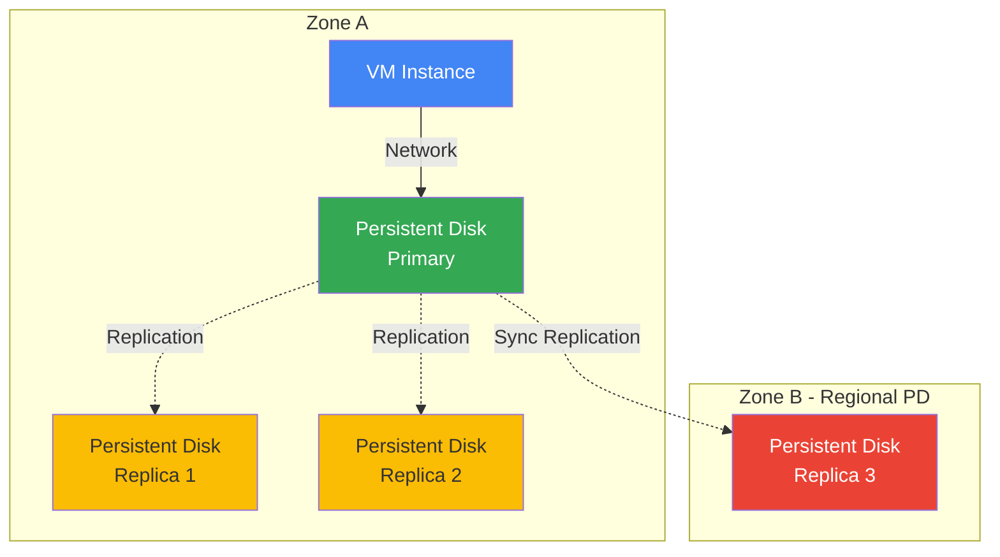

# Disks and Images

## Що таке Persistent Disks?

**Persistent Disk (PD)** - це durable block storage для Compute Engine VM instances. На відміну від ephemeral local storage, persistent disks зберігають дані незалежно від VM lifecycle.

### Основні характеристики

**Block Storage**

- Дані зберігаються у blocks (зазвичай 4 KB)
- Можна форматувати з будь-якою файловою системою (ext4, NTFS, XFS)
- Підключається до VM як звичайний диск (/dev/sdb)

**Network-Attached Storage**

- Фізично відокремлені від VM host
- Підключаються через мережу (але виглядають як local disk)
- Можна відключити та приєднати до іншої VM
- Автоматична реплікація для durability

**Durability та Availability**

- **Zonal PD**: Реплікується в 2+ locations в одній зоні
- **Regional PD**: Реплікується синхронно в 2 зонах
- 99.999% durability (zonal), 99.9999% (regional)
- Automatic checksums та repair

### Як працює Persistent Disk?



**Replication Process:**

1. VM пише дані на persistent disk
2. Дані передаються через мережу до primary replica
3. Primary replica синхронно реплікує на інші replicas
4. Write acknowledged тільки після successful replication

---

## Persistent Disks

### Типи дисків

Google Cloud пропонує 4 типи persistent disks з різною performance та ціною.

#### Standard PD (pd-standard) - HDD

**Характеристики:**

- **Тип**: Hard Disk Drive (HDD)
- **Performance**: 0.75 MB/s per GB read, 1.5 MB/s per GB write
- **IOPS**: 0.75 read IOPS per GB, 1.5 write IOPS per GB
- **Max throughput**: 1,200 MB/s read, 400 MB/s write (per VM)
- **Max IOPS**: 7,500 read, 15,000 write (per VM)
- **Ціна**: Найнижча (~$0.04/GB/month)

**Коли використовувати:**

- ✅ Sequential I/O workloads (backups, logs)
- ✅ Throughput-oriented applications
- ✅ Cold storage
- ✅ Cost-sensitive workloads
- ❌ Random I/O workloads
- ❌ Transactional databases

**Приклад:**

```bash
gcloud compute disks create backup-disk \
  --size=500GB \
  --type=pd-standard \
  --zone=us-central1-a
```

---

#### Balanced PD (pd-balanced) - SSD

**Характеристики:**

- **Тип**: Solid State Drive (SSD)
- **Performance**: 6 IOPS per GB (read/write)
- **Throughput**: 0.28 MB/s per GB
- **Max throughput**: 1,200 MB/s (per VM)
- **Max IOPS**: 80,000 (per VM)
- **Ціна**: Середня (~$0.10/GB/month)

**Коли використовувати:**

- ✅ **Recommended default** для більшості workloads
- ✅ General-purpose applications
- ✅ MySQL, PostgreSQL databases
- ✅ Web servers
- ✅ Development environments
- ✅ Balance між cost та performance

**Приклад:**

```bash
gcloud compute disks create app-disk \
  --size=100GB \
  --type=pd-balanced \
  --zone=us-central1-a
```

**Performance Calculation:**

```
100 GB pd-balanced:
- IOPS: 100 GB × 6 IOPS/GB = 600 IOPS
- Throughput: 100 GB × 0.28 MB/s/GB = 28 MB/s
```

---

#### SSD PD (pd-ssd)

**Характеристики:**

- **Тип**: High-performance SSD
- **Performance**: 30 IOPS per GB (read/write)
- **Throughput**: 0.48 MB/s per GB
- **Max throughput**: 1,200 MB/s (per VM)
- **Max IOPS**: 100,000 (per VM)
- **Ціна**: Висока (~$0.17/GB/month)

**Коли використовувати:**

- ✅ Low-latency workloads
- ✅ Transactional databases (OLTP)
- ✅ High-performance applications
- ✅ Random I/O workloads
- ❌ Cost-sensitive workloads (краще pd-balanced)

**Приклад:**

```bash
gcloud compute disks create db-disk \
  --size=100GB \
  --type=pd-ssd \
  --zone=us-central1-a
```

**Performance Calculation:**

```
100 GB pd-ssd:
- IOPS: 100 GB × 30 IOPS/GB = 3,000 IOPS
- Throughput: 100 GB × 0.48 MB/s/GB = 48 MB/s
```

---

#### Extreme PD (pd-extreme)

**Характеристики:**

- **Тип**: Ultra-high-performance SSD
- **Performance**: Configurable (до 120,000 IOPS)
- **IOPS**: Provisioned IOPS (незалежно від розміру)
- **Throughput**: До 4,800 MB/s
- **Size**: 500 GB - 64 TB
- **Ціна**: Найвища (~$0.125/GB/month + $0.65/IOPS/month)

**Коли використовувати:**

- ✅ Extreme performance requirements
- ✅ SAP HANA
- ✅ Oracle databases
- ✅ SQL Server
- ✅ Коли потрібно >100,000 IOPS
- ❌ General workloads (занадто дорого)

**Приклад:**

```bash
gcloud compute disks create extreme-disk \
  --size=1000GB \
  --type=pd-extreme \
  --provisioned-iops=100000 \
  --zone=us-central1-a
```

---

### Порівняльна таблиця

| Type | Technology | IOPS/GB | Max IOPS | Max Throughput | Price | Use Case |
|------|------------|---------|----------|----------------|-------|----------|
| **Standard PD** | HDD | 0.75-1.5 | 15,000 | 1,200 MB/s | $ | Sequential I/O |
| **Balanced PD** | SSD | 6 | 80,000 | 1,200 MB/s | $$ | **General purpose** |
| **SSD PD** | SSD | 30 | 100,000 | 1,200 MB/s | $$$ | Low latency |
| **Extreme PD** | SSD | Provisioned | 120,000 | 4,800 MB/s | $$$$ | Extreme performance |

> ⚠️ **Важливо для іспиту**: pd-balanced - це **recommended default** для більшості workloads. Розумійте різницю між IOPS та throughput.

---

### Performance Factors

**1. Disk Size**

- Більший диск = більше IOPS та throughput
- Performance scales linearly з розміром (до VM limits)

**2. VM Machine Type**

- Більший VM = вищі performance limits
- Shared-core VMs мають нижчі limits

**3. Number of Disks**

- Можна приєднати до 128 disks на VM
- Performance aggregates across disks

**4. Read vs Write**

- Standard PD: Write швидше за read
- SSD/Balanced: Read та write однакові

**Performance Limits Example:**

```
e2-standard-2 VM з 100 GB pd-balanced:
- Disk capability: 600 IOPS, 28 MB/s
- VM limit: 15,000 IOPS, 240 MB/s
- Actual: 600 IOPS, 28 MB/s (disk-limited)

n2-standard-32 VM з 100 GB pd-balanced:
- Disk capability: 600 IOPS, 28 MB/s
- VM limit: 100,000 IOPS, 2,400 MB/s
- Actual: 600 IOPS, 28 MB/s (disk-limited)
```

---

## Local SSDs

**Опис:** Фізично прикріплені SSD диски до VM host.

### Характеристики

- Найвища продуктивність (375 GB, 3 TB IOPS)
- Дані втрачаються при зупинці/видаленні VM
- До 24 local SSDs на VM (9 TB)
- Не можна відключити без видалення VM

### Коли використовувати

- ✅ Temporary cache
- ✅ Scratch space
- ✅ High-performance computing
- ❌ Persistent data

### Створення

```bash
gcloud compute instances create my-vm \
  --local-ssd=interface=NVME \
  --zone=us-central1-a
```

---

## Snapshots

**Опис:** Incremental backup persistent disks.

### Характеристики

- Incremental (тільки зміни)
- Глобальний ресурс
- Можна створювати з running VM
- Автоматичне стиснення

### Створення та використання

```bash
# Створити snapshot
gcloud compute disks snapshot my-disk \
  --snapshot-names=my-snapshot \
  --zone=us-central1-a

# Створити диск зі snapshot
gcloud compute disks create new-disk \
  --source-snapshot=my-snapshot \
  --zone=us-central1-b

# Список snapshots
gcloud compute snapshots list

# Видалити snapshot
gcloud compute snapshots delete my-snapshot
```

### Snapshot Schedule

Автоматичні snapshots за розкладом:

```bash
# Створити schedule
gcloud compute resource-policies create snapshot-schedule daily-backup \
  --max-retention-days=7 \
  --start-time=02:00 \
  --daily-schedule \
  --region=us-central1

# Приєднати до диску
gcloud compute disks add-resource-policies my-disk \
  --resource-policies=daily-backup \
  --zone=us-central1-a
```

---

## Images

**Опис:** Boot disk templates для створення VM.

### Типи

- **Public images**: Надані Google та партнерами (Debian, Ubuntu, Windows)
- **Custom images**: Створені з ваших дисків
- **Machine images**: Повна конфігурація VM (диски + metadata)

### Створення custom image

```bash
# З диску
gcloud compute images create my-image \
  --source-disk=my-disk \
  --source-disk-zone=us-central1-a

# З snapshot
gcloud compute images create my-image \
  --source-snapshot=my-snapshot

# З іншого image
gcloud compute images create my-image \
  --source-image=source-image \
  --source-image-project=source-project
```

### Використання image

```bash
gcloud compute instances create my-vm \
  --image=my-image \
  --zone=us-central1-a
```

---

## Machine Images

**Опис:** Повна конфігурація VM instance (всі диски + metadata + network).

### Відмінності від Custom Image

- Machine Image: Вся VM конфігурація
- Custom Image: Тільки boot disk

### Створення

```bash
gcloud compute machine-images create my-machine-image \
  --source-instance=my-vm \
  --source-instance-zone=us-central1-a

# Створити VM з machine image
gcloud compute instances create new-vm \
  --source-machine-image=my-machine-image \
  --zone=us-central1-b
```

---

## Image Families

**Опис:** Групування версій images.

### Використання

```bash
# Створити image в family
gcloud compute images create my-image-v2 \
  --source-disk=my-disk \
  --family=my-app \
  --source-disk-zone=us-central1-a

# Використати latest image з family
gcloud compute instances create my-vm \
  --image-family=my-app \
  --zone=us-central1-a
```

---

## Порівняльна таблиця

| Feature | Persistent Disk | Local SSD | Snapshot | Image |
|---------|----------------|-----------|----------|-------|
| **Persistence** | Так | Ні | Так | Так |
| **Performance** | Середня-Висока | Найвища | N/A | N/A |
| **Scope** | Zonal/Regional | VM-local | Global | Global |
| **Use Case** | Data storage | Temp cache | Backup | Templates |
| **Max Size** | 64 TB | 9 TB | Unlimited | N/A |

---

## Best Practices

### Persistent Disks

- ✅ Використовуйте pd-balanced для більшості workloads
- ✅ Regional PD для критичних даних
- ✅ Моніторьте IOPS та throughput
- ✅ Збільшуйте розмір для більшої performance

### Snapshots

- ✅ Налаштуйте snapshot schedules
- ✅ Зберігайте snapshots в іншому регіоні для DR
- ✅ Видаляйте старі snapshots
- ✅ Використовуйте incremental nature

### Images

- ✅ Використовуйте image families для версіонування
- ✅ Створюйте custom images для стандартизації
- ✅ Шифруйте sensitive images
- ✅ Діліться images між projects через IAM

---

> ⚠️ **Важливо для іспиту**: Розуміння різниці між persistent disk types, snapshots, images та machine images критично важливе. Знайте коли використовувати кожен тип та їх обмеження.

---

**Повернутися до:** [Модуль 03 - Compute Engine](README.md)
