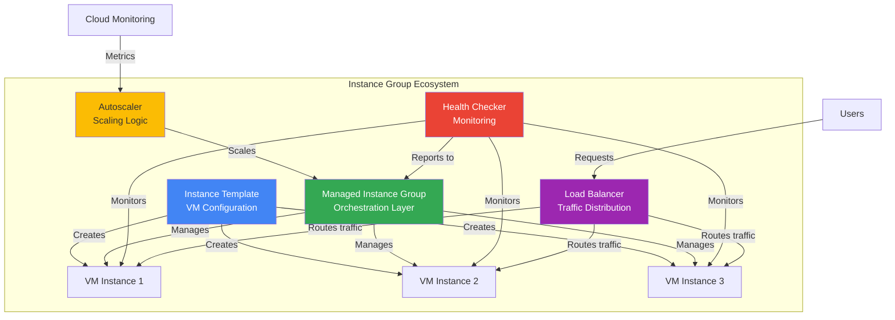
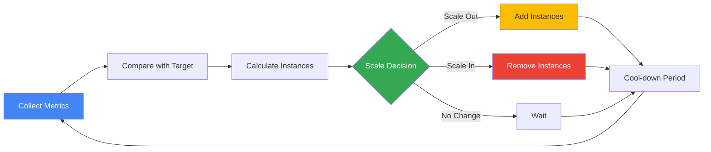
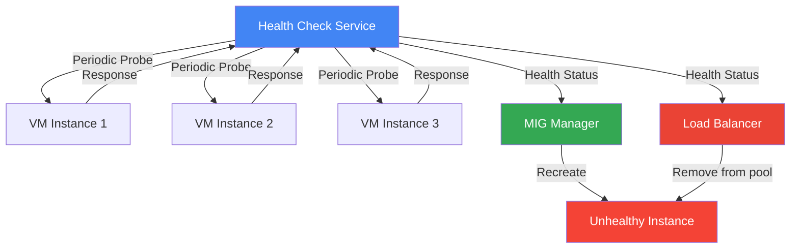
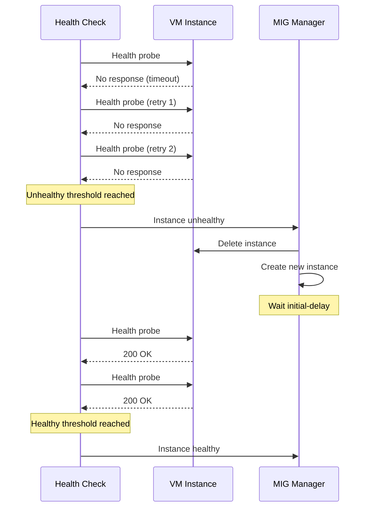
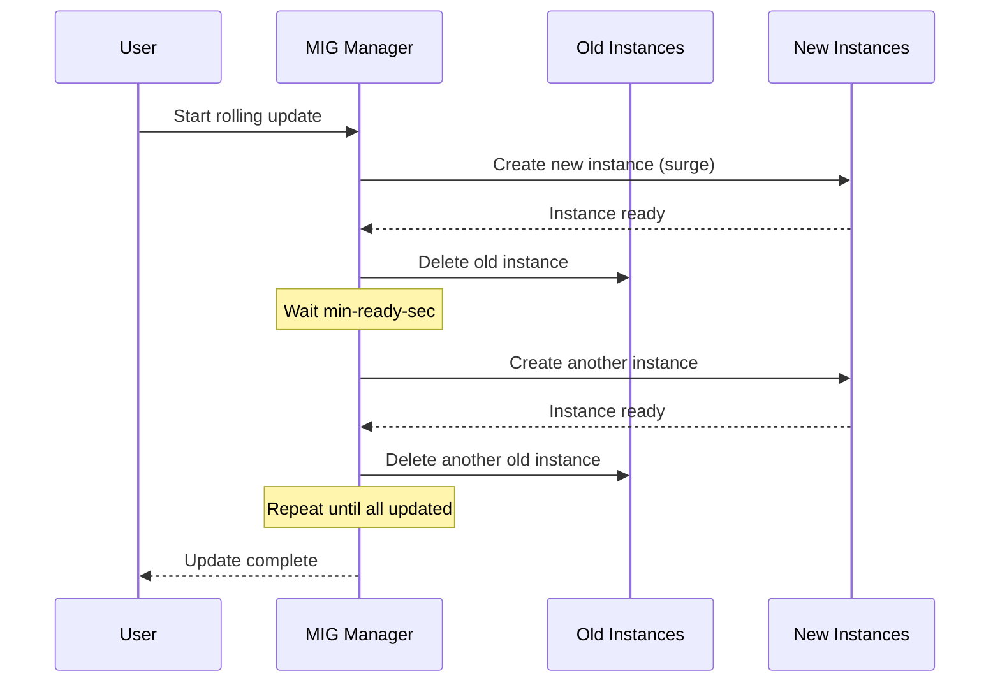
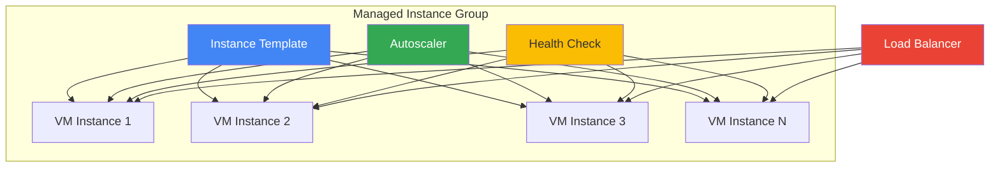

# Instance Groups

## Що таке Instance Groups?

**Instance Group** - це колекція VM instances, якими можна управляти як єдиною сутністю. Instance groups є фундаментальним компонентом для створення scalable та highly available applications на Google Cloud.

### Основні концепції

**Scalability:**

- Horizontal scaling (додавання/видалення VM instances)
- Automatic scaling на основі метрик
- Підтримка від 0 до тисяч instances

**High Availability:**

- Distribution across zones (regional MIGs)
- Automatic recreation при failures
- Health-based autohealing

**Load Balancing:**

- Integration з Cloud Load Balancing
- Automatic traffic distribution
- Session affinity support

### Як працюють Instance Groups?



**Workflow:**

1. **Instance Template** визначає VM configuration
2. **MIG** створює та управляє instances з template
3. **Autoscaler** моніторить metrics та змінює розмір MIG
4. **Health Checker** перевіряє стан instances
5. **Load Balancer** розподіляє traffic між healthy instances

---

## Типи Instance Groups

### Managed Instance Groups (MIG)

Група ідентичних VM з автоматичним управлінням.

**Характеристики:**

- Автоматичне масштабування (autoscaling)
- Автоматичне відновлення (autohealing)
- Rolling updates
- Load balancing
- Створюються з instance template

### Unmanaged Instance Groups

Група різних VM без автоматичного управління.

**Характеристики:**

- Ручне управління
- Різні конфігурації VM
- Тільки load balancing
- Legacy, не рекомендується

---

## Instance Templates

**Опис:** Шаблон для створення VM instances.

### Створення

```bash
gcloud compute instance-templates create my-template \
  --machine-type=e2-medium \
  --image-family=debian-11 \
  --image-project=debian-cloud \
  --boot-disk-size=20GB \
  --metadata-from-file startup-script=startup.sh \
  --tags=web-server
```

### Оновлення template

Templates immutable - потрібно створити новий:

```bash
gcloud compute instance-templates create my-template-v2 \
  --machine-type=e2-standard-2 \
  --image-family=debian-11 \
  --image-project=debian-cloud
```

---

## Managed Instance Groups

### Створення Zonal MIG

```bash
gcloud compute instance-groups managed create my-mig \
  --base-instance-name=my-vm \
  --template=my-template \
  --size=3 \
  --zone=us-central1-a
```

### Створення Regional MIG

```bash
gcloud compute instance-groups managed create my-mig \
  --base-instance-name=my-vm \
  --template=my-template \
  --size=6 \
  --region=us-central1
```

**Regional MIG переваги:**

- Розподіл VM між зонами
- Вища доступність
- Автоматичне балансування між зонами

---

## Autoscaling

**Опис:** Автоматичне додавання/видалення VM instances на основі метрик для оптимізації performance та cost.

### Як працює Autoscaling?

**Scaling Decision Process:**

1. Autoscaler збирає metrics (CPU, load balancer utilization, custom metrics)
2. Порівнює поточне значення з target utilization
3. Обчислює recommended number of instances
4. Додає або видаляє instances (з урахуванням min/max limits)
5. Чекає cool-down period перед наступним scaling



### Scaling Policies

#### 1. CPU Utilization

**Найпоширеніший** scaling metric.

```bash
gcloud compute instance-groups managed set-autoscaling my-mig \
  --max-num-replicas=10 \
  --min-num-replicas=2 \
  --target-cpu-utilization=0.6 \
  --cool-down-period=90 \
  --zone=us-central1-a
```

**Parameters:**

- `target-cpu-utilization`: Target average CPU (0.0-1.0)
- `cool-down-period`: Час після scaling перед наступним (seconds)
- `min-num-replicas`: Мінімальна кількість instances
- `max-num-replicas`: Максимальна кількість instances

**Calculation Example:**

```
Current: 4 instances, average CPU = 80%
Target: 60% CPU
Recommended instances = 4 × (0.80 / 0.60) = 5.33 → 6 instances
Action: Add 2 instances
```

---

#### 2. Load Balancer Utilization

Scaling на основі HTTP(S) load balancer traffic.

```bash
gcloud compute instance-groups managed set-autoscaling my-mig \
  --max-num-replicas=20 \
  --min-num-replicas=3 \
  --target-load-balancing-utilization=0.8 \
  --zone=us-central1-a
```

**Metrics:**

- Requests per second (RPS) per instance
- Target utilization = max RPS per instance

**Use Case:**

- Web applications
- API servers
- Microservices

---

#### 3. Cloud Monitoring Custom Metrics

Scaling на основі custom application metrics.

```bash
gcloud compute instance-groups managed set-autoscaling my-mig \
  --max-num-replicas=15 \
  --min-num-replicas=2 \
  --custom-metric-utilization=metric=custom.googleapis.com/queue/depth,target-utilization-value=100 \
  --zone=us-central1-a
```

**Examples:**

- Queue depth (Pub/Sub, Cloud Tasks)
- Active connections
- Database query latency
- Custom business metrics

---

#### 4. Cloud Pub/Sub Queue Size

Спеціалізований scaling для message processing.

```bash
gcloud compute instance-groups managed set-autoscaling my-mig \
  --max-num-replicas=50 \
  --min-num-replicas=1 \
  --stackdriver-metric-filter="resource.type=pubsub_subscription AND resource.labels.subscription_id=my-subscription" \
  --stackdriver-metric-utilization-target=100 \
  --stackdriver-metric-utilization-target-type=GAUGE \
  --zone=us-central1-a
```

**Use Case:**

- Event-driven processing
- Asynchronous task processing
- Message queue workers

---

### Multiple Metrics Scaling

Можна комбінувати кілька metrics для більш точного scaling.

```bash
gcloud compute instance-groups managed set-autoscaling my-mig \
  --max-num-replicas=20 \
  --min-num-replicas=3 \
  --target-cpu-utilization=0.6 \
  --target-load-balancing-utilization=0.8 \
  --zone=us-central1-a
```

**Behavior:**

- Autoscaler використовує metric, який потребує **найбільше instances**
- Ensures adequate capacity для всіх metrics

**Example:**

```
CPU suggests: 5 instances
LB utilization suggests: 8 instances
Result: Scale to 8 instances
```

---

### Scale-in Controls

Контроль швидкості зменшення кількості instances.

```bash
gcloud compute instance-groups managed update my-mig \
  --max-unavailable=2 \
  --zone=us-central1-a
```

**Parameters:**

- `max-unavailable`: Максимум instances для видалення одночасно
- Prevents rapid scale-in що може вплинути на availability

**Scale-in Strategy:**

- Видаляються найновіші instances (LIFO)
- Можна налаштувати selection policy

---

### Scaling Modes

#### Autoscaling Mode (Default)

Automatic scaling на основі metrics.

```bash
gcloud compute instance-groups managed set-autoscaling my-mig \
  --mode=on \
  --zone=us-central1-a
```

#### Scale-out Only Mode

Тільки додавання instances (ніколи не видаляє).

```bash
gcloud compute instance-groups managed set-autoscaling my-mig \
  --mode=only-scale-out \
  --zone=us-central1-a
```

**Use Case:**

- Stateful applications
- Коли manual intervention потрібен для scale-in

#### Off Mode

Вимкнути autoscaling (manual sizing).

```bash
gcloud compute instance-groups managed stop-autoscaling my-mig \
  --zone=us-central1-a
```

---

### Autoscaling Best Practices

**1. Set Realistic Targets**

- CPU: 60-70% для web apps, 50-60% для databases
- Load balancer: 80% для predictable traffic
- Custom metrics: Based on application benchmarks

**2. Configure Cool-down Period**

- Default: 60 seconds
- Recommended: 90-120 seconds для stability
- Longer для applications з slow startup

**3. Set Appropriate Min/Max**

- Min: Enough для baseline traffic
- Max: Budget constraints + capacity planning
- Buffer: 20-30% above expected peak

**4. Monitor Scaling Events**

```bash
gcloud logging read "resource.type=gce_instance_group_manager" \
  --limit=50 \
  --format=json
```

**5. Test Scaling Behavior**

- Load testing для verify scaling triggers
- Monitor metrics during scaling
- Adjust targets based on results

> ⚠️ **Важливо для іспиту**: Autoscaler використовує metric, який потребує найбільше instances. Cool-down period запобігає flapping. Scale-in можна контролювати з max-unavailable.

---

## Health Checks

**Опис:** Механізм для перевірки стану VM instances та автоматичного відновлення (autohealing) при failures.

### Як працюють Health Checks?



**Process:**

1. Health checker періодично надсилає probes до instances
2. Instance відповідає (або не відповідає)
3. Health checker підраховує consecutive failures
4. Після досягнення unhealthy threshold:
   - MIG recreates instance (autohealing)
   - Load balancer видаляє з backend pool
5. Після досягнення healthy threshold:
   - Instance повертається до normal state
   - Load balancer додає до backend pool

---

### Типи Health Checks

#### HTTP Health Check

**Найпоширеніший** тип для web applications.

```bash
gcloud compute health-checks create http my-http-health-check \
  --port=80 \
  --request-path=/health \
  --check-interval=10s \
  --timeout=5s \
  --unhealthy-threshold=3 \
  --healthy-threshold=2
```

**Parameters:**

- `port`: Port для перевірки (80, 8080, etc.)
- `request-path`: HTTP endpoint для health check
- `check-interval`: Інтервал між перевірками
- `timeout`: Час очікування відповіді
- `unhealthy-threshold`: Кількість failures для unhealthy
- `healthy-threshold`: Кількість successes для healthy

**Health Endpoint Example:**

```python
@app.route('/health')
def health_check():
    # Check database connection
    if not db.is_connected():
        return 'Unhealthy', 503
    
    # Check critical dependencies
    if not cache.is_available():
        return 'Unhealthy', 503
    
    return 'Healthy', 200
```

---

#### HTTPS Health Check

Для applications з SSL/TLS.

```bash
gcloud compute health-checks create https my-https-health-check \
  --port=443 \
  --request-path=/health \
  --check-interval=10s \
  --timeout=5s \
  --unhealthy-threshold=3 \
  --healthy-threshold=2
```

**Use Case:**

- Secure applications
- Compliance requirements
- End-to-end encryption

---

#### TCP Health Check

Для non-HTTP services (databases, custom protocols).

```bash
gcloud compute health-checks create tcp my-tcp-health-check \
  --port=3306 \
  --check-interval=10s \
  --timeout=5s \
  --unhealthy-threshold=3 \
  --healthy-threshold=2
```

**Use Case:**

- MySQL, PostgreSQL databases
- Redis, Memcached
- Custom TCP services

**Behavior:**

- Перевіряє тільки TCP connection (не application logic)
- Успішний connection = healthy
- Connection refused/timeout = unhealthy

---

#### SSL Health Check

Для SSL/TLS services без HTTP.

```bash
gcloud compute health-checks create ssl my-ssl-health-check \
  --port=443 \
  --check-interval=10s \
  --timeout=5s \
  --unhealthy-threshold=3 \
  --healthy-threshold=2
```

---

### Health Check Configuration Strategy

#### Thresholds

**Unhealthy Threshold:**

```
unhealthy-threshold = 3
check-interval = 10s
Time to mark unhealthy = 3 × 10s = 30 seconds
```

**Healthy Threshold:**

```
healthy-threshold = 2
check-interval = 10s
Time to mark healthy = 2 × 10s = 20 seconds
```

**Recommendations:**

- Unhealthy threshold: 2-3 (balance між false positives та швидкістю detection)
- Healthy threshold: 2 (швидке повернення до service)
- Check interval: 5-10s для web apps, 30-60s для databases

---

#### Initial Delay

**Critical parameter** для autohealing в MIGs.

```bash
gcloud compute instance-groups managed set-autohealing my-mig \
  --health-check=my-health-check \
  --initial-delay=300 \
  --zone=us-central1-a
```

**Initial Delay:**

- Час після VM startup перед першою health check
- Дає час для application initialization
- Запобігає recreation під час startup

**Calculation:**

```
Initial delay = Startup time + Application init time + Buffer

Example:
- VM boot: 30s
- Application startup: 60s
- Database connections: 30s
- Buffer: 60s
Total: 180s (recommended: 300s for safety)
```

**Too Short:**

- Instance recreated під час startup
- Infinite recreation loop
- Wasted resources

**Too Long:**

- Slow detection of real failures
- Unhealthy instances serve traffic longer

---

### Autohealing

**Опис:** Автоматичне recreate unhealthy instances в MIG.

#### Autohealing Process



#### Configuration

```bash
# Створити health check
gcloud compute health-checks create http my-health-check \
  --port=80 \
  --request-path=/health \
  --check-interval=10s \
  --timeout=5s \
  --unhealthy-threshold=3 \
  --healthy-threshold=2

# Приєднати до MIG
gcloud compute instance-groups managed set-autohealing my-mig \
  --health-check=my-health-check \
  --initial-delay=300 \
  --zone=us-central1-a
```

---

### Health Check vs Load Balancer Health Check

**Два типи health checks:**

| Feature | MIG Health Check | LB Health Check |
|---------|------------------|-----------------|
| **Purpose** | Autohealing | Traffic routing |
| **Action** | Recreate instance | Remove from backend |
| **Scope** | MIG instances | LB backends |
| **Configuration** | set-autohealing | Backend service |
| **Initial delay** | Required | Not applicable |

**Best Practice:**

- Використовуйте **обидва** для production
- MIG health check: Conservative (higher thresholds)
- LB health check: Aggressive (lower thresholds)

**Example:**

```bash
# MIG health check (conservative)
gcloud compute health-checks create http mig-health-check \
  --port=80 \
  --request-path=/health \
  --unhealthy-threshold=5 \
  --healthy-threshold=2

# LB health check (aggressive)
gcloud compute health-checks create http lb-health-check \
  --port=80 \
  --request-path=/health \
  --unhealthy-threshold=2 \
  --healthy-threshold=2
```

---

### Health Check Best Practices

**1. Implement Application-level Health Checks**

```python
# Good: Check dependencies
@app.route('/health')
def health():
    checks = {
        'database': check_database(),
        'cache': check_cache(),
        'external_api': check_external_api()
    }
    
    if all(checks.values()):
        return 'OK', 200
    else:
        return jsonify(checks), 503

# Bad: Always return 200
@app.route('/health')
def health():
    return 'OK', 200
```

**2. Set Appropriate Timeouts**

- Timeout < check interval
- Timeout достатній для application response
- Consider network latency

**3. Use Separate Endpoints**

- `/health` для basic health
- `/readiness` для traffic readiness
- `/liveness` для process health

**4. Monitor Health Check Failures**

```bash
gcloud logging read "resource.type=gce_instance AND jsonPayload.event_type=HEALTH_CHECK_FAILED" \
  --limit=50 \
  --format=json
```

**5. Test Health Checks**

```bash
# Simulate health check
curl -I http://INSTANCE_IP/health

# Check from health check IP ranges
# 35.191.0.0/16, 130.211.0.0/22
```

> ⚠️ **Важливо для іспиту**: Initial delay критично важливий для autohealing. MIG health check recreates instances, LB health check тільки видаляє з traffic. HTTP health check найпоширеніший для web applications.

---

## Rolling Updates

**Опис:** Поступове оновлення VM instances в MIG до нового instance template без downtime.

### Як працюють Rolling Updates?



---

### Update Modes

#### Proactive Update (Default)

MIG **негайно** замінює всі instances.

```bash
gcloud compute instance-groups managed rolling-action start-update my-mig \
  --version=template=my-template-v2 \
  --type=proactive \
  --max-surge=3 \
  --max-unavailable=0 \
  --zone=us-central1-a
```

**Behavior:**

- Активно створює нові instances
- Видаляє старі instances
- Контролюється max-surge та max-unavailable
- Recommended для більшості випадків

---

#### Opportunistic Update

Оновлення **тільки** при recreation instances.

```bash
gcloud compute instance-groups managed rolling-action start-update my-mig \
  --version=template=my-template-v2 \
  --type=opportunistic \
  --zone=us-central1-a
```

**Behavior:**

- Не створює нові instances автоматично
- Оновлює тільки коли:
  - Instance fails (autohealing)
  - Manual recreation
  - Autoscaler scales out
- Використовується для non-urgent updates

**Use Case:**

- Cost-sensitive environments
- Stateful applications
- Коли downtime acceptable

---

### Update Parameters

#### max-surge

**Опис:** Максимальна кількість **додаткових** instances під час update.

```bash
gcloud compute instance-groups managed rolling-action start-update my-mig \
  --version=template=my-template-v2 \
  --max-surge=3 \
  --max-unavailable=0 \
  --zone=us-central1-a
```

**Values:**

- Number: Absolute count (e.g., `3`)
- Percentage: Percent of target size (e.g., `10%`)
- `0`: No surge (slower updates)

**Example:**

```
Target size: 10 instances
max-surge: 3
max-unavailable: 0

During update:
- Max instances: 10 + 3 = 13
- Min instances: 10
- Update strategy: Create 3 new → Delete 3 old → Repeat
```

**Benefits:**

- Zero downtime (max-unavailable=0)
- Faster updates
- Higher capacity during update

**Drawbacks:**

- Higher cost (temporary extra instances)
- Requires capacity

---

#### max-unavailable

**Опис:** Максимальна кількість instances, які можуть бути **unavailable** під час update.

```bash
gcloud compute instance-groups managed rolling-action start-update my-mig \
  --version=template=my-template-v2 \
  --max-surge=0 \
  --max-unavailable=2 \
  --zone=us-central1-a
```

**Values:**

- Number: Absolute count (e.g., `2`)
- Percentage: Percent of target size (e.g., `20%`)
- `0`: No unavailability (requires max-surge > 0)

**Example:**

```
Target size: 10 instances
max-surge: 0
max-unavailable: 2

During update:
- Max instances: 10
- Min instances: 10 - 2 = 8
- Update strategy: Delete 2 old → Create 2 new → Repeat
```

**Benefits:**

- No extra cost (no surge)
- Simpler capacity planning

**Drawbacks:**

- Reduced capacity during update
- Potential performance impact

---

#### Combination Strategies

**1. Zero Downtime (Recommended for Production)**

```bash
--max-surge=3 --max-unavailable=0
```

- No capacity reduction
- Fastest update
- Higher temporary cost

**2. Cost-Optimized**

```bash
--max-surge=0 --max-unavailable=2
```

- No extra instances
- Slower update
- Reduced capacity during update

**3. Balanced**

```bash
--max-surge=1 --max-unavailable=1
```

- Moderate speed
- Moderate cost
- Some capacity reduction

**4. Maximum Speed**

```bash
--max-surge=100% --max-unavailable=0
```

- Doubles capacity temporarily
- Instant update
- Highest cost

> ⚠️ **Важливо для іспиту**: max-surge та max-unavailable не можуть бути обидва 0. Для zero downtime використовуйте max-surge > 0 та max-unavailable = 0.

---

#### min-ready-sec

**Опис:** Мінімальний час очікування після створення instance перед наступним update step.

```bash
gcloud compute instance-groups managed rolling-action start-update my-mig \
  --version=template=my-template-v2 \
  --max-surge=3 \
  --max-unavailable=0 \
  --min-ready-sec=60 \
  --zone=us-central1-a
```

**Purpose:**

- Дає час для application initialization
- Дозволяє health checks verify instance
- Запобігає cascade failures

**Calculation:**

```
min-ready-sec = Application startup time + Health check stabilization

Example:
- Application startup: 30s
- Health check interval: 10s × 2 checks = 20s
- Buffer: 10s
Total: 60s
```

---

### Canary Deployments

**Опис:** Поступове розгортання нової версії на підмножину instances для testing.

#### Single Canary Version

```bash
gcloud compute instance-groups managed rolling-action start-update my-mig \
  --version=template=my-template-v2 \
  --canary-version=template=my-template-v3,target-size=10% \
  --zone=us-central1-a
```

**Behavior:**

- 90% instances: my-template-v2
- 10% instances: my-template-v3 (canary)
- Monitor canary performance
- Rollout або rollback based on results

**Use Case:**

- Testing new features
- Gradual rollout
- Risk mitigation

---

#### Multi-version Deployment

```bash
# Version 1: 70%
# Version 2: 20%
# Version 3 (canary): 10%
gcloud compute instance-groups managed rolling-action start-update my-mig \
  --version=template=my-template-v1,target-size=70% \
  --version=template=my-template-v2,target-size=20% \
  --canary-version=template=my-template-v3,target-size=10% \
  --zone=us-central1-a
```

---

### Rollback

**Опис:** Повернення до попередньої версії template.

```bash
# Rollback до попереднього template
gcloud compute instance-groups managed rolling-action start-update my-mig \
  --version=template=my-template-v1 \
  --max-surge=3 \
  --max-unavailable=0 \
  --zone=us-central1-a
```

**Best Practices:**

- Зберігайте попередні templates
- Моніторьте metrics під час rollout
- Автоматизуйте rollback на основі metrics
- Test rollback procedure

---

### Update Monitoring

```bash
# Перевірити status update
gcloud compute instance-groups managed describe my-mig \
  --zone=us-central1-a \
  --format="get(status)"

# Список instances з versions
gcloud compute instance-groups managed list-instances my-mig \
  --zone=us-central1-a \
  --format="table(instance,status,currentAction,version.instanceTemplate)"

# Скасувати update
gcloud compute instance-groups managed rolling-action stop-proactive-update my-mig \
  --zone=us-central1-a
```

---

### Rolling Update Best Practices

**1. Use Proactive Updates**

- Faster and more predictable
- Better control over timing
- Recommended for production

**2. Set Appropriate Parameters**

```bash
# Production: Zero downtime
--max-surge=3 --max-unavailable=0 --min-ready-sec=60

# Development: Fast updates
--max-surge=100% --max-unavailable=0 --min-ready-sec=30

# Cost-sensitive: No surge
--max-surge=0 --max-unavailable=20% --min-ready-sec=30
```

**3. Use Canary Deployments**

- Start з 5-10% canary
- Monitor for 15-30 minutes
- Gradually increase або rollback

**4. Monitor During Updates**

- Application metrics
- Error rates
- Response times
- Health check status

**5. Test Updates in Staging**

- Same MIG configuration
- Same update parameters
- Verify rollback procedure

> ⚠️ **Важливо для іспиту**: Proactive updates негайно оновлюють instances, opportunistic - тільки при recreation. max-surge створює додаткові instances, max-unavailable дозволяє unavailability. Canary deployments використовують target-size percentage.

---

## Stateful MIGs

**Опис:** MIG з persistent state (disks, metadata).

### Використання

- Stateful applications
- Databases в MIG
- Persistent disks per instance

### Створення

```bash
gcloud compute instance-groups managed create my-stateful-mig \
  --template=my-template \
  --size=3 \
  --stateful-disk=device-name=data-disk,auto-delete=on-permanent-instance-deletion \
  --zone=us-central1-a
```

---

## MIG Architecture



---

## Команди управління

```bash
# Список MIGs
gcloud compute instance-groups managed list

# Деталі MIG
gcloud compute instance-groups managed describe my-mig --zone=us-central1-a

# Змінити розмір
gcloud compute instance-groups managed resize my-mig --size=5 --zone=us-central1-a

# Recreate instances
gcloud compute instance-groups managed recreate-instances my-mig \
  --instances=my-vm-1,my-vm-2 \
  --zone=us-central1-a

# Видалити MIG
gcloud compute instance-groups managed delete my-mig --zone=us-central1-a
```

---

## Best Practices

### MIG Design

- ✅ Використовуйте regional MIGs для HA
- ✅ Налаштуйте health checks з правильним initial delay
- ✅ Використовуйте autoscaling для cost optimization
- ✅ Тестуйте rolling updates на canary deployments

### Autoscaling

- ✅ Встановлюйте realistic min/max replicas
- ✅ Використовуйте cool-down period для стабільності
- ✅ Моніторьте autoscaling events
- ✅ Комбінуйте метрики для кращого scaling

### Health Checks

- ✅ Налаштуйте правильні thresholds
- ✅ Використовуйте application-level health checks
- ✅ Встановлюйте достатній initial delay
- ✅ Тестуйте health check endpoints

---

> ⚠️ **Важливо для іспиту**: Розуміння MIGs, autoscaling, health checks та rolling updates критично важливе. Знайте різницю між zonal та regional MIGs та коли використовувати кожен тип.

---

**Повернутися до:** [Модуль 03 - Compute Engine](README.md)
