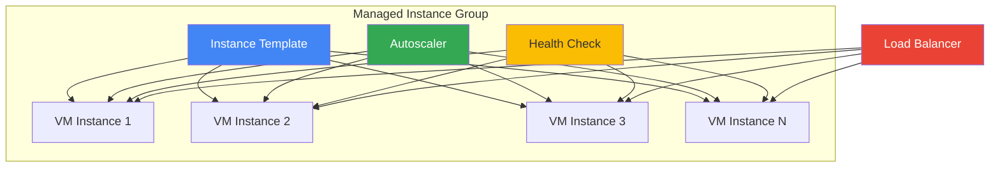

# Instance Groups

## Типи Instance Groups

### Managed Instance Groups (MIG)

Група ідентичних VM з автоматичним управлінням.

**Характеристики:**

- Автоматичне масштабування (autoscaling)
- Автоматичне відновлення (autohealing)
- Rolling updates
- Load balancing
- Створюються з instance template

### Unmanaged Instance Groups

Група різних VM без автоматичного управління.

**Характеристики:**

- Ручне управління
- Різні конфігурації VM
- Тільки load balancing
- Legacy, не рекомендується

---

## Instance Templates

**Опис:** Шаблон для створення VM instances.

### Створення

```bash
gcloud compute instance-templates create my-template \
  --machine-type=e2-medium \
  --image-family=debian-11 \
  --image-project=debian-cloud \
  --boot-disk-size=20GB \
  --metadata-from-file startup-script=startup.sh \
  --tags=web-server
```

### Оновлення template

Templates immutable - потрібно створити новий:

```bash
gcloud compute instance-templates create my-template-v2 \
  --machine-type=e2-standard-2 \
  --image-family=debian-11 \
  --image-project=debian-cloud
```

---

## Managed Instance Groups

### Створення Zonal MIG

```bash
gcloud compute instance-groups managed create my-mig \
  --base-instance-name=my-vm \
  --template=my-template \
  --size=3 \
  --zone=us-central1-a
```

### Створення Regional MIG

```bash
gcloud compute instance-groups managed create my-mig \
  --base-instance-name=my-vm \
  --template=my-template \
  --size=6 \
  --region=us-central1
```

**Regional MIG переваги:**

- Розподіл VM між зонами
- Вища доступність
- Автоматичне балансування між зонами

---

## Autoscaling

**Опис:** Автоматичне додавання/видалення VM на основі метрик.

### Метрики для autoscaling

- CPU utilization
- HTTP load balancing utilization
- Cloud Monitoring metrics
- Cloud Pub/Sub queue size

### Налаштування

```bash
gcloud compute instance-groups managed set-autoscaling my-mig \
  --max-num-replicas=10 \
  --min-num-replicas=2 \
  --target-cpu-utilization=0.6 \
  --cool-down-period=90 \
  --zone=us-central1-a
```

### Scale-in controls

```bash
# Максимум VM для видалення за раз
gcloud compute instance-groups managed update my-mig \
  --max-unavailable=2 \
  --zone=us-central1-a
```

---

## Health Checks

**Опис:** Перевірка стану VM для autohealing та load balancing.

### Типи

- HTTP/HTTPS health check
- TCP health check
- SSL health check

### Створення

```bash
gcloud compute health-checks create http my-health-check \
  --port=80 \
  --request-path=/health \
  --check-interval=10s \
  --timeout=5s \
  --unhealthy-threshold=3 \
  --healthy-threshold=2
```

### Приєднання до MIG

```bash
gcloud compute instance-groups managed set-autohealing my-mig \
  --health-check=my-health-check \
  --initial-delay=300 \
  --zone=us-central1-a
```

**Initial delay:** Час для VM startup перед першою перевіркою.

---

## Rolling Updates

**Опис:** Поступове оновлення VM в MIG до нового template.

### Типи

- **Proactive**: Негайне оновлення всіх VM
- **Opportunistic**: Оновлення тільки при recreation

### Виконання

```bash
gcloud compute instance-groups managed rolling-action start-update my-mig \
  --version=template=my-template-v2 \
  --max-surge=3 \
  --max-unavailable=0 \
  --zone=us-central1-a
```

### Параметри

- **max-surge**: Скільки додаткових VM створити
- **max-unavailable**: Скільки VM можуть бути недоступні
- **min-ready-sec**: Час очікування перед наступного VM

### Canary updates

```bash
gcloud compute instance-groups managed rolling-action start-update my-mig \
  --version=template=my-template-v2 \
  --canary-version=template=my-template-v3,target-size=10% \
  --zone=us-central1-a
```

---

## Stateful MIGs

**Опис:** MIG з persistent state (disks, metadata).

### Використання

- Stateful applications
- Databases в MIG
- Persistent disks per instance

### Створення

```bash
gcloud compute instance-groups managed create my-stateful-mig \
  --template=my-template \
  --size=3 \
  --stateful-disk=device-name=data-disk,auto-delete=on-permanent-instance-deletion \
  --zone=us-central1-a
```

---

## MIG Architecture



---

## Команди управління

```bash
# Список MIGs
gcloud compute instance-groups managed list

# Деталі MIG
gcloud compute instance-groups managed describe my-mig --zone=us-central1-a

# Змінити розмір
gcloud compute instance-groups managed resize my-mig --size=5 --zone=us-central1-a

# Recreate instances
gcloud compute instance-groups managed recreate-instances my-mig \
  --instances=my-vm-1,my-vm-2 \
  --zone=us-central1-a

# Видалити MIG
gcloud compute instance-groups managed delete my-mig --zone=us-central1-a
```

---

## Best Practices

### MIG Design

- ✅ Використовуйте regional MIGs для HA
- ✅ Налаштуйте health checks з правильним initial delay
- ✅ Використовуйте autoscaling для cost optimization
- ✅ Тестуйте rolling updates на canary deployments

### Autoscaling

- ✅ Встановлюйте realistic min/max replicas
- ✅ Використовуйте cool-down period для стабільності
- ✅ Моніторьте autoscaling events
- ✅ Комбінуйте метрики для кращого scaling

### Health Checks

- ✅ Налаштуйте правильні thresholds
- ✅ Використовуйте application-level health checks
- ✅ Встановлюйте достатній initial delay
- ✅ Тестуйте health check endpoints

---

> ⚠️ **Важливо для іспиту**: Розуміння MIGs, autoscaling, health checks та rolling updates критично важливе. Знайте різницю між zonal та regional MIGs та коли використовувати кожен тип.

---

**Повернутися до:** [Модуль 03 - Compute Engine](README.md)
