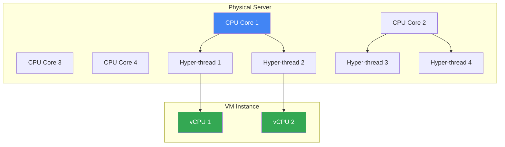
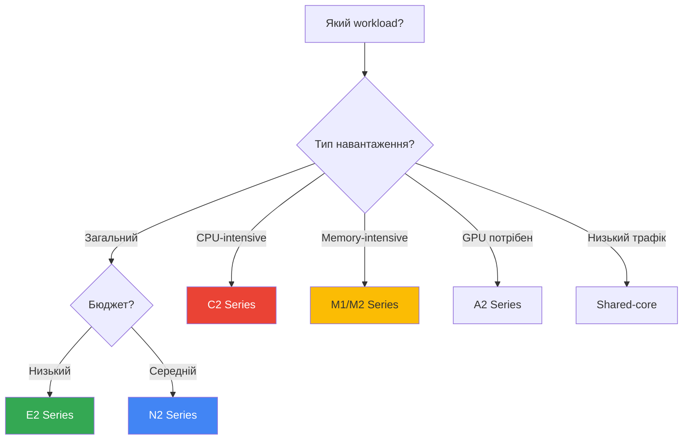
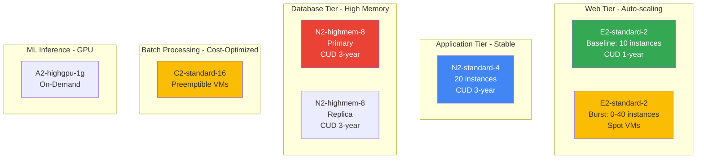

# Machine Types

## Що таке Machine Types?

**Machine type** визначає апаратні ресурси (CPU, memory), доступні для VM instance. Вибір правильного machine type критично важливий для:

- **Performance**: Достатньо ресурсів для workload
- **Cost optimization**: Не переплачувати за невикористані ресурси
- **Scalability**: Можливість масштабування при зростанні навантаження

### Основні компоненти

**vCPU (Virtual CPU)**

- Один vCPU = один hardware hyper-thread на CPU core
- Google використовує Intel Xeon та AMD EPYC processors
- Кожен vCPU працює на частоті 2.0-3.8 GHz (залежно від серії)
- vCPU можуть бути shared (burst) або dedicated

**Memory (RAM)**

- Виміряється в GB або TB
- Співвідношення memory/vCPU залежить від серії
- Більше memory = вища ціна
- Memory не можна змінити без зміни machine type

**CPU Platform**

- Покоління процесора (Skylake, Cascade Lake, Ice Lake, AMD EPYC)
- Можна вказати мінімальний CPU platform при створенні VM
- Новіші платформи = краща performance

### Як працює vCPU?



**Hyper-threading:**

- Один physical CPU core має 2 hyper-threads
- Кожен hyper-thread = 1 vCPU для VM
- Дозволяє ефективніше використовувати CPU resources

---

## Категорії Machine Types

### General Purpose

Баланс між CPU, memory та ціною.

**E2 Series** (Cost-optimized)

E2 series - найбільш cost-effective вибір для загальних workloads. Використовує **day-to-day CPU platform** (автоматичний вибір між Intel і AMD).

**Характеристики:**

- **CPU Platform**: Автоматичний вибір (Intel Broadwell, Skylake, AMD EPYC)
- **vCPU Range**: 0.25-32 vCPU (shared-core та standard)
- **Memory/vCPU**: 0.5-8 GB (можна налаштувати)
- **Network**: До 16 Gbps
- **Ціна**: Найнижча серед усіх серій

**Типи:**

- **Shared-core**: e2-micro (0.25-2 vCPU), e2-small (0.5-2 vCPU), e2-medium (1-2 vCPU)
  - Використовують частку physical CPU з можливістю bursting
  - Ідеально для low-traffic applications
  - e2-micro входить у Free Tier (744 години/місяць у певних регіонах)
  
- **Standard**: e2-standard-2/4/8/16/32
  - 0.5-8 GB memory на vCPU
  - Dedicated vCPU resources
  - Predictable performance

**Коли використовувати:**

- ✅ Web servers з низьким/середнім трафіком
- ✅ Development та testing environments
- ✅ Microservices
- ✅ Containerized applications
- ✅ Small databases (non-production)
- ❌ CPU-intensive workloads (краще C2)
- ❌ Memory-intensive applications (краще M1/M2)

**Приклад створення:**

```bash
# E2 standard instance
gcloud compute instances create web-server \
  --machine-type=e2-standard-4 \
  --zone=us-central1-a

# E2 shared-core для development
gcloud compute instances create dev-vm \
  --machine-type=e2-micro \
  --zone=us-central1-a
```

**Cost Optimization:**

- E2 на ~30-50% дешевше за N1
- Автоматичні Sustained Use Discounts (до 30%)
- Підтримує Committed Use Discounts (до 57%)
- Підтримує Preemptible/Spot VMs (до 91% знижки)

---

**N2/N2D Series** (Balanced)

N2 series надає кращу performance за E2 з більшою гнучкістю у виборі CPU platform.

**N2 (Intel-based):**

- **CPU Platform**: Intel Cascade Lake або Ice Lake
- **vCPU Range**: 2-128 vCPU
- **Memory/vCPU**: 0.5-8 GB
- **Network**: До 100 Gbps (для великих instances)
- **Features**: Intel AVX-512, Intel Turbo Boost

**N2D (AMD-based):**

- **CPU Platform**: AMD EPYC Rome або Milan
- **vCPU Range**: 2-224 vCPU
- **Memory/vCPU**: 0.5-8 GB
- **Ціна**: На ~10-15% дешевше за N2
- **Features**: AMD Infinity Fabric

**Типи:**

- n2-standard-2/4/8/16/32/48/64/80/96/128
- n2-highmem-2/4/8/16/32/48/64/80/96/128 (8 GB/vCPU)
- n2-highcpu-2/4/8/16/32/48/64/80/96 (1 GB/vCPU)
- n2d-standard (аналогічні конфігурації)

**Коли використовувати:**

- ✅ Production web applications
- ✅ Application servers (Java, .NET)
- ✅ Medium-sized databases
- ✅ Enterprise applications
- ✅ Workloads з predictable performance
- ✅ Коли потрібен specific CPU platform

**Приклад:**

```bash
# N2 з Intel CPU
gcloud compute instances create app-server \
  --machine-type=n2-standard-8 \
  --min-cpu-platform="Intel Ice Lake" \
  --zone=us-central1-a

# N2D з AMD CPU (дешевше)
gcloud compute instances create app-server-amd \
  --machine-type=n2d-standard-8 \
  --zone=us-central1-a
```

**N2 vs N2D:**

| Feature | N2 (Intel) | N2D (AMD) |
|---------|------------|-----------|
| Max vCPU | 128 | 224 |
| CPU Platform | Cascade/Ice Lake | EPYC Rome/Milan |
| Price | Baseline | 10-15% cheaper |
| Performance | Slightly higher single-thread | Better multi-thread |
| Availability | More regions | Fewer regions |

---

**N1 Series** (Legacy)

Попередня генерація general-purpose machine types. Не рекомендується для нових workloads.

- **CPU Platform**: Intel Skylake, Broadwell, Haswell, Ivy Bridge, Sandy Bridge
- **vCPU Range**: 1-96 vCPU
- **Статус**: Legacy (використовуйте E2 або N2)
- **Ціна**: Дорожче за E2, але дешевше за N2

> ⚠️ **Важливо для іспиту**: Google рекомендує мігрувати з N1 на E2 (cost) або N2 (performance).

---

### Compute-Optimized

Високе співвідношення CPU до memory для compute-intensive workloads.

#### C2/C2D Series

**C2 (Intel-based):**

- **CPU Platform**: Intel Cascade Lake (3.8 GHz sustained all-core turbo)
- **vCPU Range**: 4-60 vCPU
- **Memory/vCPU**: 4 GB (фіксоване співвідношення)
- **Performance**: Найвища single-thread performance
- **Network**: До 32 Gbps

**C2D (AMD-based):**

- **CPU Platform**: AMD EPYC Milan (3.5 GHz base frequency)
- **vCPU Range**: 2-112 vCPU
- **Memory/vCPU**: 4 GB
- **Ціна**: На ~10-15% дешевше за C2
- **Performance**: Краща multi-thread performance

**Типи:**

- c2-standard-4/8/16/30/60
- c2d-standard-2/4/8/16/32/56/112
- c2d-highcpu-2/4/8/16/32/56/112 (2 GB/vCPU)

**Коли використовувати:**

- ✅ High-performance computing (HPC)
- ✅ Gaming servers (game logic, physics)
- ✅ Video encoding/transcoding
- ✅ Scientific modeling
- ✅ CPU-bound batch processing
- ✅ Ad serving platforms
- ❌ Memory-intensive workloads (краще M1/M2)

**Приклад:**

```bash
# C2 для HPC workload
gcloud compute instances create hpc-node \
  --machine-type=c2-standard-16 \
  --zone=us-central1-a

# C2D для batch processing (дешевше)
gcloud compute instances create batch-processor \
  --machine-type=c2d-standard-32 \
  --zone=us-central1-a
```

**Performance Benchmark:**

- C2: До 3.8 GHz sustained turbo (найкраще для single-thread)
- C2D: До 3.5 GHz base (краще для multi-thread)
- Обидва: Підтримка AVX-512 instructions

---

### Memory-Optimized

Високе співвідношення memory до CPU для memory-intensive workloads.

#### M1/M2/M3 Series

**M1 Series:**

- **CPU Platform**: Intel Skylake
- **Memory Range**: 961 GB - 3.75 TB
- **vCPU**: 40-160 vCPU
- **Memory/vCPU**: 24 GB
- **Типи**: m1-ultramem-40/80/160/208

**M2 Series:**

- **CPU Platform**: Intel Cascade Lake
- **Memory Range**: 5.75 TB - 12 TB
- **vCPU**: 208-416 vCPU
- **Memory/vCPU**: 28 GB
- **Типи**: m2-ultramem-208/416
- **Performance**: Краща за M1

**M3 Series:**

- **CPU Platform**: Intel Ice Lake
- **Memory Range**: До 30 TB
- **vCPU**: До 896 vCPU
- **Memory/vCPU**: До 34 GB
- **Типи**: m3-ultramem-32/64/128
- **Performance**: Найкраща серед memory-optimized

**Коли використовувати:**

- ✅ In-memory databases (SAP HANA, Redis, Memcached)
- ✅ Large-scale analytics (Apache Spark)
- ✅ Real-time big data processing
- ✅ High-performance databases (SQL Server, Oracle)
- ✅ Genomics analysis
- ❌ General workloads (занадто дорого)

**Приклад:**

```bash
# M2 для SAP HANA
gcloud compute instances create sap-hana-db \
  --machine-type=m2-ultramem-208 \
  --zone=us-central1-a \
  --boot-disk-size=500GB

# M3 для in-memory analytics
gcloud compute instances create analytics-node \
  --machine-type=m3-ultramem-64 \
  --zone=us-central1-a
```

**Ціна:**

- M1/M2/M3 - найдорожчі machine types
- Рекомендується Committed Use Discounts (до 57% знижки)
- Доступні тільки у певних регіонах

> ⚠️ **Важливо для іспиту**: M-series використовуються ТІЛЬКИ для memory-intensive workloads (SAP HANA, in-memory DB). Для звичайних workloads використовуйте E2/N2.

---

### Accelerator-Optimized

З GPU для ML, AI та графічних workloads.

#### A2 Series

**Характеристики:**

- **GPU**: NVIDIA A100 Tensor Core GPUs (40 GB або 80 GB)
- **vCPU**: 12-96 vCPU (Intel Cascade Lake)
- **Memory**: 85-1360 GB
- **GPU Memory**: До 640 GB (8x A100 80GB)
- **Network**: До 200 Gbps (для a2-megagpu-16g)
- **GPU Interconnect**: NVIDIA NVLink (600 GB/s)

**Типи:**

- **a2-highgpu-1g**: 1x A100 40GB, 12 vCPU, 85 GB RAM
- **a2-highgpu-2g**: 2x A100 40GB, 24 vCPU, 170 GB RAM
- **a2-highgpu-4g**: 4x A100 40GB, 48 vCPU, 340 GB RAM
- **a2-highgpu-8g**: 8x A100 40GB, 96 vCPU, 680 GB RAM
- **a2-megagpu-16g**: 16x A100 40GB, 96 vCPU, 1360 GB RAM
- **a2-ultragpu-1g**: 1x A100 80GB, 12 vCPU, 170 GB RAM
- **a2-ultragpu-2g**: 2x A100 80GB, 24 vCPU, 340 GB RAM
- **a2-ultragpu-4g**: 4x A100 80GB, 48 vCPU, 680 GB RAM
- **a2-ultragpu-8g**: 8x A100 80GB, 96 vCPU, 1360 GB RAM

**Коли використовувати:**

- ✅ Machine learning training (deep learning models)
- ✅ AI inference (real-time predictions)
- ✅ High-performance computing (HPC simulations)
- ✅ 3D rendering та visualization
- ✅ Video transcoding з GPU acceleration
- ✅ Scientific computing (molecular dynamics)
- ❌ General workloads (занадто дорого)

**Приклад:**

```bash
# A2 для ML training
gcloud compute instances create ml-training-node \
  --machine-type=a2-highgpu-4g \
  --accelerator=type=nvidia-tesla-a100,count=4 \
  --maintenance-policy=TERMINATE \
  --zone=us-central1-a

# A2 для inference
gcloud compute instances create ml-inference \
  --machine-type=a2-highgpu-1g \
  --accelerator=type=nvidia-tesla-a100,count=1 \
  --zone=us-central1-a
```

**GPU Performance:**

- A100 40GB: 19.5 TFLOPS (FP32), 312 TFLOPS (Tensor Core)
- A100 80GB: 19.5 TFLOPS (FP32), 312 TFLOPS (Tensor Core)
- NVLink: 600 GB/s bandwidth між GPUs

> ⚠️ **Важливо для іспиту**: A2 instances потребують `--maintenance-policy=TERMINATE` (не можна live migrate з GPU).

---

#### G2 Series (Preview)

**Характеристики:**

- **GPU**: NVIDIA L4 Tensor Core GPUs
- **vCPU**: 4-96 vCPU
- **Use Case**: Cost-effective inference та graphics

**Типи:**

- g2-standard-4/8/12/16/24/32/48/96

**Коли використовувати:**

- ✅ ML inference (дешевше за A2)
- ✅ Graphics workloads
- ✅ Video processing
- ❌ Large-scale training (краще A2)

---

#### T4 Series (Legacy)

**Характеристики:**

- **GPU**: NVIDIA Tesla T4
- **Use Case**: Inference та light training
- **Статус**: Legacy (використовуйте G2 або A2)

---

## Custom Machine Types

Створення machine type з точною кількістю vCPU та memory.

### Правила

- 1 vCPU = 0.9-6.5 GB memory
- Memory повинна бути кратна 256 MB

### Створення

```bash
gcloud compute instances create my-custom-vm \
  --custom-cpu=4 \
  --custom-memory=10GB \
  --zone=us-central1-a
```

### Extended Memory

Більше memory на vCPU (до 8 GB/vCPU):

```bash
gcloud compute instances create my-custom-vm \
  --custom-cpu=4 \
  --custom-memory=32GB \
  --custom-extensions \
  --zone=us-central1-a
```

---

## Shared-Core Machine Types

Частка фізичного CPU core, bursting до повного core.

### Типи

- **e2-micro**: 0.25-2 vCPU, 1 GB memory
- **e2-small**: 0.5-2 vCPU, 2 GB memory
- **e2-medium**: 1-2 vCPU, 4 GB memory
- **f1-micro**: 0.2-1 vCPU, 0.6 GB memory (legacy)
- **g1-small**: 0.5-1 vCPU, 1.7 GB memory (legacy)

### Коли використовувати

- ✅ Low-traffic web servers
- ✅ Development/testing
- ✅ Microservices з низьким навантаженням
- ✅ Free tier (f1-micro в певних регіонах)

---

## Порівняльна таблиця

| Series | Type | vCPU Range | Memory/vCPU | Use Case | Price |
|--------|------|------------|-------------|----------|-------|
| E2 | General | 0.25-32 | 0.5-8 GB | Cost-optimized | $ |
| N2 | General | 2-128 | 0.5-8 GB | Balanced | $$ |
| C2 | Compute | 4-60 | 4 GB | High-performance | $$$ |
| M2 | Memory | 208-416 | 28 GB | In-memory DB | $$$$ |
| A2 | Accelerator | 12-96 | 85 GB | ML/AI | $$$$$ |

---

## Вибір Machine Type



---

## Рекомендації

### За Workload

- **Web servers**: E2 або N2 standard
- **Databases**: N2 або M1/M2
- **Batch processing**: C2 або Preemptible E2
- **ML training**: A2 з GPUs
- **Development**: E2-micro або e2-small

### Cost Optimization

- ✅ Використовуйте E2 замість N1
- ✅ Custom machine types для точних вимог
- ✅ Preemptible/Spot VMs для batch jobs
- ✅ Committed Use Discounts (1 або 3 роки)
- ✅ Sustained Use Discounts (автоматичні)

---

## Команди gcloud

```bash
# Список machine types в зоні
gcloud compute machine-types list --zones=us-central1-a

# Деталі machine type
gcloud compute machine-types describe e2-medium --zone=us-central1-a

# Створити VM з custom machine type
gcloud compute instances create my-vm \
  --custom-cpu=6 \
  --custom-memory=20GB \
  --zone=us-central1-a
```

---

## Практичний сценарій: Cost Optimization для Multi-Tier Application

### Вимоги

Компанія розгортає e-commerce платформу з такими компонентами:

1. **Web Tier**: 10-50 instances (залежно від трафіку)
2. **Application Tier**: 20 instances (стабільне навантаження)
3. **Database Tier**: 2 instances (primary + replica)
4. **Batch Processing**: Щоденні ETL jobs (4 години/день)
5. **ML Inference**: Real-time recommendations

### Рішення



### Вибір Machine Types

**1. Web Tier (Frontend)**

- **Baseline**: E2-standard-2 з CUD 1-year
  - Причина: Cost-effective для predictable baseline traffic
  - Знижка: ~37% (CUD) + ~30% (SUD) = ~67% total savings
  
- **Burst**: E2-standard-2 Spot VMs
  - Причина: Handle traffic spikes з мінімальною вартістю
  - Знижка: ~91% від on-demand
  - Fault-tolerant: Web tier може витримати preemption

**2. Application Tier (Backend)**

- **Choice**: N2-standard-4 з CUD 3-year
  - Причина: Stable workload, predictable performance
  - Знижка: ~57% (CUD) + ~30% (SUD) = ~87% total savings
  - Чому не E2: Потрібна predictable performance для business logic

**3. Database Tier**

- **Choice**: N2-highmem-8 з CUD 3-year
  - Причина: High memory/vCPU ratio для database caching
  - Знижка: ~57% (CUD) + ~30% (SUD)
  - Чому не M-series: Не потрібно 24+ GB/vCPU для цього розміру DB

**4. Batch Processing (ETL)**

- **Choice**: C2-standard-16 Preemptible
  - Причина: CPU-intensive workloads, fault-tolerant
  - Знижка: ~80% від on-demand
  - Checkpointing: ETL jobs можуть відновлюватися після preemption

**5. ML Inference**

- **Choice**: A2-highgpu-1g On-Demand
  - Причина: Real-time inference потребує GPU
  - Чому On-Demand: Критичний workload, не можна ризикувати preemption

### Cost Analysis

**Без optimization (все On-Demand N2-standard-4):**

```text
Total instances: 10 + 20 + 2 + 4 + 1 = 37 instances
Cost: 37 × $0.15/hour × 730 hours = $4,051/month
```

**З optimization:**

```
Web Baseline: 10 × $0.05/hour × 730 = $365 (CUD)
Web Burst: 20 × $0.01/hour × 200 = $40 (Spot, 200 hours/month)
App Tier: 20 × $0.06/hour × 730 = $876 (CUD 3-year)
Database: 2 × $0.12/hour × 730 = $175 (CUD 3-year)
Batch: 4 × $0.08/hour × 120 = $38 (Preemptible, 4 hours/day)
ML: 1 × $3.67/hour × 730 = $2,679 (A2 On-Demand)

Total: $4,173/month
```

**Savings: ~$2,000/month (48% reduction)**

### Key Takeaways

1. **Baseline capacity**: Використовуйте CUD 3-year для максимальних знижок
2. **Burst capacity**: Spot/Preemptible VMs для fault-tolerant workloads
3. **Right-sizing**: Вибирайте machine type за workload characteristics
4. **Cost-performance balance**: Не завжди найдешевший = найкращий

---

## Cross-References

### Пов'язані модулі

- **[Module 03 - VM Instances](vm-instances.md)**: VM lifecycle, metadata server
- **[Module 03 - Instance Groups](instance-groups.md)**: Autoscaling з різними machine types
- **[Module 07 - Persistent Disks](../07-storage/persistent-disks.md)**: Disk performance залежить від machine type
- **[Module 09 - VPC](../09-networking/vpc.md)**: Network bandwidth залежить від machine type
- **[Module 10 - IAM](../10-iam-security/iam-basics.md)**: Service accounts для VM instances
- **[Module 12 - Cloud SDK](../12-deployment-management/cloud-sdk.md)**: gcloud commands для machine types

### Ключові концепції

- **vCPU vs Physical CPU**: Розуміння hyper-threading
- **Memory/vCPU ratio**: Вибір серії за workload
- **Pricing models**: CUD, SUD, Preemptible, Spot
- **CPU platforms**: Intel vs AMD performance
- **GPU acceleration**: A2 series для ML/AI

---

> ⚠️ **Важливо для іспиту**:
>
> - Знайте різницю між E2, N2, C2, M2, A2 series
> - Розумійте pricing models (CUD, SUD, Preemptible, Spot)
> - Вмійте вибирати machine type за workload characteristics
> - Пам'ятайте про custom machine types для точних вимог
> - A2 instances потребують `--maintenance-policy=TERMINATE`

---

**Повернутися до:** [Модуль 03 - Compute Engine](README.md)
