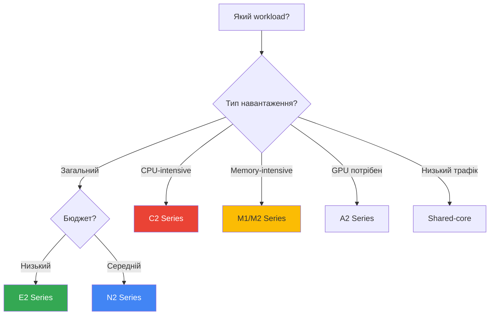

# Machine Types

## Категорії Machine Types

### General Purpose

Баланс між CPU, memory та ціною.

**E2 Series** (Cost-optimized)

- Predefined: e2-micro, e2-small, e2-medium, e2-standard-2/4/8/16/32
- Shared-core: e2-micro (0.25-2 vCPU), e2-small (0.5-2 vCPU), e2-medium (1-2 vCPU)
- Найдешевші для загальних workloads

**N2/N2D Series** (Balanced)

- n2-standard-2/4/8/16/32/48/64/80/96/128
- n2d-standard (AMD EPYC)
- Краща продуктивність за E2

**N1 Series** (Legacy)

- n1-standard-1/2/4/8/16/32/64/96
- Попередня генерація

---

### Compute-Optimized

Високе співвідношення CPU до memory.

#### C2/C2D Series

- c2-standard-4/8/16/30/60
- c2d-standard (AMD EPYC)
- High-performance computing
- Gaming servers

---

### Memory-Optimized

Високе співвідношення memory до CPU.

#### M1/M2 Series

- m1-ultramem-40/80/160 (до 3.75 TB RAM)
- m2-ultramem-208/416 (до 12 TB RAM)
- In-memory databases (SAP HANA)
- Large-scale analytics

---

### Accelerator-Optimized

З GPU для ML та графіки.

#### A2 Series

- a2-highgpu-1g/2g/4g/8g
- NVIDIA A100 GPUs
- Machine learning training

---

## Custom Machine Types

Створення machine type з точною кількістю vCPU та memory.

### Правила

- 1 vCPU = 0.9-6.5 GB memory
- Memory повинна бути кратна 256 MB

### Створення

```bash
gcloud compute instances create my-custom-vm \
  --custom-cpu=4 \
  --custom-memory=10GB \
  --zone=us-central1-a
```

### Extended Memory

Більше memory на vCPU (до 8 GB/vCPU):

```bash
gcloud compute instances create my-custom-vm \
  --custom-cpu=4 \
  --custom-memory=32GB \
  --custom-extensions \
  --zone=us-central1-a
```

---

## Shared-Core Machine Types

Частка фізичного CPU core, bursting до повного core.

### Типи

- **e2-micro**: 0.25-2 vCPU, 1 GB memory
- **e2-small**: 0.5-2 vCPU, 2 GB memory
- **e2-medium**: 1-2 vCPU, 4 GB memory
- **f1-micro**: 0.2-1 vCPU, 0.6 GB memory (legacy)
- **g1-small**: 0.5-1 vCPU, 1.7 GB memory (legacy)

### Коли використовувати

- ✅ Low-traffic web servers
- ✅ Development/testing
- ✅ Microservices з низьким навантаженням
- ✅ Free tier (f1-micro в певних регіонах)

---

## Порівняльна таблиця

| Series | Type        | vCPU Range | Memory/vCPU | Use Case         | Price |
|--------|-------------|------------|-------------|------------------|-------|
| E2 | General | 0.25-32 | 0.5-8 GB | Cost-optimized | $ |
| N2 | General | 2-128 | 0.5-8 GB | Balanced | $$ |
| C2 | Compute | 4-60 | 4 GB | High-performance | $$$ |
| M2 | Memory | 208-416 | 28 GB | In-memory DB | $$$$ |
| A2 | Accelerator | 12-96 | 85 GB | ML/AI | $$$$$ |

---

## Вибір Machine Type



---

## Рекомендації

### За Workload

- **Web servers**: E2 або N2 standard
- **Databases**: N2 або M1/M2
- **Batch processing**: C2 або Preemptible E2
- **ML training**: A2 з GPUs
- **Development**: E2-micro або e2-small

### Cost Optimization

- ✅ Використовуйте E2 замість N1
- ✅ Custom machine types для точних вимог
- ✅ Preemptible/Spot VMs для batch jobs
- ✅ Committed Use Discounts (1 або 3 роки)
- ✅ Sustained Use Discounts (автоматичні)

---

## Команди gcloud

```bash
# Список machine types в зоні
gcloud compute machine-types list --zones=us-central1-a

# Деталі machine type
gcloud compute machine-types describe e2-medium --zone=us-central1-a

# Створити VM з custom machine type
gcloud compute instances create my-vm \
  --custom-cpu=6 \
  --custom-memory=20GB \
  --zone=us-central1-a
```

---

> ⚠️ **Важливо для іспиту**: Розуміння різниці між E2, N2, C2, M2 series та коли використовувати
> custom machine types критично важливе для cost optimization питань.

---

**Повернутися до:** [Модуль 03 - Compute Engine](README.md)
