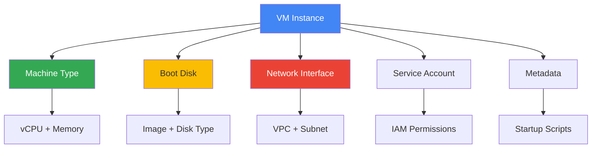
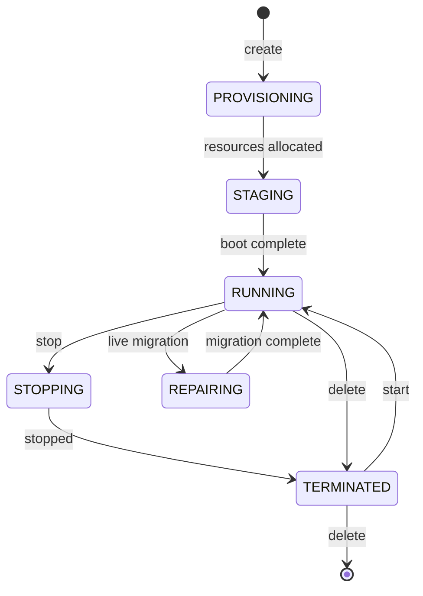
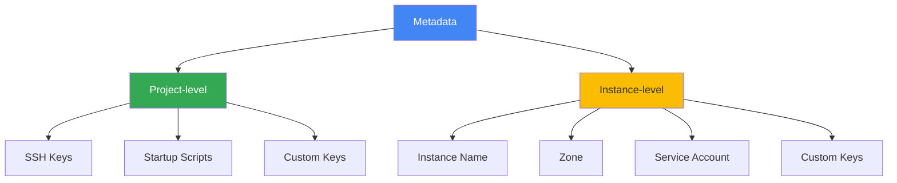

# VM Instances

## Вступ: Розуміння віртуальних машин

### Що таке VM Instance?

VM Instance (віртуальна машина) - це емульований комп'ютер, який працює на фізичному сервері Google. Це основна одиниця обчислень в Compute Engine та фундамент для розуміння всієї cloud інфраструктури.

**Ключове розуміння:** VM Instance - це не просто "сервер в хмарі". Це складна система з:

- **Compute resources** (CPU, RAM) - визначаються [machine type](machine-types.md)
- **Storage** (boot disk, data disks) - детально в [disks-and-images.md](disks-and-images.md)
- **Networking** (VPC, firewall) - зв'язок з [Module 09: Networking](../09-networking/README.md)
- **Identity** (service account) - зв'язок з [Module 10: IAM](../10-iam-security/README.md)
- **Metadata** (configuration, startup scripts)

### Зв'язок з іншими концепціями



**Залежності:**

- **Region/Zone** (Module 01) - де створюється VM
- **Machine Type** (ця тема) - скільки ресурсів
- **Disks** (ця тема) - де зберігаються дані
- **VPC** (Module 09) - як VM підключається до мережі
- **IAM** (Module 10) - які permissions має VM

---

## VM Lifecycle: Життєвий цикл віртуальної машини

### States та Transitions



### Детальний опис станів

#### 1. PROVISIONING

**Що відбувається:**

- Google виділяє фізичні ресурси (CPU, RAM)
- Резервується IP адреса
- Підготовка storage

**Тривалість:** Кілька секунд

**Оплата:** ❌ Не стягується

---

#### 2. STAGING

**Що відбувається:**

- Завантаження boot image на диск
- Налаштування мережі
- Підготовка до запуску ОС

**Тривалість:** 10-30 секунд

**Оплата:** ❌ Не стягується

---

#### 3. RUNNING

**Що відбувається:**

- ОС завантажена та працює
- Виконуються startup scripts
- VM доступна через SSH/RDP
- Додаток працює

**Тривалість:** Необмежена (поки не зупините)

**Оплата:** ✅ Стягується за секунду (мінімум 1 хвилина)

**Важливо:**

- Оплата за CPU, RAM, disk, network egress
- Sustained Use Discounts застосовуються автоматично
- Можна змінити metadata, додати диски (без зупинки)
- НЕ можна змінити machine type (потрібна зупинка)

---

#### 4. STOPPING

**Що відбувається:**

- Graceful shutdown ОС
- Збереження стану
- Відключення від мережі

**Тривалість:** 30-90 секунд

**Оплата:** ❌ Не стягується за CPU/RAM, ✅ стягується за disk

---

#### 5. TERMINATED

**Що відбувається:**

- VM зупинена
- Ресурси CPU/RAM звільнені
- Boot disk зберігається
- IP адреса може бути збережена (ephemeral) або звільнена

**Тривалість:** Необмежена

**Оплата:** ❌ Не стягується за CPU/RAM, ✅ стягується за disk storage

**Важливо:**

- Можна змінити machine type
- Можна змінити boot disk
- Можна створити snapshot
- Можна видалити VM (boot disk може бути збережений)

---

### Практичний приклад lifecycle

```bash
# 1. Створення VM (PROVISIONING → STAGING → RUNNING)
gcloud compute instances create my-vm \
  --zone=us-central1-a \
  --machine-type=e2-medium

# 2. Перевірка стану
gcloud compute instances describe my-vm \
  --zone=us-central1-a \
  --format="get(status)"
# Output: RUNNING

# 3. Зупинка VM (RUNNING → STOPPING → TERMINATED)
gcloud compute instances stop my-vm \
  --zone=us-central1-a

# 4. Зміна machine type (тільки коли TERMINATED)
gcloud compute instances set-machine-type my-vm \
  --machine-type=e2-standard-4 \
  --zone=us-central1-a

# 5. Запуск VM (TERMINATED → STAGING → RUNNING)
gcloud compute instances start my-vm \
  --zone=us-central1-a

# 6. Видалення VM
gcloud compute instances delete my-vm \
  --zone=us-central1-a
```

---

## Створення VM Instances

### Через Console

1. Navigation menu → Compute Engine → VM instances
2. CREATE INSTANCE
3. Налаштування: name, region, zone, machine type, boot disk
4. CREATE

### Через gcloud

```bash
gcloud compute instances create my-vm \
  --zone=us-central1-a \
  --machine-type=e2-medium \
  --image-family=debian-11 \
  --image-project=debian-cloud \
  --boot-disk-size=20GB \
  --boot-disk-type=pd-balanced
```

---

## SSH Доступ

### Через Console

- Click SSH button в VM instances list

### Через gcloud

```bash
gcloud compute ssh my-vm --zone=us-central1-a
```

### Через SSH keys

```bash
# Додати SSH key до metadata
gcloud compute instances add-metadata my-vm \
  --metadata-from-file ssh-keys=~/.ssh/id_rsa.pub
```

---

## Metadata та Startup Scripts: Конфігурація VM

### Що таке Metadata?

**Metadata** - це key-value пари, які зберігаються на metadata server та доступні з VM без автентифікації. Це потужний механізм для конфігурації та управління VM.

#### Metadata Server

```text
Адреса: http://metadata.google.internal/computeMetadata/v1/
Альтернатива: http://169.254.169.254/computeMetadata/v1/
```

**Ключове розуміння:** Metadata server - це спеціальний HTTP endpoint, доступний ТІЛЬКИ з VM. Він надає:

- Project metadata (спільне для всіх VM в проекті)
- Instance metadata (специфічне для конкретної VM)
- Service account tokens (для автентифікації в GCP APIs)

#### Типи Metadata



---

### Робота з Metadata

#### Встановлення metadata при створенні

```bash
# Instance-level metadata
gcloud compute instances create my-vm \
  --metadata=environment=production,app=web-server,version=1.0

# Metadata з файлу
gcloud compute instances create my-vm \
  --metadata-from-file=startup-script=startup.sh,config=config.yaml
```

#### Читання metadata з VM

```bash
# Отримати всю metadata
curl -H "Metadata-Flavor: Google" \
  http://metadata.google.internal/computeMetadata/v1/

# Отримати конкретне значення
curl -H "Metadata-Flavor: Google" \
  http://metadata.google.internal/computeMetadata/v1/instance/name

# Отримати custom metadata
curl -H "Metadata-Flavor: Google" \
  http://metadata.google.internal/computeMetadata/v1/instance/attributes/environment
```

**Важливо:** Header `Metadata-Flavor: Google` обов'язковий для безпеки!

#### Оновлення metadata на існуючій VM

```bash
# Додати нові ключі
gcloud compute instances add-metadata my-vm \
  --metadata=new-key=new-value

# Оновити існуючі ключі
gcloud compute instances add-metadata my-vm \
  --metadata=environment=staging

# Видалити ключі
gcloud compute instances remove-metadata my-vm \
  --keys=old-key
```

---

### Startup Scripts: Автоматизація конфігурації

**Startup Script** - це скрипт, який виконується автоматично при кожному запуску VM (STAGING → RUNNING).

#### Коли виконується startup script?

```text
VM Lifecycle:
PROVISIONING → STAGING → [STARTUP SCRIPT RUNS] → RUNNING
                ↑
                Тут виконується скрипт!
```

**Важливо:**

- ✅ Виконується при КОЖНОМУ запуску (не тільки при створенні)
- ✅ Виконується як root
- ✅ Логи доступні в Cloud Logging
- ❌ НЕ блокує перехід в RUNNING (виконується асинхронно)

#### Приклад 1: Встановлення веб-сервера

```bash
#!/bin/bash
# startup.sh

# Логування
exec > >(tee /var/log/startup-script.log)
exec 2>&1

echo "Starting startup script..."

# Оновлення системи
apt-get update
apt-get install -y nginx

# Отримання metadata
ENVIRONMENT=$(curl -H "Metadata-Flavor: Google" \
  http://metadata.google.internal/computeMetadata/v1/instance/attributes/environment)

# Конфігурація на основі metadata
cat > /var/www/html/index.html <<EOF
<h1>Environment: $ENVIRONMENT</h1>
<p>Instance: $(hostname)</p>
EOF

# Запуск сервісу
systemctl start nginx
systemctl enable nginx

echo "Startup script completed!"
```

Створення VM з цим скриптом:

```bash
gcloud compute instances create web-server \
  --metadata-from-file=startup-script=startup.sh \
  --metadata=environment=production \
  --tags=http-server
```

#### Приклад 2: Інтеграція з Cloud Storage

```bash
#!/bin/bash
# Завантаження конфігурації з Cloud Storage

# Отримання service account token
TOKEN=$(curl -H "Metadata-Flavor: Google" \
  http://metadata.google.internal/computeMetadata/v1/instance/service-accounts/default/token \
  | jq -r '.access_token')

# Завантаження конфігурації
gsutil cp gs://my-bucket/config.yaml /etc/app/config.yaml

# Запуск додатку
systemctl start my-app
```

**Зв'язок з Module 10 (IAM):** Service account VM повинен мати permissions для доступу до Cloud Storage!

#### Приклад 3: Реєстрація в системі моніторингу

```bash
#!/bin/bash
# Інтеграція з Cloud Monitoring

# Встановлення Ops Agent
curl -sSO https://dl.google.com/cloudagents/add-google-cloud-ops-agent-repo.sh
bash add-google-cloud-ops-agent-repo.sh --also-install

# Конфігурація логування
cat > /etc/google-cloud-ops-agent/config.yaml <<EOF
logging:
  receivers:
    syslog:
      type: files
      include_paths:
        - /var/log/syslog
        - /var/log/app/*.log
  service:
    pipelines:
      default_pipeline:
        receivers: [syslog]
EOF

systemctl restart google-cloud-ops-agent
```

**Зв'язок з Module 11 (Monitoring):** Startup script налаштовує інтеграцію з Cloud Logging!

---

### Shutdown Scripts

**Shutdown Script** - виконується перед зупинкою VM (RUNNING → STOPPING).

```bash
gcloud compute instances add-metadata my-vm \
  --metadata-from-file=shutdown-script=shutdown.sh
```

Приклад shutdown.sh:

```bash
#!/bin/bash
# Graceful shutdown додатку

echo "Shutting down application..."

# Зупинка прийому нових запитів
systemctl stop nginx

# Очікування завершення поточних запитів
sleep 10

# Збереження стану
/opt/app/save-state.sh

echo "Shutdown complete"
```

**Use case:** Graceful shutdown для stateful додатків.

---

### Best Practices для Metadata та Scripts

#### ✅ Do's

1. **Використовуйте metadata для конфігурації**

   ```bash
   # Замість hardcoded значень
   ENVIRONMENT=$(curl -H "Metadata-Flavor: Google" \
     http://metadata.google.internal/computeMetadata/v1/instance/attributes/environment)
   ```

2. **Логуйте виконання скриптів**

   ```bash
   exec > >(tee /var/log/startup-script.log)
   exec 2>&1
   ```

3. **Перевіряйте успішність команд**

   ```bash
   set -e  # Exit on error
   set -x  # Print commands
   ```

4. **Використовуйте idempotent операції**

   ```bash
   # Перевірка перед встановленням
   if ! command -v nginx &> /dev/null; then
       apt-get install -y nginx
   fi
   ```

#### ❌ Don'ts

1. **Не зберігайте секрети в metadata**

   ```bash
   # ❌ ПОГАНО
   --metadata=db-password=secret123
   
   # ✅ ДОБРЕ - використовуйте Secret Manager
   gcloud secrets versions access latest --secret="db-password"
   ```

2. **Не блокуйте startup script**

   ```bash
   # ❌ ПОГАНО - довгі операції
   sleep 3600
   
   # ✅ ДОБРЕ - запускайте в background
   nohup long-running-task.sh &
   ```

3. **Не ігноруйте помилки**

   ```bash
   # ❌ ПОГАНО
   apt-get install -y some-package
   
   # ✅ ДОБРЕ
   apt-get install -y some-package || {
       echo "Failed to install package"
       exit 1
   }
   ```

---

### Практичний сценарій: Auto-scaling Web Application

```bash
#!/bin/bash
# Startup script для auto-scaling web app

set -e
set -x

# 1. Отримання конфігурації з metadata
APP_VERSION=$(curl -H "Metadata-Flavor: Google" \
  http://metadata.google.internal/computeMetadata/v1/instance/attributes/app-version)

ENVIRONMENT=$(curl -H "Metadata-Flavor: Google" \
  http://metadata.google.internal/computeMetadata/v1/instance/attributes/environment)

# 2. Встановлення залежностей
apt-get update
apt-get install -y docker.io

# 3. Завантаження Docker image
docker pull gcr.io/my-project/my-app:${APP_VERSION}

# 4. Запуск контейнера з environment-specific конфігурацією
docker run -d \
  --name my-app \
  -p 80:8080 \
  -e ENVIRONMENT=${ENVIRONMENT} \
  gcr.io/my-project/my-app:${APP_VERSION}

# 5. Налаштування health checks
cat > /etc/systemd/system/health-check.service <<EOF
[Unit]
Description=Health Check Service

[Service]
ExecStart=/usr/local/bin/health-check.sh
Restart=always

[Install]
WantedBy=multi-user.target
EOF

systemctl enable health-check
systemctl start health-check

echo "Application started successfully!"
```

**Зв'язки з іншими модулями:**

- **Module 03 (Instance Groups):** Цей скрипт використовується в Managed Instance Group
- **Module 09 (Load Balancing):** Health checks інтегруються з Load Balancer
- **Module 11 (Monitoring):** Логи відправляються в Cloud Logging
- **Module 12 (Deployment):** Docker image з Container Registry

---

## Preemptible VMs

**Опис:** Короткострокові VM з 60-91% знижкою, можуть бути зупинені GCP в будь-який момент.

### Характеристики

- До 24 годин роботи
- 30-секундне попередження перед зупинкою
- Не гарантована доступність
- Не підходять для production баз даних

### Створення

```bash
gcloud compute instances create my-preemptible-vm \
  --preemptible \
  --zone=us-central1-a
```

### Коли використовувати

- ✅ Batch processing
- ✅ Fault-tolerant workloads
- ✅ Тестування та розробка
- ❌ Критичні production workloads

---

## Spot VMs

**Опис:** Новіша версія Preemptible VMs з додатковими можливостями.

### Відмінності від Preemptible

- Немає максимального часу роботи (24 години)
- Динамічна ціна (може змінюватися)
- Можливість встановити max price

```bash
gcloud compute instances create my-spot-vm \
  --provisioning-model=SPOT \
  --zone=us-central1-a
```

---

## Управління VM

### Зупинка

```bash
gcloud compute instances stop my-vm --zone=us-central1-a
```

### Запуск

```bash
gcloud compute instances start my-vm --zone=us-central1-a
```

### Перезавантаження

```bash
gcloud compute instances reset my-vm --zone=us-central1-a
```

### Видалення

```bash
gcloud compute instances delete my-vm --zone=us-central1-a
```

### Зміна machine type (потребує зупинки)

```bash
gcloud compute instances set-machine-type my-vm \
  --machine-type=e2-standard-4 \
  --zone=us-central1-a
```

---

## Labels та Tags

### Labels

Для організації та біллінгу:

```bash
gcloud compute instances add-labels my-vm \
  --labels=env=prod,team=backend
```

### Network Tags

Для firewall rules:

```bash
gcloud compute instances add-tags my-vm \
  --tags=web-server,https-server
```

---

## Live Migration

- Автоматична міграція VM між хостами без downtime
- Відбувається при maintenance подіях
- Можна вимкнути (VM буде перезавантажена)

```bash
gcloud compute instances create my-vm \
  --maintenance-policy=MIGRATE  # або TERMINATE
```

---

## Best Practices

- ✅ Використовуйте startup scripts для автоматизації
- ✅ Застосовуйте labels для організації
- ✅ Використовуйте preemptible/spot VMs для cost savings
- ✅ Налаштуйте автоматичні snapshots
- ✅ Використовуйте service accounts замість user credentials
- ✅ Увімкніть OS Login для централізованого управління SSH

---

## Cross-References

**Пов'язані теми в цьому модулі:**

- [Machine Types](machine-types.md) - Вибір CPU/RAM конфігурації
- [Disks and Images](disks-and-images.md) - Boot disks, snapshots, images
- [Instance Groups](instance-groups.md) - Managed Instance Groups для auto-scaling

**Інші модулі:**

- [Module 07 - Cloud Storage](../07-storage/cloud-storage.md) - Інтеграція з Cloud Storage через metadata
- [Module 09 - VPC](../09-networking/vpc.md) - Мережева конфігурація VM
- [Module 09 - Load Balancing](../09-networking/load-balancing.md) - Health checks для VM
- [Module 10 - Service Accounts](../10-iam-security/service-accounts.md) - IAM permissions для VM
- [Module 11 - Cloud Monitoring](../11-monitoring-logging/cloud-monitoring.md) - Ops Agent для моніторингу
- [Module 11 - Cloud Logging](../11-monitoring-logging/cloud-logging.md) - Startup script logs
- [Module 12 - Cloud SDK](../12-deployment-management/cloud-sdk.md) - gcloud commands для VM

---

**Повернутися до:** [Модуль 03 - Compute Engine](README.md)
