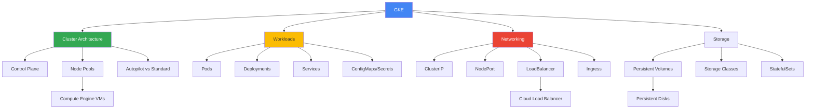

# Kubernetes Engine (GKE)

## Вступ до модуля

Google Kubernetes Engine (GKE) - це керований сервіс Kubernetes, який дозволяє розгортати, керувати та масштабувати контейнеризовані додатки. GKE є одним з найпопулярніших сервісів GCP та критично важливим для сучасних cloud-native архітектур.

### Чому GKE важливий?

**Container Orchestration:** У сучасному світі більшість додатків контейнеризовані. Kubernetes став de-facto стандартом для оркестрації контейнерів, а GKE - найпростіший спосіб використовувати Kubernetes без управління складною інфраструктурою.

**Managed Service:** GKE автоматично керує Kubernetes control plane, що означає:

- Автоматичні оновлення Kubernetes
- Автоматичні патчі безпеки
- Моніторинг та логування з коробки
- Інтеграція з іншими GCP сервісами

### Реальний сценарій: Коли використовувати GKE

```text
Сценарій: Microservices архітектура для e-commerce платформи

Вимоги:
- 20+ мікросервісів (User Service, Product Service, Order Service, etc.)
- Різні мови програмування (Java, Python, Node.js, Go)
- Автоматичне масштабування кожного сервісу
- Service discovery та load balancing
- Rolling updates без downtime
- Multi-environment (dev, staging, prod)

❌ Неможливо ефективно з:
- Compute Engine: Складно керувати 20+ сервісами вручну
- App Engine: Кожен сервіс - окремий App Engine app (складно)
- Cloud Functions: Не підходить для довготривалих сервісів

✅ Рішення: GKE
- Kubernetes Deployments для кожного мікросервісу
- Kubernetes Services для service discovery
- Horizontal Pod Autoscaler для автоскейлінгу
- Namespaces для різних environments
- Rolling updates через Deployments
- Ingress для routing
```

### Структура модуля та взаємозв'язки



### GKE Architecture: Як все працює разом

```
User Request
    ↓
Ingress (HTTP(S) Load Balancer)
    ↓
Service (ClusterIP)
    ↓
Pods (containers)
    ↓
Persistent Volume (storage)

Control Plane (managed by Google)
    ↓
Node Pool (Compute Engine VMs)
    ↓
Pods running on Nodes
```

**Ключове розуміння:**

- **Control Plane**: Managed by Google, ви не платите за нього
- **Nodes**: Compute Engine VMs, ви платите за них
- **Pods**: Найменша deployable unit, містить 1+ containers
- **Services**: Stable endpoint для доступу до Pods

---

## Module Goal

Цей модуль надає глибоке розуміння Google Kubernetes Engine - керованого Kubernetes сервісу. Ви навчитесь створювати та керувати GKE кластерами, розгортати containerized додатки, налаштовувати networking та storage, та використовувати Kubernetes best practices для production workloads.

## Module Goal (English)

This module provides deep understanding of Google Kubernetes Engine - the managed Kubernetes service. You will learn to create and manage GKE clusters, deploy containerized applications, configure networking and storage, and use Kubernetes best practices for production workloads.

---

## Topics

### 1. [GKE Basics](gke-basics.md)

**Що ви дізнаєтесь:**

- Що таке Kubernetes та навіщо він потрібен
- GKE vs self-managed Kubernetes
- Autopilot vs Standard mode
- Cluster creation та configuration
- kubectl basics

**Ключові концепції:**

- **Kubernetes**: Container orchestration platform
- **GKE**: Managed Kubernetes від Google
- **Autopilot**: Fully managed, Google керує nodes
- **Standard**: Ви керуєте node pools
- **kubectl**: CLI для взаємодії з Kubernetes

**Autopilot vs Standard:**

```
Autopilot:
✅ Google керує nodes
✅ Оплата за Pods (не за nodes)
✅ Автоматичний scaling
✅ Менше контролю
❌ Деякі обмеження

Standard:
✅ Повний контроль над nodes
✅ Можна використати preemptible nodes
✅ Більше гнучкості
❌ Потрібно керувати nodes
❌ Оплата за nodes
```

**Залежності:**

- Базується на Compute Engine (Module 03)
- Використовує VPC networking (Module 09)
- Container concepts (Docker basics)

**Типове питання на іспиті:**

```text
Компанія хоче використовувати Kubernetes без управління nodes.
Який режим GKE обрати?

A) Standard mode
B) Autopilot mode
C) Regional cluster
D) Private cluster

Відповідь: B (Autopilot - fully managed nodes)
```

---

### 2. [Clusters and Nodes](clusters-and-nodes.md)

**Що ви дізнаєтесь:**

- Cluster types: Zonal vs Regional
- Node pools та їх конфігурація
- Machine types для nodes
- Autoscaling: Cluster Autoscaler
- Node taints та tolerations
- Maintenance windows та upgrades

**Ключові концепції:**

- **Zonal cluster**: Control plane в одній зоні
- **Regional cluster**: Control plane replicated в 3 зонах (HA)
- **Node pool**: Група nodes з однаковою конфігурацією
- **Cluster Autoscaler**: Автоматичне додавання/видалення nodes

**Cluster Architecture:**

```
Regional Cluster
    ↓
Control Plane (3 replicas в різних зонах)
    ↓
Node Pool 1 (europe-west1-a)
    [Node 1] [Node 2]
    ↓
Node Pool 2 (europe-west1-b)
    [Node 3] [Node 4]
    ↓
Node Pool 3 (europe-west1-c)
    [Node 5] [Node 6]
```

**Залежності:**

- Nodes - це Compute Engine VMs
- Використовує regions/zones з Module 01
- Networking через VPC

**Типове питання на іспиті:**

```text
Як забезпечити high availability для GKE control plane?

A) Використати більше nodes
B) Використати regional cluster
C) Використати preemptible nodes
D) Використати larger machine types

Відповідь: B (regional cluster має replicated control plane)
```

---

### 3. [Workloads](workloads.md)

**Що ви дізнаєтесь:**

- Pods: Базова одиниця deployment
- Deployments: Declarative updates для Pods
- Services: Stable networking для Pods
- ConfigMaps та Secrets: Configuration management
- StatefulSets: Stateful applications
- DaemonSets та Jobs

**Ключові концепції:**

- **Pod**: 1+ containers, shared network/storage
- **Deployment**: Manages ReplicaSets, rolling updates
- **Service**: Stable IP/DNS для Pods
- **ConfigMap**: Non-sensitive configuration
- **Secret**: Sensitive data (passwords, keys)

**Deployment Flow:**

```
kubectl apply -f deployment.yaml
    ↓
Deployment creates ReplicaSet
    ↓
ReplicaSet creates Pods
    ↓
Pods scheduled on Nodes
    ↓
Containers running in Pods
```

**Service Types:**

```
ClusterIP (default)
    → Internal cluster access only
    
NodePort
    → External access через Node IP:Port
    
LoadBalancer
    → External access через Cloud Load Balancer
    
Ingress
    → HTTP(S) routing з single IP
```

**Залежності:**

- Pods run на Nodes (попередня тема)
- Services використовують networking
- Persistent Volumes для storage

**Типове питання на іспиті:**

```text
Як надати external access до веб-додатку в GKE?

A) ClusterIP Service
B) NodePort Service
C) LoadBalancer Service або Ingress
D) Port forwarding

Відповідь: C (LoadBalancer або Ingress для production)
```

---

## Key Exam Takeaways

### GKE Mode Selection

| Вимоги | Mode | Чому |
|--------|------|------|
| Мінімальне управління | Autopilot | Google керує nodes |
| Повний контроль | Standard | Ви керуєте node pools |
| Cost optimization | Standard з preemptible | Дешевші nodes |
| Production HA | Regional cluster | Multi-zone control plane |

---

### Workload Types

| Use Case | Kubernetes Resource | Приклад |
|----------|---------------------|---------|
| Stateless app | Deployment | Web server |
| Stateful app | StatefulSet | Database |
| Background task | Job | Data processing |
| Node-level service | DaemonSet | Log collector |
| Scheduled task | CronJob | Backup script |

---

### Service Types

| Type | Use Case | External Access |
|------|----------|-----------------|
| ClusterIP | Internal communication | Ні |
| NodePort | Development/testing | Так (Node IP:Port) |
| LoadBalancer | Production single service | Так (Cloud LB) |
| Ingress | Production multiple services | Так (HTTP(S) LB) |

---

## Architecture Patterns

### Pattern 1: Microservices Application

```
Ingress (HTTP(S) Load Balancer)
    ↓
[Frontend Service] → Frontend Pods
    ↓
[API Service] → API Pods
    ↓
[Auth Service] → Auth Pods
[Product Service] → Product Pods
[Order Service] → Order Pods
    ↓
Cloud SQL (database)
Cloud Storage (files)
```

**Чому така архітектура:**

- Ingress: Single entry point, path-based routing
- Services: Service discovery між мікросервісами
- Deployments: Independent scaling кожного сервісу
- External services: Managed databases та storage

---

### Pattern 2: Batch Processing

```
CronJob (scheduler)
    ↓
Job (creates Pods)
    ↓
[Worker Pod 1] [Worker Pod 2] [Worker Pod 3]
    ↓
Process data from Cloud Storage
    ↓
Write results to BigQuery
```

**Чому така архітектура:**

- CronJob: Scheduled execution
- Job: Parallel processing
- Pods: Ephemeral workers
- Cloud Storage: Input/output data

---

### Pattern 3: Stateful Application

```
StatefulSet
    ↓
[Pod-0] → PersistentVolume-0
[Pod-1] → PersistentVolume-1
[Pod-2] → PersistentVolume-2
    ↓
Headless Service (stable network identity)
```

**Чому така архітектура:**

- StatefulSet: Ordered deployment, stable identity
- PersistentVolumes: Durable storage per Pod
- Headless Service: Direct Pod access

---

## GKE Best Practices

### Cluster Configuration

✅ **Use Regional Clusters for Production**

- Multi-zone control plane
- Higher availability
- Automatic failover

✅ **Use Autopilot for Simplicity**

- Less operational overhead
- Automatic node management
- Pay-per-Pod pricing

✅ **Use Standard for Control**

- Custom node configurations
- Preemptible nodes
- Specific machine types

---

### Workload Configuration

✅ **Resource Requests/Limits**

```yaml
resources:
  requests:
    memory: "256Mi"
    cpu: "100m"
  limits:
    memory: "512Mi"
    cpu: "500m"
```

✅ **Health Checks**

```yaml
livenessProbe:
  httpGet:
    path: /health
    port: 8080
readinessProbe:
  httpGet:
    path: /ready
    port: 8080
```

✅ **Horizontal Pod Autoscaler**

```yaml
apiVersion: autoscaling/v2
kind: HorizontalPodAutoscaler
spec:
  minReplicas: 2
  maxReplicas: 10
  metrics:
  - type: Resource
    resource:
      name: cpu
      target:
        type: Utilization
        averageUtilization: 70
```

---

### Security Best Practices

✅ **Use Workload Identity**

- Kubernetes Service Accounts → Google Service Accounts
- No need for key files

✅ **Use Private Clusters**

- Nodes without external IPs
- Control plane accessible via private endpoint

✅ **Use Binary Authorization**

- Only deploy signed container images
- Enforce security policies

✅ **Use Network Policies**

- Control Pod-to-Pod communication
- Micro-segmentation

---

## Pricing та Cost Optimization

### Pricing Components

**1. Cluster Management Fee**

- Autopilot: Included in Pod pricing
- Standard: $0.10/hour per cluster (зonal)
- Standard: $0.10/hour per cluster (regional)

**2. Compute Resources**

- Autopilot: Pay for Pod resources (CPU, memory)
- Standard: Pay for Compute Engine nodes

**3. Networking**

- Egress traffic
- Load Balancer costs

### Cost Optimization Strategies

💡 **Use Autopilot for Variable Workloads**

- Pay only for running Pods
- No idle node costs

💡 **Use Preemptible Nodes (Standard mode)**

- Up to 80% discount
- For fault-tolerant workloads

💡 **Right-size Resource Requests**

- Don't over-provision
- Use Vertical Pod Autoscaler

💡 **Use Cluster Autoscaler**

- Automatically remove idle nodes
- Scale down during low traffic

💡 **Use Committed Use Discounts**

- For predictable workloads
- 37-57% discount on nodes

---

## Зв'язок з іншими модулями

**Module 01 (Cloud Fundamentals):**

- GKE - це managed container orchestration
- Uses regions/zones for cluster placement

**Module 02 (GCP Core Services):**

- GKE - один з compute опцій
- Порівняння з Compute Engine, App Engine

**Module 03 (Compute Engine):**

- GKE nodes - це Compute Engine VMs
- Node pools використовують machine types

**Module 07 (Storage):**

- Persistent Volumes використовують Persistent Disks
- Container images в Container Registry

**Module 09 (Networking):**

- GKE використовує VPC networking
- Services та Ingress використовують Load Balancers

**Module 10 (IAM):**

- Workload Identity для Pod authentication
- RBAC для Kubernetes authorization

---

## 📝 [Practice Questions](exam-questions.md)

**Що включено:**

- 15+ питань на GKE
- Cluster configuration scenarios
- Workload deployment questions
- Networking та service exposure
- Cost optimization scenarios

**Фокус питань:**

- Autopilot vs Standard selection
- Regional vs Zonal clusters
- Service type selection
- Scaling strategies

---

**Попередній модуль:** [Module 03 - Compute Engine](../03-compute-engine/README.md)

**Наступний модуль:** [Module 05 - App Engine](../05-app-engine/README.md)
