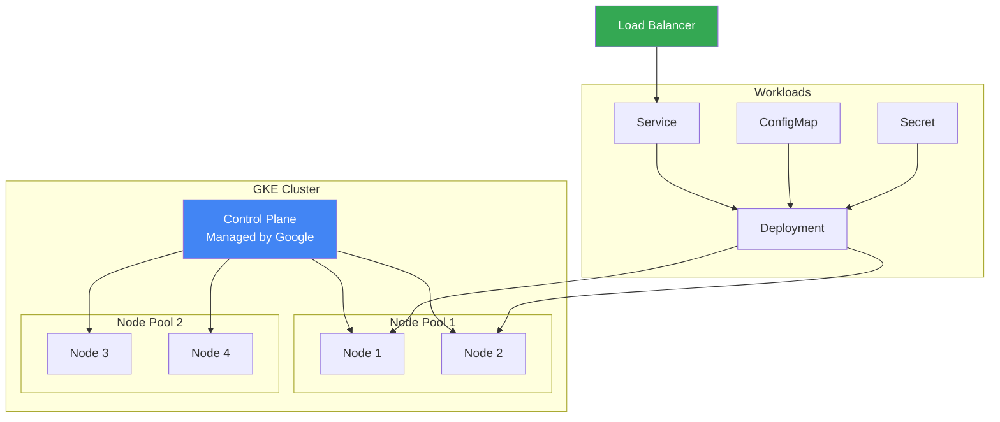

# Google Kubernetes Engine (GKE)

## Мета модуля

Цей модуль охоплює Google Kubernetes Engine - керований Kubernetes сервіс для оркестрації контейнерів. Ви навчитесь створювати кластери, управляти workloads та використовувати GKE для production deployments.

## Module Goal (English)

This module covers Google Kubernetes Engine - a managed Kubernetes service for container orchestration. You will learn to create clusters, manage workloads, and use GKE for production deployments.

## Topics

- [GKE Basics](gke-basics.md) - Standard vs Autopilot, kubectl basics
- [Clusters and Nodes](clusters-and-nodes.md) - Creating clusters, node pools, autoscaling
- [Workloads](workloads.md) - Deployments, Services, ConfigMaps, Secrets

## Key Exam Takeaways

- ✅ Know the difference between GKE Standard and Autopilot modes
- ✅ Understand node pools and cluster autoscaling
- ✅ Know how to deploy applications using kubectl
- ✅ Understand Services (ClusterIP, NodePort, LoadBalancer)
- ✅ Know how to use ConfigMaps and Secrets
- ✅ Understand Persistent Volumes in GKE

## GKE Architecture

## 📝 [Practice Questions](exam-questions.md)
