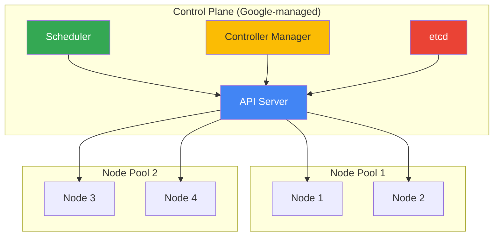

# GKE Basics

## Вступ

**Google Kubernetes Engine (GKE)** — це managed Kubernetes service для deploying, managing та scaling containerized applications. GKE автоматизує Kubernetes operations та інтегрується з GCP services.

### Що таке GKE?

GKE — це managed container orchestration platform:

- **Managed control plane:** Google управляє Kubernetes master nodes
- **Auto-scaling:** Automatic cluster та pod scaling
- **Auto-repair:** Automatic node health monitoring та repair
- **Security:** Built-in security features та compliance
- **Integration:** Native GCP service integration

### Навіщо потрібен GKE?

1. **Container Orchestration:** Автоматичне управління containers
2. **Scalability:** Horizontal та vertical scaling
3. **High Availability:** Multi-zone та regional clusters
4. **Simplified Operations:** Managed Kubernetes без operational overhead
5. **Cost Optimization:** Pay-per-use pricing та autoscaling

### Зв'язок з іншими модулями

- **[Module 03 - Compute Engine](../03-compute-engine/README.md):** GKE runs on Compute Engine VMs
- **[Module 07 - Storage](../07-storage/README.md):** Persistent volumes
- **[Module 09 - Networking](../09-networking/README.md):** VPC networking
- **[Module 10 - IAM & Security](../10-iam-security/README.md):** Workload Identity
- **[Module 11 - Monitoring](../11-monitoring-logging/README.md):** GKE monitoring

---

## GKE Architecture

### Cluster Components

**Control Plane (Managed by Google):**

- **API Server:** Kubernetes API endpoint
- **Scheduler:** Pod placement decisions
- **Controller Manager:** Cluster state management
- **etcd:** Cluster configuration storage

**Data Plane (Your workloads):**

- **Nodes:** Compute Engine VMs running containers
- **Pods:** Smallest deployable units
- **Services:** Network endpoints
- **Volumes:** Persistent storage



---

## GKE Modes

### Standard Mode

**Full control over cluster configuration:**

**Characteristics:**

- Manual node management
- Full node pool configuration
- Custom machine types
- Advanced networking options
- More control, more responsibility

**When to use:**

- Specific node requirements (GPUs, local SSDs)
- Custom networking configurations
- Windows containers
- Stateful workloads with specific requirements

**Creating Standard cluster:**

```bash
gcloud container clusters create my-standard-cluster \
  --zone=us-central1-a \
  --num-nodes=3 \
  --machine-type=e2-medium \
  --disk-size=50GB \
  --enable-autoscaling \
  --min-nodes=1 \
  --max-nodes=10
```

### Autopilot Mode

**Google manages nodes automatically:**

**Characteristics:**

- Fully managed nodes
- Automatic optimization
- Pay per pod (not per node)
- Pre-configured best practices
- Less control, less operational overhead

**When to use:**

- Standard containerized workloads
- Simplified operations
- Cost optimization
- No specific node requirements

**Creating Autopilot cluster:**

```bash
gcloud container clusters create-auto my-autopilot-cluster \
  --region=us-central1
```

### Standard vs Autopilot Comparison

| Feature | Standard | Autopilot |
|---------|----------|-----------|
| **Node management** | Manual | Automatic |
| **Pricing** | Per node | Per pod |
| **Machine types** | Any | Optimized |
| **Node pools** | Custom | Managed |
| **GPUs** | Yes | Limited |
| **Windows** | Yes | No |
| **Flexibility** | High | Medium |
| **Operational overhead** | High | Low |

> ⚠️ **Best Practice:** Use Autopilot for most workloads unless you need specific node configurations.

---

## Cluster Types

### Zonal Cluster

**Single zone deployment:**

```bash
gcloud container clusters create zonal-cluster \
  --zone=us-central1-a \
  --num-nodes=3
```

**Characteristics:**

- Control plane in single zone
- Nodes in single zone
- Lower cost
- Lower availability (99.5% SLA)

### Multi-Zonal Cluster

**Nodes across multiple zones:**

```bash
gcloud container clusters create multi-zonal-cluster \
  --zone=us-central1-a \
  --node-locations=us-central1-a,us-central1-b,us-central1-c \
  --num-nodes=3
```

**Characteristics:**

- Control plane in single zone
- Nodes distributed across zones
- Higher availability
- Automatic zone balancing

### Regional Cluster

**Control plane and nodes across zones:**

```bash
gcloud container clusters create regional-cluster \
  --region=us-central1 \
  --num-nodes=3
```

**Characteristics:**

- Control plane replicated across 3 zones
- Nodes distributed across zones
- Highest availability (99.95% SLA)
- Higher cost
- Recommended for production

---

## Node Pools

### What are Node Pools?

**Node pool** — це група nodes з однаковою конфігурацією.

**Characteristics:**

- Same machine type
- Same disk configuration
- Same labels and taints
- Independent scaling

### Creating Node Pools

```bash
# Create cluster with default node pool
gcloud container clusters create my-cluster \
  --zone=us-central1-a \
  --num-nodes=3

# Add additional node pool
gcloud container node-pools create high-mem-pool \
  --cluster=my-cluster \
  --zone=us-central1-a \
  --machine-type=n2-highmem-4 \
  --num-nodes=2 \
  --enable-autoscaling \
  --min-nodes=1 \
  --max-nodes=5
```

### Node Pool Use Cases

**Different workload types:**

```bash
# CPU-intensive workloads
gcloud container node-pools create cpu-pool \
  --cluster=my-cluster \
  --machine-type=c2-standard-8 \
  --num-nodes=2

# Memory-intensive workloads
gcloud container node-pools create memory-pool \
  --cluster=my-cluster \
  --machine-type=n2-highmem-8 \
  --num-nodes=2

# GPU workloads
gcloud container node-pools create gpu-pool \
  --cluster=my-cluster \
  --machine-type=n1-standard-4 \
  --accelerator=type=nvidia-tesla-t4,count=1 \
  --num-nodes=1
```

---

## Cluster Networking

### VPC-Native Clusters

**Recommended networking mode:**

```bash
gcloud container clusters create vpc-native-cluster \
  --enable-ip-alias \
  --zone=us-central1-a \
  --num-nodes=3
```

**Benefits:**

- Pods have native VPC IPs
- Direct communication with VPC resources
- Better network performance
- Required for Private GKE

### Network Modes

**1. VPC-Native (Alias IPs):**

- Pods get IPs from VPC subnet
- Better integration with VPC
- **Recommended**

**2. Routes-Based:**

- Legacy mode
- Pods get IPs from separate range
- Not recommended for new clusters

### Private Clusters

**Control plane and nodes without public IPs:**

```bash
gcloud container clusters create private-cluster \
  --enable-private-nodes \
  --enable-private-endpoint \
  --master-ipv4-cidr=172.16.0.0/28 \
  --zone=us-central1-a \
  --num-nodes=3
```

**Options:**

- `--enable-private-nodes`: Nodes without public IPs
- `--enable-private-endpoint`: Control plane without public IP
- `--enable-master-authorized-networks`: Restrict control plane access

---

## kubectl Basics

### Cluster Access

```bash
# Get credentials
gcloud container clusters get-credentials my-cluster \
  --zone=us-central1-a

# Verify connection
kubectl cluster-info

# View current context
kubectl config current-context
```

### Common Commands

**Pods:**

```bash
# List pods
kubectl get pods

# List pods in all namespaces
kubectl get pods --all-namespaces

# Describe pod
kubectl describe pod my-pod

# View logs
kubectl logs my-pod

# Follow logs
kubectl logs -f my-pod

# Execute command in pod
kubectl exec -it my-pod -- /bin/bash
```

**Deployments:**

```bash
# List deployments
kubectl get deployments

# Describe deployment
kubectl describe deployment my-deployment

# Scale deployment
kubectl scale deployment my-deployment --replicas=5

# Update image
kubectl set image deployment/my-deployment container=new-image:v2
```

**Services:**

```bash
# List services
kubectl get services

# Describe service
kubectl describe service my-service

# Expose deployment
kubectl expose deployment my-deployment --port=80 --type=LoadBalancer
```

---

## Workload Identity

### What is Workload Identity?

**Workload Identity** дозволяє Kubernetes pods автентифікуватися як GCP service accounts.

**Benefits:**

- No service account keys needed
- Automatic credential rotation
- Fine-grained IAM permissions
- Security best practice

### Enabling Workload Identity

**1. Enable on cluster:**

```bash
gcloud container clusters create my-cluster \
  --workload-pool=PROJECT_ID.svc.id.goog \
  --zone=us-central1-a
```

**2. Create Kubernetes service account:**

```bash
kubectl create serviceaccount my-ksa --namespace=default
```

**3. Create GCP service account:**

```bash
gcloud iam service-accounts create my-gsa
```

**4. Bind KSA to GSA:**

```bash
gcloud iam service-accounts add-iam-policy-binding \
  my-gsa@PROJECT_ID.iam.gserviceaccount.com \
  --role=roles/iam.workloadIdentityUser \
  --member="serviceAccount:PROJECT_ID.svc.id.goog[default/my-ksa]"
```

**5. Annotate KSA:**

```bash
kubectl annotate serviceaccount my-ksa \
  iam.gke.io/gcp-service-account=my-gsa@PROJECT_ID.iam.gserviceaccount.com
```

**6. Use in pod:**

```yaml
apiVersion: v1
kind: Pod
metadata:
  name: my-pod
spec:
  serviceAccountName: my-ksa
  containers:
  - name: app
    image: gcr.io/my-project/my-app
```

---

## Cluster Autoscaling

### Cluster Autoscaler

**Automatically adds/removes nodes:**

```bash
gcloud container clusters create autoscaling-cluster \
  --enable-autoscaling \
  --min-nodes=1 \
  --max-nodes=10 \
  --zone=us-central1-a
```

**How it works:**

1. Pods cannot be scheduled (insufficient resources)
2. Cluster Autoscaler adds nodes
3. Pods are scheduled
4. When nodes are underutilized, they are removed

### Vertical Pod Autoscaler (VPA)

**Automatically adjusts pod resource requests:**

```bash
# Enable VPA
gcloud container clusters update my-cluster \
  --enable-vertical-pod-autoscaling \
  --zone=us-central1-a
```

### Horizontal Pod Autoscaler (HPA)

**Automatically scales pod replicas:**

```bash
kubectl autoscale deployment my-deployment \
  --cpu-percent=50 \
  --min=1 \
  --max=10
```

---

## Security Features

### Binary Authorization

**Enforce deployment policies:**

```bash
gcloud container clusters create secure-cluster \
  --enable-binauthz \
  --zone=us-central1-a
```

**Use case:** Only allow signed container images

### Shielded GKE Nodes

**Secure boot and integrity monitoring:**

```bash
gcloud container clusters create shielded-cluster \
  --enable-shielded-nodes \
  --zone=us-central1-a
```

### Network Policies

**Control pod-to-pod communication:**

```bash
gcloud container clusters create network-policy-cluster \
  --enable-network-policy \
  --zone=us-central1-a
```

---

## Практичний сценарій: Production GKE Cluster

### Вимоги

1. High availability (99.95% SLA)
2. Auto-scaling (1-20 nodes)
3. Private networking
4. Workload Identity
5. Monitoring enabled

### Implementation

```bash
# Create regional cluster with all features
gcloud container clusters create prod-cluster \
  --region=us-central1 \
  --num-nodes=3 \
  --machine-type=e2-standard-4 \
  --enable-autoscaling \
  --min-nodes=3 \
  --max-nodes=20 \
  --enable-ip-alias \
  --enable-private-nodes \
  --enable-private-endpoint \
  --master-ipv4-cidr=172.16.0.0/28 \
  --enable-master-authorized-networks \
  --master-authorized-networks=10.0.0.0/8 \
  --workload-pool=PROJECT_ID.svc.id.goog \
  --enable-stackdriver-kubernetes \
  --enable-shielded-nodes \
  --enable-network-policy \
  --maintenance-window-start=2023-01-01T00:00:00Z \
  --maintenance-window-duration=4h \
  --release-channel=regular

# Add high-memory node pool
gcloud container node-pools create highmem-pool \
  --cluster=prod-cluster \
  --region=us-central1 \
  --machine-type=n2-highmem-8 \
  --num-nodes=1 \
  --enable-autoscaling \
  --min-nodes=0 \
  --max-nodes=5
```

---

## Best Practices

### Cluster Design

✅ **DO:**

- Use regional clusters for production
- Enable Workload Identity
- Use VPC-native networking
- Enable auto-scaling
- Use release channels for updates

❌ **DON'T:**

- Don't use zonal clusters for production
- Don't use service account keys
- Don't use routes-based networking
- Don't manually manage node versions

### Node Pools

✅ **DO:**

- Create separate node pools for different workload types
- Use taints and tolerations for dedicated pools
- Enable auto-repair and auto-upgrade
- Use preemptible nodes for batch workloads

### Security

✅ **DO:**

- Enable Binary Authorization
- Use private clusters
- Enable Shielded GKE Nodes
- Implement network policies
- Use least privilege IAM

---

## Exam Tips

> ⚠️ **Важливо для іспиту:**

1. **GKE Modes:**
   - Standard: Full control, manual management
   - Autopilot: Managed nodes, pay per pod

2. **Cluster Types:**
   - Zonal: Single zone (99.5% SLA)
   - Regional: Multi-zone (99.95% SLA)
   - Use regional for production

3. **Networking:**
   - VPC-native (recommended)
   - Private clusters for security
   - Network policies for pod isolation

4. **Workload Identity:**
   - No service account keys
   - Bind KSA to GSA
   - Security best practice

5. **Autoscaling:**
   - Cluster Autoscaler: nodes
   - HPA: pod replicas
   - VPA: pod resources

6. **Node Pools:**
   - Group nodes with same config
   - Different pools for different workloads
   - Independent scaling

7. **Common Scenarios:**
   - High availability → Regional cluster
   - Cost optimization → Autopilot + autoscaling
   - Security → Private cluster + Workload Identity
   - Mixed workloads → Multiple node pools

---

**Повернутися до:** [Модуль 04 - Kubernetes Engine](README.md)
