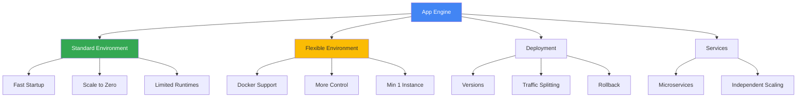

# App Engine

## Вступ до модуля

App Engine - це Platform-as-a-Service (PaaS) від Google, який дозволяє розробникам зосередитися на коді, а не на інфраструктурі. Це один з перших сервісів GCP та ідеальний вибір для веб-додатків та API, які потребують автоматичного масштабування.

### Чому App Engine важливий?

**Zero Infrastructure Management:** App Engine повністю керує інфраструктурою - від серверів до масштабування. Ви просто deploy код, і Google робить решту.

**Automatic Scaling:** App Engine може масштабуватися від 0 до тисяч instances автоматично, базуючись на навантаженні. Це робить його ідеальним для додатків зі змінним трафіком.

### Реальний сценарій

```text
Сценарій: Стартап запускає веб-додаток

Вимоги:
- Швидкий launch (мінімальний час на setup)
- Невідоме навантаження (може бути 10 або 10,000 користувачів)
- Мінімальна команда (2 розробники, без DevOps)
- Фокус на features, не на інфраструктурі

✅ App Engine Standard:
- Deploy за 5 хвилин
- Автоматичне масштабування від 0
- Оплата тільки за використання
- Вбудований моніторинг та логування
- Розробники фокусуються на коді
```

### Структура модуля



---

## Module Goal

Цей модуль надає глибоке розуміння Google App Engine - PaaS для веб-додатків. Ви навчитесь вибирати між Standard та Flexible environments, розгортати додатки, керувати versions та traffic, та використовувати App Engine для production workloads.

---

## Topics

### 1. [Standard vs Flexible](standard-vs-flexible.md)

**Standard Environment:**

- Sandbox environment з обмеженнями
- Швидкий startup (мілісекунди)
- Автоматичне масштабування до 0
- Підтримка: Python, Java, Node.js, PHP, Ruby, Go
- Безкоштовний tier

**Flexible Environment:**

- Docker containers
- Повільніший startup (хвилини)
- Мінімум 1 instance
- Підтримка будь-якого runtime
- Більше контролю

**Decision Matrix:**

| Вимоги | Standard | Flexible |
|--------|----------|----------|
| Швидкий startup | ✅ | ❌ |
| Scale to zero | ✅ | ❌ |
| Custom runtime | ❌ | ✅ |
| SSH access | ❌ | ✅ |
| Cost-effective | ✅ | ❌ |

---

### 2. [Deployment](deployment.md)

**Ключові концепції:**

- **Services**: Мікросервіси в одному App Engine app
- **Versions**: Різні версії одного service
- **Traffic Splitting**: Розподіл трафіку між versions
- **Rollback**: Повернення до попередньої версії

**Deployment Flow:**

```
gcloud app deploy
    ↓
New Version Created
    ↓
Traffic Splitting (0% → 100%)
    ↓
Old Version (можна видалити)
```

---

## Key Exam Takeaways

✅ **Standard для:**

- Веб-додатки з підтримуваними runtimes
- Змінне навантаження
- Cost optimization

✅ **Flexible для:**

- Custom runtimes
- Docker containers
- Потрібен SSH access

---

**Попередній модуль:** [Module 04 - Kubernetes Engine](../04-kubernetes-engine/README.md)

**Наступний модуль:** [Module 06 - Cloud Functions](../06-cloud-functions/README.md)
