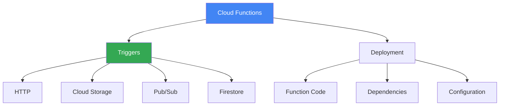

# Cloud Functions

## Вступ до модуля

Cloud Functions - це serverless Functions-as-a-Service (FaaS), який дозволяє запускати код у відповідь на події без управління серверами. Це ідеальний вибір для event-driven архітектур та мікрозадач.

### Чому Cloud Functions важливий?

**Event-Driven Architecture:** Cloud Functions автоматично виконується у відповідь на події (HTTP request, file upload, Pub/Sub message). Це дозволяє будувати reactive системи.

**Pay-per-Execution:** Ви платите тільки за час виконання функції. Якщо функція не викликається - ви не платите.

### Реальний сценарій

```text
Сценарій: Обробка uploaded зображень

Вимоги:
- Користувачі завантажують зображення в Cloud Storage
- Потрібно створити thumbnails
- Обробка тільки коли є нові зображення
- Не потрібен постійно працюючий сервер

✅ Cloud Functions:
- Trigger: Cloud Storage upload event
- Function: Resize зображення, створити thumbnail
- Оплата: Тільки за час виконання resize
- Автоматичне масштабування під будь-яке навантаження
```

### Структура модуля



---

## Module Goal

Цей модуль надає розуміння Cloud Functions - serverless FaaS. Ви навчитесь створювати event-driven функції, використовувати різні triggers, та розгортати serverless архітектури.

---

## Topics

### 1. [Triggers](triggers.md)

**HTTP Triggers:**

- Webhooks
- API endpoints
- Microservices

**Event Triggers:**

- Cloud Storage: file upload/delete
- Pub/Sub: message processing
- Firestore: document changes
- Cloud Scheduler: cron jobs

---

### 2. [Deployment](deployment.md)

**Deployment Process:**

```bash
gcloud functions deploy my-function \
  --runtime=python39 \
  --trigger-http \
  --allow-unauthenticated
```

**Key Concepts:**

- Runtime: Python, Node.js, Go, Java
- Memory: 128MB - 8GB
- Timeout: Max 9 minutes
- Concurrency: Max 1000 concurrent executions

---

## Key Exam Takeaways

✅ **Use Cloud Functions для:**

- Event-driven workloads
- Короткотривалі задачі (< 9 хвилин)
- Webhooks та API endpoints
- File processing

❌ **Не використовуйте для:**

- Довготривалі процеси (> 9 хвилин)
- Stateful applications
- Потрібен постійний connection

---

**Попередній модуль:** [Module 05 - App Engine](../05-app-engine/README.md)

**Наступний модуль:** [Module 07 - Storage](../07-storage/README.md)
