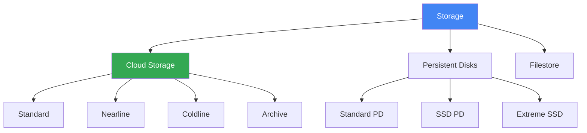

# Storage

## Вступ до модуля

Storage - це фундаментальна частина будь-якої cloud архітектури. GCP пропонує різні типи storage для різних потреб: object storage, block storage, та file storage.

### Чому Storage важливий?

**Різні типи даних потребують різних storage:** Зображення потребують object storage, VM boot disks потребують block storage, а shared files потребують file storage. Розуміння різниці критично важливе.

### Структура модуля

---

## Module Goal

Цей модуль надає розуміння storage опцій в GCP. Ви навчитесь вибирати правильний тип storage, використовувати storage classes, та оптимізувати вартість.

---

## Topics

### 1. [Cloud Storage](cloud-storage.md)

**Object Storage для:**

- Unstructured data (зображення, відео, backup)
- Static website hosting
- Data lake
- Archive

---

### 2. [Storage Classes](storage-classes.md)

| Class | Access Frequency | Min Storage Duration | Use Case |
|-------|------------------|---------------------|----------|
| Standard | Frequent | None | Hot data |
| Nearline | Once/month | 30 days | Backup |
| Coldline | Once/quarter | 90 days | Archive |
| Archive | Once/year | 365 days | Long-term archive |

---

### 3. [Persistent Disks](persistent-disks.md)

**Block Storage для:**

- VM boot disks
- Database storage
- Application data

---

### 4. [Filestore](filestore.md)

**File Storage для:**

- Shared file systems
- NFS workloads
- Legacy applications

---

## Key Exam Takeaways

✅ **Cloud Storage:** Unstructured data, global access
✅ **Persistent Disk:** VM storage, high performance
✅ **Filestore:** Shared files, NFS

---

**Попередній модуль:** [Module 06 - Cloud Functions](../06-cloud-functions/README.md)

**Наступний модуль:** [Module 08 - Databases](../08-databases/README.md)
