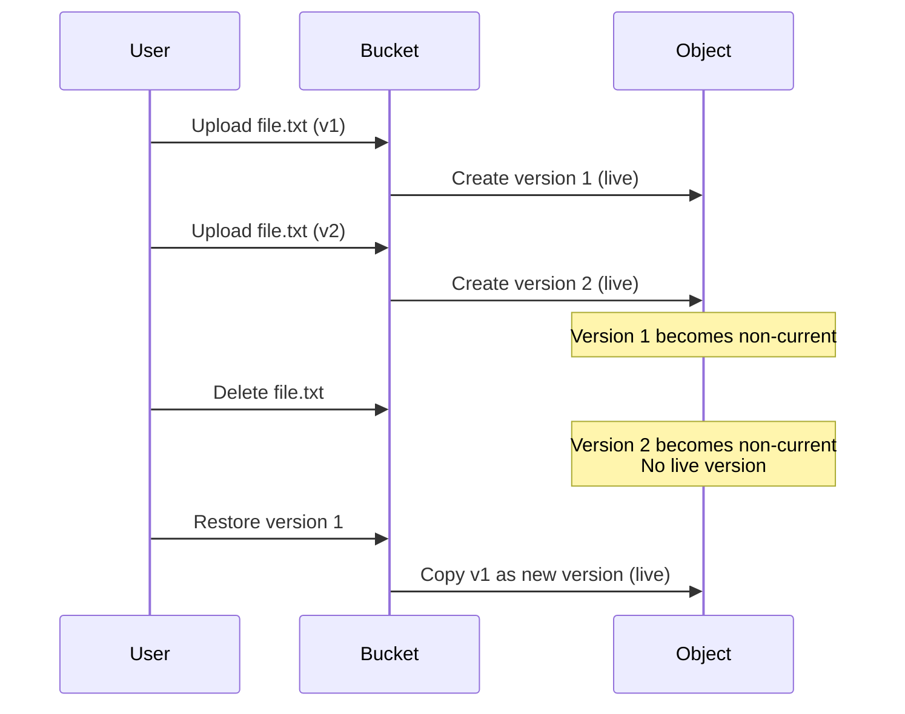

# Cloud Storage

## Fundamentals

**Cloud Storage** - це об'єктне сховище (object storage) для зберігання та доступу до даних будь-якого типу та розміру.

### Що таке Object Storage?

**Object Storage** - це архітектура зберігання даних, де дані зберігаються як об'єкти (objects) замість файлової системи (file storage) або блоків (block storage).

**Структура об'єкта:**

```
Object = Data + Metadata + Unique ID

Data: Фактичний вміст (файл, зображення, відео)
Metadata: Інформація про об'єкт (content-type, creation date, custom metadata)
Unique ID: Унікальний ідентифікатор (bucket name + object name)
```

**Приклад:**

```
Bucket: my-photos
Object: vacation/beach.jpg
Full path: gs://my-photos/vacation/beach.jpg

Metadata:
- Content-Type: image/jpeg
- Size: 2.5 MB
- Created: 2024-01-15
- Custom: photographer=John
```

---

### Cloud Storage vs File Storage vs Block Storage

| Feature | Object Storage | File Storage | Block Storage |
|---------|---------------|--------------|---------------|
| **Structure** | Flat namespace | Hierarchical | Raw blocks |
| **Access** | HTTP API | NFS/SMB | SCSI/iSCSI |
| **Metadata** | Rich | Limited | None |
| **Scalability** | Unlimited | Limited | Limited |
| **Use Case** | Unstructured data | Shared files | Databases, VMs |
| **GCP Service** | Cloud Storage | Filestore | Persistent Disk |

---

## Ключові Концепції

### Buckets

**Bucket** - це контейнер для зберігання об'єктів в Cloud Storage.

**Характеристики:**

- Глобально унікальне ім'я (across all GCP)
- Регіональне або multi-regional розміщення
- Storage class (Standard, Nearline, Coldline, Archive)
- Lifecycle policies
- Versioning
- Access control

**Naming Rules:**

- Тільки lowercase letters, numbers, dashes, underscores, dots
- 3-63 символи
- Не може починатися з "goog" або містити "google"
- Не може бути IP адресою

**Приклади:**

```bash
# Valid
my-company-backups
data-analytics-2024
user-uploads.example.com

# Invalid
MyBucket (uppercase)
go (too short)
google-storage (contains "google")
192.168.1.1 (IP address)
```

---

### Objects

**Object** - це індивідуальний файл, збережений в bucket.

**Характеристики:**

- Розмір: 0 bytes - 5 TB
- Ім'я може містити `/` (симулює директорії)
- Immutable (незмінний) - для зміни потрібно перезаписати
- Версіонування опціональне

**Object Naming:**

```
# Flat structure (no directories)
gs://my-bucket/file.txt
gs://my-bucket/image.jpg

# Simulated directories
gs://my-bucket/2024/01/data.csv
gs://my-bucket/users/john/profile.jpg
```

> ⚠️ **Важливо**: Cloud Storage не має справжніх директорій. `/` в імені об'єкта - це просто частина імені. Console UI показує їх як папки для зручності.

---

## Storage Classes

Cloud Storage пропонує 4 storage classes з різною ціною та доступністю.

### Standard Storage

**Опис:** Для часто використовуваних даних (hot data).

**Характеристики:**

- **Availability**: 99.95% (regional), 99.95% (dual-region), >99.95% (multi-region)
- **Latency**: Milliseconds
- **Minimum storage duration**: None
- **Retrieval cost**: None

**Use Cases:**

- ✅ Website content
- ✅ Streaming video
- ✅ Mobile apps
- ✅ Gaming content
- ✅ Data analytics

**Pricing Example (us-central1):**

```
Storage: $0.020/GB/month
Operations: $0.05/10,000 Class A, $0.004/10,000 Class B
Network: $0.12/GB egress
```

---

### Nearline Storage

**Опис:** Для даних, до яких звертаються рідше (раз на місяць).

**Характеристики:**

- **Availability**: 99.9% (regional), 99.9% (dual-region), 99.95% (multi-region)
- **Latency**: Milliseconds
- **Minimum storage duration**: 30 days
- **Retrieval cost**: $0.01/GB

**Use Cases:**

- ✅ Backups
- ✅ Long-tail content
- ✅ Data archiving (accessed monthly)

**Pricing Example (us-central1):**

```
Storage: $0.010/GB/month (50% cheaper than Standard)
Early deletion: Charged for full 30 days
```

---

### Coldline Storage

**Опис:** Для даних, до яких звертаються дуже рідко (раз на квартал).

**Характеристики:**

- **Availability**: 99.9% (regional), 99.9% (dual-region), 99.95% (multi-region)
- **Latency**: Milliseconds
- **Minimum storage duration**: 90 days
- **Retrieval cost**: $0.02/GB

**Use Cases:**

- ✅ Disaster recovery
- ✅ Compliance archives
- ✅ Data accessed quarterly

**Pricing Example (us-central1):**

```
Storage: $0.004/GB/month (80% cheaper than Standard)
Early deletion: Charged for full 90 days
```

---

### Archive Storage

**Опис:** Для даних, до яких звертаються рідше ніж раз на рік.

**Характеристики:**

- **Availability**: 99.9% (regional), 99.9% (dual-region), 99.95% (multi-region)
- **Latency**: Milliseconds
- **Minimum storage duration**: 365 days
- **Retrieval cost**: $0.05/GB

**Use Cases:**

- ✅ Long-term backups
- ✅ Regulatory archives
- ✅ Cold storage

**Pricing Example (us-central1):**

```
Storage: $0.0012/GB/month (94% cheaper than Standard)
Early deletion: Charged for full 365 days
```

---

### Storage Class Comparison

| Class | Storage Cost | Retrieval Cost | Min Duration | Use Case |
|-------|-------------|----------------|--------------|----------|
| **Standard** | $0.020/GB | Free | None | Hot data |
| **Nearline** | $0.010/GB | $0.01/GB | 30 days | Monthly access |
| **Coldline** | $0.004/GB | $0.02/GB | 90 days | Quarterly access |
| **Archive** | $0.0012/GB | $0.05/GB | 365 days | Yearly access |

---

## Bucket Locations

### Location Types

#### Regional

**Опис:** Дані зберігаються в одному регіоні (3 зони).

**Characteristics:**

- Lowest latency для користувачів в регіоні
- Lowest cost
- 99.9% availability SLA

**Use Cases:**

- ✅ Compute workloads в тому ж регіоні
- ✅ Data analytics
- ✅ Cost-sensitive applications

**Example:**

```bash
gcloud storage buckets create gs://my-regional-bucket \
  --location=us-central1 \
  --storage-class=standard
```

---

#### Dual-Region

**Опис:** Дані реплікуються між двома регіонами в одній географії.

**Characteristics:**

- Higher availability (99.95%)
- Geo-redundancy
- Automatic failover

**Available Dual-Regions:**

- `nam4`: Iowa + South Carolina
- `eur4`: Netherlands + Finland

**Use Cases:**

- ✅ High availability requirements
- ✅ Disaster recovery
- ✅ Compliance (data residency)

**Example:**

```bash
gcloud storage buckets create gs://my-dual-bucket \
  --location=nam4 \
  --storage-class=standard
```

---

#### Multi-Region

**Опис:** Дані реплікуються в кількох регіонах континенту.

**Characteristics:**

- Highest availability (>99.95%)
- Global redundancy
- Lowest latency для global users

**Available Multi-Regions:**

- `us`: United States
- `eu`: European Union
- `asia`: Asia

**Use Cases:**

- ✅ Global applications
- ✅ Content delivery
- ✅ Maximum availability

**Example:**

```bash
gcloud storage buckets create gs://my-multi-bucket \
  --location=us \
  --storage-class=standard
```

---

## Object Lifecycle Management

**Lifecycle Management** - автоматичне управління об'єктами на основі правил.

### Lifecycle Actions

#### Delete

Видалення об'єктів після певного часу.

**Example:**

```json
{
  "lifecycle": {
    "rule": [
      {
        "action": {"type": "Delete"},
        "condition": {
          "age": 365,
          "matchesPrefix": ["logs/"]
        }
      }
    ]
  }
}
```

**Use Case:** Видалення логів старше 1 року.

---

#### SetStorageClass

Переміщення об'єктів до іншого storage class.

**Example:**

```json
{
  "lifecycle": {
    "rule": [
      {
        "action": {
          "type": "SetStorageClass",
          "storageClass": "NEARLINE"
        },
        "condition": {
          "age": 30
        }
      },
      {
        "action": {
          "type": "SetStorageClass",
          "storageClass": "COLDLINE"
        },
        "condition": {
          "age": 90
        }
      },
      {
        "action": {
          "type": "SetStorageClass",
          "storageClass": "ARCHIVE"
        },
        "condition": {
          "age": 365
        }
      }
    ]
  }
}
```

**Use Case:** Автоматичне переміщення даних до cheaper storage classes з часом.

---

### Lifecycle Conditions

**Age-based:**

```json
{"age": 30}  // 30 days old
```

**Created before:**

```json
{"createdBefore": "2024-01-01"}
```

**Number of newer versions:**

```json
{"numNewerVersions": 3}  // Keep only 3 latest versions
```

**Is live:**

```json
{"isLive": false}  // Non-current versions only
```

**Matches prefix:**

```json
{"matchesPrefix": ["logs/", "temp/"]}
```

**Matches suffix:**

```json
{"matchesSuffix": [".log", ".tmp"]}
```

---

### Practical Lifecycle Scenario

**Scenario:** Media company з video files.

**Requirements:**

- Keep recent videos (< 30 days) in Standard
- Move older videos (30-90 days) to Nearline
- Archive very old videos (> 90 days) to Coldline
- Delete temp files after 7 days

**Solution:**

```json
{
  "lifecycle": {
    "rule": [
      {
        "action": {"type": "Delete"},
        "condition": {
          "age": 7,
          "matchesPrefix": ["temp/"]
        }
      },
      {
        "action": {
          "type": "SetStorageClass",
          "storageClass": "NEARLINE"
        },
        "condition": {
          "age": 30,
          "matchesPrefix": ["videos/"]
        }
      },
      {
        "action": {
          "type": "SetStorageClass",
          "storageClass": "COLDLINE"
        },
        "condition": {
          "age": 90,
          "matchesPrefix": ["videos/"]
        }
      }
    ]
  }
}
```

**Apply:**

```bash
gcloud storage buckets update gs://media-bucket \
  --lifecycle-file=lifecycle.json
```

---

## Object Versioning

**Versioning** - зберігання кількох версій об'єкта.

### How Versioning Works



### Enable Versioning

```bash
# Enable versioning
gcloud storage buckets update gs://my-bucket \
  --versioning

# Disable versioning
gcloud storage buckets update gs://my-bucket \
  --no-versioning
```

### List Versions

```bash
# List all versions
gcloud storage ls -a gs://my-bucket/file.txt
```

### Restore Version

```bash
# Copy old version to restore
gcloud storage cp \
  gs://my-bucket/file.txt#1234567890 \
  gs://my-bucket/file.txt
```

### Lifecycle with Versioning

**Delete old versions:**

```json
{
  "lifecycle": {
    "rule": [
      {
        "action": {"type": "Delete"},
        "condition": {
          "numNewerVersions": 3,
          "isLive": false
        }
      }
    ]
  }
}
```

**Use Case:** Keep only 3 latest versions, delete older.

---

## Access Control

Cloud Storage підтримує два механізми access control:

### 1. IAM (Identity and Access Management)

**Рекомендований** метод для bucket-level та project-level permissions.

**Common Roles:**

| Role | Permissions | Use Case |
|------|-------------|----------|
| `roles/storage.objectViewer` | Read objects | Read-only access |
| `roles/storage.objectCreator` | Create objects | Upload files |
| `roles/storage.objectAdmin` | Full object control | Manage objects |
| `roles/storage.admin` | Full bucket control | Bucket admin |

**Grant Access:**

```bash
# Grant user read access to bucket
gcloud storage buckets add-iam-policy-binding gs://my-bucket \
  --member=user:john@example.com \
  --role=roles/storage.objectViewer

# Grant service account write access
gcloud storage buckets add-iam-policy-binding gs://my-bucket \
  --member=serviceAccount:my-sa@project.iam.gserviceaccount.com \
  --role=roles/storage.objectCreator
```

---

### 2. ACLs (Access Control Lists)

**Legacy** метод для object-level permissions.

**Predefined ACLs:**

- `private`: Owner only
- `publicRead`: Public read access
- `publicReadWrite`: Public read/write (not recommended)
- `authenticatedRead`: Any authenticated user

**Set ACL:**

```bash
# Make object public
gcloud storage objects update gs://my-bucket/file.txt \
  --predefined-acl=publicRead

# Make bucket public
gcloud storage buckets update gs://my-bucket \
  --predefined-acl=publicRead
```

> ⚠️ **Best Practice**: Використовуйте IAM замість ACLs для нових проектів. ACLs складніші та менш гнучкі.

---

### Uniform Bucket-Level Access

**Uniform bucket-level access** - використання тільки IAM (вимкнення ACLs).

**Enable:**

```bash
gcloud storage buckets update gs://my-bucket \
  --uniform-bucket-level-access
```

**Benefits:**

- ✅ Simplified access control
- ✅ Consistent permissions
- ✅ Better security
- ✅ Required for some features (Bucket Lock)

---

### Signed URLs

**Signed URLs** - тимчасовий доступ до приватних об'єктів без authentication.

**Use Cases:**

- ✅ Temporary file sharing
- ✅ Direct uploads from client
- ✅ Time-limited downloads

**Generate Signed URL:**

```bash
# Read access (1 hour)
gcloud storage sign-url gs://my-bucket/file.txt \
  --duration=1h

# Upload access
gcloud storage sign-url gs://my-bucket/upload.txt \
  --http-verb=PUT \
  --duration=10m
```

**Example Output:**

```
https://storage.googleapis.com/my-bucket/file.txt?
X-Goog-Algorithm=GOOG4-RSA-SHA256&
X-Goog-Credential=...&
X-Goog-Date=20240115T120000Z&
X-Goog-Expires=3600&
X-Goog-SignedHeaders=host&
X-Goog-Signature=...
```

---

## Data Transfer

### gsutil

**gsutil** - command-line tool для Cloud Storage.

**Common Commands:**

```bash
# Create bucket
gsutil mb gs://my-bucket

# Upload file
gsutil cp file.txt gs://my-bucket/

# Upload directory
gsutil cp -r directory/ gs://my-bucket/

# Download file
gsutil cp gs://my-bucket/file.txt .

# List objects
gsutil ls gs://my-bucket/

# Delete object
gsutil rm gs://my-bucket/file.txt

# Sync directory
gsutil rsync -r local-dir/ gs://my-bucket/remote-dir/

# Parallel upload (faster)
gsutil -m cp -r large-dir/ gs://my-bucket/
```

---

### Parallel Composite Uploads

Для великих файлів (> 150 MB) gsutil автоматично використовує parallel composite uploads.

**How it works:**

1. Файл розбивається на частини
2. Частини завантажуються паралельно
3. Частини об'єднуються в один об'єкт

**Configuration:**

```bash
# Set parallel upload threshold
gsutil config set parallel_composite_upload_threshold 150M

# Set number of parallel processes
gsutil config set parallel_process_count 8
```

---

### Transfer Service

**Storage Transfer Service** - керований сервіс для великих data transfers.

**Sources:**

- Amazon S3
- Azure Blob Storage
- HTTP/HTTPS locations
- Other Cloud Storage buckets

**Features:**

- Scheduled transfers
- Bandwidth control
- Filtering (prefix, suffix, modified date)
- Delete source after transfer

**Use Cases:**

- ✅ Multi-cloud migration
- ✅ Backup from other clouds
- ✅ Regular data synchronization

**Example:**

```bash
gcloud transfer jobs create \
  --source-bucket=s3://aws-bucket \
  --destination-bucket=gs://gcp-bucket \
  --schedule-starts=2024-01-15T00:00:00Z \
  --schedule-repeats-every=24h
```

---

## Best Practices

### 1. Choose Right Storage Class

**Decision Tree:**

```
Access frequency?
├─ Daily/Weekly → Standard
├─ Monthly → Nearline
├─ Quarterly → Coldline
└─ Yearly → Archive
```

### 2. Use Lifecycle Policies

```bash
# Automatic cost optimization
Standard (0-30 days) → Nearline (30-90 days) → Coldline (90+ days)
```

### 3. Enable Versioning for Critical Data

```bash
# Protect against accidental deletion
gcloud storage buckets update gs://critical-data \
  --versioning
```

### 4. Use Uniform Bucket-Level Access

```bash
# Simplified security model
gcloud storage buckets update gs://my-bucket \
  --uniform-bucket-level-access
```

### 5. Optimize Naming

```bash
# Good: Avoid sequential prefixes
user-123/data.txt
user-456/data.txt

# Bad: Sequential prefixes (hotspotting)
2024-01-01/data.txt
2024-01-02/data.txt
```

### 6. Use Parallel Uploads

```bash
# Faster uploads for large files
gsutil -m cp -r large-dataset/ gs://my-bucket/
```

### 7. Monitor Costs

```bash
# Set budget alerts
# Use Cloud Monitoring for storage metrics
# Review lifecycle policies regularly
```

---

## Practical Scenario: Multi-Tier Storage Strategy

### Scenario

E-commerce company з product images та backups.

**Requirements:**

- Product images: High availability, fast access
- User uploads: Standard storage, move to Nearline after 30 days
- Backups: Keep for 7 years, rarely accessed
- Logs: Delete after 90 days

### Solution

**1. Create Buckets:**

```bash
# Product images (multi-region for global access)
gcloud storage buckets create gs://products-images \
  --location=us \
  --storage-class=standard \
  --uniform-bucket-level-access

# User uploads (regional)
gcloud storage buckets create gs://user-uploads \
  --location=us-central1 \
  --storage-class=standard \
  --uniform-bucket-level-access

# Backups (regional, archive)
gcloud storage buckets create gs://company-backups \
  --location=us-central1 \
  --storage-class=archive \
  --uniform-bucket-level-access

# Logs (regional)
gcloud storage buckets create gs://application-logs \
  --location=us-central1 \
  --storage-class=standard \
  --uniform-bucket-level-access
```

**2. Configure Lifecycle Policies:**

**user-uploads lifecycle:**

```json
{
  "lifecycle": {
    "rule": [
      {
        "action": {
          "type": "SetStorageClass",
          "storageClass": "NEARLINE"
        },
        "condition": {"age": 30}
      }
    ]
  }
}
```

**application-logs lifecycle:**

```json
{
  "lifecycle": {
    "rule": [
      {
        "action": {"type": "Delete"},
        "condition": {"age": 90}
      }
    ]
  }
}
```

**3. Set Access Control:**

```bash
# Product images: Public read
gcloud storage buckets add-iam-policy-binding gs://products-images \
  --member=allUsers \
  --role=roles/storage.objectViewer

# User uploads: Application service account
gcloud storage buckets add-iam-policy-binding gs://user-uploads \
  --member=serviceAccount:app@project.iam.gserviceaccount.com \
  --role=roles/storage.objectAdmin

# Backups: Backup service account only
gcloud storage buckets add-iam-policy-binding gs://company-backups \
  --member=serviceAccount:backup@project.iam.gserviceaccount.com \
  --role=roles/storage.objectCreator
```

**4. Enable Versioning for Critical Data:**

```bash
gcloud storage buckets update gs://company-backups \
  --versioning
```

### Results

**Cost Optimization:**

- Product images: $0.020/GB (Standard, multi-region)
- User uploads: $0.020/GB → $0.010/GB after 30 days
- Backups: $0.0012/GB (Archive)
- Logs: Auto-deleted after 90 days

**Estimated Monthly Cost (1 TB each):**

```
Products: 1000 GB × $0.020 = $20
User uploads: 500 GB × $0.020 + 500 GB × $0.010 = $15
Backups: 1000 GB × $0.0012 = $1.20
Logs: 1000 GB × $0.020 × (90/30) = $60

Total: ~$96/month
```

---

## Cross-References

**[Module 02 - Storage Services](../02-gcp-core-services/storage-services.md)**

- Storage types overview
- Decision tree for storage selection

**[Module 03 - Disks and Images](../03-compute-engine/disks-and-images.md)**

- Persistent Disks vs Cloud Storage
- VM images storage

**[Module 07 - Storage Classes](storage-classes.md)**

- Deep dive into storage classes
- Cost analysis

**[Module 10 - IAM](../10-iam-security/iam-basics.md)**

- IAM roles for Cloud Storage
- Service accounts

**[Module 11 - Monitoring](../11-monitoring-logging/cloud-monitoring.md)**

- Storage metrics monitoring
- Cost tracking

**[Module 12 - Cloud SDK](../12-deployment-management/cloud-sdk.md)**

- gsutil commands
- Automation scripts

---

> ⚠️ **Важливо для іспиту**: Розуміння storage classes, lifecycle policies, та access control критично важливе. Знайте коли використовувати кожен storage class та як налаштувати lifecycle для cost optimization.

---

**Повернутися до:** [Модуль 07 - Storage](README.md)
