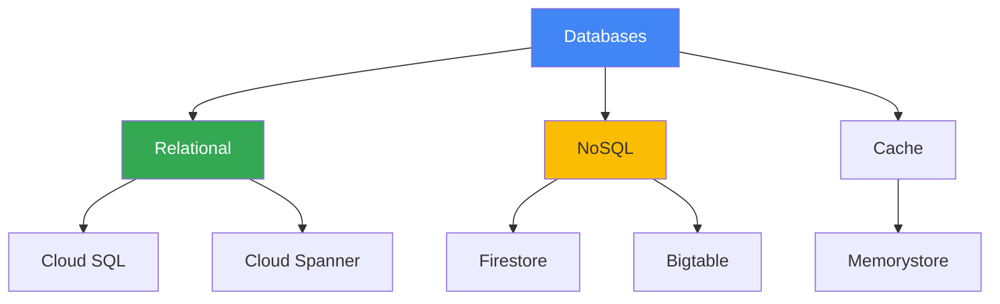

# Databases

## Вступ до модуля

Databases - це серце більшості додатків. GCP пропонує різні managed database сервіси для різних потреб: relational, NoSQL, cache.

### Структура модуля



---

## Module Goal

Цей модуль надає розуміння database сервісів GCP. Ви навчитесь вибирати правильну базу даних для конкретних потреб.

---

## Topics

### 1. [Cloud SQL](cloud-sql.md)

**Managed Relational Database:**

- MySQL, PostgreSQL, SQL Server
- Automatic backups
- High availability
- Read replicas

**Use Cases:**

- Traditional applications
- ACID transactions
- Structured data

---

### 2. [Cloud Spanner](cloud-spanner.md)

**Globally Distributed SQL:**

- Horizontal scaling
- ACID transactions
- Global consistency
- 99.999% availability

**Use Cases:**

- Global applications
- Financial systems
- High availability requirements

---

### 3. [Firestore](firestore.md)

**NoSQL Document Database:**

- Flexible schema
- Real-time updates
- Mobile/web apps
- Automatic scaling

**Use Cases:**

- Mobile apps
- Real-time collaboration
- User profiles

---

### 4. [Bigtable](bigtable.md)

**NoSQL Wide-Column:**

- Petabyte-scale
- Low latency
- Time-series data
- Analytics

**Use Cases:**

- IoT data
- Time-series analytics
- Financial data

---

## Key Exam Takeaways

**Decision Tree:**

```
Потрібна транзакційність?
    ↓ Так
    Глобальний масштаб?
        ↓ Так → Cloud Spanner
        ↓ Ні → Cloud SQL
    ↓ Ні
    Тип даних?
        ↓ Documents → Firestore
        ↓ Time-series → Bigtable
        ↓ Cache → Memorystore
```

---

**Попередній модуль:** [Module 07 - Storage](../07-storage/README.md)

**Наступний модуль:** [Module 09 - Networking](../09-networking/README.md)
