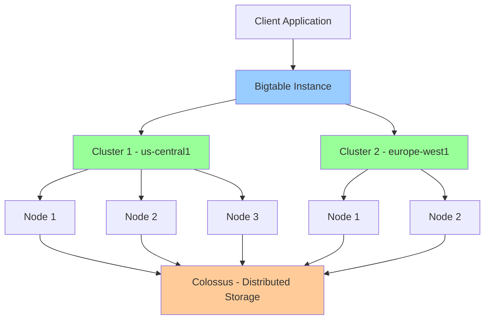

# Bigtable

## Вступ

**Cloud Bigtable** — це NoSQL wide-column база даних для petabyte-scale workloads з мілісекундною latency. Bigtable — це managed service на основі технології, яка використовується в Google Search, Maps, Gmail.

### Що таке Bigtable?

Bigtable — це highly scalable NoSQL database для великих обсягів даних:

- **Wide-column store:** Sparse, distributed, persistent multi-dimensional sorted map
- **Petabyte-scale:** Horizontal scaling до petabytes
- **Low latency:** Мілісекундна latency для reads/writes
- **High throughput:** Millions of operations per second

### Навіщо використовувати Bigtable?

1. **Time-Series Data:**
   - IoT sensor data
   - Financial market data
   - Application metrics
   - Log data

2. **Analytical Workloads:**
   - Large-scale analytics
   - Machine learning features
   - Graph data

3. **High Throughput:**
   - Millions of QPS
   - Consistent low latency
   - Real-time applications

4. **Operational Workloads:**
   - User profiles
   - Product catalogs
   - Gaming data

### Зв'язок з іншими модулями

- **[Module 03 - Compute Engine](../03-compute-engine/README.md):** VM instances з Bigtable clients
- **[Module 04 - Kubernetes Engine](../04-kubernetes-engine/README.md):** GKE workloads з Bigtable
- **[Module 09 - Networking](../09-networking/README.md):** VPC peering, Private Google Access
- **[Module 10 - IAM & Security](../10-iam-security/README.md):** Access control, encryption
- **[Module 11 - Monitoring](../11-monitoring-logging/README.md):** Metrics, monitoring

---

## Архітектура Bigtable

### High-Level Architecture



### Ключові компоненти

1. **Instance:**
   - Контейнер для clusters
   - Визначає replication configuration
   - Може містити кілька clusters

2. **Cluster:**
   - Група nodes у певному region/zone
   - Визначає compute capacity
   - Автоматичне rebalancing

3. **Nodes:**
   - Compute resources
   - Обробляють read/write requests
   - Кожен node: ~10,000 QPS, 10 TB storage

4. **Colossus (Storage):**
   - Distributed file system Google
   - Automatic replication
   - Durable storage

5. **Tablets:**
   - Shards of table data
   - Розподілені між nodes
   - Automatic splitting/merging

---

## Data Model

### Wide-Column Store

Bigtable — це sparse, distributed, persistent multi-dimensional sorted map:

```
(row_key, column_family, column_qualifier, timestamp) → value
```

**Структура:**

```
Row Key | Column Family: cf1           | Column Family: cf2
        | col1    | col2    | col3     | col1    | col2
--------|---------|---------|----------|---------|--------
row1    | value1  | value2  | value3   | value4  | value5
row2    | value6  |         | value7   |         | value8
row3    |         | value9  |          | value10 |
```

### Row Keys

**Row key** — це унікальний identifier для row:

- **Sorted lexicographically:** Rows зберігаються в sorted order
- **Max size:** 4 KB
- **Design critical:** Визначає performance

**Приклад row keys:**

```
user#123#2024-02-10
sensor#device001#1707566400
metric#cpu#server1#20240210
```

### Column Families

**Column family** — це група related columns:

- **Defined at table creation:** Не можна додавати динамічно
- **Storage unit:** Columns у одній family зберігаються разом
- **Max 100 families:** Рекомендовано < 10

**Створення table з column families:**

```bash
cbt createtable my-table \
  "families=cf1:maxversions=3,cf2:maxversions=1"
```

### Column Qualifiers

**Column qualifier** — це ім'я column у family:

- **Dynamic:** Можна додавати без schema changes
- **Part of data:** Можуть бути мільйони qualifiers
- **Sparse:** Не всі rows мають всі columns

### Timestamps

**Timestamp** — це version identifier:

- **Microseconds:** Unix timestamp у мікросекундах
- **Multiple versions:** Можна зберігати кілька versions
- **Automatic:** Server-side або client-side timestamps

**Garbage collection:**

```bash
# Зберігати тільки останні 3 versions
cbt setgcpolicy my-table cf1 maxversions=3

# Зберігати versions за останні 7 днів
cbt setgcpolicy my-table cf1 maxage=7d
```

---

## Schema Design

### Row Key Design

**Row key design** — найважливіший аспект для performance.

#### Best Practices

✅ **DO:**

1. **Distribute writes evenly:**
   - Використовуйте hash prefix
   - Reverse domain names
   - Salting

2. **Group related data:**
   - Rows з similar keys зберігаються разом
   - Ефективні range scans

3. **Keep keys short:**
   - Менше storage overhead
   - Швидші operations

❌ **DON'T:**

1. **Monotonically increasing keys:**
   - Timestamp prefix
   - Sequential IDs
   - Hotspotting на одному node

2. **Domain names as prefix:**
   - `com.example.user1`
   - Hotspotting

**Приклади:**

```
❌ BAD: Sequential timestamps
2024-02-10-00:00:00#user1
2024-02-10-00:00:01#user2
2024-02-10-00:00:02#user3
→ Всі writes йдуть на один node (hotspot)

✅ GOOD: Reverse timestamp
user1#9999999999-1707566400
user2#9999999999-1707566401
user3#9999999999-1707566402
→ Distributed writes

✅ GOOD: Hash prefix
a3f2#user1#2024-02-10
b7e1#user2#2024-02-10
c9d4#user3#2024-02-10
→ Distributed writes
```

### Field Promotion

**Field promotion** — використання column qualifiers як data:

```
❌ BAD: Fixed columns
Row: user1
  cf:name = "John"
  cf:email = "john@example.com"
  cf:tag1 = "developer"
  cf:tag2 = "blogger"

✅ GOOD: Field promotion
Row: user1
  cf:name = "John"
  cf:email = "john@example.com"
  tags:developer = ""
  tags:blogger = ""
→ Flexible, sparse, efficient
```

### Tall and Narrow vs Short and Wide

**Tall and Narrow:**

- Багато rows, мало columns
- Краще для scans
- Ефективніше для time-series

**Short and Wide:**

- Мало rows, багато columns
- Краще для point reads
- Може бути inefficient

**Приклад (Time-series):**

```
✅ GOOD: Tall and Narrow
sensor1#2024-02-10-00:00:00 | temp=20.5
sensor1#2024-02-10-00:01:00 | temp=20.6
sensor1#2024-02-10-00:02:00 | temp=20.7

❌ BAD: Short and Wide
sensor1 | 2024-02-10-00:00:00=20.5 | 2024-02-10-00:01:00=20.6 | ...
→ Row може стати занадто великим
```

---

## Replication

### Single-Cluster Replication

**Default:**

- Дані реплікуються в межах cluster
- Automatic failover між nodes
- 99.5% availability SLA

### Multi-Cluster Replication

**Replication across clusters:**

- Eventual consistency
- Automatic failover між clusters
- 99.99% availability SLA

**Створення replicated instance:**

```bash
# Створення instance з 2 clusters
gcloud bigtable instances create my-instance \
  --display-name="My Instance" \
  --cluster=my-cluster-1 \
  --cluster-zone=us-central1-a \
  --cluster-num-nodes=3 \
  --cluster=my-cluster-2 \
  --cluster-zone=europe-west1-b \
  --cluster-num-nodes=3
```

**Replication modes:**

1. **Automatic:** Default, eventual consistency
2. **Application-controlled:** App вибирає cluster для reads

---

## Performance Optimization

### Scaling

**Horizontal scaling:**

```bash
# Збільшення кількості nodes
gcloud bigtable clusters update my-cluster \
  --instance=my-instance \
  --num-nodes=10
```

**Autoscaling:**

```bash
# Увімкнення autoscaling
gcloud bigtable clusters update my-cluster \
  --instance=my-instance \
  --autoscaling-min-nodes=3 \
  --autoscaling-max-nodes=10 \
  --autoscaling-cpu-target=70
```

### Performance Guidelines

**Throughput per node:**

- Reads: ~10,000 rows/second
- Writes: ~10,000 rows/second
- Scans: ~200 MB/second

**Latency:**

- Single row read: < 10ms (p99)
- Single row write: < 10ms (p99)

**Best Practices:**

✅ **DO:**

- Pre-split tables для нових workloads
- Використовуйте batch operations
- Моніторьте CPU utilization (target < 70%)
- Використовуйте connection pooling

❌ **DON'T:**

- Не робіть single-row operations у loops
- Не створюйте hotspots
- Не використовуйте занадто багато column families

---

## Operations

### Creating Tables

```bash
# Створення instance
gcloud bigtable instances create my-instance \
  --display-name="My Instance" \
  --cluster=my-cluster \
  --cluster-zone=us-central1-a \
  --cluster-num-nodes=3

# Створення table
cbt -instance=my-instance createtable my-table

# Створення column families
cbt -instance=my-instance createfamily my-table cf1
cbt -instance=my-instance createfamily my-table cf2

# Set GC policy
cbt -instance=my-instance setgcpolicy my-table cf1 maxversions=3
```

### Reading and Writing Data

**Write data:**

```bash
# Single write
cbt -instance=my-instance set my-table \
  row1 cf1:col1=value1

# Batch write (using cbt import)
echo "row1,cf1:col1,value1" > data.csv
echo "row2,cf1:col1,value2" >> data.csv
cbt -instance=my-instance import my-table data.csv
```

**Read data:**

```bash
# Read single row
cbt -instance=my-instance read my-table prefix=row1

# Read range
cbt -instance=my-instance read my-table start=row1 end=row5

# Count rows
cbt -instance=my-instance count my-table
```

### Using Client Libraries

**Python example:**

```python
from google.cloud import bigtable
from google.cloud.bigtable import column_family

# Initialize client
client = bigtable.Client(project='my-project', admin=True)
instance = client.instance('my-instance')

# Create table
table = instance.table('my-table')
cf1 = table.column_family('cf1', max_versions=3)
table.create(column_families=[cf1])

# Write data
row = table.direct_row('row1')
row.set_cell('cf1', 'col1', 'value1')
row.commit()

# Read data
row = table.read_row('row1')
print(row.cells['cf1']['col1'][0].value)

# Scan rows
rows = table.read_rows(start_key='row1', end_key='row5')
for row_key, row in rows:
    print(row_key, row.cells)
```

---

## Use Cases

### 1. Time-Series Data

**IoT Sensor Data:**

```
Row Key: sensor_id#reverse_timestamp
Column Family: metrics
Columns: temperature, humidity, pressure

Example:
sensor001#9999999999-1707566400 | metrics:temp=20.5 | metrics:humidity=65
sensor001#9999999999-1707566340 | metrics:temp=20.6 | metrics:humidity=66
```

### 2. Financial Data

**Stock Market Data:**

```
Row Key: symbol#reverse_timestamp
Column Family: quotes
Columns: bid, ask, volume

Example:
GOOG#9999999999-1707566400 | quotes:bid=150.25 | quotes:ask=150.30
GOOG#9999999999-1707566340 | quotes:bid=150.20 | quotes:ask=150.25
```

### 3. User Analytics

**User Events:**

```
Row Key: user_id#reverse_timestamp#event_id
Column Family: event
Columns: type, page, duration

Example:
user123#9999999999-1707566400#evt1 | event:type=click | event:page=/home
user123#9999999999-1707566340#evt2 | event:type=view | event:page=/products
```

---

## Практичний сценарій: IoT Sensor Platform

### Вимоги

1. Мільйони IoT sensors
2. Real-time data ingestion
3. Time-series queries
4. Low latency reads
5. Petabyte-scale storage

### Schema Design

```
Table: sensor_data

Row Key: sensor_id#reverse_timestamp
  Format: device001#9999999999-1707566400

Column Families:
  - metrics: Temperature, humidity, pressure
  - metadata: Location, device_type
  - alerts: Alert_type, severity

Example Rows:
device001#9999999999-1707566400
  metrics:temperature = 20.5
  metrics:humidity = 65
  metadata:location = "warehouse-1"
  
device001#9999999999-1707566340
  metrics:temperature = 20.6
  metrics:humidity = 66
  alerts:high_temp = "warning"
```

### Implementation

```bash
# 1. Створення instance з autoscaling
gcloud bigtable instances create iot-platform \
  --display-name="IoT Platform" \
  --cluster=iot-cluster-us \
  --cluster-zone=us-central1-a \
  --cluster-num-nodes=3 \
  --cluster-storage-type=SSD

# 2. Увімкнення autoscaling
gcloud bigtable clusters update iot-cluster-us \
  --instance=iot-platform \
  --autoscaling-min-nodes=3 \
  --autoscaling-max-nodes=30 \
  --autoscaling-cpu-target=70

# 3. Створення table та column families
cbt -instance=iot-platform createtable sensor_data

cbt -instance=iot-platform createfamily sensor_data metrics
cbt -instance=iot-platform createfamily sensor_data metadata
cbt -instance=iot-platform createfamily sensor_data alerts

# 4. Set GC policies (зберігати 30 днів)
cbt -instance=iot-platform setgcpolicy sensor_data metrics maxage=30d
cbt -instance=iot-platform setgcpolicy sensor_data alerts maxage=30d
```

**Application code (Python):**

```python
from google.cloud import bigtable
import time

client = bigtable.Client(project='my-project')
instance = client.instance('iot-platform')
table = instance.table('sensor_data')

# Write sensor data
def write_sensor_data(sensor_id, temperature, humidity):
    # Reverse timestamp для newest-first ordering
    reverse_ts = 9999999999 - int(time.time())
    row_key = f"{sensor_id}#{reverse_ts}"
    
    row = table.direct_row(row_key)
    row.set_cell('metrics', 'temperature', str(temperature))
    row.set_cell('metrics', 'humidity', str(humidity))
    row.set_cell('metadata', 'location', 'warehouse-1')
    
    row.commit()

# Read latest sensor data
def read_latest_data(sensor_id, limit=10):
    start_key = f"{sensor_id}#"
    end_key = f"{sensor_id}#~"  # ~ is after all digits
    
    rows = table.read_rows(start_key=start_key, end_key=end_key, limit=limit)
    
    results = []
    for row_key, row in rows:
        temp = row.cells['metrics']['temperature'][0].value.decode('utf-8')
        humidity = row.cells['metrics']['humidity'][0].value.decode('utf-8')
        results.append({'temperature': temp, 'humidity': humidity})
    
    return results

# Batch write для high throughput
def batch_write_sensor_data(sensor_readings):
    rows = []
    for reading in sensor_readings:
        reverse_ts = 9999999999 - int(time.time())
        row_key = f"{reading['sensor_id']}#{reverse_ts}"
        
        row = table.direct_row(row_key)
        row.set_cell('metrics', 'temperature', str(reading['temp']))
        row.set_cell('metrics', 'humidity', str(reading['humidity']))
        rows.append(row)
    
    # Batch commit
    table.mutate_rows(rows)
```

---

## Bigtable vs Other Databases

| Feature | Bigtable | Cloud Spanner | Firestore |
|---------|----------|---------------|-----------|
| **Type** | Wide-column NoSQL | Relational | Document NoSQL |
| **Scale** | Petabytes | Petabytes | Terabytes |
| **Latency** | Milliseconds | Milliseconds | Milliseconds |
| **Consistency** | Eventual (multi-cluster) | Strong | Strong |
| **Transactions** | Single-row | Multi-row ACID | Multi-document ACID |
| **Query** | Row key, range scans | SQL | Queries, indexes |
| **Use Case** | Time-series, analytics | Global apps | Mobile/web apps |

**Коли використовувати Bigtable:**

- Time-series data (IoT, metrics, logs)
- High throughput workloads (> 10,000 QPS)
- Large datasets (> 1 TB)
- Simple key-value access patterns

**Коли НЕ використовувати Bigtable:**

- Потрібні ACID transactions
- Потрібні complex queries (SQL)
- Small datasets (< 1 TB)
- Ad-hoc analytics

---

## Monitoring and Optimization

### Key Metrics

```bash
# CPU utilization (target < 70%)
gcloud monitoring time-series list \
  --filter='metric.type="bigtable.googleapis.com/cluster/cpu_load"'

# Storage utilization
gcloud monitoring time-series list \
  --filter='metric.type="bigtable.googleapis.com/cluster/storage_utilization"'

# Latency
gcloud monitoring time-series list \
  --filter='metric.type="bigtable.googleapis.com/server/latencies"'
```

### Performance Tuning

**Hotspotting detection:**

- Моніторьте CPU per node
- Перевіряйте row key distribution
- Використовуйте Key Visualizer

**Optimization strategies:**

1. Redesign row keys
2. Add more nodes
3. Use batch operations
4. Optimize column families

---

## Best Practices

### 1. Schema Design

✅ **DO:**

- Design row keys для uniform distribution
- Використовуйте reverse timestamps для time-series
- Тримайте column families < 10
- Використовуйте field promotion

❌ **DON'T:**

- Не використовуйте sequential row keys
- Не створюйте hotspots
- Не використовуйте занадто багато column families
- Не зберігайте large values (> 10 MB)

### 2. Performance

✅ **DO:**

- Використовуйте batch operations
- Pre-split tables
- Моніторьте CPU utilization
- Використовуйте autoscaling

❌ **DON'T:**

- Не робіть single-row operations у loops
- Не over-provision nodes
- Не ігноруйте hotspots

### 3. Cost Optimization

✅ **DO:**

- Використовуйте HDD для cold data
- Налаштуйте GC policies
- Використовуйте autoscaling
- Delete unused tables

❌ **DON'T:**

- Не over-provision nodes
- Не зберігайте старі versions без потреби
- Не використовуйте SSD для всього

---

## Exam Tips

> ⚠️ **Важливо для іспиту:**

1. **Data Model:**
   - Wide-column NoSQL
   - (row_key, column_family, column_qualifier, timestamp) → value
   - Sorted by row key

2. **Row Key Design:**
   - Найважливіший аспект
   - Уникайте monotonically increasing keys
   - Використовуйте hash prefix або reverse timestamps

3. **Scaling:**
   - Horizontal scaling (add nodes)
   - ~10,000 QPS per node
   - Autoscaling available

4. **Replication:**
   - Single-cluster: 99.5% SLA
   - Multi-cluster: 99.99% SLA
   - Eventual consistency

5. **Performance:**
   - Millisecond latency
   - Petabyte-scale
   - High throughput

6. **Use Cases:**
   - Time-series data
   - IoT sensor data
   - Financial data
   - Analytics workloads

7. **vs Other Databases:**
   - Bigtable: Time-series, high throughput
   - Spanner: Relational, ACID
   - Firestore: Mobile/web, real-time

---

**Повернутися до:** [Модуль 08 - Databases](README.md)
