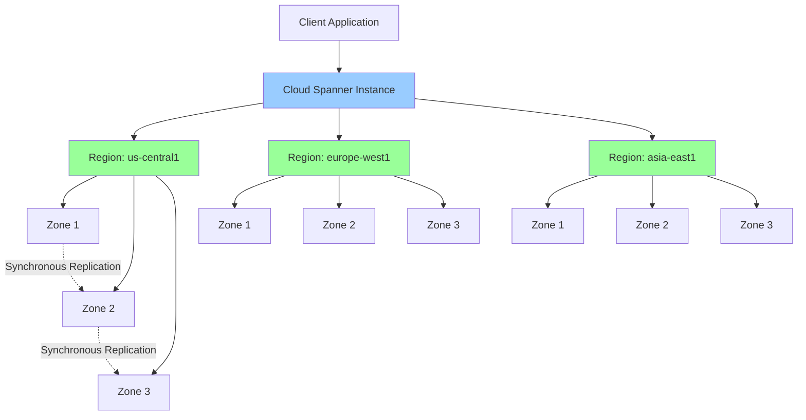
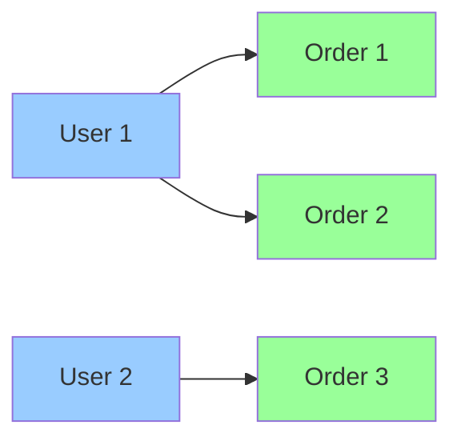
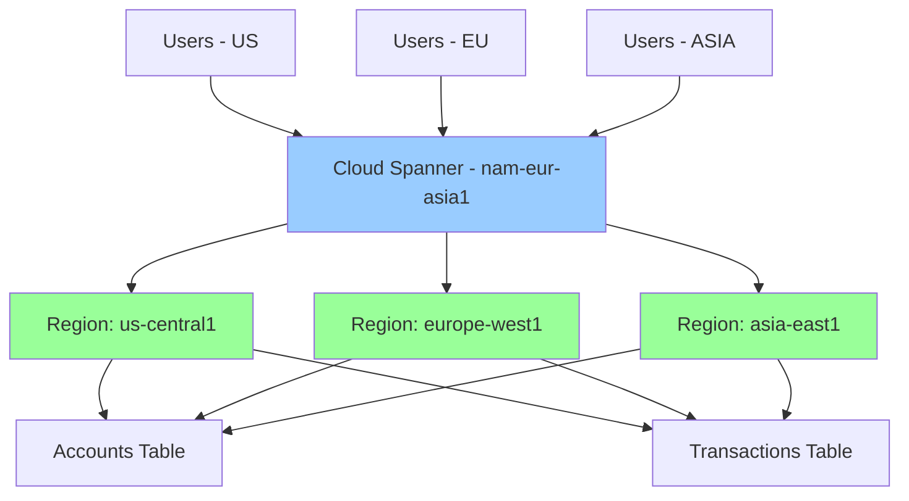

# Cloud Spanner

## Вступ

**Cloud Spanner** — це глобально розподілена, горизонтально масштабована реляційна база даних з сильною консистентністю. Це перша база даних, яка поєднує переваги реляційних баз даних (ACID transactions, SQL) з можливостями NoSQL баз даних (horizontal scaling, global distribution).

### Що таке Cloud Spanner?

Cloud Spanner — це унікальна база даних, яка вирішує традиційний компроміс між consistency та availability:

- **Реляційна модель:** SQL, ACID transactions, schemas
- **Горизонтальне масштабування:** Automatic sharding, petabyte-scale
- **Глобальна доступність:** Multi-region deployment
- **Сильна консистентність:** Linearizability через TrueTime

### Навіщо використовувати Cloud Spanner?

1. **Global Applications:**
   - Користувачі по всьому світу
   - Низька latency для всіх regions
   - Сильна консистентність глобально

2. **Mission-Critical Workloads:**
   - 99.999% availability SLA (multi-region)
   - Automatic failover
   - Zero downtime schema changes

3. **Horizontal Scalability:**
   - Automatic sharding
   - Petabyte-scale storage
   - Millions of QPS

4. **ACID Transactions:**
   - Повна підтримка SQL
   - Multi-row, multi-table transactions
   - Сильна консистентність

### Зв'язок з іншими модулями

- **[Module 03 - Compute Engine](../03-compute-engine/README.md):** Підключення VM instances до Cloud Spanner
- **[Module 04 - Kubernetes Engine](../04-kubernetes-engine/README.md):** GKE workloads з Cloud Spanner
- **[Module 05 - App Engine](../05-app-engine/README.md):** App Engine applications з Cloud Spanner
- **[Module 09 - Networking](../09-networking/README.md):** VPC peering, Private Google Access
- **[Module 10 - IAM & Security](../10-iam-security/README.md):** Database access control, encryption

---

## Архітектура Cloud Spanner

### Глобальна розподілена архітектура



### Ключові компоненти

1. **Instance:**
   - Логічний контейнер для databases
   - Визначає compute capacity (nodes)
   - Визначає replication configuration

2. **Database:**
   - Містить tables, indexes, schemas
   - Множина databases в одному instance

3. **Nodes:**
   - Compute та storage resources
   - Кожен node = 2 TB storage, 10,000 QPS reads
   - Automatic scaling

4. **Splits:**
   - Automatic sharding даних
   - Розподіл даних між nodes
   - Transparent для applications

---

## TrueTime

**TrueTime** — це унікальна технологія Google, яка забезпечує глобальну сильну консистентність.

### Що таке TrueTime?

TrueTime — це highly-available, distributed clock з гарантованою точністю:

- **API:** `TT.now()` повертає інтервал часу `[earliest, latest]`
- **Uncertainty:** Максимальна похибка ~7ms
- **Implementation:** Atomic clocks + GPS clocks

### Як TrueTime працює?

```
TT.now() = [t_earliest, t_latest]

Гарантія: фактичний час завжди в цьому інтервалі
```

**Приклад:**

```
TT.now() = [10:00:00.000, 10:00:00.007]

Фактичний час: між 10:00:00.000 та 10:00:00.007
```

### Використання TrueTime для консистентності

Cloud Spanner використовує TrueTime для забезпечення **external consistency** (linearizability):

1. **Transaction Commit:**
   - Отримати timestamp `t` з TT.now()
   - Почекати до `t_latest` перед commit
   - Гарантія: всі наступні reads побачать цей write

2. **Read Timestamp:**
   - Використовувати TT.now() для snapshot reads
   - Гарантія: читання найсвіжіших даних

> ⚠️ **Важливо для іспиту:** TrueTime забезпечує external consistency - найсильнішу форму консистентності для розподілених систем.

---

## Instance Configurations

Cloud Spanner підтримує різні конфігурації для різних потреб.

### Regional Configuration

**Single-region instance:**

- Дані реплікуються в 3 zones одного region
- 99.99% availability SLA
- Найнижча latency для одного region
- Нижча вартість

**Приклад:**

```bash
# Створення regional instance
gcloud spanner instances create my-instance \
  --config=regional-us-central1 \
  --nodes=1 \
  --description="Regional instance"
```

### Multi-region Configuration

**Multi-region instance:**

- Дані реплікуються в кілька regions
- 99.999% availability SLA
- Глобальна доступність
- Вища вартість

**Типи multi-region configurations:**

1. **nam3 (North America):**
   - us-central1, us-east1, us-west1
   - Оптимізовано для North America

2. **eur3 (Europe):**
   - europe-west1, europe-north1, europe-west4
   - Оптимізовано для Europe

3. **nam-eur-asia1 (Global):**
   - us-central1, europe-west1, asia-east1
   - Глобальна доступність

**Приклад:**

```bash
# Створення multi-region instance
gcloud spanner instances create my-global-instance \
  --config=nam-eur-asia1 \
  --nodes=3 \
  --description="Global instance"
```

### Порівняльна таблиця

| Configuration | Regions | Zones | SLA | Use Case |
|---------------|---------|-------|-----|----------|
| **Regional** | 1 | 3 | 99.99% | Single-region apps |
| **Multi-region** | 3+ | 9+ | 99.999% | Global apps |

---

## Compute Capacity (Nodes)

### Node Capacity

Кожен node надає:

- **Storage:** 2 TB
- **Read throughput:** ~10,000 QPS
- **Write throughput:** ~2,000 QPS

### Scaling

**Manual scaling:**

```bash
# Збільшення кількості nodes
gcloud spanner instances update my-instance \
  --nodes=5
```

**Autoscaling:**

```bash
# Увімкнення autoscaling (через Terraform або Console)
# Min nodes: 1, Max nodes: 10
```

### Processing Units

Альтернатива nodes для більш гнучкого scaling:

- **1 node = 1000 processing units**
- Можна налаштувати в increments of 100 PUs

```bash
# Налаштування processing units
gcloud spanner instances update my-instance \
  --processing-units=500
```

---

## Schema Design

### Таблиці та Primary Keys

**Створення таблиці:**

```sql
CREATE TABLE Users (
  UserId INT64 NOT NULL,
  Email STRING(255),
  Name STRING(100),
  CreatedAt TIMESTAMP NOT NULL OPTIONS (allow_commit_timestamp=true)
) PRIMARY KEY (UserId);
```

**Best Practices для Primary Keys:**

✅ **DO:**

- Використовуйте UUID або hash для рівномірного розподілу
- Уникайте monotonically increasing keys (timestamp, auto-increment)

❌ **DON'T:**

- Не використовуйте timestamp як primary key (hotspotting)

### Interleaved Tables

**Interleaving** — це унікальна feature Cloud Spanner для co-location related data:

```sql
CREATE TABLE Users (
  UserId INT64 NOT NULL,
  Name STRING(100)
) PRIMARY KEY (UserId);

CREATE TABLE Orders (
  UserId INT64 NOT NULL,
  OrderId INT64 NOT NULL,
  Amount FLOAT64
) PRIMARY KEY (UserId, OrderId),
  INTERLEAVE IN PARENT Users ON DELETE CASCADE;
```

**Переваги:**

- Related data зберігається разом
- Швидші joins
- Ефективніші transactions



### Secondary Indexes

```sql
CREATE INDEX UsersByEmail ON Users(Email);
```

**Storing clause для covering indexes:**

```sql
CREATE INDEX UsersByEmail ON Users(Email) STORING (Name);
```

---

## Transactions

### Read-Write Transactions

**ACID transactions з сильною консистентністю:**

```sql
BEGIN TRANSACTION;

UPDATE Accounts SET Balance = Balance - 100 WHERE AccountId = 1;
UPDATE Accounts SET Balance = Balance + 100 WHERE AccountId = 2;

COMMIT TRANSACTION;
```

**Характеристики:**

- Linearizability (external consistency)
- Multi-row, multi-table
- Automatic retry на conflicts

### Read-Only Transactions

**Snapshot reads для consistency:**

```sql
BEGIN TRANSACTION READ ONLY;

SELECT * FROM Users WHERE UserId = 1;
SELECT * FROM Orders WHERE UserId = 1;

COMMIT TRANSACTION;
```

**Переваги:**

- Не блокують writes
- Consistent snapshot
- Можна використовувати stale reads для lower latency

### Stale Reads

**Bounded staleness reads:**

```sql
SELECT * FROM Users WHERE UserId = 1
  WITH STALENESS = EXACT_STALENESS 10s;
```

**Use Cases:**

- Analytics queries
- Non-critical reads
- Lower latency

---

## Consistency Models

Cloud Spanner підтримує кілька consistency models:

### 1. Strong Consistency (Default)

- Linearizability (external consistency)
- Reads завжди бачать найсвіжіші writes
- Використовує TrueTime

### 2. Bounded Staleness

- Reads можуть бути stale до певного часу
- Нижча latency
- Підходить для analytics

### 3. Exact Staleness

- Reads з конкретним timestamp
- Для consistent snapshots

```sql
-- Strong consistency (default)
SELECT * FROM Users WHERE UserId = 1;

-- Bounded staleness (max 10 seconds old)
SELECT * FROM Users WHERE UserId = 1
  WITH STALENESS = MAX_STALENESS 10s;

-- Exact staleness (exactly 15 seconds old)
SELECT * FROM Users WHERE UserId = 1
  WITH STALENESS = EXACT_STALENESS 15s;
```

---

## Backups

### Automated Backups

Cloud Spanner не має automated backups за замовчуванням - потрібно створювати вручну або через schedule.

### On-demand Backups

```bash
# Створення backup
gcloud spanner backups create my-backup \
  --instance=my-instance \
  --database=my-database \
  --retention-period=7d

# Перегляд backups
gcloud spanner backups list --instance=my-instance

# Відновлення з backup
gcloud spanner databases create my-restored-db \
  --instance=my-instance \
  --backup=my-backup
```

### Export/Import

**Export до Cloud Storage:**

```bash
# Export через Dataflow
gcloud dataflow jobs run spanner-export \
  --gcs-location=gs://dataflow-templates/latest/Cloud_Spanner_to_GCS_Avro \
  --region=us-central1 \
  --parameters \
instanceId=my-instance,\
databaseId=my-database,\
outputDir=gs://my-bucket/export/
```

---

## Performance Optimization

### Query Optimization

**1. Use indexes:**

```sql
-- Without index (slow)
SELECT * FROM Users WHERE Email = 'user@example.com';

-- With index (fast)
CREATE INDEX UsersByEmail ON Users(Email);
SELECT * FROM Users WHERE Email = 'user@example.com';
```

**2. Avoid hotspots:**

❌ **BAD:** Monotonically increasing primary key

```sql
CREATE TABLE Events (
  Timestamp TIMESTAMP NOT NULL,  -- Hotspot!
  EventId INT64
) PRIMARY KEY (Timestamp);
```

✅ **GOOD:** Hash-based primary key

```sql
CREATE TABLE Events (
  EventId STRING(36) NOT NULL,  -- UUID
  Timestamp TIMESTAMP
) PRIMARY KEY (EventId);
```

**3. Use interleaved tables:**

```sql
-- Co-locate related data
CREATE TABLE Orders (
  UserId INT64 NOT NULL,
  OrderId INT64 NOT NULL
) PRIMARY KEY (UserId, OrderId),
  INTERLEAVE IN PARENT Users;
```

### Monitoring

**Key metrics:**

- CPU utilization (target: < 65%)
- Storage utilization (target: < 75% per node)
- Query latency
- Transaction latency

```bash
# Перегляд метрик
gcloud monitoring time-series list \
  --filter='metric.type="spanner.googleapis.com/instance/cpu/utilization"'
```

---

## Best Practices

### 1. Schema Design

✅ **DO:**

- Використовуйте UUID або hash для primary keys
- Використовуйте interleaved tables для related data
- Створюйте covering indexes з STORING clause
- Уникайте hotspots

❌ **DON'T:**

- Не використовуйте monotonically increasing keys
- Не створюйте занадто багато indexes
- Не використовуйте large columns у primary key

### 2. Transactions

✅ **DO:**

- Тримайте transactions короткими
- Використовуйте read-only transactions для reads
- Використовуйте stale reads для analytics
- Batch writes де можливо

❌ **DON'T:**

- Не тримайте transactions відкритими довго
- Не робіть багато sequential reads у transaction

### 3. Scaling

✅ **DO:**

- Моніторьте CPU utilization
- Scale before hitting 65% CPU
- Використовуйте autoscaling
- Plan for traffic spikes

❌ **DON'T:**

- Не чекайте до 100% CPU
- Не забувайте про storage limits (2 TB/node)

### 4. Cost Optimization

✅ **DO:**

- Використовуйте regional instances де можливо
- Використовуйте processing units для fine-grained scaling
- Видаляйте старі backups
- Використовуйте stale reads для non-critical queries

❌ **DON'T:**

- Не over-provision nodes
- Не використовуйте multi-region без потреби

---

## Практичний сценарій: Global Financial Application

### Вимоги

1. Глобальні користувачі (US, EU, ASIA)
2. Сильна консистентність для transactions
3. 99.999% availability
4. ACID transactions для transfers
5. Low latency globally

### Архітектура



### Імплементація

```bash
# 1. Створення global instance
gcloud spanner instances create financial-db \
  --config=nam-eur-asia1 \
  --nodes=3 \
  --description="Global financial database"

# 2. Створення database
gcloud spanner databases create accounts \
  --instance=financial-db

# 3. Створення schema
gcloud spanner databases ddl update accounts \
  --instance=financial-db \
  --ddl='CREATE TABLE Accounts (
    AccountId STRING(36) NOT NULL,
    UserId STRING(36) NOT NULL,
    Balance FLOAT64 NOT NULL,
    Currency STRING(3) NOT NULL,
    CreatedAt TIMESTAMP NOT NULL OPTIONS (allow_commit_timestamp=true)
  ) PRIMARY KEY (AccountId);

  CREATE TABLE Transactions (
    TransactionId STRING(36) NOT NULL,
    FromAccountId STRING(36) NOT NULL,
    ToAccountId STRING(36) NOT NULL,
    Amount FLOAT64 NOT NULL,
    Status STRING(20) NOT NULL,
    CreatedAt TIMESTAMP NOT NULL OPTIONS (allow_commit_timestamp=true)
  ) PRIMARY KEY (TransactionId);

  CREATE INDEX TransactionsByAccount ON Transactions(FromAccountId);'
```

**Application code (Python):**

```python
from google.cloud import spanner

# Initialize client
spanner_client = spanner.Client()
instance = spanner_client.instance('financial-db')
database = instance.database('accounts')

# Transfer money (ACID transaction)
def transfer_money(from_account, to_account, amount):
    def transfer(transaction):
        # Read current balances
        row1 = transaction.read('Accounts', ['Balance'], 
                                 keys=[[from_account]])
        row2 = transaction.read('Accounts', ['Balance'], 
                                 keys=[[to_account]])
        
        balance1 = list(row1)[0][0]
        balance2 = list(row2)[0][0]
        
        # Check sufficient funds
        if balance1 < amount:
            raise Exception('Insufficient funds')
        
        # Update balances
        transaction.update('Accounts', 
                          columns=['AccountId', 'Balance'],
                          values=[
                              [from_account, balance1 - amount],
                              [to_account, balance2 + amount]
                          ])
        
        # Record transaction
        transaction.insert('Transactions',
                          columns=['TransactionId', 'FromAccountId', 
                                  'ToAccountId', 'Amount', 'Status'],
                          values=[[generate_uuid(), from_account, 
                                  to_account, amount, 'COMPLETED']])
    
    database.run_in_transaction(transfer)
```

---

## Cloud Spanner vs Cloud SQL

| Feature | Cloud Spanner | Cloud SQL |
|---------|---------------|-----------|
| **Scale** | Horizontal (petabytes) | Vertical (64 TB) |
| **Availability** | 99.999% (multi-region) | 99.95% (regional HA) |
| **Consistency** | Strong (global) | Strong (regional) |
| **Latency** | Low (global) | Lowest (single region) |
| **Cost** | Вища | Нижча |
| **Use Case** | Global apps | Regional apps |

**Коли використовувати Cloud Spanner:**

- Глобальні applications
- Потрібна сильна консистентність
- Horizontal scaling
- 99.999% availability

**Коли використовувати Cloud SQL:**

- Regional applications
- Нижча вартість
- Традиційні MySQL/PostgreSQL workloads
- Vertical scaling достатньо

---

## Exam Tips

> ⚠️ **Важливо для іспиту:**

1. **TrueTime:**
   - Унікальна технологія Google
   - Забезпечує external consistency (linearizability)
   - Використовує atomic clocks + GPS

2. **Availability:**
   - Regional: 99.99% SLA
   - Multi-region: 99.999% SLA

3. **Scaling:**
   - Horizontal scaling (automatic sharding)
   - 1 node = 2 TB storage, ~10,000 QPS reads
   - Processing units для fine-grained scaling

4. **Schema Design:**
   - Уникайте monotonically increasing primary keys
   - Використовуйте interleaved tables для related data
   - UUID або hash для primary keys

5. **Consistency:**
   - Strong consistency (default)
   - Bounded staleness для lower latency
   - Exact staleness для snapshots

6. **Use Cases:**
   - Global applications
   - Financial systems
   - Mission-critical workloads
   - Потрібна сильна консистентність

7. **vs Cloud SQL:**
   - Spanner = horizontal scaling, global
   - Cloud SQL = vertical scaling, regional

---

**Повернутися до:** [Модуль 08 - Databases](README.md)
