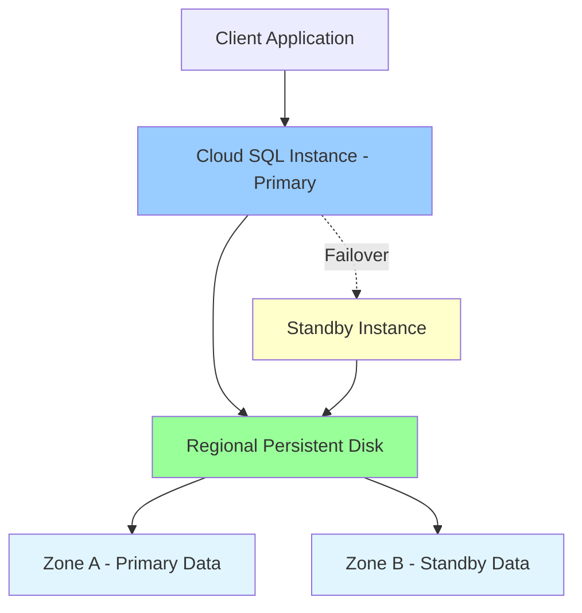
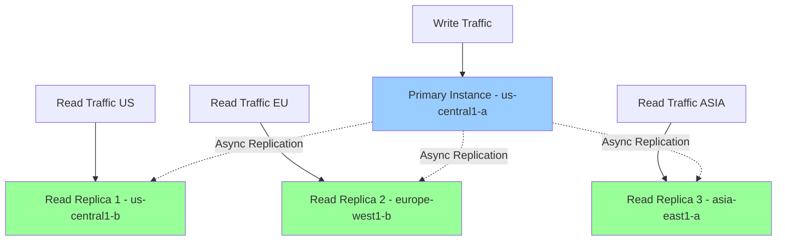
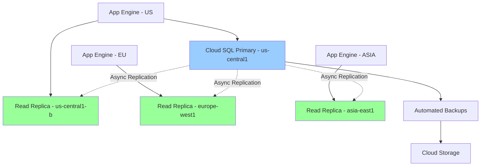

# Cloud SQL

## Вступ

**Cloud SQL** — це повністю керований реляційний database сервіс для MySQL, PostgreSQL та SQL Server. Google автоматично керує replication, backup, patching та high availability.

### Що таке Cloud SQL?

Cloud SQL надає традиційні реляційні бази даних як managed service:

- **Автоматичне управління:** Google керує infrastructure, patching, backups
- **High Availability:** Automatic failover, 99.95% SLA
- **Scalability:** Vertical scaling (до 96 cores, 624 GB RAM)
- **Security:** Encryption at rest and in transit, IAM integration

### Навіщо використовувати Cloud SQL?

1. **Managed Service:**
   - Немає потреби керувати servers
   - Автоматичні backups та updates
   - Моніторинг та alerting

2. **High Availability:**
   - Automatic failover
   - Regional redundancy
   - 99.95% SLA

3. **Compatibility:**
   - Стандартні MySQL, PostgreSQL, SQL Server
   - Легка міграція з on-premises
   - Підтримка існуючих tools та drivers

4. **Integration:**
   - Інтеграція з Compute Engine, GKE, App Engine
   - Private IP для secure connectivity
   - Cloud SQL Proxy для encrypted connections

### Зв'язок з іншими модулями

- **[Module 03 - Compute Engine](../03-compute-engine/README.md):** Підключення VM instances до Cloud SQL
- **[Module 04 - Kubernetes Engine](../04-kubernetes-engine/README.md):** GKE workloads з Cloud SQL
- **[Module 05 - App Engine](../05-app-engine/README.md):** App Engine applications з Cloud SQL
- **[Module 07 - Storage](../07-storage/README.md):** Backup до Cloud Storage
- **[Module 09 - Networking](../09-networking/README.md):** Private IP, VPC peering
- **[Module 10 - IAM & Security](../10-iam-security/README.md):** Database access control

---

## Підтримувані Database Engines

Cloud SQL підтримує три основні реляційні бази даних:

### 1. MySQL

**Версії:** MySQL 5.6, 5.7, 8.0

**Характеристики:**

- Найпопулярніша open-source база даних
- Відмінна для web applications
- Підтримка InnoDB storage engine
- ACID compliance

**Use Cases:**

- WordPress, Drupal, інші CMS
- E-commerce platforms
- Web applications

### 2. PostgreSQL

**Версії:** PostgreSQL 9.6, 10, 11, 12, 13, 14, 15

**Характеристики:**

- Advanced open-source база даних
- Підтримка JSON, JSONB
- Full-text search
- Advanced indexing (GiST, GIN, BRIN)

**Use Cases:**

- Data warehousing
- Geospatial applications (PostGIS)
- Complex queries та analytics

### 3. SQL Server

**Версії:** SQL Server 2017, 2019

**Характеристики:**

- Microsoft enterprise database
- T-SQL support
- Integration Services (SSIS)
- Reporting Services (SSRS)

**Use Cases:**

- Enterprise Windows applications
- .NET applications
- Legacy SQL Server migrations

### Порівняльна таблиця

| Feature | MySQL | PostgreSQL | SQL Server |
|---------|-------|------------|------------|
| **License** | Open Source | Open Source | Proprietary |
| **ACID** | ✅ | ✅ | ✅ |
| **JSON Support** | ✅ | ✅ (JSONB) | ✅ |
| **Full-Text Search** | ✅ | ✅ | ✅ |
| **Geospatial** | Limited | ✅ (PostGIS) | ✅ |
| **Max Storage** | 64 TB | 64 TB | 64 TB |
| **Max RAM** | 624 GB | 624 GB | 624 GB |

---

## Instance Types

Cloud SQL пропонує різні типи instances для різних workloads.

### Machine Types

**Shared-core (db-f1-micro, db-g1-small):**

- 1 shared vCPU
- 0.6-1.7 GB RAM
- Для development та testing
- Низька вартість

**Standard (db-n1-standard-*):**

- 1-96 vCPUs
- 3.75-624 GB RAM
- Для production workloads
- Balanced CPU/memory ratio

**High-memory (db-n1-highmem-*):**

- 2-96 vCPUs
- 13-624 GB RAM
- Для memory-intensive workloads
- Higher memory per vCPU

**Custom:**

- Custom vCPU та RAM configuration
- Flexibility для specific requirements

### Storage Types

**SSD (Solid State Drive):**

- Високий IOPS
- Низька latency
- Рекомендовано для production

**HDD (Hard Disk Drive):**

- Нижчий IOPS
- Вища latency
- Дешевше для large storage needs

### Storage Auto-increase

```bash
# Увімкнення automatic storage increase
gcloud sql instances patch my-instance \
  --storage-auto-increase \
  --storage-auto-increase-limit=500
```

**Переваги:**

- Автоматичне збільшення storage при досягненні threshold
- Запобігає out-of-space errors
- Можна встановити maximum limit

---

## High Availability (HA) Configuration

### Архітектура HA

Cloud SQL HA configuration використовує **regional persistent disks** для synchronous replication:



### Компоненти HA

1. **Primary Instance:**
   - Обробляє всі read/write operations
   - Знаходиться у primary zone

2. **Standby Instance:**
   - Hot standby у іншій zone
   - Автоматично активується при failover
   - Не обробляє queries (тільки standby)

3. **Regional Persistent Disk:**
   - Synchronous replication між zones
   - Автоматичне failover без data loss
   - RPO = 0 (no data loss)

### Створення HA Instance

```bash
# Створення Cloud SQL instance з HA
gcloud sql instances create my-ha-instance \
  --database-version=MYSQL_8_0 \
  --tier=db-n1-standard-2 \
  --region=us-central1 \
  --availability-type=REGIONAL \
  --backup \
  --backup-start-time=03:00

# Перевірка HA status
gcloud sql instances describe my-ha-instance \
  --format="value(settings.availabilityType)"
```

### Failover Process

**Automatic Failover:**

- Відбувається автоматично при виході з ладу primary instance
- RTO (Recovery Time Objective): ~60 seconds
- RPO (Recovery Point Objective): 0 (no data loss)

**Manual Failover (для testing):**

```bash
# Ініціювання manual failover
gcloud sql instances failover my-ha-instance
```

### SLA

- **Regional (HA):** 99.95% uptime SLA
- **Zonal (non-HA):** Немає SLA

> ⚠️ **Важливо для іспиту:** Regional HA configuration забезпечує 99.95% SLA та automatic failover без data loss.

---

## Read Replicas

**Read Replicas** — це read-only копії primary instance для розподілу read traffic.

### Типи Read Replicas

#### 1. Cross-zone Read Replicas

Read replica у іншій zone того самого region:

```bash
# Створення cross-zone read replica
gcloud sql instances create my-replica-1 \
  --master-instance-name=my-primary-instance \
  --tier=db-n1-standard-1 \
  --zone=us-central1-b
```

#### 2. Cross-region Read Replicas

Read replica у іншому region:

```bash
# Створення cross-region read replica
gcloud sql instances create my-replica-eu \
  --master-instance-name=my-primary-instance \
  --tier=db-n1-standard-1 \
  --region=europe-west1
```

**Use Cases:**

- Зменшення latency для users у різних regions
- Disaster recovery
- Data locality для compliance

#### 3. External Read Replicas

Read replica для external MySQL instance (on-premises або інший cloud):

```bash
# Створення external read replica
gcloud sql instances create external-replica \
  --master-instance-name=external-master \
  --tier=db-n1-standard-1
```

### Архітектура з Read Replicas



### Replication Lag

Read replicas використовують **asynchronous replication**, тому може бути replication lag:

```bash
# Перевірка replication lag
gcloud sql instances describe my-replica-1 \
  --format="value(replicaConfiguration.replicaLag)"
```

**Типовий lag:** Кілька секунд (залежить від workload та network)

### Promoting Read Replica

Read replica можна promote до standalone instance:

```bash
# Promote read replica
gcloud sql instances promote-replica my-replica-1
```

**Після promotion:**

- Replica стає independent instance
- Replication зупиняється
- Можна використовувати для disaster recovery

---

## Backup and Recovery

### Automated Backups

Cloud SQL автоматично створює backups:

**Характеристики:**

- Щоденні automated backups
- Binary logs для point-in-time recovery
- Retention period: 1-365 днів (default: 7)
- Backups зберігаються у multi-regional location

**Налаштування automated backups:**

```bash
# Увімкнення automated backups
gcloud sql instances patch my-instance \
  --backup-start-time=03:00 \
  --retained-backups-count=30

# Перегляд backups
gcloud sql backups list --instance=my-instance
```

### On-demand Backups

Створення backup вручну:

```bash
# Створення on-demand backup
gcloud sql backups create \
  --instance=my-instance \
  --description="Before major update"
```

### Point-in-Time Recovery (PITR)

PITR дозволяє відновити database до конкретного моменту часу:

**Вимоги:**

- Automated backups увімкнені
- Binary logging увімкнений

```bash
# Клонування instance з PITR
gcloud sql instances clone my-instance my-instance-clone \
  --point-in-time='2024-02-10T10:30:00.000Z'
```

**Use Cases:**

- Відновлення після accidental data deletion
- Rollback після failed deployment
- Testing з production data

### Export/Import

**Export database до Cloud Storage:**

```bash
# Export database
gcloud sql export sql my-instance gs://my-bucket/backup.sql \
  --database=my-database

# Export у CSV format
gcloud sql export csv my-instance gs://my-bucket/data.csv \
  --database=my-database \
  --query="SELECT * FROM users WHERE created_at > '2024-01-01'"
```

**Import database з Cloud Storage:**

```bash
# Import database
gcloud sql import sql my-instance gs://my-bucket/backup.sql \
  --database=my-database
```

---

## Connectivity Options

### 1. Public IP

Instance доступний через public IP address:

```bash
# Створення instance з public IP
gcloud sql instances create my-public-instance \
  --database-version=MYSQL_8_0 \
  --tier=db-n1-standard-1 \
  --assign-ip
```

**Authorized Networks:**

```bash
# Додавання authorized network
gcloud sql instances patch my-public-instance \
  --authorized-networks=203.0.113.0/24
```

### 2. Private IP

Instance доступний тільки через VPC (рекомендовано для production):

```bash
# Створення instance з private IP
gcloud sql instances create my-private-instance \
  --database-version=MYSQL_8_0 \
  --tier=db-n1-standard-1 \
  --network=projects/my-project/global/networks/default \
  --no-assign-ip
```

**Переваги Private IP:**

- Більш secure (не доступний з Інтернету)
- Нижча latency
- Немає egress charges для traffic у VPC

### 3. Cloud SQL Proxy

Cloud SQL Proxy забезпечує secure connection через IAM authentication:

```bash
# Запуск Cloud SQL Proxy
cloud_sql_proxy -instances=my-project:us-central1:my-instance=tcp:3306
```

**Переваги:**

- Automatic SSL/TLS encryption
- IAM authentication (без паролів)
- Не потрібно whitelist IP addresses

**Підключення через Proxy:**

```python
import mysql.connector

connection = mysql.connector.connect(
    host='127.0.0.1',
    port=3306,
    user='my-user',
    password='my-password',
    database='my-database'
)
```

---

## Migration Strategies

### 1. Database Migration Service (DMS)

**Database Migration Service** — це managed service для міграції до Cloud SQL:

**Підтримувані джерела:**

- MySQL (on-premises, AWS RDS, Azure)
- PostgreSQL (on-premises, AWS RDS, Azure)

**Типи міграції:**

- **One-time migration:** Single migration event
- **Continuous migration:** Ongoing replication

```bash
# Створення migration job
gcloud database-migration migration-jobs create my-migration \
  --source=my-source-connection \
  --destination=my-cloud-sql-instance \
  --type=CONTINUOUS
```

### 2. mysqldump / pg_dump

Traditional dump and restore:

```bash
# Export з on-premises MySQL
mysqldump -h on-prem-host -u user -p my-database > backup.sql

# Upload to Cloud Storage
gsutil cp backup.sql gs://my-bucket/

# Import to Cloud SQL
gcloud sql import sql my-instance gs://my-bucket/backup.sql \
  --database=my-database
```

### 3. External Replica Promotion

Створення external replica та promotion:

1. Налаштувати Cloud SQL instance як replica on-premises master
2. Дочекатися sync
3. Promote Cloud SQL replica до master
4. Переключити applications на Cloud SQL

---

## Security

### 1. Encryption

**At Rest:**

- Automatic encryption з Google-managed keys
- Customer-managed encryption keys (CMEK) available

**In Transit:**

- SSL/TLS connections
- Cloud SQL Proxy з automatic encryption

### 2. IAM Integration

```bash
# Надання Cloud SQL Admin role
gcloud projects add-iam-policy-binding my-project \
  --member=user:alice@example.com \
  --role=roles/cloudsql.admin

# Надання Cloud SQL Client role
gcloud projects add-iam-policy-binding my-project \
  --member=serviceAccount:my-sa@my-project.iam.gserviceaccount.com \
  --role=roles/cloudsql.client
```

### 3. Database Users

```bash
# Створення database user
gcloud sql users create my-user \
  --instance=my-instance \
  --password=my-password

# Створення IAM database user (passwordless)
gcloud sql users create alice@example.com \
  --instance=my-instance \
  --type=CLOUD_IAM_USER
```

---

## Monitoring and Maintenance

### Cloud Monitoring Integration

**Ключові метрики:**

- CPU utilization
- Memory utilization
- Disk utilization
- Connections count
- Replication lag (для replicas)

```bash
# Перегляд метрик
gcloud monitoring time-series list \
  --filter='metric.type="cloudsql.googleapis.com/database/cpu/utilization"'
```

### Maintenance Windows

```bash
# Налаштування maintenance window
gcloud sql instances patch my-instance \
  --maintenance-window-day=SUN \
  --maintenance-window-hour=3
```

**Maintenance operations:**

- OS updates
- Database patches
- Hardware maintenance

---

## Best Practices

### 1. High Availability

✅ **DO:**

- Використовуйте Regional HA для production
- Налаштуйте automated backups
- Тестуйте failover scenarios
- Використовуйте read replicas для disaster recovery

❌ **DON'T:**

- Не використовуйте zonal instances для critical workloads
- Не ігноруйте backup retention policies

### 2. Performance

✅ **DO:**

- Використовуйте read replicas для read-heavy workloads
- Налаштуйте connection pooling
- Моніторьте slow queries
- Використовуйте SSD storage для production

❌ **DON'T:**

- Не використовуйте shared-core instances для production
- Не ігноруйте replication lag

### 3. Security

✅ **DO:**

- Використовуйте Private IP для production
- Увімкніть SSL/TLS connections
- Використовуйте IAM authentication де можливо
- Регулярно ротуйте passwords

❌ **DON'T:**

- Не використовуйте public IP без authorized networks
- Не зберігайте credentials у code

### 4. Cost Optimization

✅ **DO:**

- Використовуйте appropriate machine types
- Налаштуйте storage auto-increase з limits
- Видаляйте старі backups
- Використовуйте committed use discounts

❌ **DON'T:**

- Не over-provision resources
- Не зберігайте непотрібні read replicas

---

## Практичний сценарій: E-commerce Platform

### Вимоги

1. High availability (99.95% SLA)
2. Read-heavy workload (product catalog)
3. Global users (US, EU, ASIA)
4. Point-in-time recovery
5. Secure connectivity

### Архітектура



### Імплементація

```bash
# 1. Створення primary instance з HA
gcloud sql instances create ecommerce-primary \
  --database-version=MYSQL_8_0 \
  --tier=db-n1-standard-4 \
  --region=us-central1 \
  --availability-type=REGIONAL \
  --network=projects/my-project/global/networks/default \
  --no-assign-ip \
  --backup \
  --backup-start-time=03:00 \
  --retained-backups-count=30 \
  --enable-bin-log

# 2. Створення read replicas у різних regions
gcloud sql instances create ecommerce-replica-us \
  --master-instance-name=ecommerce-primary \
  --tier=db-n1-standard-2 \
  --zone=us-central1-b

gcloud sql instances create ecommerce-replica-eu \
  --master-instance-name=ecommerce-primary \
  --tier=db-n1-standard-2 \
  --region=europe-west1

gcloud sql instances create ecommerce-replica-asia \
  --master-instance-name=ecommerce-primary \
  --tier=db-n1-standard-2 \
  --region=asia-east1

# 3. Створення database та user
gcloud sql databases create ecommerce \
  --instance=ecommerce-primary

gcloud sql users create app-user \
  --instance=ecommerce-primary \
  --password=STRONG_PASSWORD

# 4. Налаштування connection pooling у application
# (використовуйте connection pool library для вашої мови)
```

---

## Exam Tips

> ⚠️ **Важливо для іспиту:**

1. **HA Configuration:**
   - Regional HA = 99.95% SLA, automatic failover
   - Zonal = no SLA
   - RPO = 0 (no data loss)

2. **Read Replicas:**
   - Asynchronous replication
   - Можна promote до standalone instance
   - Cross-region replicas для disaster recovery

3. **Backup:**
   - Automated backups щоденно
   - Point-in-time recovery з binary logs
   - Retention: 1-365 днів

4. **Connectivity:**
   - Public IP = доступний з Інтернету
   - Private IP = тільки VPC (рекомендовано)
   - Cloud SQL Proxy = IAM auth, SSL/TLS

5. **Migration:**
   - Database Migration Service для continuous migration
   - mysqldump/pg_dump для one-time migration
   - External replica promotion

6. **Supported Engines:**
   - MySQL 5.6, 5.7, 8.0
   - PostgreSQL 9.6-15
   - SQL Server 2017, 2019

7. **Storage:**
   - SSD = high IOPS (production)
   - HDD = lower cost (large storage)
   - Auto-increase available

---

**Повернутися до:** [Модуль 08 - Databases](README.md)
