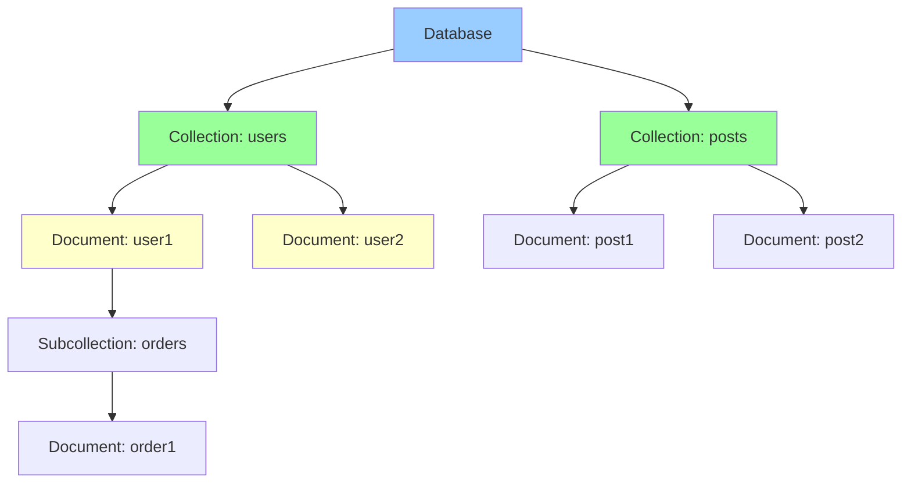

# Firestore

## Вступ

**Cloud Firestore** — це NoSQL документна база даних для mobile, web та server applications. Firestore забезпечує real-time synchronization, offline support та automatic scaling.

### Що таке Firestore?

Firestore — це managed NoSQL database з унікальними features:

- **Document-oriented:** Дані зберігаються як documents у collections
- **Real-time synchronization:** Автоматичне оновлення даних у всіх clients
- **Offline support:** Працює offline з automatic sync
- **Automatic scaling:** Horizontal scaling без manual configuration

### Навіщо використовувати Firestore?

1. **Mobile та Web Applications:**
   - Real-time chat applications
   - Collaborative tools
   - Gaming leaderboards
   - Social media feeds

2. **Real-time Features:**
   - Live updates без polling
   - Automatic synchronization
   - Conflict resolution

3. **Offline Support:**
   - Працює без internet connection
   - Automatic sync при reconnect
   - Local caching

4. **Serverless:**
   - Немає потреби керувати servers
   - Automatic scaling
   - Pay-per-use pricing

### Зв'язок з іншими модулями

- **[Module 03 - Compute Engine](../03-compute-engine/README.md):** Backend servers з Firestore
- **[Module 04 - Kubernetes Engine](../04-kubernetes-engine/README.md):** GKE applications з Firestore
- **[Module 05 - App Engine](../05-app-engine/README.md):** App Engine з Firestore integration
- **[Module 06 - Cloud Functions](../06-cloud-functions/README.md):** Triggers на Firestore events
- **[Module 10 - IAM & Security](../10-iam-security/README.md):** Security rules, authentication

---

## Data Model

### Collections та Documents

Firestore використовує hierarchical data model:



**Collection:**

- Контейнер для documents
- Не може містити інші collections безпосередньо
- Автоматично створюється при додаванні першого document

**Document:**

- Набір key-value pairs (fields)
- Максимальний розмір: 1 MB
- Може містити subcollections
- Унікальний ID у collection

### Document Structure

**Приклад document:**

```json
{
  "userId": "user123",
  "name": "John Doe",
  "email": "john@example.com",
  "age": 30,
  "address": {
    "city": "New York",
    "country": "USA"
  },
  "tags": ["developer", "blogger"],
  "createdAt": "2024-02-10T10:00:00Z"
}
```

**Supported Data Types:**

- String
- Number (integer, float)
- Boolean
- Map (nested object)
- Array
- Null
- Timestamp
- Geopoint
- Reference (до іншого document)

### Subcollections

Documents можуть містити subcollections для hierarchical data:

```
/users/{userId}/orders/{orderId}
/posts/{postId}/comments/{commentId}
```

**Приклад:**

```javascript
// Reference to subcollection
db.collection('users').doc('user123')
  .collection('orders').doc('order456');
```

---

## Modes: Native vs Datastore

Firestore має два modes:

### 1. Native Mode (Firestore)

**Характеристики:**

- Real-time listeners
- Offline support
- Mobile та web SDKs
- Strongly consistent queries
- Automatic indexing

**Use Cases:**

- Mobile applications
- Web applications
- Real-time features

### 2. Datastore Mode

**Характеристики:**

- Server-side applications
- Eventual consistency
- No real-time listeners
- Compatible з legacy Datastore

**Use Cases:**

- Server applications
- Legacy Datastore migrations
- Batch processing

> ⚠️ **Важливо для іспиту:** Native mode рекомендовано для нових applications. Datastore mode для legacy compatibility.

---

## Queries

### Simple Queries

**Read single document:**

```javascript
const docRef = db.collection('users').doc('user123');
const doc = await docRef.get();

if (doc.exists) {
  console.log('Document data:', doc.data());
}
```

**Query collection:**

```javascript
const snapshot = await db.collection('users')
  .where('age', '>', 25)
  .get();

snapshot.forEach(doc => {
  console.log(doc.id, '=>', doc.data());
});
```

### Compound Queries

**Multiple conditions:**

```javascript
const snapshot = await db.collection('users')
  .where('age', '>', 25)
  .where('city', '==', 'New York')
  .get();
```

### Ordering and Limiting

```javascript
const snapshot = await db.collection('posts')
  .orderBy('createdAt', 'desc')
  .limit(10)
  .get();
```

### Pagination

**Using cursors:**

```javascript
// First page
const first = await db.collection('posts')
  .orderBy('createdAt')
  .limit(10)
  .get();

// Get last document
const lastDoc = first.docs[first.docs.length - 1];

// Next page
const next = await db.collection('posts')
  .orderBy('createdAt')
  .startAfter(lastDoc)
  .limit(10)
  .get();
```

### Indexes

**Automatic indexes:**

- Single-field indexes створюються автоматично
- Підтримують equality та range queries

**Composite indexes:**

- Потрібні для compound queries
- Створюються вручну або автоматично при помилці

**Створення composite index:**

```yaml
indexes:
  - collectionGroup: posts
    queryScope: COLLECTION
    fields:
      - fieldPath: category
        order: ASCENDING
      - fieldPath: createdAt
        order: DESCENDING
```

---

## Real-time Listeners

### Document Listener

**Listen to document changes:**

```javascript
const unsubscribe = db.collection('users').doc('user123')
  .onSnapshot(doc => {
    console.log('Current data:', doc.data());
  });

// Unsubscribe when done
unsubscribe();
```

### Collection Listener

**Listen to collection changes:**

```javascript
const unsubscribe = db.collection('posts')
  .where('published', '==', true)
  .onSnapshot(snapshot => {
    snapshot.docChanges().forEach(change => {
      if (change.type === 'added') {
        console.log('New post:', change.doc.data());
      }
      if (change.type === 'modified') {
        console.log('Modified post:', change.doc.data());
      }
      if (change.type === 'removed') {
        console.log('Removed post:', change.doc.data());
      }
    });
  });
```

**Use Cases:**

- Real-time chat
- Live dashboards
- Collaborative editing
- Gaming leaderboards

---

## Offline Support

### How Offline Works

1. **Local Cache:**
   - Firestore кешує дані локально
   - Queries працюють з cache

2. **Write Operations:**
   - Writes зберігаються локально
   - Автоматично sync при reconnect

3. **Conflict Resolution:**
   - Last-write-wins strategy
   - Automatic merge

**Enable offline persistence:**

```javascript
// Web
firebase.firestore().enablePersistence()
  .catch(err => {
    if (err.code == 'failed-precondition') {
      // Multiple tabs open
    } else if (err.code == 'unimplemented') {
      // Browser doesn't support
    }
  });

// Mobile (enabled by default)
```

---

## Transactions

### ACID Transactions

Firestore підтримує ACID transactions:

```javascript
const transaction = await db.runTransaction(async (t) => {
  const accountRef = db.collection('accounts').doc('account1');
  const doc = await t.get(accountRef);
  
  const newBalance = doc.data().balance - 100;
  
  if (newBalance < 0) {
    throw new Error('Insufficient funds');
  }
  
  t.update(accountRef, { balance: newBalance });
});
```

**Characteristics:**

- Atomic: All or nothing
- Consistent: Data integrity
- Isolated: No interference
- Durable: Persisted

**Limitations:**

- Max 500 documents per transaction
- Max transaction duration: 60 seconds

---

## Batch Writes

**Batch multiple writes:**

```javascript
const batch = db.batch();

// Add documents
const ref1 = db.collection('users').doc('user1');
batch.set(ref1, { name: 'Alice' });

const ref2 = db.collection('users').doc('user2');
batch.update(ref2, { age: 31 });

const ref3 = db.collection('users').doc('user3');
batch.delete(ref3);

// Commit batch
await batch.commit();
```

**Benefits:**

- Atomic operations
- Better performance
- Reduced costs

**Limitations:**

- Max 500 operations per batch

---

## Security Rules

### Firebase Security Rules

Security rules контролюють доступ до даних:

**Basic rules:**

```javascript
rules_version = '2';
service cloud.firestore {
  match /databases/{database}/documents {
    // Allow read/write for authenticated users
    match /users/{userId} {
      allow read, write: if request.auth != null 
                         && request.auth.uid == userId;
    }
    
    // Public read, authenticated write
    match /posts/{postId} {
      allow read: if true;
      allow write: if request.auth != null;
    }
  }
}
```

### Advanced Rules

**Validation:**

```javascript
match /users/{userId} {
  allow create: if request.auth != null
                && request.resource.data.name is string
                && request.resource.data.age is number
                && request.resource.data.age >= 18;
  
  allow update: if request.auth.uid == userId
                && request.resource.data.name == resource.data.name; // Name immutable
}
```

**Functions:**

```javascript
function isOwner(userId) {
  return request.auth.uid == userId;
}

function isAdmin() {
  return get(/databases/$(database)/documents/admins/$(request.auth.uid)).data.role == 'admin';
}

match /posts/{postId} {
  allow read: if true;
  allow write: if isOwner(resource.data.authorId) || isAdmin();
}
```

---

## Best Practices

### 1. Data Modeling

✅ **DO:**

- Denormalize data для швидких reads
- Використовуйте subcollections для hierarchical data
- Обмежуйте розмір documents (< 1 MB)
- Використовуйте references для large relationships

❌ **DON'T:**

- Не створюйте глибокі hierarchies (> 100 levels)
- Не зберігайте arrays з > 1000 elements
- Не використовуйте document ID як data

### 2. Queries

✅ **DO:**

- Створюйте composite indexes для compound queries
- Використовуйте pagination для large results
- Cache query results де можливо
- Використовуйте limit() для обмеження results

❌ **DON'T:**

- Не робіть queries без indexes
- Не fetch всі documents у collection
- Не використовуйте array-contains з великими arrays

### 3. Real-time Listeners

✅ **DO:**

- Unsubscribe listeners коли не потрібні
- Використовуйте specific queries для listeners
- Обмежуйте кількість active listeners

❌ **DON'T:**

- Не створюйте listeners для всієї collection
- Не забувайте unsubscribe
- Не використовуйте listeners для one-time reads

### 4. Security

✅ **DO:**

- Завжди використовуйте security rules
- Validate data у rules
- Використовуйте Firebase Authentication
- Test security rules

❌ **DON'T:**

- Не використовуйте `allow read, write: if true` у production
- Не довіряйте client-side validation
- Не зберігайте sensitive data без encryption

### 5. Cost Optimization

✅ **DO:**

- Використовуйте caching
- Batch reads та writes
- Використовуйте pagination
- Minimize listener scope

❌ **DON'T:**

- Не робіть зайві reads
- Не створюйте багато indexes
- Не використовуйте real-time listeners без потреби

---

## Практичний сценарій: Real-time Chat Application

### Вимоги

1. Real-time messaging
2. Offline support
3. User presence
4. Message history
5. Security (users can only read their chats)

### Data Model

```
/users/{userId}
  - name: string
  - email: string
  - online: boolean
  - lastSeen: timestamp

/chats/{chatId}
  - participants: array
  - lastMessage: string
  - lastMessageTime: timestamp
  
/chats/{chatId}/messages/{messageId}
  - senderId: string
  - text: string
  - timestamp: timestamp
  - read: boolean
```

### Security Rules

```javascript
rules_version = '2';
service cloud.firestore {
  match /databases/{database}/documents {
    // Users can read/write their own profile
    match /users/{userId} {
      allow read: if request.auth != null;
      allow write: if request.auth.uid == userId;
    }
    
    // Users can only access chats they're part of
    match /chats/{chatId} {
      allow read: if request.auth.uid in resource.data.participants;
      allow create: if request.auth.uid in request.resource.data.participants;
      
      // Messages subcollection
      match /messages/{messageId} {
        allow read: if request.auth.uid in get(/databases/$(database)/documents/chats/$(chatId)).data.participants;
        allow create: if request.auth.uid in get(/databases/$(database)/documents/chats/$(chatId)).data.participants
                      && request.auth.uid == request.resource.data.senderId;
      }
    }
  }
}
```

### Implementation (JavaScript)

```javascript
// Send message
async function sendMessage(chatId, text) {
  const messageRef = db.collection('chats').doc(chatId)
    .collection('messages').doc();
  
  const batch = db.batch();
  
  // Add message
  batch.set(messageRef, {
    senderId: currentUser.uid,
    text: text,
    timestamp: firebase.firestore.FieldValue.serverTimestamp(),
    read: false
  });
  
  // Update chat last message
  batch.update(db.collection('chats').doc(chatId), {
    lastMessage: text,
    lastMessageTime: firebase.firestore.FieldValue.serverTimestamp()
  });
  
  await batch.commit();
}

// Listen to messages
function listenToMessages(chatId, callback) {
  return db.collection('chats').doc(chatId)
    .collection('messages')
    .orderBy('timestamp', 'asc')
    .onSnapshot(snapshot => {
      const messages = [];
      snapshot.forEach(doc => {
        messages.push({ id: doc.id, ...doc.data() });
      });
      callback(messages);
    });
}

// Update user presence
function updatePresence(online) {
  const userRef = db.collection('users').doc(currentUser.uid);
  
  if (online) {
    userRef.update({
      online: true,
      lastSeen: firebase.firestore.FieldValue.serverTimestamp()
    });
  } else {
    userRef.update({
      online: false,
      lastSeen: firebase.firestore.FieldValue.serverTimestamp()
    });
  }
}

// Listen to user presence
window.addEventListener('beforeunload', () => {
  updatePresence(false);
});
```

---

## Firestore vs Realtime Database

| Feature | Firestore | Realtime Database |
|---------|-----------|-------------------|
| **Data Model** | Collections/Documents | JSON tree |
| **Queries** | Advanced (compound) | Limited |
| **Scaling** | Automatic | Manual sharding |
| **Offline** | Advanced | Basic |
| **Pricing** | Per operation | Per bandwidth |
| **Latency** | Lower | Very low |

**Коли використовувати Firestore:**

- Складні queries
- Structured data
- Automatic scaling
- Mobile/web apps

**Коли використовувати Realtime Database:**

- Simple data
- Very low latency critical
- Presence systems
- Legacy applications

---

## Monitoring and Limits

### Quotas and Limits

**Free tier:**

- 1 GB storage
- 50,000 reads/day
- 20,000 writes/day
- 20,000 deletes/day

**Limits:**

- Max document size: 1 MB
- Max field name: 1,500 bytes
- Max depth: 100 levels
- Max writes/second per document: 1

### Monitoring

```bash
# View metrics
gcloud monitoring time-series list \
  --filter='metric.type="firestore.googleapis.com/document/read_count"'
```

---

## Exam Tips

> ⚠️ **Важливо для іспиту:**

1. **Data Model:**
   - Collections містять documents
   - Documents містять fields та subcollections
   - Max document size: 1 MB

2. **Modes:**
   - Native mode: Real-time, mobile/web
   - Datastore mode: Server-side, legacy

3. **Queries:**
   - Automatic single-field indexes
   - Composite indexes для compound queries
   - Pagination з cursors

4. **Real-time:**
   - onSnapshot() для real-time updates
   - Automatic synchronization
   - Unsubscribe listeners

5. **Offline:**
   - Local cache
   - Automatic sync
   - Conflict resolution (last-write-wins)

6. **Security:**
   - Firebase Security Rules
   - Authentication required
   - Validate data у rules

7. **Transactions:**
   - ACID compliance
   - Max 500 documents
   - Max 60 seconds duration

8. **Use Cases:**
   - Mobile applications
   - Real-time features
   - Offline-first apps
   - Collaborative tools

---

**Повернутися до:** [Модуль 08 - Databases](README.md)
