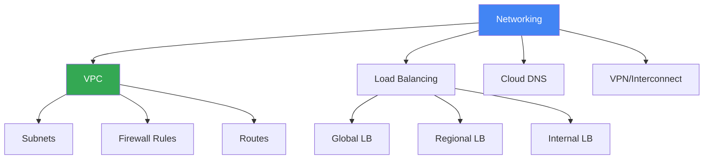

# Networking

## Вступ до модуля

Networking - це основа cloud інфраструктури. Розуміння VPC, subnets, load balancing та інших networking концепцій критично важливе для проектування безпечних та ефективних архітектур.

### Структура модуля

---

## Module Goal

Цей модуль надає розуміння networking в GCP. Ви навчитесь створювати VPC, налаштовувати load balancing, та забезпечувати connectivity.

---

## Topics

### 1. [VPC](vpc.md)

**Virtual Private Cloud:**

- Global resource
- Subnets (regional)
- Firewall rules
- Routes

---

### 2. [Load Balancing](load-balancing.md)

**Types:**

- Global HTTP(S) Load Balancer
- Regional Network Load Balancer
- Internal Load Balancer

---

### 3. [Cloud DNS](cloud-dns.md)

**Managed DNS:**

- Public zones
- Private zones
- DNSSEC

---

### 4. [VPN/Interconnect](vpn-interconnect.md)

**Hybrid Connectivity:**

- Cloud VPN: Encrypted connection
- Cloud Interconnect: Dedicated connection

---

## Key Exam Takeaways

✅ **VPC:** Global network, regional subnets
✅ **Load Balancer:** Global для HTTP(S), Regional для TCP/UDP
✅ **Cloud VPN:** Encrypted hybrid connectivity

---

**Попередній модуль:** [Module 08 - Databases](../08-databases/README.md)

**Наступний модуль:** [Module 10 - IAM & Security](../10-iam-security/README.md)
