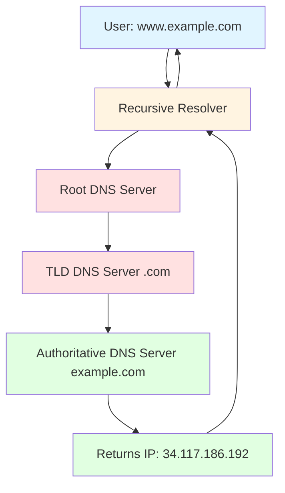
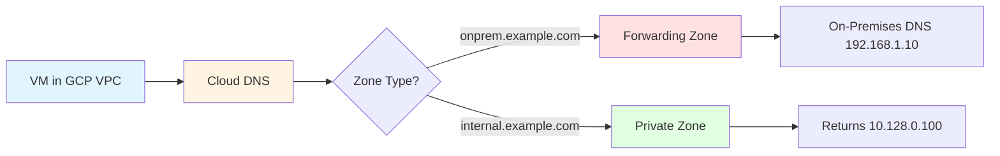
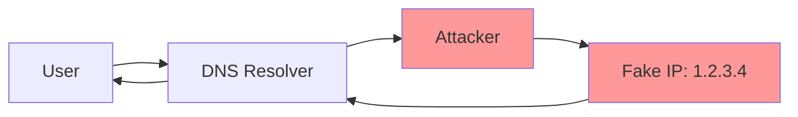
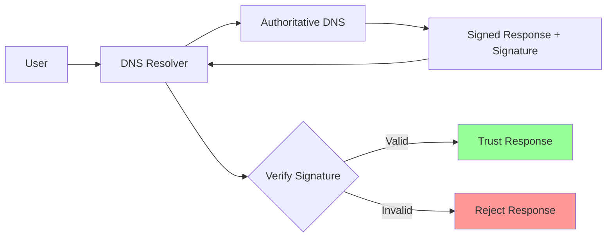
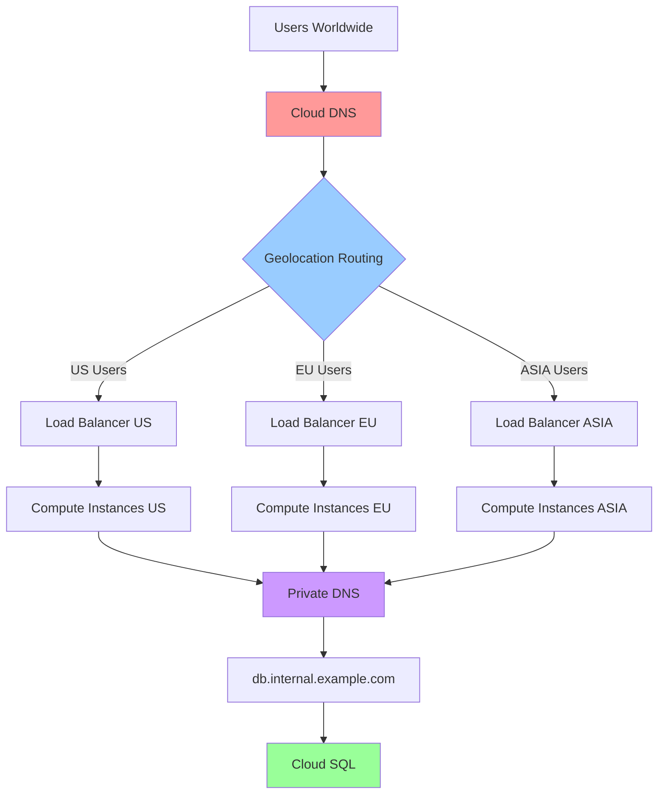

# Cloud DNS

## Вступ

**Cloud DNS** — це високопродуктивний, надійний та масштабований керований DNS (Domain Name System) сервіс від Google Cloud, який працює на тій самій інфраструктурі, що й Google.

### Що таке DNS?

DNS (Domain Name System) — це "телефонна книга Інтернету", яка перетворює зрозумілі людині доменні імена (наприклад, `example.com`) на IP адреси (наприклад, `34.117.186.192`), які використовують комп'ютери для з'єднання.

**Приклад:**

```
Користувач вводить: www.example.com
DNS повертає: 34.117.186.192
Браузер підключається до: 34.117.186.192
```

### Навіщо потрібен Cloud DNS?

1. **Висока доступність (High Availability):**
   - 100% SLA uptime для managed zones
   - Anycast DNS серверів по всьому світу
   - Автоматичне резервування

2. **Продуктивність (Performance):**
   - Низька затримка (low latency) завдяки глобальній мережі Google
   - Швидке поширення змін (propagation)
   - Кешування на edge locations

3. **Масштабованість (Scalability):**
   - Мільйони DNS запитів за секунду
   - Автоматичне масштабування
   - Немає обмежень на кількість зон або записів

4. **Безпека (Security):**
   - DNSSEC для захисту від DNS spoofing
   - Інтеграція з Cloud IAM
   - Private zones для внутрішніх ресурсів

### Зв'язок з іншими модулями

- **[Module 03 - Compute Engine](../03-compute-engine/README.md):** DNS записи для VM instances
- **[Module 04 - Kubernetes Engine](../04-kubernetes-engine/README.md):** DNS для GKE Services
- **[Module 09 - Networking](README.md):** Інтеграція з VPC, Load Balancers
- **[Module 10 - IAM & Security](../10-iam-security/README.md):** Управління доступом до DNS зон
- **[Module 11 - Monitoring](../11-monitoring-logging/README.md):** Моніторинг DNS запитів

---

## DNS Fundamentals

### Як працює DNS?

DNS працює як ієрархічна розподілена база даних:



**Процес DNS resolution:**

1. **User Query:** Користувач вводить `www.example.com`
2. **Recursive Resolver:** DNS resolver (наприклад, 8.8.8.8) отримує запит
3. **Root Server:** Resolver запитує root DNS server: "Де знайти .com?"
4. **TLD Server:** Root відповідає: "Запитай TLD server для .com"
5. **Authoritative Server:** TLD відповідає: "Запитай authoritative server для example.com"
6. **Final Answer:** Authoritative server повертає IP адресу
7. **Response:** Resolver повертає IP користувачу

### DNS Record Types

DNS записи (records) зберігають різні типи інформації про домен:

| Record Type | Призначення | Приклад |
|-------------|-------------|---------|
| **A** | IPv4 адреса | `example.com → 34.117.186.192` |
| **AAAA** | IPv6 адреса | `example.com → 2001:db8::1` |
| **CNAME** | Canonical Name (alias) | `www.example.com → example.com` |
| **MX** | Mail Exchange | `example.com → mail.example.com` |
| **TXT** | Text record (verification) | `example.com → "v=spf1 include:_spf.google.com"` |
| **NS** | Name Server | `example.com → ns-cloud-a1.googledomains.com` |
| **SOA** | Start of Authority | Metadata про зону |
| **PTR** | Pointer (reverse DNS) | `192.186.117.34.in-addr.arpa → example.com` |
| **SRV** | Service record | `_http._tcp.example.com → server.example.com:80` |
| **CAA** | Certificate Authority Authorization | `example.com → 0 issue "letsencrypt.org"` |

### TTL (Time To Live)

TTL визначає, скільки часу DNS запис може бути закешований:

```
example.com.  300  IN  A  34.117.186.192
              ^^^
              TTL (seconds)
```

**Вибір TTL:**

- **Низький TTL (60-300 секунд):**
  - ✅ Швидкі зміни (migration, failover)
  - ❌ Більше DNS запитів = вища вартість

- **Високий TTL (3600-86400 секунд):**
  - ✅ Менше DNS запитів = нижча вартість
  - ❌ Повільні зміни

> ⚠️ **Важливо для іспиту:** Перед плановою зміною DNS (наприклад, migration) зменшіть TTL заздалегідь, щоб зміни поширилися швидше.

---

## Cloud DNS Zone Types

Cloud DNS підтримує кілька типів зон для різних сценаріїв.

### 1. Public Zones

**Public zones** — це DNS зони, доступні з Інтернету. Вони відповідають на запити від будь-якого DNS resolver.

**Характеристики:**

- Доступні з усього Інтернету
- Використовуються для публічних доменів
- Anycast DNS серверів Google
- 100% SLA uptime

**Приклад використання:**

```bash
# Створення public zone
gcloud dns managed-zones create my-public-zone \
  --dns-name=example.com. \
  --description="Public zone for example.com"

# Перегляд name servers
gcloud dns managed-zones describe my-public-zone
```

**Output:**

```
nameServers:
- ns-cloud-a1.googledomains.com.
- ns-cloud-a2.googledomains.com.
- ns-cloud-a3.googledomains.com.
- ns-cloud-a4.googledomains.com.
```

> ⚠️ **Важливо:** Після створення зони потрібно налаштувати NS записи у вашого domain registrar (наприклад, GoDaddy, Namecheap).

### 2. Private Zones

**Private zones** — це DNS зони, доступні тільки всередині VPC networks. Вони не видимі з Інтернету.

**Характеристики:**

- Доступні тільки з VPC networks
- Використовуються для внутрішніх ресурсів
- Інтеграція з VPC DNS
- Немає публічних name servers

**Приклад використання:**

```bash
# Створення private zone
gcloud dns managed-zones create my-private-zone \
  --dns-name=internal.example.com. \
  --description="Private zone for internal resources" \
  --visibility=private \
  --networks=default

# Додавання A record
gcloud dns record-sets create db.internal.example.com. \
  --zone=my-private-zone \
  --type=A \
  --ttl=300 \
  --rrdatas=10.128.0.100
```

**Use Case:**

```
VM в VPC → db.internal.example.com → 10.128.0.100 (Cloud SQL private IP)
```

### 3. Forwarding Zones

**Forwarding zones** — це зони, які перенаправляють DNS запити до інших DNS серверів (наприклад, on-premises DNS).

**Характеристики:**

- Перенаправлення запитів до custom DNS servers
- Використовуються для hybrid cloud
- Інтеграція з on-premises DNS

**Приклад використання:**

```bash
# Створення forwarding zone
gcloud dns managed-zones create my-forwarding-zone \
  --dns-name=onprem.example.com. \
  --description="Forwarding zone to on-premises DNS" \
  --visibility=private \
  --networks=default \
  --forwarding-targets=192.168.1.10,192.168.1.11
```

**Архітектура:**



### 4. Peering Zones

**Peering zones** — це зони, які дозволяють одній VPC використовувати DNS зони з іншої VPC.

**Характеристики:**

- Спільний доступ до DNS зон між VPCs
- Використовуються для multi-project architectures
- Не потребує VPC peering

**Приклад використання:**

```bash
# У Project A (де знаходиться DNS zone)
gcloud dns managed-zones create shared-zone \
  --dns-name=shared.example.com. \
  --visibility=private \
  --networks=vpc-a

# У Project B (створення peering zone)
gcloud dns managed-zones create peering-zone \
  --dns-name=shared.example.com. \
  --visibility=private \
  --networks=vpc-b \
  --target-project=project-a \
  --target-network=vpc-a
```

---

## DNS Record Management

### Створення DNS Records

**A Record (IPv4):**

```bash
# Додавання A record
gcloud dns record-sets create www.example.com. \
  --zone=my-public-zone \
  --type=A \
  --ttl=300 \
  --rrdatas=34.117.186.192
```

**AAAA Record (IPv6):**

```bash
# Додавання AAAA record
gcloud dns record-sets create www.example.com. \
  --zone=my-public-zone \
  --type=AAAA \
  --ttl=300 \
  --rrdatas=2001:db8::1
```

**CNAME Record (Alias):**

```bash
# Додавання CNAME record
gcloud dns record-sets create blog.example.com. \
  --zone=my-public-zone \
  --type=CNAME \
  --ttl=300 \
  --rrdatas=www.example.com.
```

> ⚠️ **Важливо:** CNAME record не може існувати на тому самому рівні, що й інші записи (наприклад, A, MX).

**MX Record (Mail):**

```bash
# Додавання MX record
gcloud dns record-sets create example.com. \
  --zone=my-public-zone \
  --type=MX \
  --ttl=300 \
  --rrdatas="10 mail.example.com.","20 mail2.example.com."
```

**TXT Record (Verification):**

```bash
# Додавання TXT record для domain verification
gcloud dns record-sets create example.com. \
  --zone=my-public-zone \
  --type=TXT \
  --ttl=300 \
  --rrdatas="v=spf1 include:_spf.google.com ~all"
```

### Оновлення DNS Records

```bash
# Оновлення A record
gcloud dns record-sets update www.example.com. \
  --zone=my-public-zone \
  --type=A \
  --ttl=600 \
  --rrdatas=34.117.186.193
```

### Видалення DNS Records

```bash
# Видалення A record
gcloud dns record-sets delete www.example.com. \
  --zone=my-public-zone \
  --type=A
```

### Перегляд DNS Records

```bash
# Перегляд всіх records у зоні
gcloud dns record-sets list --zone=my-public-zone

# Перегляд конкретного record
gcloud dns record-sets describe www.example.com. \
  --zone=my-public-zone \
  --type=A
```

---

## DNSSEC (DNS Security Extensions)

### Що таке DNSSEC?

DNSSEC додає криптографічні підписи до DNS записів, щоб захистити від DNS spoofing та cache poisoning атак.

**Проблема без DNSSEC:**



**Рішення з DNSSEC:**



### Увімкнення DNSSEC

```bash
# Увімкнення DNSSEC для зони
gcloud dns managed-zones update my-public-zone \
  --dnssec-state=on

# Перегляд DNSSEC ключів
gcloud dns dns-keys list --zone=my-public-zone
```

**Output:**

```
ID  TYPE          ALGORITHM  DESCRIPTION
1   keySigning    rsasha256  KSK (Key Signing Key)
2   zoneSigning   rsasha256  ZSK (Zone Signing Key)
```

### DS Record для Registrar

Після увімкнення DNSSEC потрібно додати DS record у domain registrar:

```bash
# Отримання DS record
gcloud dns dns-keys describe 1 \
  --zone=my-public-zone \
  --format="value(ds_record())"
```

**Output:**

```
12345 8 2 A1B2C3D4E5F6...
```

> ⚠️ **Важливо:** Додайте цей DS record у налаштуваннях вашого domain registrar.

---

## Routing Policies

Cloud DNS підтримує різні routing policies для розподілу трафіку.

### 1. Weighted Round Robin (WRR)

Розподіл трафіку на основі ваги (weight):

```bash
# Створення WRR record set
gcloud dns record-sets create www.example.com. \
  --zone=my-public-zone \
  --type=A \
  --ttl=300 \
  --routing-policy-type=WRR \
  --routing-policy-data="34.117.186.192=70;35.201.123.45=30"
```

**Результат:**

- 70% трафіку → 34.117.186.192
- 30% трафіку → 35.201.123.45

**Use Case:** A/B testing, canary deployments

### 2. Geolocation Routing

Розподіл трафіку на основі географічного розташування користувача:

```bash
# Створення geolocation record set
gcloud dns record-sets create www.example.com. \
  --zone=my-public-zone \
  --type=A \
  --ttl=300 \
  --routing-policy-type=GEO \
  --routing-policy-data="us-east1=34.117.186.192;europe-west1=35.201.123.45"
```

**Результат:**

- Користувачі з US → 34.117.186.192
- Користувачі з Europe → 35.201.123.45

**Use Case:** Зменшення latency, compliance (GDPR)

### 3. Failover Routing

Автоматичне перемикання на backup у разі недоступності primary:

```bash
# Створення failover record set
gcloud dns record-sets create www.example.com. \
  --zone=my-public-zone \
  --type=A \
  --ttl=60 \
  --routing-policy-type=FAILOVER \
  --routing-policy-data="primary=34.117.186.192;backup=35.201.123.45" \
  --enable-health-checking
```

**Результат:**

- Primary доступний → 34.117.186.192
- Primary недоступний → 35.201.123.45

**Use Case:** High availability, disaster recovery

---

## Практичний сценарій: Multi-Region Web Application

### Вимоги

1. Глобальна доступність для користувачів
2. Зменшення latency через geolocation routing
3. High availability через failover
4. Внутрішні DNS для databases

### Архітектура



### Імплементація

```bash
# 1. Створення public zone
gcloud dns managed-zones create example-zone \
  --dns-name=example.com. \
  --description="Public zone for example.com"

# 2. Додавання geolocation routing для www
gcloud dns record-sets create www.example.com. \
  --zone=example-zone \
  --type=A \
  --ttl=300 \
  --routing-policy-type=GEO \
  --routing-policy-data="us-central1=34.117.186.192;europe-west1=35.201.123.45;asia-east1=34.80.123.45"

# 3. Створення private zone для internal resources
gcloud dns managed-zones create internal-zone \
  --dns-name=internal.example.com. \
  --description="Private zone for internal resources" \
  --visibility=private \
  --networks=default

# 4. Додавання A record для database
gcloud dns record-sets create db.internal.example.com. \
  --zone=internal-zone \
  --type=A \
  --ttl=300 \
  --rrdatas=10.128.0.100

# 5. Додавання A record для cache
gcloud dns record-sets create cache.internal.example.com. \
  --zone=internal-zone \
  --type=A \
  --ttl=300 \
  --rrdatas=10.128.0.200
```

---

## Integration з Load Balancers

### External HTTP(S) Load Balancer

Cloud DNS автоматично інтегрується з External HTTP(S) Load Balancer:

```bash
# 1. Отримання IP адреси load balancer
gcloud compute forwarding-rules describe http-content-rule \
  --global \
  --format="value(IPAddress)"

# Output: 34.117.186.192

# 2. Додавання A record
gcloud dns record-sets create www.example.com. \
  --zone=my-public-zone \
  --type=A \
  --ttl=300 \
  --rrdatas=34.117.186.192
```

### Internal Load Balancer

Для Internal Load Balancer використовуйте private zone:

```bash
# 1. Отримання internal IP load balancer
gcloud compute forwarding-rules describe internal-http-rule \
  --region=us-central1 \
  --format="value(IPAddress)"

# Output: 10.128.0.100

# 2. Додавання A record у private zone
gcloud dns record-sets create api.internal.example.com. \
  --zone=my-private-zone \
  --type=A \
  --ttl=300 \
  --rrdatas=10.128.0.100
```

---

## Best Practices

### 1. Zone Management

✅ **DO:**

- Використовуйте окремі зони для різних environments (dev, staging, prod)
- Використовуйте private zones для внутрішніх ресурсів
- Налаштуйте DNSSEC для public zones

❌ **DON'T:**

- Не використовуйте public zones для internal resources
- Не забувайте про trailing dot (`.`) у DNS names

### 2. TTL Configuration

✅ **DO:**

- Використовуйте низький TTL (60-300s) перед плановими змінами
- Використовуйте високий TTL (3600-86400s) для стабільних записів
- Зменшіть TTL заздалегідь перед migration

❌ **DON'T:**

- Не використовуйте занадто низький TTL постійно (висока вартість)
- Не змінюйте DNS під час високого навантаження без зниження TTL

### 3. Security

✅ **DO:**

- Увімкніть DNSSEC для захисту від spoofing
- Використовуйте IAM для обмеження доступу до DNS зон
- Регулярно перевіряйте DNS records на несанкціоновані зміни

❌ **DON'T:**

- Не залишайте DNS zones доступними для всіх
- Не використовуйте public zones для sensitive information

### 4. Performance

✅ **DO:**

- Використовуйте geolocation routing для зменшення latency
- Налаштуйте failover для high availability
- Використовуйте CDN разом з DNS для статичного контенту

❌ **DON'T:**

- Не ігноруйте latency metrics
- Не використовуйте single region для global users

### 5. Cost Optimization

✅ **DO:**

- Видаляйте невикористовувані DNS zones
- Використовуйте високий TTL для зменшення кількості запитів
- Консолідуйте DNS zones де можливо

❌ **DON'T:**

- Не створюйте зайві DNS zones
- Не використовуйте занадто низький TTL без потреби

---

## Моніторинг та Troubleshooting

### Ключові метрики

**DNS Metrics:**

- Query count
- Query latency
- Response code distribution (NOERROR, NXDOMAIN, SERVFAIL)
- DNSSEC validation failures

### Перегляд метрик

```bash
# Перегляд DNS query count
gcloud monitoring time-series list \
  --filter='metric.type="dns.googleapis.com/query/rr_count"' \
  --format=json
```

### Типові проблеми

**1. NXDOMAIN (Domain Not Found):**

**Причини:**

- DNS record не існує
- Typo у domain name
- Zone не налаштована правильно

**Рішення:**

```bash
# Перевірка існування record
gcloud dns record-sets list --zone=my-public-zone

# Додавання missing record
gcloud dns record-sets create missing.example.com. \
  --zone=my-public-zone \
  --type=A \
  --ttl=300 \
  --rrdatas=34.117.186.192
```

**2. Slow DNS Resolution:**

**Причини:**

- Високий TTL (старий кеш)
- DNS server перевантажений
- Network latency

**Рішення:**

```bash
# Зменшення TTL
gcloud dns record-sets update www.example.com. \
  --zone=my-public-zone \
  --type=A \
  --ttl=60 \
  --rrdatas=34.117.186.192

# Використання geolocation routing
gcloud dns record-sets update www.example.com. \
  --zone=my-public-zone \
  --type=A \
  --routing-policy-type=GEO \
  --routing-policy-data="us-central1=34.117.186.192;europe-west1=35.201.123.45"
```

**3. DNSSEC Validation Failures:**

**Причини:**

- DS record не налаштований у registrar
- DNSSEC ключі expired
- Clock skew

**Рішення:**

```bash
# Перевірка DNSSEC статусу
gcloud dns managed-zones describe my-public-zone

# Перегенерація DNSSEC ключів
gcloud dns managed-zones update my-public-zone \
  --dnssec-state=off

gcloud dns managed-zones update my-public-zone \
  --dnssec-state=on
```

### DNS Debugging Tools

```bash
# nslookup
nslookup www.example.com 8.8.8.8

# dig
dig www.example.com @8.8.8.8

# dig з DNSSEC перевіркою
dig www.example.com @8.8.8.8 +dnssec

# host
host www.example.com
```

---

## Exam Tips

> ⚠️ **Важливо для іспиту:**

1. **Zone Types:**
   - Public = доступний з Інтернету
   - Private = доступний тільки з VPC
   - Forwarding = перенаправлення до custom DNS
   - Peering = спільний доступ між VPCs

2. **DNS Record Types:**
   - A = IPv4 адреса
   - AAAA = IPv6 адреса
   - CNAME = alias (не може бути з іншими records)
   - MX = mail server
   - TXT = text (verification, SPF)

3. **TTL Strategy:**
   - Зменшіть TTL перед плановими змінами
   - Високий TTL = менше запитів = нижча вартість
   - Низький TTL = швидші зміни = вища вартість

4. **DNSSEC:**
   - Захист від DNS spoofing
   - Потребує DS record у registrar
   - KSK (Key Signing Key) + ZSK (Zone Signing Key)

5. **Routing Policies:**
   - WRR = weighted round robin (A/B testing)
   - GEO = geolocation (зменшення latency)
   - FAILOVER = high availability

6. **Private Zones:**
   - Доступні тільки з VPC networks
   - Використовуються для internal resources
   - Не потребують public name servers

7. **Integration:**
   - Cloud DNS інтегрується з Load Balancers
   - Використовуйте A records для IP адрес
   - Використовуйте CNAME для aliases

---

**Повернутися до:** [Модуль 09 - Networking](README.md)
