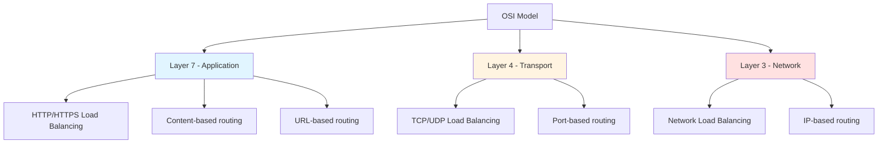
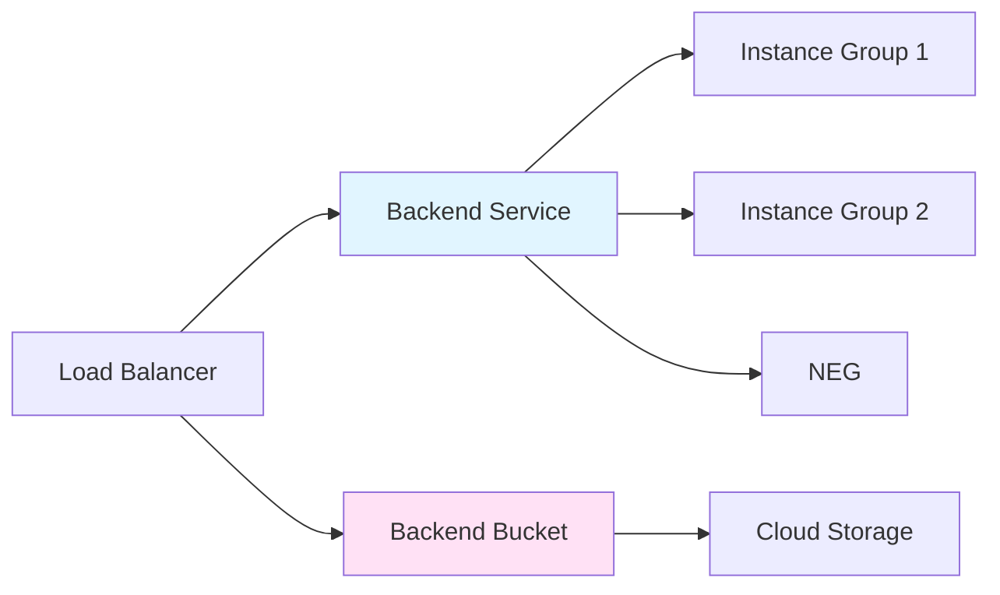
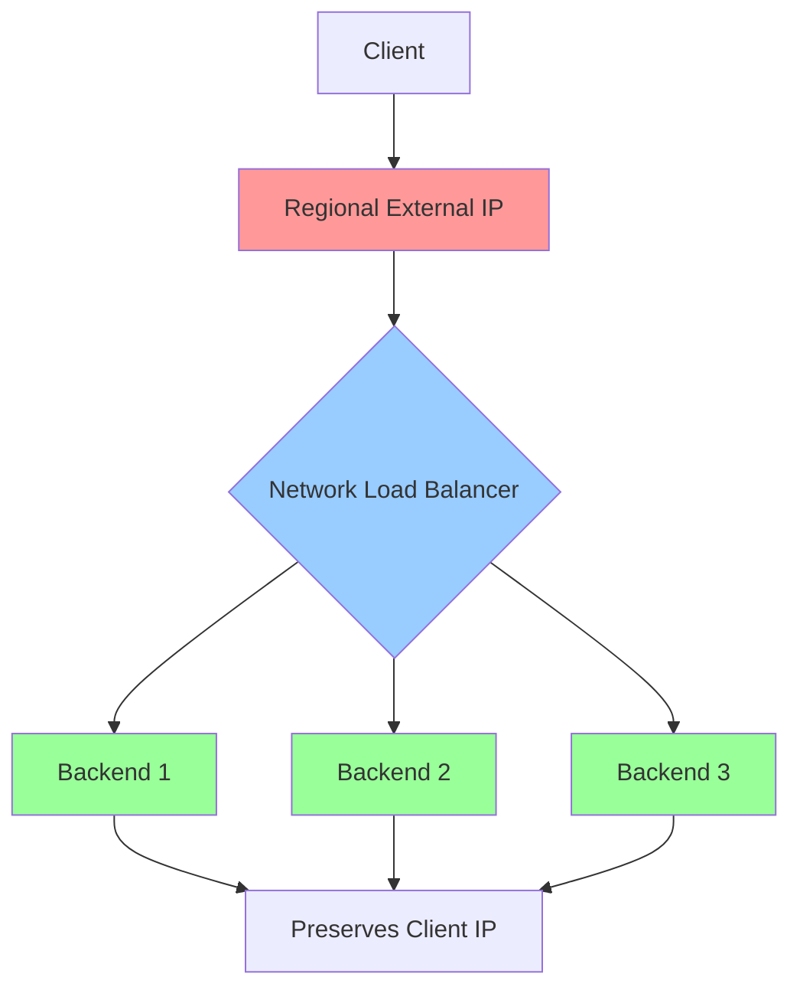
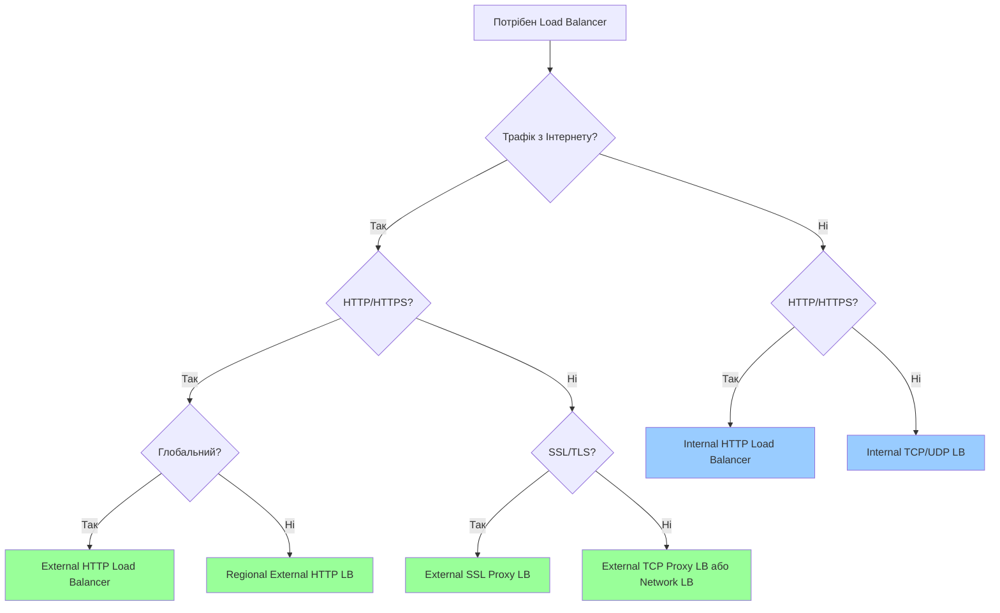
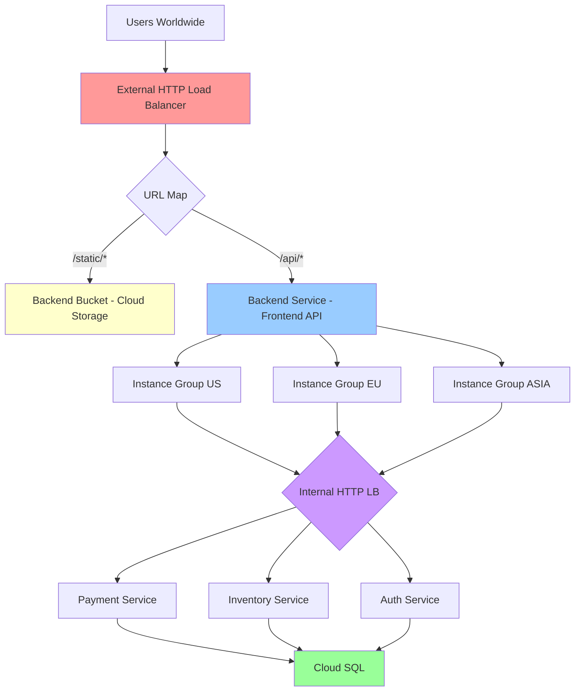

# Load Balancing

## Вступ

**Load Balancing** (балансування навантаження) — це процес розподілу вхідного трафіку між кількома backend-серверами для забезпечення високої доступності, надійності та масштабованості додатків.

### Навіщо потрібен Load Balancer?

1. **Висока доступність (High Availability):**
   - Якщо один сервер виходить з ладу, трафік автоматично перенаправляється на здорові сервери
   - Користувачі не відчувають переривань у роботі

2. **Масштабованість (Scalability):**
   - Можна додавати або видаляти backend-сервери без простою
   - Автоматичне масштабування на основі навантаження

3. **Продуктивність (Performance):**
   - Розподіл навантаження запобігає перевантаженню окремих серверів
   - Зменшення часу відгуку для користувачів

4. **Глобальний розподіл (Global Distribution):**
   - Користувачі направляються до найближчого регіону
   - Зменшення мережевої затримки (latency)

### Зв'язок з іншими модулями

- **[Module 03 - Compute Engine](../03-compute-engine/README.md):** Backend-сервери часто є VM instances
- **[Module 04 - Kubernetes Engine](../04-kubernetes-engine/README.md):** GKE використовує load balancers для Services
- **[Module 05 - App Engine](../05-app-engine/README.md):** App Engine автоматично використовує HTTP(S) LB
- **[Module 10 - IAM & Security](../10-iam-security/README.md):** SSL certificates, Cloud Armor для захисту
- **[Module 11 - Monitoring](../11-monitoring-logging/README.md):** Моніторинг метрик load balancer

---

## Основні концепції

### OSI Model і Load Balancing

Load balancers працюють на різних рівнях OSI моделі:



**Layer 7 (Application Layer):**

- Розуміє HTTP/HTTPS протоколи
- Може маршрутизувати на основі URL, headers, cookies
- Приклад: HTTP(S) Load Balancer

**Layer 4 (Transport Layer):**

- Працює з TCP/UDP пакетами
- Маршрутизація на основі IP адреси та порту
- Приклад: Network Load Balancer, Internal TCP/UDP Load Balancer

**Layer 3 (Network Layer):**

- Працює з IP пакетами
- Найшвидший, але найменш гнучкий
- Приклад: Network Load Balancer (passthrough mode)

### Backend Services vs Backend Buckets

**Backend Service:**

- Група VM instances, instance groups, або NEGs (Network Endpoint Groups)
- Використовується для динамічного контенту
- Підтримує health checks

**Backend Bucket:**

- Cloud Storage bucket
- Використовується для статичного контенту (images, CSS, JS)
- Не потребує VM instances



### Health Checks

Health checks визначають, чи здоровий backend-сервер і чи може він приймати трафік.

**Типи health checks:**

1. **HTTP Health Check:**
   - Відправляє HTTP GET запит
   - Очікує HTTP 200 OK
   - Використовується для HTTP(S) load balancers

2. **HTTPS Health Check:**
   - Те саме, але через HTTPS
   - Перевіряє SSL certificate

3. **TCP Health Check:**
   - Встановлює TCP з'єднання
   - Використовується для TCP load balancers

4. **SSL Health Check:**
   - Встановлює SSL/TLS з'єднання

**Параметри health check:**

```yaml
check-interval: 10s        # Як часто перевіряти
timeout: 5s                # Скільки чекати відповіді
healthy-threshold: 2       # Скільки успішних перевірок для "healthy"
unhealthy-threshold: 3     # Скільки невдалих перевірок для "unhealthy"
```

**Приклад:**

```bash
# Створення HTTP health check
gcloud compute health-checks create http my-http-health-check \
  --port=80 \
  --request-path=/health \
  --check-interval=10s \
  --timeout=5s \
  --healthy-threshold=2 \
  --unhealthy-threshold=3
```

---

## Типи Load Balancers у GCP

GCP пропонує кілька типів load balancers, кожен з яких оптимізований для конкретних сценаріїв.

### Порівняльна таблиця

| Тип | Scope | Layer | Протокол | Use Case |
|-----|-------|-------|----------|----------|
| **External HTTP(S)** | Global | 7 | HTTP/HTTPS | Веб-додатки, глобальні сервіси |
| **External SSL Proxy** | Global | 4 | SSL/TLS | Non-HTTP SSL трафік |
| **External TCP Proxy** | Global | 4 | TCP | Non-HTTP TCP трафік |
| **External Network** | Regional | 4 | TCP/UDP | Високопродуктивний TCP/UDP |
| **Internal HTTP(S)** | Regional | 7 | HTTP/HTTPS | Внутрішні мікросервіси |
| **Internal TCP/UDP** | Regional | 4 | TCP/UDP | Внутрішні бази даних, сервіси |

---

## 1. External HTTP(S) Load Balancer

### Характеристики

- **Scope:** Global (один IP для всього світу)
- **Layer:** 7 (Application)
- **Протокол:** HTTP, HTTPS, HTTP/2
- **Anycast IP:** Користувачі автоматично направляються до найближчого backend
- **SSL Termination:** Load balancer обробляє SSL/TLS

### Архітектура

```mermaid
graph TB
    A[User - Europe] --> B[Global Anycast IP]
    C[User - Asia] --> B
    D[User - US] --> B
    
    B --> E{HTTP(S) Load Balancer}
    
    E --> F[Backend Service - Europe]
    E --> G[Backend Service - Asia]
    E --> H[Backend Service - US]
    
    F --> I[Instance Group EU]
    G --> J[Instance Group ASIA]
    H --> K[Instance Group US]
    
    style B fill:#ff9999
    style E fill:#99ccff
    style F fill:#99ff99
    style G fill:#99ff99
    style H fill:#99ff99
```

### Основні компоненти

1. **Global Forwarding Rule:**
   - Визначає зовнішній IP адресу
   - Направляє трафік до target proxy

2. **Target HTTP(S) Proxy:**
   - Обробляє HTTP/HTTPS запити
   - Використовує URL map для маршрутизації

3. **URL Map:**
   - Визначає правила маршрутизації на основі URL
   - Може направляти різні шляхи до різних backend services

4. **Backend Service:**
   - Група backend instances
   - Налаштування health checks, session affinity, timeout

5. **Backend (Instance Groups або NEGs):**
   - Фактичні сервери, які обробляють запити

### Content-Based Routing

HTTP(S) Load Balancer може маршрутизувати трафік на основі:

**1. Host-based routing:**

```
example.com/api     → Backend Service A
api.example.com     → Backend Service B
```

**2. Path-based routing:**

```
example.com/images  → Backend Bucket (Cloud Storage)
example.com/api     → Backend Service A
example.com/admin   → Backend Service B
```

**3. Header-based routing:**

```
User-Agent: Mobile  → Backend Service Mobile
User-Agent: Desktop → Backend Service Desktop
```

### Практичний приклад: Створення HTTP(S) Load Balancer

```bash
# 1. Створення instance template
gcloud compute instance-templates create web-server-template \
  --machine-type=e2-medium \
  --image-family=debian-11 \
  --image-project=debian-cloud \
  --tags=http-server \
  --metadata=startup-script='#!/bin/bash
    apt-get update
    apt-get install -y nginx
    echo "Hello from $(hostname)" > /var/www/html/index.html
    systemctl start nginx'

# 2. Створення managed instance groups у різних регіонах
gcloud compute instance-groups managed create web-ig-us \
  --base-instance-name=web-us \
  --size=2 \
  --template=web-server-template \
  --zone=us-central1-a

gcloud compute instance-groups managed create web-ig-eu \
  --base-instance-name=web-eu \
  --size=2 \
  --template=web-server-template \
  --zone=europe-west1-b

# 3. Налаштування named ports
gcloud compute instance-groups managed set-named-ports web-ig-us \
  --named-ports=http:80 \
  --zone=us-central1-a

gcloud compute instance-groups managed set-named-ports web-ig-eu \
  --named-ports=http:80 \
  --zone=europe-west1-b

# 4. Створення health check
gcloud compute health-checks create http http-basic-check \
  --port=80 \
  --request-path=/

# 5. Створення backend service
gcloud compute backend-services create web-backend-service \
  --protocol=HTTP \
  --health-checks=http-basic-check \
  --global

# 6. Додавання instance groups до backend service
gcloud compute backend-services add-backend web-backend-service \
  --instance-group=web-ig-us \
  --instance-group-zone=us-central1-a \
  --global

gcloud compute backend-services add-backend web-backend-service \
  --instance-group=web-ig-eu \
  --instance-group-zone=europe-west1-b \
  --global

# 7. Створення URL map
gcloud compute url-maps create web-url-map \
  --default-service=web-backend-service

# 8. Створення target HTTP proxy
gcloud compute target-http-proxies create http-lb-proxy \
  --url-map=web-url-map

# 9. Створення global forwarding rule
gcloud compute forwarding-rules create http-content-rule \
  --global \
  --target-http-proxy=http-lb-proxy \
  --ports=80

# 10. Отримання IP адреси load balancer
gcloud compute forwarding-rules describe http-content-rule --global
```

### SSL/TLS Certificates

Для HTTPS потрібен SSL certificate:

**1. Google-managed certificate (рекомендовано):**

```bash
# Створення managed SSL certificate
gcloud compute ssl-certificates create my-cert \
  --domains=example.com,www.example.com \
  --global

# Створення target HTTPS proxy
gcloud compute target-https-proxies create https-lb-proxy \
  --url-map=web-url-map \
  --ssl-certificates=my-cert
```

**2. Self-managed certificate:**

```bash
# Завантаження власного certificate
gcloud compute ssl-certificates create my-self-cert \
  --certificate=path/to/cert.pem \
  --private-key=path/to/key.pem \
  --global
```

### Cloud CDN Integration

Cloud CDN (Content Delivery Network) кешує контент на edge locations для швидшого доступу.

```bash
# Увімкнення Cloud CDN для backend service
gcloud compute backend-services update web-backend-service \
  --enable-cdn \
  --global
```

**Переваги Cloud CDN:**

- Зменшення latency для користувачів
- Зменшення навантаження на backend
- Кешування статичного контенту (images, CSS, JS)

---

## 2. External Network Load Balancer

### Характеристики

- **Scope:** Regional
- **Layer:** 4 (Transport) або 3 (Network)
- **Протокол:** TCP, UDP
- **Passthrough:** Зберігає оригінальний IP клієнта
- **High Performance:** Мільйони запитів за секунду

### Коли використовувати?

- Високопродуктивні TCP/UDP додатки
- Потрібен оригінальний IP клієнта
- Non-HTTP протоколи (наприклад, SMTP, DNS, gaming)
- Регіональні додатки

### Архітектура



### Практичний приклад

```bash
# 1. Створення instance group (аналогічно до HTTP(S) LB)

# 2. Створення health check
gcloud compute health-checks create tcp tcp-health-check \
  --port=80

# 3. Створення target pool
gcloud compute target-pools create network-lb-pool \
  --region=us-central1 \
  --health-check=tcp-health-check

# 4. Додавання instances до target pool
gcloud compute target-pools add-instances network-lb-pool \
  --instances=instance-1,instance-2 \
  --instances-zone=us-central1-a

# 5. Створення forwarding rule
gcloud compute forwarding-rules create network-lb-rule \
  --region=us-central1 \
  --ports=80 \
  --target-pool=network-lb-pool
```

---

## 3. Internal HTTP(S) Load Balancer

### Характеристики

- **Scope:** Regional
- **Layer:** 7 (Application)
- **Протокол:** HTTP, HTTPS
- **Private:** Доступний тільки всередині VPC
- **Use Case:** Мікросервісна архітектура

### Архітектура мікросервісів

```mermaid
graph TB
    A[External HTTP(S) LB] --> B[Frontend Service]
    
    B --> C{Internal HTTP(S) LB}
    
    C --> D[Auth Service]
    C --> E[Payment Service]
    C --> F[Inventory Service]
    
    D --> G[Internal Database]
    E --> G
    F --> G
    
    style A fill:#ff9999
    style C fill:#99ccff
    style D fill:#99ff99
    style E fill:#99ff99
    style F fill:#99ff99
```

### Практичний приклад

```bash
# 1. Створення subnet для proxy-only (required for Internal HTTP(S) LB)
gcloud compute networks subnets create proxy-only-subnet \
  --purpose=REGIONAL_MANAGED_PROXY \
  --role=ACTIVE \
  --region=us-central1 \
  --network=default \
  --range=10.129.0.0/23

# 2. Створення health check
gcloud compute health-checks create http internal-http-health-check \
  --port=80 \
  --region=us-central1

# 3. Створення backend service
gcloud compute backend-services create internal-backend-service \
  --load-balancing-scheme=INTERNAL_MANAGED \
  --protocol=HTTP \
  --health-checks=internal-http-health-check \
  --health-checks-region=us-central1 \
  --region=us-central1

# 4. Додавання instance group
gcloud compute backend-services add-backend internal-backend-service \
  --instance-group=internal-ig \
  --instance-group-zone=us-central1-a \
  --region=us-central1

# 5. Створення URL map
gcloud compute url-maps create internal-url-map \
  --default-service=internal-backend-service \
  --region=us-central1

# 6. Створення target HTTP proxy
gcloud compute target-http-proxies create internal-http-proxy \
  --url-map=internal-url-map \
  --region=us-central1

# 7. Створення forwarding rule (internal IP)
gcloud compute forwarding-rules create internal-http-rule \
  --load-balancing-scheme=INTERNAL_MANAGED \
  --network=default \
  --subnet=default \
  --address=10.128.0.100 \
  --ports=80 \
  --region=us-central1 \
  --target-http-proxy=internal-http-proxy \
  --target-http-proxy-region=us-central1
```

---

## 4. Internal TCP/UDP Load Balancer

### Характеристики

- **Scope:** Regional
- **Layer:** 4 (Transport)
- **Протокол:** TCP, UDP
- **Private:** Доступний тільки всередині VPC
- **Use Case:** Внутрішні бази даних, legacy додатки

### Практичний приклад: Load Balancing для MySQL

```bash
# 1. Створення health check
gcloud compute health-checks create tcp mysql-health-check \
  --port=3306 \
  --region=us-central1

# 2. Створення backend service
gcloud compute backend-services create mysql-backend-service \
  --load-balancing-scheme=INTERNAL \
  --protocol=TCP \
  --health-checks=mysql-health-check \
  --health-checks-region=us-central1 \
  --region=us-central1

# 3. Додавання instance group
gcloud compute backend-services add-backend mysql-backend-service \
  --instance-group=mysql-ig \
  --instance-group-zone=us-central1-a \
  --region=us-central1

# 4. Створення forwarding rule
gcloud compute forwarding-rules create mysql-lb-rule \
  --load-balancing-scheme=INTERNAL \
  --network=default \
  --subnet=default \
  --address=10.128.0.200 \
  --ports=3306 \
  --region=us-central1 \
  --backend-service=mysql-backend-service
```

---

## Вибір Load Balancer: Decision Tree



### Критерії вибору

| Критерій | HTTP(S) LB | Network LB | Internal HTTP(S) | Internal TCP/UDP |
|----------|------------|------------|------------------|------------------|
| **Global reach** | ✅ | ❌ | ❌ | ❌ |
| **Layer 7 routing** | ✅ | ❌ | ✅ | ❌ |
| **SSL termination** | ✅ | ❌ | ✅ | ❌ |
| **Preserve client IP** | ❌ | ✅ | ❌ | ✅ |
| **Cloud CDN** | ✅ | ❌ | ❌ | ❌ |
| **WebSocket** | ✅ | ✅ | ✅ | ✅ |
| **Private only** | ❌ | ❌ | ✅ | ✅ |

---

## Advanced Features

### Session Affinity

Session affinity (sticky sessions) гарантує, що запити від одного клієнта завжди направляються до того самого backend.

**Типи session affinity:**

1. **Client IP affinity:**
   - На основі IP адреси клієнта
   - Працює для всіх типів load balancers

2. **Generated cookie affinity:**
   - Load balancer створює cookie
   - Тільки для HTTP(S) load balancers

3. **HTTP cookie affinity:**
   - Використовує існуючий cookie додатку
   - Тільки для HTTP(S) load balancers

```bash
# Увімкнення session affinity
gcloud compute backend-services update web-backend-service \
  --session-affinity=CLIENT_IP \
  --global
```

### Connection Draining

Connection draining дозволяє завершити існуючі з'єднання перед видаленням backend instance.

```bash
# Налаштування connection draining timeout
gcloud compute backend-services update web-backend-service \
  --connection-draining-timeout=300 \
  --global
```

**Як це працює:**

1. Instance помічається для видалення
2. Load balancer перестає направляти нові запити
3. Існуючі з'єднання продовжують працювати
4. Після timeout або завершення всіх з'єднань instance видаляється

### Cloud Armor (Security)

Cloud Armor захищає додатки від DDoS атак та інших загроз.

```bash
# Створення security policy
gcloud compute security-policies create my-policy \
  --description="Block malicious traffic"

# Додавання правила для блокування IP
gcloud compute security-policies rules create 1000 \
  --security-policy=my-policy \
  --expression="origin.ip == '203.0.113.0/24'" \
  --action=deny-403

# Застосування policy до backend service
gcloud compute backend-services update web-backend-service \
  --security-policy=my-policy \
  --global
```

**Можливості Cloud Armor:**

- IP allowlist/blocklist
- Geo-based blocking
- Rate limiting
- Pre-configured WAF rules (OWASP Top 10)

### Traffic Splitting

Traffic splitting дозволяє розподіляти трафік між різними версіями додатку (A/B testing, canary deployments).

```bash
# Створення двох backend services
gcloud compute backend-services create app-v1 --global
gcloud compute backend-services create app-v2 --global

# Налаштування URL map з traffic splitting
gcloud compute url-maps create split-traffic-map \
  --default-service=app-v1

# Додавання route rule з traffic split (90% v1, 10% v2)
gcloud compute url-maps add-path-matcher split-traffic-map \
  --path-matcher-name=split \
  --default-service=app-v1 \
  --backend-service-path-rules="/api/*=app-v1:90,app-v2:10"
```

---

## Практичний сценарій: E-commerce Platform

### Вимоги

1. Глобальна доступність для користувачів
2. Статичний контент (images, CSS) з Cloud Storage
3. Динамічний контент з backend API
4. Внутрішні мікросервіси (payment, inventory)
5. SSL/TLS для безпеки

### Архітектура



### Імплементація

```bash
# 1. External HTTP(S) Load Balancer для frontend
# (створення аналогічно до попередніх прикладів)

# 2. Backend Bucket для статичного контенту
gsutil mb gs://my-ecommerce-static
gcloud compute backend-buckets create static-backend \
  --gcs-bucket-name=my-ecommerce-static

# 3. URL Map з path-based routing
gcloud compute url-maps create ecommerce-url-map \
  --default-service=frontend-backend-service

gcloud compute url-maps add-path-matcher ecommerce-url-map \
  --path-matcher-name=ecommerce-paths \
  --default-service=frontend-backend-service \
  --backend-service-path-rules="/static/*=static-backend,/api/*=frontend-backend-service"

# 4. Internal HTTP(S) Load Balancer для мікросервісів
# (створення аналогічно до попереднього прикладу Internal HTTP(S) LB)
```

---

## Best Practices

### 1. Health Checks

✅ **DO:**

- Використовуйте dedicated health check endpoint (наприклад, `/health`)
- Налаштуйте realistic timeouts та intervals
- Перевіряйте критичні залежності (database, cache)

❌ **DON'T:**

- Не використовуйте root path `/` для health checks
- Не робіть health checks занадто складними (slow queries)

### 2. Backend Configuration

✅ **DO:**

- Використовуйте managed instance groups для автоматичного масштабування
- Налаштуйте connection draining перед видаленням instances
- Використовуйте session affinity тільки коли необхідно

❌ **DON'T:**

- Не використовуйте unmanaged instance groups у production
- Не ігноруйте unhealthy instances

### 3. Security

✅ **DO:**

- Використовуйте Google-managed SSL certificates
- Увімкніть Cloud Armor для захисту від DDoS
- Налаштуйте firewall rules для обмеження доступу до backends

❌ **DON'T:**

- Не використовуйте self-signed certificates у production
- Не залишайте backends доступними з Інтернету напряму

### 4. Performance

✅ **DO:**

- Увімкніть Cloud CDN для статичного контенту
- Використовуйте global load balancers для worldwide users
- Налаштуйте autoscaling на основі CPU або custom metrics

❌ **DON'T:**

- Не використовуйте regional load balancers для global traffic
- Не ігноруйте latency metrics

### 5. Cost Optimization

✅ **DO:**

- Використовуйте backend buckets для статичного контенту
- Налаштуйте autoscaling для зменшення кількості instances у non-peak hours
- Використовуйте committed use discounts для predictable workloads

❌ **DON'T:**

- Не переплачуйте за over-provisioned backends
- Не використовуйте global load balancers для regional-only traffic

---

## Моніторинг та Troubleshooting

### Ключові метрики

**Load Balancer Metrics:**

- Request count
- Request latency
- Backend latency
- Error rate (4xx, 5xx)
- Bytes sent/received

**Backend Metrics:**

- Healthy vs unhealthy instances
- CPU utilization
- Memory utilization
- Disk I/O

### Перегляд метрик

```bash
# Перегляд метрик load balancer
gcloud monitoring time-series list \
  --filter='metric.type="loadbalancing.googleapis.com/https/request_count"' \
  --format=json

# Перегляд статусу backend service
gcloud compute backend-services get-health web-backend-service \
  --global
```

### Типові проблеми

**1. 502 Bad Gateway:**

- Backend instances unhealthy
- Firewall rules блокують трафік
- Health check неправильно налаштований

**Рішення:**

```bash
# Перевірка health status
gcloud compute backend-services get-health web-backend-service --global

# Перевірка firewall rules
gcloud compute firewall-rules list --filter="targetTags:http-server"
```

**2. High Latency:**

- Backends перевантажені
- Неоптимальний routing (users directed to far regions)
- Database queries повільні

**Рішення:**

- Увімкніть autoscaling
- Додайте backends у більше регіонів
- Оптимізуйте database queries

**3. SSL Certificate Issues:**

- Certificate expired
- Domain mismatch
- Certificate not provisioned yet (Google-managed)

**Рішення:**

```bash
# Перевірка статусу certificate
gcloud compute ssl-certificates describe my-cert --global

# Оновлення certificate
gcloud compute ssl-certificates create new-cert \
  --certificate=new-cert.pem \
  --private-key=new-key.pem \
  --global
```

---

## Exam Tips

> ⚠️ **Важливо для іспиту:**

1. **Розуміння різниці між Layer 4 та Layer 7:**
   - Layer 7 (HTTP(S)) = content-based routing, SSL termination
   - Layer 4 (TCP/UDP) = faster, preserves client IP

2. **Global vs Regional:**
   - Global = External HTTP(S), SSL Proxy, TCP Proxy
   - Regional = Network LB, Internal HTTP(S), Internal TCP/UDP

3. **External vs Internal:**
   - External = доступний з Інтернету
   - Internal = доступний тільки всередині VPC

4. **Health Checks:**
   - Обов'язкові для всіх load balancers
   - Визначають healthy/unhealthy backends

5. **Cloud CDN:**
   - Працює тільки з External HTTP(S) Load Balancer
   - Кешує статичний контент на edge locations

6. **Session Affinity:**
   - Client IP = працює для всіх LB
   - Cookie-based = тільки для HTTP(S) LB

7. **Cloud Armor:**
   - Захист від DDoS
   - Працює тільки з External HTTP(S) Load Balancer

---

**Повернутися до:** [Модуль 09 - Networking](README.md)
