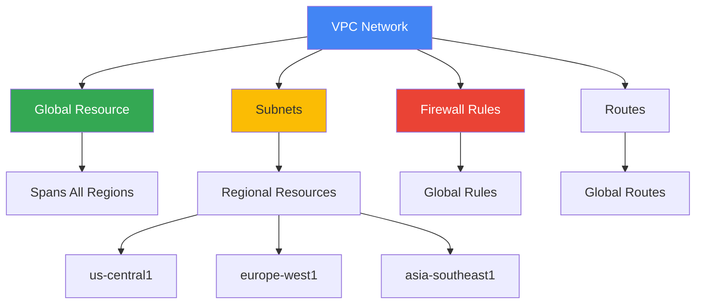
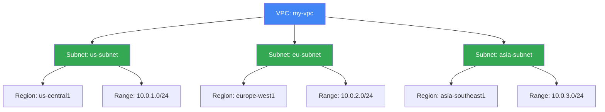
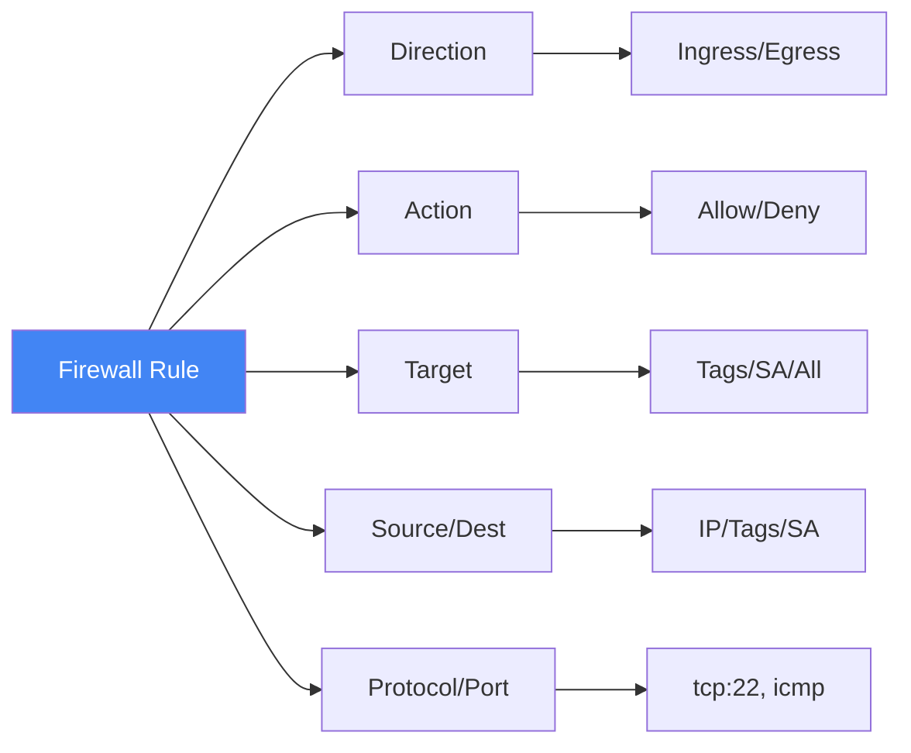
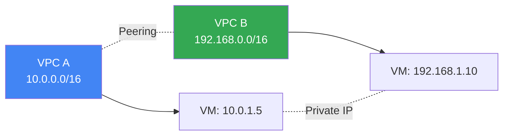
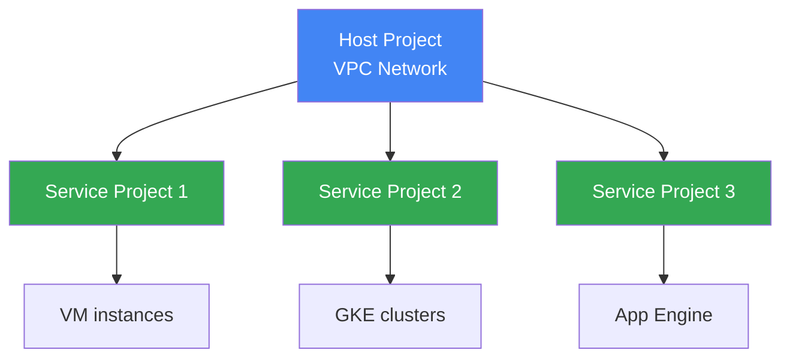
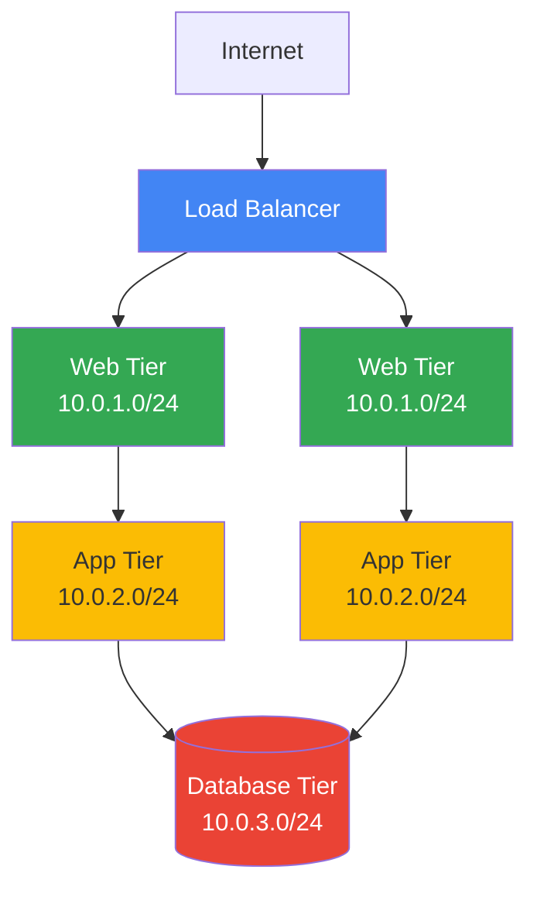

# VPC (Virtual Private Cloud)

## Вступ: Розуміння мережевої архітектури GCP

### Що таке VPC?

**VPC (Virtual Private Cloud)** - це глобальна віртуальна мережа, яка з'єднує ваші GCP ресурси між собою та з інтернетом. Це фундамент мережевої архітектури в Google Cloud.

**Ключове розуміння:** VPC в GCP - це НЕ просто "віртуальна мережа". Це глобальний ресурс, який охоплює всі регіони та зони, на відміну від AWS VPC, який обмежений одним регіоном.



---

### Чому VPC важлива?

**Три ключові функції VPC:**

1. **Ізоляція** - Ваші ресурси відокремлені від інших проектів
2. **Connectivity** - Контроль того, як ресурси спілкуються між собою
3. **Security** - Firewall rules контролюють трафік

**Реальний сценарій:**

```text
Проблема: E-commerce платформа з VM в різних регіонах

❌ Без VPC:
- VM не можуть спілкуватися між собою
- Потрібні публічні IP для всього
- Немає контролю над трафіком

✅ З VPC:
- VM спілкуються через приватні IP
- Firewall rules контролюють доступ
- Низька латентність між регіонами
```

---

### Зв'язки з іншими модулями

**Module 01 (Fundamentals):**

- VPC - це глобальний ресурс (не zonal, не regional)
- Розуміння [regions/zones](../01-cloud-fundamentals/gcp-regions-zones.md) критично важливе

**Module 03 (Compute Engine):**

- Кожна [VM instance](../03-compute-engine/vm-instances.md) підключена до VPC
- Network tags для firewall rules

**Module 04 (GKE):**

- GKE clusters використовують VPC для pod networking
- [GKE networking](../04-kubernetes-engine/README.md) modes

**Module 10 (IAM):**

- VPC Service Controls для security perimeter
- [IAM permissions](../10-iam-security/README.md) для network admin

---

## VPC Fundamentals

### VPC як глобальний ресурс

```text
Традиційна мережа (on-premises):
Region A ──────────────────── Region B
   │                              │
Потрібен VPN або Interconnect

GCP VPC:
Region A ════════════════════ Region B
   │                              │
Одна VPC, автоматичний зв'язок!
```

**Переваги глобальної VPC:**

- ✅ Один IP address space для всіх регіонів
- ✅ Автоматичний routing між регіонами
- ✅ Централізоване управління firewall rules
- ✅ Низька латентність між регіонами (Google's private network)

---

### Типи VPC

#### 1. Auto Mode VPC

**Що це:** VPC з автоматично створеними subnets в кожному регіоні.

```bash
# Створення auto mode VPC
gcloud compute networks create my-auto-vpc \
  --subnet-mode=auto
```

**Характеристики:**

- ✅ Автоматично створює subnet в кожному регіоні
- ✅ Предвизначені IP ranges (10.128.0.0/9)
- ✅ Легко почати
- ❌ Менше контролю над IP ranges
- ❌ Не підходить для production з складною топологією

**Коли використовувати:**

- Тестування та розробка
- Прості проекти
- Швидкий старт

---

#### 2. Custom Mode VPC

**Що це:** VPC де ви повністю контролюєте subnets та IP ranges.

```bash
# Створення custom mode VPC
gcloud compute networks create my-custom-vpc \
  --subnet-mode=custom

# Створення subnet
gcloud compute networks subnets create my-subnet \
  --network=my-custom-vpc \
  --region=us-central1 \
  --range=10.0.1.0/24
```

**Характеристики:**

- ✅ Повний контроль над IP ranges
- ✅ Створюєте тільки потрібні subnets
- ✅ Можна використовувати будь-які RFC 1918 ranges
- ✅ Рекомендується для production

**Коли використовувати:**

- Production environments
- Складна мережева топологія
- Потрібен контроль над IP addressing
- Hybrid cloud (VPN/Interconnect)

---

## Subnets: Регіональні мережі

### Що таке Subnet?

**Subnet** - це регіональний ресурс, який визначає IP range для ресурсів в конкретному регіоні.



---

### IP Ranges та CIDR

**CIDR (Classless Inter-Domain Routing)** - нотація для визначення IP ranges.

```text
Приклад: 10.0.1.0/24

10.0.1.0 - Network address
/24      - Subnet mask (255.255.255.0)
         - 256 IP addresses (254 usable)

Розбивка:
10.0.1.0   - Network address (не можна використати)
10.0.1.1   - Gateway (зарезервовано GCP)
10.0.1.2   - Перша доступна IP
...
10.0.1.254 - Остання доступна IP
10.0.1.255 - Broadcast address (не можна використати)
```

**Рекомендовані ranges (RFC 1918):**

- `10.0.0.0/8` - Великі мережі (16,777,216 IPs)
- `172.16.0.0/12` - Середні мережі (1,048,576 IPs)
- `192.168.0.0/16` - Малі мережі (65,536 IPs)

---

### Primary та Secondary IP Ranges

#### Primary Range

**Призначення:** Основний IP range для VM instances.

```bash
gcloud compute networks subnets create my-subnet \
  --network=my-vpc \
  --region=us-central1 \
  --range=10.0.1.0/24  # Primary range
```

---

#### Secondary Ranges

**Призначення:** Додаткові IP ranges для GKE pods та services.

```bash
gcloud compute networks subnets create gke-subnet \
  --network=my-vpc \
  --region=us-central1 \
  --range=10.0.1.0/24 \
  --secondary-range=pods=10.4.0.0/14 \
  --secondary-range=services=10.8.0.0/20
```

**Використання:**

- ✅ GKE pod networking (alias IP)
- ✅ Ізоляція pod traffic від VM traffic
- ✅ Ефективне використання IP space

**Зв'язок з Module 04 (GKE):**
Secondary ranges критично важливі для [GKE VPC-native clusters](../04-kubernetes-engine/README.md).

---

### Subnet Expansion

**Можливість:** Розширити subnet без downtime.

```bash
# Початковий subnet: 10.0.1.0/24 (256 IPs)
gcloud compute networks subnets expand-ip-range my-subnet \
  --region=us-central1 \
  --prefix-length=23  # Тепер 10.0.0.0/23 (512 IPs)
```

**Важливо:**

- ✅ Можна тільки розширювати (не зменшувати)
- ✅ Без downtime
- ❌ Не можна змінити початкову адресу
- ❌ Не можна перекривати інші subnets

---

## Routing: Як трафік рухається в VPC

### System-Generated Routes

**Автоматичні routes**, які GCP створює для вас:

#### 1. Default Route to Internet

```text
Destination: 0.0.0.0/0
Next hop: default-internet-gateway
Priority: 1000
```

**Призначення:** Весь трафік, який не відповідає іншим routes, йде в інтернет.

---

#### 2. Subnet Routes

```text
Destination: 10.0.1.0/24 (subnet range)
Next hop: VPC network
Priority: 0
```

**Призначення:** Трафік між VM в одній subnet.

---

### Custom Static Routes

**Створення custom route:**

```bash
gcloud compute routes create my-route \
  --network=my-vpc \
  --destination-range=192.168.1.0/24 \
  --next-hop-instance=my-vm \
  --next-hop-instance-zone=us-central1-a
```

**Use cases:**

- Routing через firewall VM
- Hybrid connectivity (VPN/Interconnect)
- Multi-tier applications

---

### Route Priority

**Як GCP вибирає route:**

1. **Найбільш специфічний match** (longest prefix match)
2. **Priority** (нижче число = вища priority)

```text
Приклад:
Route 1: 10.0.0.0/8,  priority 100
Route 2: 10.0.1.0/24, priority 200

Трафік до 10.0.1.5 → Route 2 (більш специфічний)
Трафік до 10.1.0.5 → Route 1
```

---

## Firewall Rules: Контроль трафіку

### Що таке Firewall Rules?

**Firewall rules** - це stateful правила, які контролюють ingress (вхідний) та egress (вихідний) трафік.

**Stateful означає:**

- ✅ Якщо дозволено ingress, автоматично дозволено response
- ✅ Не потрібно створювати окремі rules для return traffic

---

### Структура Firewall Rule



---

### Приклади Firewall Rules

#### 1. Allow SSH from anywhere

```bash
gcloud compute firewall-rules create allow-ssh \
  --network=my-vpc \
  --direction=INGRESS \
  --action=ALLOW \
  --rules=tcp:22 \
  --source-ranges=0.0.0.0/0 \
  --target-tags=ssh-server
```

**Пояснення:**

- `--direction=INGRESS` - вхідний трафік
- `--action=ALLOW` - дозволити
- `--rules=tcp:22` - SSH port
- `--source-ranges=0.0.0.0/0` - з будь-якої IP
- `--target-tags=ssh-server` - тільки для VM з цим tag

---

#### 2. Allow HTTP/HTTPS

```bash
gcloud compute firewall-rules create allow-web \
  --network=my-vpc \
  --direction=INGRESS \
  --action=ALLOW \
  --rules=tcp:80,tcp:443 \
  --source-ranges=0.0.0.0/0 \
  --target-tags=web-server
```

---

#### 3. Allow internal communication

```bash
gcloud compute firewall-rules create allow-internal \
  --network=my-vpc \
  --direction=INGRESS \
  --action=ALLOW \
  --rules=tcp:0-65535,udp:0-65535,icmp \
  --source-ranges=10.0.0.0/8
```

**Use case:** Дозволити всі протоколи між VM в VPC.

---

#### 4. Deny egress to specific IP

```bash
gcloud compute firewall-rules create deny-egress \
  --network=my-vpc \
  --direction=EGRESS \
  --action=DENY \
  --rules=all \
  --destination-ranges=192.168.1.0/24 \
  --priority=100
```

---

### Firewall Rule Priority

**Як працює priority:**

```text
Priority: 0-65535 (нижче = вища priority)

Приклад:
Rule 1: DENY tcp:22, priority 100
Rule 2: ALLOW tcp:22, priority 200

Результат: SSH заблокований (Rule 1 має вищу priority)
```

**Default priorities:**

- Implied deny all ingress: 65535
- Implied allow all egress: 65535

---

### Targeting: Кому застосовується rule?

#### 1. All instances in VPC

```bash
--target-tags=""  # Або не вказувати target
```

---

#### 2. Instances with network tags

```bash
--target-tags=web-server,database
```

**Зв'язок з Module 03:**
Network tags встановлюються на [VM instances](../03-compute-engine/vm-instances.md).

---

#### 3. Instances with service account

```bash
--target-service-accounts=my-sa@project.iam.gserviceaccount.com
```

**Зв'язок з Module 10:**
Використання [service accounts](../10-iam-security/service-accounts.md) для firewall targeting - більш безпечний підхід.

---

## VPC Peering: З'єднання VPCs

### Що таке VPC Peering?

**VPC Peering** - це з'єднання двох VPC networks для приватного спілкування.



---

### Створення VPC Peering

```bash
# В VPC A
gcloud compute networks peerings create peer-a-to-b \
  --network=vpc-a \
  --peer-project=project-b \
  --peer-network=vpc-b

# В VPC B
gcloud compute networks peerings create peer-b-to-a \
  --network=vpc-b \
  --peer-project=project-a \
  --peer-network=vpc-a
```

**Важливо:** Peering має бути створений з обох сторін!

---

### Обмеження VPC Peering

- ❌ IP ranges не можуть перекриватися
- ❌ Transitive peering не підтримується
- ❌ Максимум 25 peering connections на VPC

```text
Transitive peering НЕ працює:
VPC A ←→ VPC B ←→ VPC C
VPC A ✗ VPC C (немає прямого зв'язку)
```

---

## Shared VPC: Централізоване управління

### Що таке Shared VPC?

**Shared VPC** - дозволяє організації використовувати одну VPC для кількох projects.



**Переваги:**

- ✅ Централізоване управління мережею
- ✅ Спільне використання IP space
- ✅ Єдині firewall rules
- ✅ Cost optimization

**Зв'язок з Module 10:**
Потребує [IAM permissions](../10-iam-security/README.md) для Shared VPC Admin.

---

## Private Google Access

### Що це?

**Private Google Access** - дозволяє VM без external IP доступати до Google APIs через internal IP.

```bash
gcloud compute networks subnets update my-subnet \
  --region=us-central1 \
  --enable-private-ip-google-access
```

**Use case:**

```text
Сценарій: VM без external IP потрібен доступ до Cloud Storage

❌ Без Private Google Access:
VM → ✗ Cannot reach storage.googleapis.com

✅ З Private Google Access:
VM → Private Google Access → Cloud Storage
```

**Зв'язок з Module 07:**
Критично для доступу до [Cloud Storage](../07-storage/cloud-storage.md) з private VMs.

---

## Best Practices

### 1. VPC Design

✅ **Do:**

- Використовуйте custom mode VPC для production
- Плануйте IP ranges заздалегідь
- Залишайте місце для розширення
- Використовуйте RFC 1918 private ranges

❌ **Don't:**

- Не використовуйте auto mode для production
- Не створюйте overlapping IP ranges
- Не використовуйте /29 або менші subnets (замало IPs)

---

### 2. Firewall Rules

✅ **Do:**

- Використовуйте principle of least privilege
- Використовуйте service accounts замість tags (більш безпечно)
- Документуйте кожне правило
- Регулярно аудитуйте rules

❌ **Don't:**

- Не відкривайте 0.0.0.0/0 для всіх портів
- Не використовуйте priority 0 (зарезервовано)
- Не створюйте занадто багато rules (складно управляти)

---

### 3. Security

✅ **Do:**

- Увімкніть VPC Flow Logs для моніторингу
- Використовуйте Cloud NAT для egress traffic
- Використовуйте Private Google Access
- Регулярно перевіряйте firewall rules

❌ **Don't:**

- Не давайте external IP всім VM
- Не використовуйте default VPC для production
- Не ігноруйте security best practices

---

## Практичний сценарій: 3-Tier Web Application

### Архітектура



### Імплементація

```bash
# 1. Створити VPC
gcloud compute networks create three-tier-vpc \
  --subnet-mode=custom

# 2. Створити subnets
gcloud compute networks subnets create web-subnet \
  --network=three-tier-vpc \
  --region=us-central1 \
  --range=10.0.1.0/24

gcloud compute networks subnets create app-subnet \
  --network=three-tier-vpc \
  --region=us-central1 \
  --range=10.0.2.0/24

gcloud compute networks subnets create db-subnet \
  --network=three-tier-vpc \
  --region=us-central1 \
  --range=10.0.3.0/24

# 3. Firewall rules
# Allow HTTP/HTTPS to web tier
gcloud compute firewall-rules create allow-web-ingress \
  --network=three-tier-vpc \
  --allow=tcp:80,tcp:443 \
  --source-ranges=0.0.0.0/0 \
  --target-tags=web-server

# Allow web → app communication
gcloud compute firewall-rules create allow-web-to-app \
  --network=three-tier-vpc \
  --allow=tcp:8080 \
  --source-tags=web-server \
  --target-tags=app-server

# Allow app → database communication
gcloud compute firewall-rules create allow-app-to-db \
  --network=three-tier-vpc \
  --allow=tcp:3306 \
  --source-tags=app-server \
  --target-tags=database-server

# Deny direct internet access to app and db tiers
gcloud compute firewall-rules create deny-app-db-egress \
  --network=three-tier-vpc \
  --direction=EGRESS \
  --action=DENY \
  --rules=all \
  --destination-ranges=0.0.0.0/0 \
  --target-tags=app-server,database-server \
  --priority=100
```

**Зв'язки з іншими модулями:**

- **Module 03:** [VM instances](../03-compute-engine/vm-instances.md) в кожному tier
- **Module 08:** [Cloud SQL](../08-databases/cloud-sql.md) в database tier
- **Module 09:** [Load Balancer](load-balancing.md) перед web tier

---

## Exam Tips

> ⚠️ **Важливо для іспиту:**

1. **VPC - глобальний ресурс**, subnets - регіональні
2. **Auto mode vs Custom mode** - знайте різницю та коли використовувати
3. **Firewall rules - stateful** - не потрібні окремі rules для return traffic
4. **VPC Peering не transitive** - A↔B↔C не означає A↔C
5. **Private Google Access** - для доступу до Google APIs без external IP
6. **Shared VPC** - для централізованого управління в організації

---

**Повернутися до:** [Модуль 09 - Networking](README.md)
