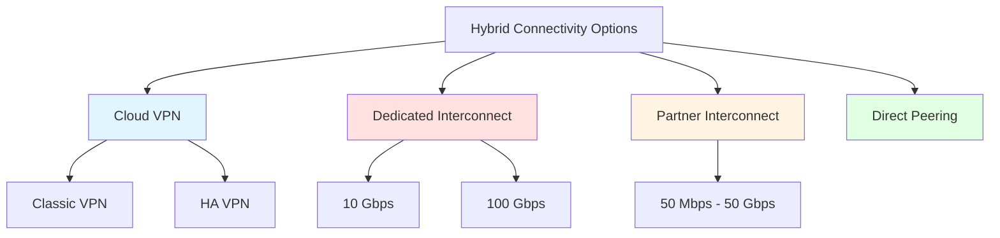
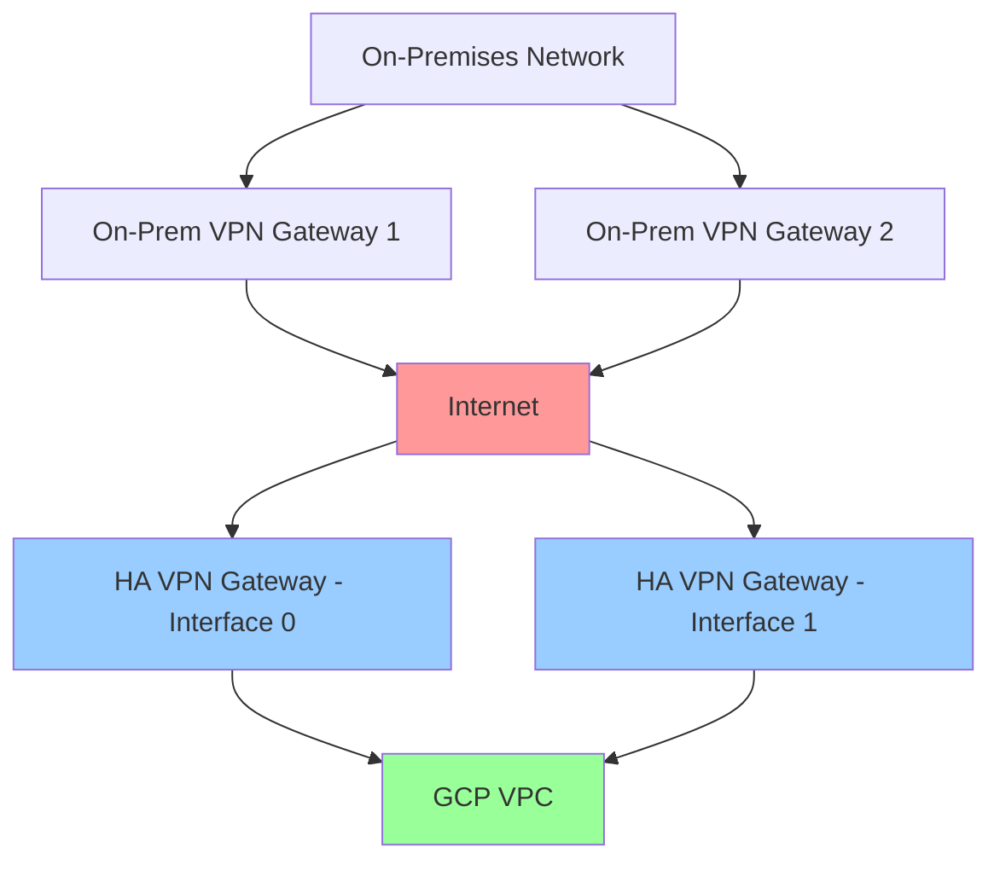
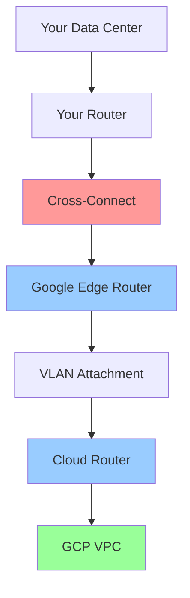
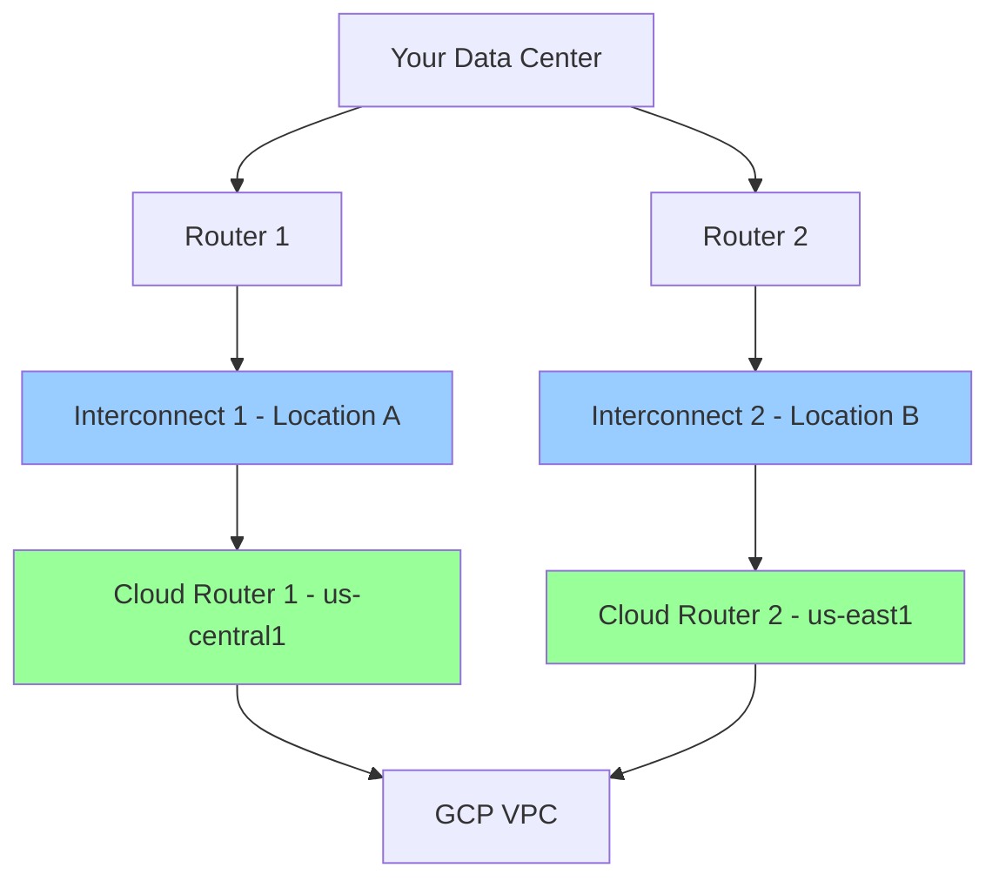
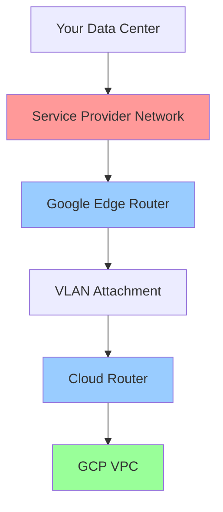
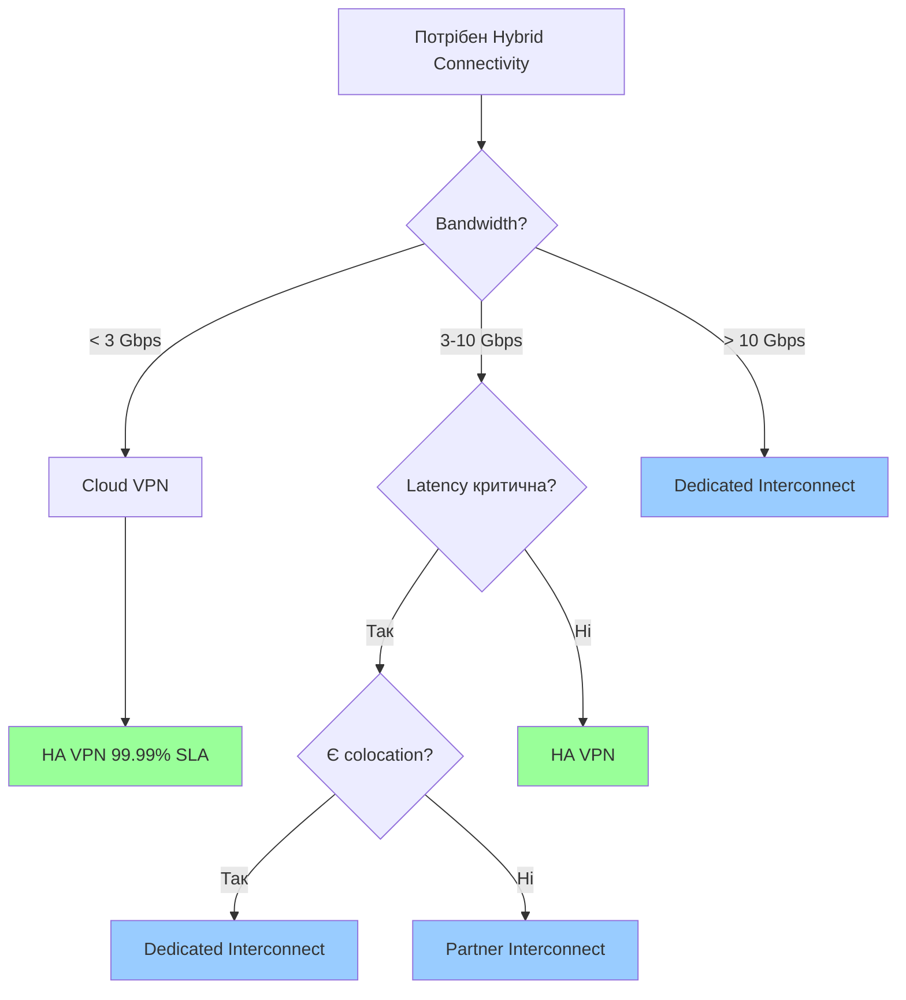
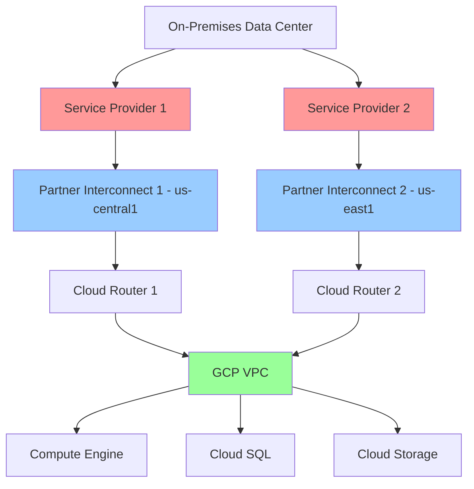

# VPN & Interconnect

## Вступ

**Hybrid Connectivity** — це з'єднання між Google Cloud Platform та вашою on-premises інфраструктурою або іншими хмарними провайдерами. GCP пропонує кілька варіантів для створення таких з'єднань.

### Навіщо потрібен Hybrid Connectivity?

1. **Migration to Cloud:**
   - Поступова міграція workloads до GCP
   - Збереження частини інфраструктури on-premises

2. **Disaster Recovery:**
   - Backup on-premises даних у GCP
   - Failover між on-premises та cloud

3. **Burst to Cloud:**
   - Використання GCP для peak workloads
   - Економія на on-premises інфраструктурі

4. **Compliance:**
   - Деякі дані повинні залишатися on-premises
   - Hybrid архітектура для compliance requirements

### Зв'язок з іншими модулями

- **[Module 03 - Compute Engine](../03-compute-engine/README.md):** Hybrid workloads на VM instances
- **[Module 07 - Storage](../07-storage/README.md):** Backup on-premises даних до Cloud Storage
- **[Module 08 - Databases](../08-databases/README.md):** Hybrid database architectures
- **[Module 09 - Networking](README.md):** VPC, routing, firewall rules
- **[Module 10 - IAM & Security](../10-iam-security/README.md):** Secure hybrid connectivity

---

## Варіанти Hybrid Connectivity

GCP пропонує 4 основні варіанти для hybrid connectivity:



### Порівняльна таблиця

| Варіант | Bandwidth | Latency | SLA | Use Case |
|---------|-----------|---------|-----|----------|
| **Classic VPN** | 1.5-3 Gbps/tunnel | Середня | Немає | Legacy, testing |
| **HA VPN** | 1.5-3 Gbps/tunnel | Середня | 99.99% | Production hybrid |
| **Dedicated Interconnect** | 10/100 Gbps | Найнижча | 99.9%/99.99% | High bandwidth, low latency |
| **Partner Interconnect** | 50 Mbps - 50 Gbps | Низька | 99.9%/99.99% | Flexible bandwidth |
| **Direct Peering** | 10 Gbps+ | Низька | Немає | Google services access |

---

## Cloud VPN

**Cloud VPN** — це IPsec VPN з'єднання між вашою on-premises мережею та GCP VPC через публічний Інтернет.

### Характеристики

- **Encryption:** IPsec (IKEv1 або IKEv2)
- **Bandwidth:** До 3 Gbps на tunnel
- **Transport:** Через публічний Інтернет
- **Cost:** Низька вартість

### Cloud VPN Types

#### 1. Classic VPN (Legacy)

**Classic VPN** — це старий варіант VPN без SLA.

**Характеристики:**

- Один VPN gateway
- Немає SLA
- Single tunnel (no redundancy)
- Не рекомендується для production

**Архітектура:**


> ⚠️ **Важливо для іспиту:** Classic VPN deprecated, використовуйте HA VPN для production.

#### 2. HA VPN (High Availability VPN)

**HA VPN** — це рекомендований варіант VPN з 99.99% SLA.

**Характеристики:**

- Два VPN gateways (redundancy)
- 99.99% SLA
- Multiple tunnels для high availability
- Automatic failover

**Архітектура:**



**HA VPN Topologies:**

1. **HA VPN to on-premises (2 gateways):**
   - 2 on-premises VPN gateways
   - 4 tunnels total
   - 99.99% SLA

2. **HA VPN to on-premises (1 gateway):**
   - 1 on-premises VPN gateway з 2 interfaces
   - 2 tunnels total
   - 99.99% SLA

3. **HA VPN to HA VPN (VPC to VPC):**
   - З'єднання між двома VPCs
   - 2 tunnels total
   - 99.99% SLA

### Практичний приклад: Створення HA VPN

```bash
# 1. Створення HA VPN gateway
gcloud compute vpn-gateways create ha-vpn-gw-1 \
  --network=default \
  --region=us-central1

# 2. Створення Cloud Router (для BGP)
gcloud compute routers create cloud-router-1 \
  --region=us-central1 \
  --network=default \
  --asn=65001

# 3. Створення external VPN gateway (on-premises)
gcloud compute external-vpn-gateways create on-prem-gw \
  --interfaces=0=203.0.113.1,1=203.0.113.2

# 4. Створення VPN tunnels (2 tunnels для HA)
gcloud compute vpn-tunnels create tunnel-1 \
  --peer-external-gateway=on-prem-gw \
  --peer-external-gateway-interface=0 \
  --region=us-central1 \
  --ike-version=2 \
  --shared-secret=SECRET_1 \
  --router=cloud-router-1 \
  --vpn-gateway=ha-vpn-gw-1 \
  --interface=0

gcloud compute vpn-tunnels create tunnel-2 \
  --peer-external-gateway=on-prem-gw \
  --peer-external-gateway-interface=1 \
  --region=us-central1 \
  --ike-version=2 \
  --shared-secret=SECRET_2 \
  --router=cloud-router-1 \
  --vpn-gateway=ha-vpn-gw-1 \
  --interface=1

# 5. Налаштування BGP sessions
gcloud compute routers add-interface cloud-router-1 \
  --interface-name=if-tunnel-1 \
  --vpn-tunnel=tunnel-1 \
  --region=us-central1

gcloud compute routers add-bgp-peer cloud-router-1 \
  --peer-name=bgp-peer-1 \
  --peer-asn=65002 \
  --interface=if-tunnel-1 \
  --peer-ip-address=169.254.1.2 \
  --region=us-central1

gcloud compute routers add-interface cloud-router-1 \
  --interface-name=if-tunnel-2 \
  --vpn-tunnel=tunnel-2 \
  --region=us-central1

gcloud compute routers add-bgp-peer cloud-router-1 \
  --peer-name=bgp-peer-2 \
  --peer-asn=65002 \
  --interface=if-tunnel-2 \
  --peer-ip-address=169.254.2.2 \
  --region=us-central1
```

### Cloud Router і BGP

**Cloud Router** використовує BGP (Border Gateway Protocol) для динамічного обміну маршрутами між GCP та on-premises.

**Переваги BGP:**

- Автоматичне оновлення маршрутів
- Failover при виході з ладу tunnel
- Немає потреби вручну налаштовувати static routes

**ASN (Autonomous System Number):**

- GCP Cloud Router: 64512-65534 (private ASN)
- On-premises: Ваш ASN (private або public)

---

## Dedicated Interconnect

**Dedicated Interconnect** — це пряме фізичне з'єднання між вашим data center та Google network через colocation facility.

### Характеристики

- **Bandwidth:** 10 Gbps або 100 Gbps
- **Latency:** Найнижча (direct connection)
- **SLA:** 99.9% (10 Gbps) або 99.99% (100 Gbps)
- **Transport:** Приватне з'єднання (не через Інтернет)
- **Cost:** Висока вартість

### Коли використовувати?

- Потрібен високий bandwidth (10+ Gbps)
- Критична низька latency
- Велика кількість даних для transfer
- Predictable network performance

### Архітектура



### Компоненти

1. **Interconnect Connection:**
   - Фізичне з'єднання між вашим router та Google edge router
   - 10 Gbps або 100 Gbps

2. **VLAN Attachment:**
   - Логічне з'єднання через interconnect
   - Кожен VLAN attachment = 1 VPC
   - До 16 VLAN attachments на interconnect

3. **Cloud Router:**
   - BGP routing між on-premises та GCP
   - Автоматичний обмін маршрутами

### Практичний приклад

```bash
# 1. Створення Cloud Router
gcloud compute routers create interconnect-router \
  --region=us-central1 \
  --network=default \
  --asn=65001

# 2. Створення Interconnect (через Console або API)
# Це створює physical connection у colocation facility

# 3. Створення VLAN Attachment
gcloud compute interconnects attachments dedicated create vlan-attachment-1 \
  --region=us-central1 \
  --router=interconnect-router \
  --interconnect=my-interconnect \
  --vlan=100

# 4. Налаштування BGP session
gcloud compute routers add-interface interconnect-router \
  --interface-name=if-vlan-1 \
  --interconnect-attachment=vlan-attachment-1 \
  --region=us-central1

gcloud compute routers add-bgp-peer interconnect-router \
  --peer-name=bgp-peer-interconnect \
  --peer-asn=65002 \
  --interface=if-vlan-1 \
  --peer-ip-address=169.254.1.2 \
  --region=us-central1
```

### High Availability

Для 99.99% SLA потрібно:

- 2 Interconnect connections
- У різних colocation facilities (різні edge availability domains)
- 2 Cloud Routers у різних regions



---

## Partner Interconnect

**Partner Interconnect** — це з'єднання через service provider (партнера Google), якщо ви не можете використовувати Dedicated Interconnect.

### Характеристики

- **Bandwidth:** 50 Mbps - 50 Gbps (flexible)
- **Latency:** Низька
- **SLA:** 99.9% або 99.99% (залежить від topology)
- **Transport:** Через service provider
- **Cost:** Середня вартість

### Коли використовувати?

- Ваш data center не знаходиться у colocation facility
- Потрібен менший bandwidth (< 10 Gbps)
- Хочете гнучкість у виборі bandwidth
- Швидке provisioning (без фізичного з'єднання)

### Архітектура



### Bandwidth Options

| Capacity | Use Case |
|----------|----------|
| 50 Mbps | Testing, small workloads |
| 100 Mbps | Small production |
| 200 Mbps | Medium workloads |
| 300-500 Mbps | Medium-large workloads |
| 1 Gbps | Large workloads |
| 2-10 Gbps | Very large workloads |
| 10-50 Gbps | Enterprise workloads |

### Практичний приклад

```bash
# 1. Створення Cloud Router
gcloud compute routers create partner-router \
  --region=us-central1 \
  --network=default \
  --asn=65001

# 2. Створення VLAN Attachment для Partner Interconnect
gcloud compute interconnects attachments partner create partner-attachment-1 \
  --region=us-central1 \
  --router=partner-router \
  --edge-availability-domain=AVAILABILITY_DOMAIN_1

# 3. Отримання pairing key для service provider
gcloud compute interconnects attachments describe partner-attachment-1 \
  --region=us-central1 \
  --format="value(pairingKey)"

# 4. Надати pairing key вашому service provider

# 5. Після активації, налаштувати BGP session
gcloud compute routers add-interface partner-router \
  --interface-name=if-partner-1 \
  --interconnect-attachment=partner-attachment-1 \
  --region=us-central1

gcloud compute routers add-bgp-peer partner-router \
  --peer-name=bgp-peer-partner \
  --peer-asn=65002 \
  --interface=if-partner-1 \
  --peer-ip-address=169.254.1.2 \
  --region=us-central1
```

---

## Вибір Hybrid Connectivity: Decision Tree



### Критерії вибору

| Критерій | Cloud VPN | Dedicated Interconnect | Partner Interconnect |
|----------|-----------|------------------------|----------------------|
| **Bandwidth** | До 3 Gbps | 10/100 Gbps | 50 Mbps - 50 Gbps |
| **Latency** | Середня | Найнижча | Низька |
| **SLA** | 99.99% (HA) | 99.9%/99.99% | 99.9%/99.99% |
| **Cost** | Низька | Висока | Середня |
| **Setup Time** | Хвилини | Тижні/місяці | Дні/тижні |
| **Transport** | Інтернет | Приватне | Service Provider |
| **Encryption** | IPsec | Немає (приватне) | Немає (приватне) |

---

## Практичний сценарій: Enterprise Hybrid Architecture

### Вимоги

1. З'єднання між on-premises data center та GCP
2. High availability (99.99% SLA)
3. Bandwidth: 5 Gbps
4. Низька latency для database replication
5. Secure connectivity

### Рекомендована архітектура

**Partner Interconnect з HA topology:**



### Імплементація

```bash
# 1. Створення VPC network
gcloud compute networks create enterprise-vpc \
  --subnet-mode=custom

gcloud compute networks subnets create subnet-us-central1 \
  --network=enterprise-vpc \
  --region=us-central1 \
  --range=10.1.0.0/16

gcloud compute networks subnets create subnet-us-east1 \
  --network=enterprise-vpc \
  --region=us-east1 \
  --range=10.2.0.0/16

# 2. Створення Cloud Routers (2 для HA)
gcloud compute routers create router-us-central1 \
  --region=us-central1 \
  --network=enterprise-vpc \
  --asn=65001

gcloud compute routers create router-us-east1 \
  --region=us-east1 \
  --network=enterprise-vpc \
  --asn=65001

# 3. Створення Partner Interconnect attachments
gcloud compute interconnects attachments partner create attachment-us-central1 \
  --region=us-central1 \
  --router=router-us-central1 \
  --edge-availability-domain=AVAILABILITY_DOMAIN_1

gcloud compute interconnects attachments partner create attachment-us-east1 \
  --region=us-east1 \
  --router=router-us-east1 \
  --edge-availability-domain=AVAILABILITY_DOMAIN_1

# 4. Налаштування BGP sessions (після активації від service provider)
# ... (аналогічно до попередніх прикладів)

# 5. Налаштування firewall rules
gcloud compute firewall-rules create allow-on-prem \
  --network=enterprise-vpc \
  --allow=tcp,udp,icmp \
  --source-ranges=192.168.0.0/16
```

---

## Best Practices

### 1. High Availability

✅ **DO:**

- Використовуйте HA VPN з 2 tunnels
- Використовуйте 2 Interconnect connections у різних locations
- Налаштуйте BGP для automatic failover
- Тестуйте failover scenarios

❌ **DON'T:**

- Не використовуйте Classic VPN для production
- Не покладайтеся на single connection
- Не ігноруйте SLA requirements

### 2. Routing

✅ **DO:**

- Використовуйте Cloud Router з BGP для dynamic routing
- Налаштуйте route priorities правильно
- Використовуйте route advertisements для control traffic flow

❌ **DON'T:**

- Не використовуйте static routes для hybrid connectivity
- Не забувайте про route propagation delays

### 3. Security

✅ **DO:**

- Використовуйте IPsec encryption для VPN
- Налаштуйте firewall rules для обмеження трафіку
- Використовуйте Private Google Access для Google APIs
- Регулярно ротуйте VPN shared secrets

❌ **DON'T:**

- Не відкривайте всі порти для on-premises
- Не використовуйте weak encryption algorithms

### 4. Bandwidth Planning

✅ **DO:**

- Моніторьте bandwidth utilization
- Плануйте bandwidth на основі peak usage
- Використовуйте multiple tunnels/connections для більшого bandwidth

❌ **DON'T:**

- Не недооцінюйте bandwidth requirements
- Не забувайте про bandwidth limits (3 Gbps/tunnel для VPN)

### 5. Cost Optimization

✅ **DO:**

- Вибирайте правильний тип connectivity на основі requirements
- Використовуйте Partner Interconnect для flexible bandwidth
- Моніторьте egress traffic costs

❌ **DON'T:**

- Не переплачуйте за Dedicated Interconnect якщо не потрібно
- Не ігноруйте egress costs

---

## Моніторинг та Troubleshooting

### Ключові метрики

**VPN Metrics:**

- Tunnel status (up/down)
- Bytes sent/received
- Packet loss
- Tunnel establishment time

**Interconnect Metrics:**

- Link status
- Bandwidth utilization
- Packet drops
- BGP session status

### Перегляд метрик

```bash
# Перегляд VPN tunnel status
gcloud compute vpn-tunnels describe tunnel-1 \
  --region=us-central1

# Перегляд Interconnect status
gcloud compute interconnects describe my-interconnect

# Перегляд BGP sessions
gcloud compute routers get-status cloud-router-1 \
  --region=us-central1
```

### Типові проблеми

**1. VPN Tunnel Down:**

**Причини:**

- Incorrect shared secret
- Firewall blocking UDP 500/4500
- IKE version mismatch
- On-premises gateway down

**Рішення:**

```bash
# Перевірка tunnel status
gcloud compute vpn-tunnels describe tunnel-1 --region=us-central1

# Перевірка firewall rules
gcloud compute firewall-rules list

# Recreate tunnel з правильними параметрами
gcloud compute vpn-tunnels delete tunnel-1 --region=us-central1
# ... створити знову
```

**2. BGP Session Not Established:**

**Причини:**

- Incorrect ASN
- Incorrect peer IP address
- Firewall blocking BGP (TCP 179)

**Рішення:**

```bash
# Перевірка BGP status
gcloud compute routers get-status cloud-router-1 --region=us-central1

# Перевірка BGP configuration
gcloud compute routers describe cloud-router-1 --region=us-central1
```

**3. Low Bandwidth:**

**Причини:**

- Single tunnel (max 3 Gbps)
- Network congestion
- MTU issues

**Рішення:**

- Додайте більше tunnels
- Налаштуйте MTU правильно (1460 для VPN)
- Використовуйте Interconnect для higher bandwidth

---

## Exam Tips

> ⚠️ **Важливо для іспиту:**

1. **VPN Types:**
   - Classic VPN = deprecated, no SLA
   - HA VPN = 99.99% SLA, 2 tunnels minimum

2. **Bandwidth Limits:**
   - Cloud VPN = 3 Gbps/tunnel
   - Dedicated Interconnect = 10/100 Gbps
   - Partner Interconnect = 50 Mbps - 50 Gbps

3. **SLA:**
   - HA VPN = 99.99%
   - Dedicated Interconnect = 99.9% (10G) / 99.99% (100G)
   - Partner Interconnect = 99.9% / 99.99%

4. **BGP:**
   - Cloud Router використовує BGP для dynamic routing
   - ASN: 64512-65534 (private)
   - Automatic route propagation

5. **High Availability:**
   - HA VPN = 2 tunnels, 2 interfaces
   - Dedicated Interconnect = 2 connections, різні locations
   - Partner Interconnect = 2 attachments, різні regions

6. **Use Cases:**
   - VPN = low bandwidth, testing, cost-sensitive
   - Dedicated Interconnect = high bandwidth, low latency, enterprise
   - Partner Interconnect = flexible bandwidth, no colocation

7. **Security:**
   - VPN = IPsec encryption
   - Interconnect = no encryption (private connection)
   - Firewall rules apply to all hybrid traffic

---

**Повернутися до:** [Модуль 09 - Networking](README.md)
