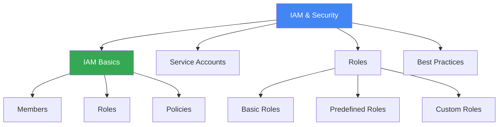

# IAM & Security

## Вступ до модуля

Identity and Access Management (IAM) - це фундамент безпеки в GCP. Розуміння IAM критично важливе для забезпечення proper access control та security.

### Структура модуля

---

## Module Goal

Цей модуль надає розуміння IAM та security в GCP. Ви навчитесь керувати access control, використовувати service accounts, та застосовувати security best practices.

---

## Topics

### 1. [IAM Basics](iam-basics.md)

**Core Concepts:**

- Members: Who
- Roles: What permissions
- Policies: Binding members to roles

---

### 2. [Service Accounts](service-accounts.md)

**Identity для Applications:**

- VM identity
- Application authentication
- Key management

---

### 3. [Roles and Permissions](roles-and-permissions.md)

**Role Types:**

- Basic: Owner, Editor, Viewer
- Predefined: Service-specific
- Custom: Tailored permissions

---

### 4. [Best Practices](best-practices.md)

**Security Best Practices:**

- Principle of least privilege
- Use service accounts
- Enable audit logging
- Use organization policies

---

## Key Exam Takeaways

✅ **IAM Policy:** Members + Roles = Access
✅ **Service Accounts:** Identity для VMs та applications
✅ **Least Privilege:** Надавайте мінімально необхідні permissions

---

**Попередній модуль:** [Module 09 - Networking](../09-networking/README.md)

**Наступний модуль:** [Module 11 - Monitoring & Logging](../11-monitoring-logging/README.md)
