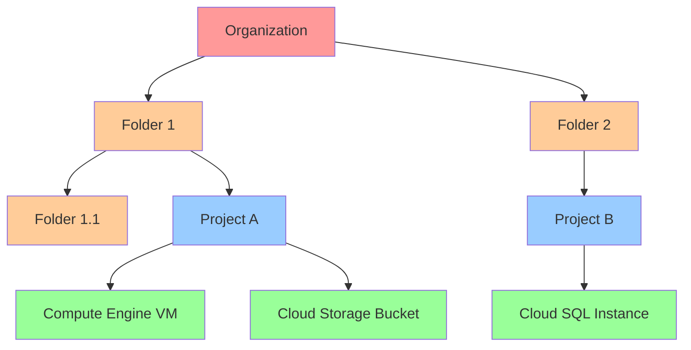
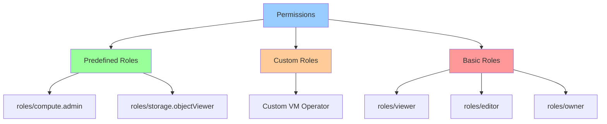

# IAM Basics

## Вступ

**Identity and Access Management (IAM)** — це система для управління доступом до GCP resources. IAM дозволяє контролювати, хто (identity) має який доступ (role) до яких ресурсів (resources).

### Що таке IAM?

IAM — це unified access control system для всіх GCP services:

- **Authentication:** Хто ви? (Who are you?)
- **Authorization:** Що ви можете робити? (What can you do?)
- **Auditing:** Що ви зробили? (What did you do?)

### Основні концепції

**IAM Policy:**

```
WHO (Member) + CAN DO WHAT (Role) + ON WHICH RESOURCE (Resource)
```

**Приклад:**

```
user:alice@example.com (WHO)
+ roles/storage.objectViewer (CAN DO WHAT)
+ on bucket "my-bucket" (ON WHICH RESOURCE)
= Alice can view objects in my-bucket
```

### Зв'язок з іншими модулями

- **[Module 03 - Compute Engine](../03-compute-engine/README.md):** VM instance access control
- **[Module 04 - Kubernetes Engine](../04-kubernetes-engine/README.md):** GKE cluster permissions
- **[Module 07 - Storage](../07-storage/README.md):** Cloud Storage bucket permissions
- **[Module 08 - Databases](../08-databases/README.md):** Database access control
- **[Module 09 - Networking](../09-networking/README.md):** Network resource permissions

---

## IAM Resource Hierarchy

### Hierarchy Structure



### Рівні ієрархії

**1. Organization (Організація):**

- Корінь ієрархії
- Представляє компанію
- Створюється автоматично при використанні Google Workspace або Cloud Identity
- Один organization на domain

**2. Folder (Папка):**

- Групування projects
- Можна створювати вкладені folders
- Використовується для департаментів, teams, environments

**3. Project (Проект):**

- Основна одиниця організації resources
- Містить resources (VMs, buckets, databases)
- Billing account прив'язаний до project

**4. Resource (Ресурс):**

- Конкретний GCP resource
- VM instance, bucket, database, etc.

### Policy Inheritance

**Правило:** Policies наслідуються вниз по ієрархії.

```
Organization: alice@example.com = roles/viewer
  ↓ (inherited)
Folder: alice@example.com = roles/viewer
  ↓ (inherited)
Project: alice@example.com = roles/viewer
  ↓ (inherited)
Resource: alice@example.com = roles/viewer
```

**Важливо:**

- Child policies НЕ МОЖУТЬ обмежити parent policies
- Можна тільки додавати permissions, не забирати
- Least privilege principle: надавайте permissions на найнижчому рівні

> ⚠️ **Важливо для іспиту:** IAM policies наслідуються вниз. Child не може обмежити parent permissions.

---

## IAM Policy Structure

### Policy Format

IAM policy — це JSON document:

```json
{
  "bindings": [
    {
      "role": "roles/storage.objectViewer",
      "members": [
        "user:alice@example.com",
        "serviceAccount:my-sa@project.iam.gserviceaccount.com"
      ]
    },
    {
      "role": "roles/storage.objectAdmin",
      "members": [
        "group:admins@example.com"
      ],
      "condition": {
        "title": "Expires in 2024",
        "expression": "request.time < timestamp('2024-12-31T23:59:59Z')"
      }
    }
  ],
  "etag": "BwXhFJ7QYBY=",
  "version": 3
}
```

### Policy Components

**1. Bindings:**

- Зв'язок між members та role
- Один binding = один role + список members

**2. Members:**

- Identity, яка отримує permissions
- Types: user, serviceAccount, group, domain, allUsers, allAuthenticatedUsers

**3. Role:**

- Набір permissions
- Types: Basic, Predefined, Custom

**4. Condition (optional):**

- Conditional access based on attributes
- CEL (Common Expression Language)

**5. Etag:**

- Concurrency control
- Prevents race conditions

**6. Version:**

- Policy schema version
- Version 3 supports conditions

---

## Members (Identities)

### Types of Members

**1. Google Account (User):**

```
user:alice@example.com
```

- Individual Google account
- Gmail або Google Workspace account

**2. Service Account:**

```
serviceAccount:my-sa@project-id.iam.gserviceaccount.com
```

- Account для applications/VMs
- Not for humans

**3. Google Group:**

```
group:admins@example.com
```

- Collection of Google accounts та service accounts
- Managed у Google Groups

**4. Google Workspace Domain:**

```
domain:example.com
```

- Всі users у Google Workspace domain

**5. Cloud Identity Domain:**

```
domain:example.com
```

- Всі users у Cloud Identity domain

**6. All Authenticated Users:**

```
allAuthenticatedUsers
```

- Будь-хто authenticated з Google account
- Включає users з будь-якого domain

**7. All Users:**

```
allUsers
```

- Будь-хто в internet (public access)
- Включає anonymous users

### Best Practices для Members

✅ **DO:**

- Використовуйте groups замість individual users
- Використовуйте service accounts для applications
- Використовуйте Cloud Identity для non-Gmail users

❌ **DON'T:**

- Не використовуйте `allUsers` без необхідності
- Не надавайте permissions individual users (використовуйте groups)
- Не використовуйте user accounts для applications

---

## Roles

### Types of Roles

**1. Basic Roles (Primitive Roles):**

Старі, широкі roles:

| Role | Permissions | Use Case |
|------|-------------|----------|
| **roles/viewer** | Read-only access | View resources |
| **roles/editor** | Viewer + modify | Modify resources |
| **roles/owner** | Editor + manage access + billing | Full control |

⚠️ **Не рекомендовано:** Занадто широкі permissions. Використовуйте predefined roles.

**2. Predefined Roles:**

Granular roles для specific services:

```
roles/compute.instanceAdmin.v1  - Manage Compute Engine instances
roles/storage.objectViewer      - View Cloud Storage objects
roles/cloudsql.admin            - Administer Cloud SQL
roles/container.developer       - Develop GKE applications
```

**Приклади:**

```bash
# Compute Engine Admin
gcloud projects add-iam-policy-binding my-project \
  --member=user:alice@example.com \
  --role=roles/compute.admin

# Storage Object Viewer
gcloud projects add-iam-policy-binding my-project \
  --member=user:bob@example.com \
  --role=roles/storage.objectViewer
```

**3. Custom Roles:**

User-defined roles з specific permissions:

```yaml
title: "Custom VM Operator"
description: "Can start/stop VMs but not delete"
stage: "GA"
includedPermissions:
- compute.instances.start
- compute.instances.stop
- compute.instances.get
- compute.instances.list
```

**Створення custom role:**

```bash
gcloud iam roles create vmOperator \
  --project=my-project \
  --title="VM Operator" \
  --description="Can start/stop VMs" \
  --permissions=compute.instances.start,compute.instances.stop,compute.instances.get \
  --stage=GA
```

### Role Hierarchy



---

## Permissions

### Permission Format

Permissions мають format:

```
<service>.<resource>.<verb>
```

**Приклади:**

```
compute.instances.create    - Create Compute Engine instances
storage.objects.get         - Get Cloud Storage objects
cloudsql.instances.update   - Update Cloud SQL instances
iam.serviceAccounts.create  - Create service accounts
```

### Permission Categories

**1. Read Permissions:**

```
*.get
*.list
*.describe
```

**2. Write Permissions:**

```
*.create
*.update
*.delete
```

**3. Admin Permissions:**

```
*.setIamPolicy
*.getIamPolicy
```

### Viewing Permissions

**List permissions у role:**

```bash
# Predefined role
gcloud iam roles describe roles/compute.instanceAdmin.v1

# Custom role
gcloud iam roles describe vmOperator --project=my-project
```

**Test permissions:**

```bash
gcloud projects get-iam-policy my-project \
  --flatten="bindings[].members" \
  --filter="bindings.members:user:alice@example.com"
```

---

## IAM Policy Management

### Viewing Policies

**Project-level policy:**

```bash
gcloud projects get-iam-policy my-project
```

**Resource-level policy (bucket):**

```bash
gsutil iam get gs://my-bucket
```

**Resource-level policy (VM):**

```bash
gcloud compute instances get-iam-policy my-instance \
  --zone=us-central1-a
```

### Adding IAM Bindings

**Add member to role:**

```bash
gcloud projects add-iam-policy-binding my-project \
  --member=user:alice@example.com \
  --role=roles/viewer
```

**Add multiple members:**

```bash
# Add to group
gcloud projects add-iam-policy-binding my-project \
  --member=group:developers@example.com \
  --role=roles/editor

# Add service account
gcloud projects add-iam-policy-binding my-project \
  --member=serviceAccount:my-sa@project.iam.gserviceaccount.com \
  --role=roles/storage.admin
```

### Removing IAM Bindings

```bash
gcloud projects remove-iam-policy-binding my-project \
  --member=user:alice@example.com \
  --role=roles/viewer
```

### Setting Complete Policy

**⚠️ Caution:** Overwrites entire policy!

```bash
# Get current policy
gcloud projects get-iam-policy my-project > policy.yaml

# Edit policy.yaml

# Set new policy
gcloud projects set-iam-policy my-project policy.yaml
```

---

## Conditional Access (IAM Conditions)

### What are Conditions?

Conditions дозволяють надавати temporary або conditional access.

**Use Cases:**

- Temporary access (expires after date)
- Access based on resource attributes
- Access based on request attributes

### Condition Syntax (CEL)

**Common Expression Language (CEL):**

```
request.time < timestamp('2024-12-31T23:59:59Z')
```

### Examples

**1. Temporary access:**

```bash
gcloud projects add-iam-policy-binding my-project \
  --member=user:contractor@example.com \
  --role=roles/viewer \
  --condition='expression=request.time < timestamp("2024-12-31T23:59:59Z"),title=Expires end of 2024'
```

**2. Resource name condition:**

```bash
gcloud storage buckets add-iam-policy-binding gs://my-bucket \
  --member=user:alice@example.com \
  --role=roles/storage.objectViewer \
  --condition='expression=resource.name.startsWith("projects/_/buckets/my-bucket/objects/public/"),title=Public folder only'
```

**3. IP address restriction:**

```
expression=origin.ip in ["203.0.113.0/24", "198.51.100.0/24"]
```

**4. Time-based access:**

```
expression=request.time.getHours("America/New_York") >= 9 && request.time.getHours("America/New_York") <= 17
```

---

## Policy Troubleshooting

### Policy Troubleshooter

**Check why user has/doesn't have access:**

```bash
gcloud policy-troubleshoot iam \
  --resource=//cloudresourcemanager.googleapis.com/projects/my-project \
  --principal=user:alice@example.com \
  --permission=compute.instances.create
```

### Common Issues

**1. Policy not taking effect:**

- Propagation delay (up to 7 minutes)
- Check inheritance from parent resources
- Verify etag conflicts

**2. Access denied:**

- Check all levels (org, folder, project, resource)
- Verify service account permissions
- Check conditional access

**3. Too many permissions:**

- Use Policy Analyzer
- Review basic roles usage
- Implement least privilege

---

## Best Practices

### 1. Least Privilege Principle

✅ **DO:**

- Надавайте мінімальні необхідні permissions
- Використовуйте predefined roles замість basic roles
- Надавайте permissions на найнижчому рівні

❌ **DON'T:**

- Не використовуйте `roles/owner` без потреби
- Не надавайте `roles/editor` всім
- Не використовуйте basic roles у production

### 2. Use Groups

✅ **DO:**

- Створюйте groups для teams
- Надавайте permissions groups, не users
- Управляйте membership у Google Groups

❌ **DON'T:**

- Не надавайте permissions individual users
- Не створюйте багато individual bindings

### 3. Service Accounts

✅ **DO:**

- Використовуйте service accounts для applications
- Один service account на application
- Rotate service account keys regularly

❌ **DON'T:**

- Не використовуйте user accounts для applications
- Не share service account keys
- Не надавайте широкі permissions service accounts

### 4. Monitoring and Auditing

✅ **DO:**

- Використовуйте Cloud Audit Logs
- Моніторьте IAM policy changes
- Regular access reviews
- Use Policy Analyzer

❌ **DON'T:**

- Не ігноруйте audit logs
- Не забувайте про orphaned permissions

### 5. Organization Policies

✅ **DO:**

- Використовуйте organization policies для constraints
- Enforce domain restrictions
- Disable service account key creation

❌ **DON'T:**

- Не покладайтеся тільки на IAM
- Не забувайте про organization-level controls

---

## Практичний сценарій: Multi-Environment Setup

### Вимоги

1. Три environments: dev, staging, production
2. Developers: full access до dev, read-only до staging/prod
3. DevOps: full access до всіх environments
4. Contractors: temporary access до dev only

### Hierarchy Design

```
Organization: example.com
├── Folder: Engineering
│   ├── Project: app-dev
│   ├── Project: app-staging
│   └── Project: app-production
```

### IAM Setup

**1. Create groups:**

```bash
# Google Groups
developers@example.com
devops@example.com
contractors@example.com
```

**2. Organization-level policies:**

```bash
# DevOps: viewer на organization level
gcloud organizations add-iam-policy-binding 123456789 \
  --member=group:devops@example.com \
  --role=roles/viewer
```

**3. Folder-level policies:**

```bash
# Engineering folder
gcloud resource-manager folders add-iam-policy-binding 987654321 \
  --member=group:developers@example.com \
  --role=roles/viewer
```

**4. Project-level policies:**

```bash
# Dev project - developers full access
gcloud projects add-iam-policy-binding app-dev \
  --member=group:developers@example.com \
  --role=roles/editor

# Dev project - contractors temporary access
gcloud projects add-iam-policy-binding app-dev \
  --member=group:contractors@example.com \
  --role=roles/editor \
  --condition='expression=request.time < timestamp("2024-06-30T23:59:59Z"),title=Q2 2024 contract'

# Staging project - developers read-only
gcloud projects add-iam-policy-binding app-staging \
  --member=group:developers@example.com \
  --role=roles/viewer

# Production project - developers read-only
gcloud projects add-iam-policy-binding app-production \
  --member=group:developers@example.com \
  --role=roles/viewer

# All projects - DevOps full access
for project in app-dev app-staging app-production; do
  gcloud projects add-iam-policy-binding $project \
    --member=group:devops@example.com \
    --role=roles/editor
done
```

**5. Resource-level policies (example: Cloud Storage):**

```bash
# Dev bucket - developers can write
gsutil iam ch group:developers@example.com:objectAdmin gs://app-dev-data

# Production bucket - developers read-only
gsutil iam ch group:developers@example.com:objectViewer gs://app-prod-data
```

---

## IAM vs Organization Policies

| Feature | IAM | Organization Policies |
|---------|-----|----------------------|
| **Purpose** | Who can do what | What can be done |
| **Type** | Permissions | Constraints |
| **Example** | Alice can create VMs | VMs must be in us-central1 |
| **Scope** | Identity-based | Resource-based |

**IAM:** "Alice can create VMs"
**Org Policy:** "VMs can only be created in us-central1"

Both work together для comprehensive access control.

---

## Exam Tips

> ⚠️ **Важливо для іспиту:**

1. **Hierarchy:**
   - Organization → Folder → Project → Resource
   - Policies наслідуються вниз
   - Child не може обмежити parent

2. **Members:**
   - user, serviceAccount, group, domain
   - allUsers (public), allAuthenticatedUsers

3. **Roles:**
   - Basic: viewer, editor, owner (не рекомендовано)
   - Predefined: granular, service-specific
   - Custom: user-defined permissions

4. **Permissions:**
   - Format: service.resource.verb
   - Example: compute.instances.create

5. **Best Practices:**
   - Least privilege principle
   - Use groups, not individual users
   - Use predefined roles, not basic roles
   - Service accounts для applications

6. **Policy Management:**
   - add-iam-policy-binding: add member
   - remove-iam-policy-binding: remove member
   - set-iam-policy: overwrite entire policy (caution!)

7. **Conditions:**
   - Temporary access (time-based)
   - Resource attributes
   - CEL expressions

8. **Troubleshooting:**
   - Policy Troubleshooter
   - Propagation delay (up to 7 minutes)
   - Check all hierarchy levels

---

**Повернутися до:** [Модуль 10 - IAM & Security](README.md)
