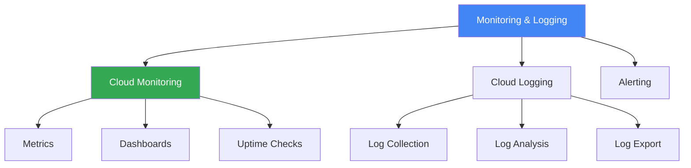

# Monitoring & Logging

## Вступ до модуля

Monitoring та Logging - це критично важливі інструменти для операційного управління cloud інфраструктурою. Cloud Monitoring та Cloud Logging надають visibility в ваші системи.

### Структура модуля

---

## Module Goal

Цей модуль надає розуміння monitoring та logging в GCP. Ви навчитесь налаштовувати моніторинг, аналізувати логи, та створювати alerts.

---

## Topics

### 1. [Cloud Monitoring](cloud-monitoring.md)

**Metrics Collection:**

- System metrics
- Custom metrics
- Dashboards
- Uptime checks

---

### 2. [Cloud Logging](cloud-logging.md)

**Log Management:**

- Automatic log collection
- Log queries
- Log-based metrics
- Log export

---

### 3. [Alerting](alerting.md)

**Alert Policies:**

- Metric-based alerts
- Log-based alerts
- Notification channels
- Incident management

---

## Key Exam Takeaways

✅ **Cloud Monitoring:** Metrics, dashboards, uptime checks
✅ **Cloud Logging:** Centralized logging, analysis
✅ **Alerting:** Proactive incident detection

---

**Попередній модуль:** [Module 10 - IAM & Security](../10-iam-security/README.md)

**Наступний модуль:** [Module 12 - Deployment & Management](../12-deployment-management/README.md)
