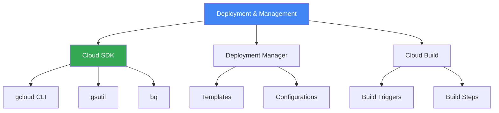

# Deployment & Management

## Вступ до модуля

Deployment та Management tools дозволяють автоматизувати та стандартизувати deployment процеси. Cloud SDK, Deployment Manager, та Cloud Build - ключові інструменти для infrastructure as code та CI/CD.

### Структура модуля

---

## Module Goal

Цей модуль надає розуміння deployment та management tools в GCP. Ви навчитесь використовувати Cloud SDK, автоматизувати deployments, та налаштовувати CI/CD pipelines.

---

## Topics

### 1. [Cloud SDK](cloud-sdk.md)

**Command-Line Tools:**

- gcloud: GCP resources management
- gsutil: Cloud Storage operations
- bq: BigQuery operations

---

### 2. [Deployment Manager](deployment-manager.md)

**Infrastructure as Code:**

- YAML/Python templates
- Declarative deployments
- Resource dependencies

---

### 3. [Cloud Build](cloud-build.md)

**CI/CD Platform:**

- Build triggers
- Build steps
- Container image building
- Deployment automation

---

## Key Exam Takeaways

✅ **Cloud SDK:** gcloud для automation
✅ **Deployment Manager:** Infrastructure as Code
✅ **Cloud Build:** CI/CD pipelines

---

**Попередній модуль:** [Module 11 - Monitoring & Logging](../11-monitoring-logging/README.md)

**Наступний модуль:** [Module 13 - Practice Questions](../13-practice-questions/README.md)
