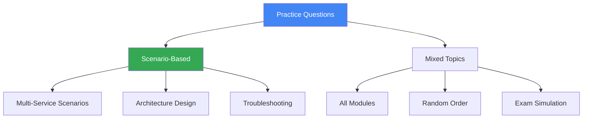

# Practice Questions

## Вступ до модуля

Цей модуль містить комплексні практичні питання, які охоплюють всі теми Associate Cloud Engineer іспиту. Питання організовані за сценаріями та змішаними темами для симуляції реального іспиту.

### Структура модуля



---

## Module Goal

Цей модуль надає практику з реалістичними exam questions. Ви перевірите своє розуміння всіх тем та підготуєтесь до формату іспиту.

---

## Topics

### 1. [Scenario-Based Questions](scenario-based.md)

**Complex Scenarios:**

- Multi-service architectures
- Migration scenarios
- Cost optimization
- High availability design
- Security implementations

**Example:**

```text
Компанія мігрує e-commerce платформу в GCP. Вимоги:
- 99.95% availability
- Users в Європі та США
- GDPR compliance
- Auto-scaling
- Cost optimization

Яка архітектура найкраще підходить?
```

---

### 2. [Mixed Topics](mixed-topics.md)

**Cross-Module Questions:**

- Compute + Storage + Networking
- IAM + Security + Monitoring
- Databases + Compute + Load Balancing

**Exam Simulation:**

- 50+ питань
- Різні теми
- Різна складність
- Детальні пояснення

---

## Exam Preparation Strategy

### 1. Вивчіть всі модулі (01-12)

Переконайтесь, що ви розумієте:

- ✅ Cloud models (IaaS, PaaS, SaaS)
- ✅ Regions та zones
- ✅ Compute опції (CE, GKE, App Engine, Functions)
- ✅ Storage types (Cloud Storage, Persistent Disk, Filestore)
- ✅ Database selection (SQL, Spanner, Firestore, Bigtable)
- ✅ Networking (VPC, Load Balancing, DNS)
- ✅ IAM та security
- ✅ Monitoring та logging
- ✅ Deployment tools

---

### 2. Практикуйте з питаннями

- Спочатку по модулях
- Потім scenario-based
- Нарешті mixed topics

---

### 3. Фокус на decision-making

Іспит перевіряє вашу здатність:

- Вибрати правильний сервіс
- Проектувати архітектури
- Оптимізувати вартість
- Забезпечити security та compliance

---

## Key Exam Tips

✅ **Читайте уважно:** Зверніть увагу на ключові слова (cost-effective, high availability, compliance)

✅ **Виключайте неправильні відповіді:** Часто 2 відповіді явно неправильні

✅ **Думайте про trade-offs:** Вартість vs Performance vs Availability

✅ **Знайте обмеження:** Max timeout Cloud Functions (9 хв), Max VM instances в MIG, etc.

✅ **Практикуйте gcloud команди:** Знайте базові команди для кожного сервісу

---

## Exam Format

**Офіційний іспит:**

- 50-60 питань
- 2 години
- Multiple choice та multiple select
- Passing score: ~70%

**Теми:**

- 30% Compute
- 20% Storage та Databases
- 20% Networking
- 15% IAM та Security
- 15% Monitoring та Management

---

**Попередній модуль:** [Module 12 - Deployment & Management](../12-deployment-management/README.md)

**Повернутися до:** [Main README](../README.md)
